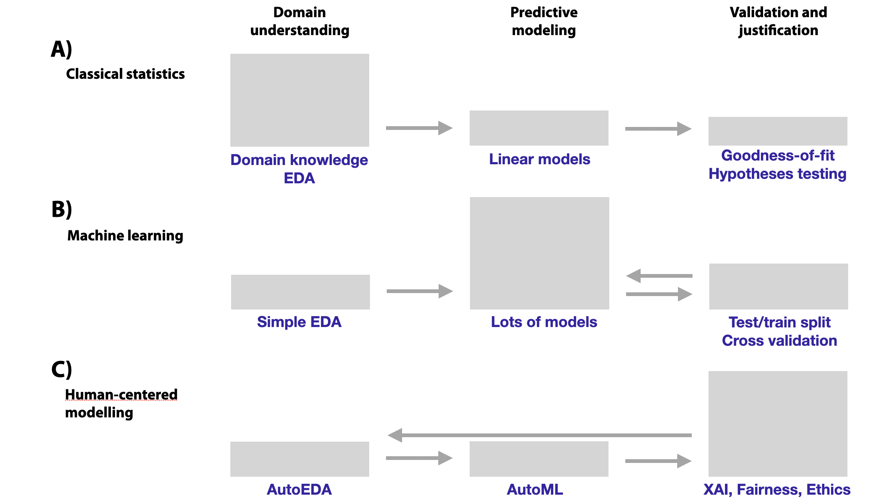
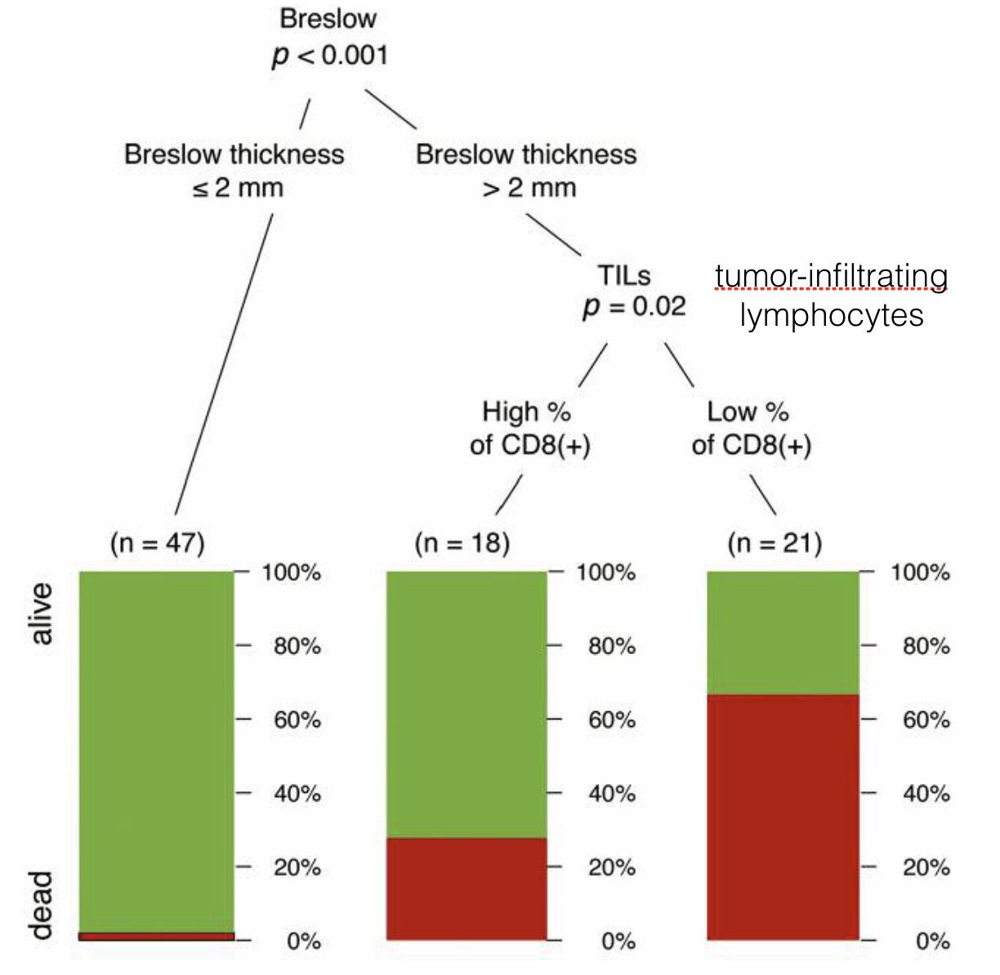

# Introduction

## Notes to readers

A note to readers: this text is a work in progress. 

We've released this initial version to get more feedback. Feedback can be given at the GitHub repo https://github.com/pbiecek/ema/issues. We are primarily interested in the organization and consistency of the content, but any comments will be welcomed.

We'd like to thank everyone that contributed feedback, found typos, or ignited discussions while the book was being written, including GitHub contributors: [agosiewska](https://github.com/agosiewska/), Rees Morrison, [kasiapekala](https://github.com/kasiapekala/), [hbaniecki](https://github.com/hbaniecki/), [AsiaHenzel](https://github.com/AsiaHenzel/), [kozaka93](https://github.com/kozaka93/),
[agilebean](https://github.com/agilebean/).


## The aim of the book

Predictive models are used to guess (statisticians would say: predict) values of a variable of interest based on other variables. As an example, consider prediction of sales based on historical data, prediction of risk of heart disease based on patient characteristics, or prediction of political attitudes based on Facebook comments.

Predictive models have been constructed through the entire human history. Ancient Egyptians, for instance, used observations of the rising of Sirius to predict flooding of the Nile. A more rigorous approach to model construction may be attributed to the method of least squares, published more than two centuries ago by Legendre in 1805 and by Gauss in 1809. With time, the number of applications in economy, medicine, biology, and  agriculture has grown. The term *regression* was coined by Francis Galton in 1886. Initially, it was referring to biological applications, while today it is used for various models that allow prediction of continuous variables. Prediction of nominal variables is called *classification*, and its beginning may be attributed to works of Ronald Fisher in 1936.

During the last century, many statistical models that can be used for predictive purposes have been developed. These include linear models, generalized linear models, regression and classification trees, rule-based models, and many others. Developments in mathematical foundations of predictive models were boosted by increasing computational power of personal computers and availability of large datasets in the era of ,,big data'' that we have entered. 

With the increasing demand for predictive models, model features such as flexibility, ability to perform internally variable selection (feature engineering), and high precision of predictions are of interest. To obtain robust models, ensembles of models are used. Techniques like bagging, boosting, or model stacking combine hundreds or thousands of small models into a one super-model. Large deep neural models have over a billion parameters. 

There is a cost of this progress. Complex models may seem to operate like ,,black boxes''. It may be difficult, or even impossible, to understand how thousands of coefficients affect the model prediction. At the same time, complex models may not work as well as we would like them to. An overview of real problems with massive-scale black-box models may be found in an excellent book of Cathy O'Neil [@ONeil] or in her TED Talk ,,*The era of blind faith in big data must end*''. There is a growing number of examples of predictive models with performance that deteriorated over time or became biased in some sense. For instance, IBM's  Watson for Oncology was criticized  by oncologists for delivering unsafe and inaccurate recommendations [@IBMWatson]. Amazon's system for CV screening was found to be biased against women [@AmazonAI]. The COMPAS (Correctional Offender Management Profiling for Alternative Sanctions) algorithm for predicting recidivism, developed by Northpointe (now Equivant), is accused to be biased against blacks [@COMPAS].  Algorithms beyond Apple Credit Card are accused to be gender-biased [@AppleCreditCard]. Some tools for sentiment analysis are suspected to be age-biased [@Diaz2018]. These are examples of models and algorithms that led to serious violations of fairness and ethical principles. An example of situation when data drift led to  deterioration in model performance is the Google Flu model, which gave worse predictions after two years than at baseline [@GoogleFLU], [@Lazer1203].

A reaction to some of these examples and  problems are new regulations, like the General Data Protection Regulation [@EUGDPR]. Also, new civic rights are being formulated  [@RightToExpl], [@RightToExpl2], [@RightToExpl3]. A noteworthy example is the *,,Right to Explanation''*, i.e., the right to be provided an explanation for an output of an automated algorithm [@RightToExpl]. To exercise the right, we need new methods for verification, exploration, and explanation of predictive models.


Figure \@ref(fig:UMEPImportance) shows how the increase in the model complexity affects the relative importance of domain understanding vs. modeling vs. validation. Simplest models are usually built on top of a good understanding of the domain. Domain knowledge helps to create and select most important variables that can be transformed into predictive scores. Machine learning exploits the tradeoff between availability of data and domain knowledge. Flexible models can use massive data to learn good features and filter out bad ones. The effort is shifted from a deep understanding of the domain towards computationally heavy training of models. The validation part is of an increased importance because it creates a feedback loop with the modeling. Results from model validation lead to next decisions related to model training. This is different than in case of statistical hypothesis testing. Statistical hypotheses shall be stated in advance of data analysis and obtained p-values shall not interfere in the way how data or models were prepared.

What will be next? The increasing automation in the EDA (Exploratory Data Analysis) and modeling part of the process shift the focus towards the validation of models. The purpose of validation is not only to measure how good is the model but also what other risks are associated with models. Risks like concept drift, gender, age or race bias. This book is about new methods that can be used for validation and justification.


```{r UMEPImportance, echo=FALSE, fig.cap="Shift in the relative importance and effort put in different phases of the data-driven modeling. (A) Statistical modeling is often based on deep understanding of the domain. Manual data exploration, consultations with domain experts, variable transformations lead to good models. Structures of models are often based on (generalized) linear models. Model verification is done through hypothesis testing. (B) Machine learning modeling is often based on elastic models fitted to large volumes of data. Domain exploration is often shallow while the focus is based on predictive performance. Lots of attention is put in cross validation and other strategies that deal with overfitting. (C) What will be next? Human-centered modeling? Better tools for auto EDA and auto ML will shift focus into the part related with validation against the domain knowledge like fairness, bias or new techniques for data exploration. Arrows show feedback loops in the modeling process. The feedback loop is even larger now, as the results from model validation are helping also in the domain understanding.", out.width = '90%', fig.align='center'}

```


Out of this we can conclude that, today, the true bottleneck in predictive modelling is not the lack of data, nor the lack of computational power, nor inadequate algorithms, nor the lack of flexible models. It is the lack of tools for model validation, model exploration, and explanation of model decisions. Thus, in this book, we present a collection of methods that may be used for this purpose. As development of such methods is a very active area of research and new methods become available almost on a continuous basis, we do not aim at being exhaustive. Rather, we present the mind-set, key problems, and several examples of methods that can be used in model exploration.


## A bit of philosophy: three laws of model explanation {#three-single-laws}

In 1942, Isaac Asimov forumlated [Three Laws of Robotics](https://en.wikipedia.org/wiki/Three_Laws_of_Robotics): 

1) a robot may not injure a human being, 
2) a robot must obey the orders given it by human beings, and 
3) a robot must protect its own existence. 

Today’s robots, like cleaning robots, robotic pets, or autonomous cars are far from being conscious enough to fall under Asimov’s ethics. However, we are more and more surrounded by complex predictive models and algorithms used for decision making. Artificial Intelligence models are used in health care, politics, education, justice, and many other areas. The models and algorithms have a far larger influence on our lives than physical robots. Yet, applications of such models are left unregulated despite examples of their potential harmfulness. See *Weapons of Math Destruction* by Cathy O'Neil [@ONeil] for an excellent overview of selected problems.

It's clear that we need to control the models and algorithms that may affect us. Thus, Asimov's laws are referred to in the context of the discussion around [Ethics of Artificial Intelligence](https://en.wikipedia.org/wiki/Ethics_of_artificial_intelligence). Initiatives to formulate principles for AI development have been undertaken, for instance, in the UK [Olhede & Wolfe, Significance 2018, 15: 6-7]. Following Asimov's approach, we propose three requirements that any predictive model should fulfill:

-	**Prediction's validation**. For every prediction of a model, one should be able to verify how strong is the evidence that confirms the prediction.
-	**Prediction's justification**. For every prediction of a model, one should be able to understand which variables affect the prediction and to what extent. 
-	**Prediction's speculation**. For every prediction of a model, one should be able to understand how the model prediction would change if input variables changed. 

We see two ways to comply with these requirements. One is to use only models that fulfill these conditions by design. There are so called interpretable by design models like linear models, rule based models or classification trees with small number of parameters [@molnar2019]. However, the price for transparency may be a reduction in performance. Another way is to use tools that allow, perhaps by using approximations or simplifications, to ,,explain'' predictions for any model. In our book, we will focus on the latter approach.


## The structure of this book {#bookstructure}

This book is split in two major parts. In the part *Instance-level explainers*, we present techniques for exploration and explanation of model predictions for a single observation. On the other hand, in the part *Dataset-level explainers*, we present techniques for exploration and explanation of a model for an entire dataset. 

Before embarking on the description of the methods, in Chapter
\@ref(modelDevelopmentProcess), we provide a short introduction to the process of data exploration and model assembly along with notation and definition of key concepts that are used in consecutive chapters. 
In Chapters \@ref(doItYourselfWithR) and \@ref(doItYourselfWithPython), we provide a short description of R and Python tools and packages that are necessary to replicate the results presented in this book. In Chapter \@ref(dataSetsIntro), we describe two datasets that are used throughout the book to illustrate the presented methods and tools. 

(ref:UMEPpiramideCaption) Stack with model exploration methods presented in this book. Left side is focused on instance-level explanation while the right side is focused on dataset-level explanation. Consecutive layers of the stack are linked with a deeper level of model exploration. These layers are linked with law's of model exploration introduced in Section \@ref(three-single-laws)

```{r UMEPpiramide, echo=FALSE, fig.cap='(ref:UMEPpiramideCaption)', out.width = '85%', fig.align='center'}
knitr::include_graphics("figure/UMEPpiramide.png")
```

Rest of the book is structured in Figure \@ref(fig:UMEPpiramide).


The **Instance-level** part of the book consists of Chapters \@ref(breakDown)-\@ref(summaryInstanceLevel). 
Chapters \@ref(breakDown)-\@ref(shapley) present methods to decompose  model predictions into variable contributions. In particular, Chapter \@ref(breakDown) introduces Break-down (BD) plots for models with additive effects. On the other hand, Chapter \@ref(iBreakDown) presents a method that allows for interactions. Finally, Chapter \@ref(shapley) describes SHAP [@SHAP] an alternative method for decomposing model predictions that is closely linked with Shapley values [@shapleybook1952] developed originally for cooperative games.
Chapter \@ref(LIME) presents a different approach to explanation of single-instance predictions. It is based on a local approximation of a black-box model by a simpler, glass-box one. In this chapter, we discuss the Local Interpretable Model-Agnostic Explanations (LIME) method [@lime]. These chapters corresponds to the second layer of the stack in Figure \@ref(fig:UMEPpiramide).

In Chapters \@ref(ceterisParibus)-\@ref(localDiagnostics) we present methods based on Ceteris-paribus (CP) profiles. The profiles show the change of model-based predictions induced by a change of a single variable. These profiles are introduced in Chapter \@ref(ceterisParibus) while Chapter \@ref(ceterisParibusOscillations) presents a CP-profile-based measure that summarizes the impact of a selected variable on model’s predictions. This measure can be used to determine the order of variables in model exploration. It is particularly important for models with large numbers of explanatory variables. Chapter \@ref(localDiagnostics) is focused on model diagnostic. It describes local-fidelity plots that are useful to investigate the sources of a poor prediction for a particular single observation. 
The final chapter of the first part, Chapter \@ref(summaryInstanceLevel) compares various instance-level explainers. 

The **Dataset-level explainers** part of the book consists of Chapters \@ref(modelLevelExploration)-\@ref(residualDiagnostic). These chapters present methods in the same order as appeared in the Model Exploration Stack in Figure \@ref(fig:UMEPpiramide).
Chapter \@ref(modelPerformance) shows selected measures for model benchmarking along with performance measures for classification and regression models.
On top of these measures, the Chapter \@ref(featureImportance) presented an algorithm for assessment of importance of variables based on selected performance measure. This method is model agnostic and can be used for cross models comparisons.
Next layer of the Model Exploration Stack is presented in Chapters \@ref(partialDependenceProfiles) and \@ref(accumulatedLocalProfiles). Here we introduce Partial Dependency and Accumulated Dependency methods for univariate exploration of variable effects.
This part of the book is closed with the Chapter \@ref(residualDiagnostic) that summarises diagnostic techniques for model residuals.


To make the exploration of the book easier, in each chapter we introduce a single method and each chapter has the same structure: 

* Section *Introduction* explains the goal of and the general idea behind the method.
* Section *Method* shows mathematical or computational details related to the method. This subsection can be skipped if you are not interested in the details.
* Section *Example* shows an exemplary application of the method with discussion of results.
* Section *Pros and cons* summarizes the advantages and disadvantages of the method. It also provides some guidance regarding when  to use the method.
* Section *Code snippets* shows the implementation of the method in R and Python. This subsection can be skipped if you are not interested in the implementation.


## Terminology 

It is worth noting that, when it comes to predictive models, the same concepts have often been given different names in statistics and in machine learning. For instance, in the statistical-modelling literature, one refers to ,,explanatory variables,'' with ,,independent variables,'' ,,predictors,'' or ,,covariates'' as often-used equivalents. Explanatory variables are used in the model as means to explain (predict) the ,,dependent variable,'' also called ,,predicted'' variable or ,,response.'' In machine-learning terminology, ,,input variables'' or ,,features'' are used to predict the ,,output'' or ,,target'' variable. In statistical modelling, models are fit to the data that contain ,,observations'', whereas in the machine-learning world a dataset may contain ,,instances'' or ,,cases''. When we talk about values that define a single instance of a model in statistical modelling we refer to model ,,coefficients'' while in machine-learning  it is more common to use phrase model ,,parameters''. In statistics it is common to say that model coefficients are ,,estimated'' while in machine learning it is more common to say that parameters are ,,trained'' or are obtained in the process of ,,model training''.

To the extent possible, in our book we try to consistently use the statistical-modelling terminology. However, the reader may find references to a ,,feature'' here and there. Somewhat inconsistently, we also introduce the term ,,instance-level'' explanation. Instance-level explanation methods are designed to extract information about the behavior of the model related to a specific observation (or instance). On the other hand, ,,dataset-level'' explanation techniques allow obtaining information about the behavior of the model for an entire dataset.

We consider models for dependent variables that can be continuous or nominal/categorical. The values of a continuous variable can be represented by numbers with an ordering that makes some sense (zip codes or phone numbers are not considered as continuous variables while age, number of children are). A continuous variable does not have to be continuous in the mathematical sense; counts  (number of floors, steps, etc.) will be treated as continuous variables as well. A nominal/categorical variable can assume only a finite set of values that are not numbers in the mathematical sense, i.e. it makes no sense to subtract or divide these values. 

In this book we focus on ,,black-box'' approach. We discuss this approach in a bit more detail in the next section. 

## Glass-box models vs. black-box models

Black-box models are models with a complex structure that is hard to understand by humans. Usually this refers to a large number of model coefficients or complex mathematical transformations. As people vary in their capacity to understand complex models, there is no strict threshold for the number of coefficients that makes a model a black-box. In practice, for most people this threshold is probably closer to 10 than to 100. 

A ,,glass-box'' (sometimes called white-box or transparent-box) model, which is opposite to a ,,black-box'' one, is a model that is easy to understand (though maybe not by every person). It has a simple structure and a limited number of coefficients.

The most common classes of glass-box models are decision or regression trees, as an example in Figure \@ref(fig:BILLCD8), rules, or models with an explicit compact structure, like the following model for obesity based on the BMI index.

$$
BMI = \frac{mass_{kg}}{height_{m^2}}.
$$

In the model, two explanatory variables are used, mass in kilograms and height in meters. Based on them a BMI index is derived that commonly used for classification into *Underweight* (BMI < 18), *Normal* (18 < BMI < 25) or *Overweight* (BMI > 25) categories. Having the model in a compact form it is easy to understand how changes in one variable affect the model output.

The structure of a glass-box model is, in general, easy to understand. It may be difficult to collect the necessary data, build the model, fit it to the data, or perform model validation, but once the model has been developed its interpretation and mode of working is straightforward.

Why is it important to understand the model structure? There are several important advantages. If the model structure is clear, we can easily see which variables are included in the model and which are not. Hence, for instance, we may be able to, question the model when a particular explanatory variable was excluded from it. Also, in the case of a model with a clear structure and a limited number of coefficients, we can easily link changes in model predictions with changes in particular explanatory variables. This, in turn, may allow us to challenge the model against domain knowledge if, for instance, the effect of a particular variable on predictions is inconsistent with previously established results. Note that linking changes in model predictions with changes in particular explanatory variables may be difficult when there are many variables and/or coefficients in the model. For instance, a classification tree with hundreds of nodes is difficult to understand, as is a linear regression model with hundreds of coefficients.

```{r BILLCD8, echo=FALSE, fig.cap="Example classification tree model for melanoma risk patients based on [@BILLCD8]. The model is based on two explanatory variables, Breslow thickness and Tumor infiltration lymphocytes. These two variables lead to three groups of paritents with different odds of survival.", out.width = '50%', fig.align='center'}

```

Note that some glass-box models, like the decision tree model presented in Figure \@ref(fig:BILLCD8) by design satisfies explainability laws introduced in Section \@ref(three-single-laws).
For *Prediction's validation* we see in each node how many patients fall in a given category. For *Prediction's justification* we see which variables are used in every decision path. For *Prediction's speculation* we can trace how changes in particular variables will affect the model prediction. We can, of course, argue if the model is good or not, but obviously the model structure is transparent.


Comprehending the performance of a black-box models presents more challenges. The structure of a complex model, such as a neural-network model, may be far from transparent. Consequently, we may not understand which features influence the model decisions and by how much. Consequently, it may be difficult to decide whether the model is consistent with our domain knowledge. In our book we present tools that can help in extracting the information necessary for the evaluation of complex models.


## Model-agnostic vs. model-specific approach

Interest in model interpretability is as old as the statistical modeling itself.
Some classes of models have been developed for a long period of time or have attracted  intensive research. Consequently, those classes of models are equipped with excellent tools for model exploration or visualisation. For example:

* There are many tools for diagnostics and evaluation of linear models, see for example [@Galecki2013] or [@Faraway02practicalregression]. Model assumptions are formally defined (normality, linear structure, homogenous variance) and can be checked by using normality tests or plots (normal qq-plot), diagnostic plots, tests for model structure, tools for identification of outliers, etc.
* For many more advanced models with an additive structure, like the proportional hazards model, many tools can be used for checking model assumptions, see for example [@rms] or [@sheather2009modern].
* Random-forest models are equipped with the out-of-bag method of evaluating performance and several tools for measuring variable importance [@R-randomForest]. Methods have been developed to extract information from the model structure about possible interactions [@randomForestExplainer]. Similar tools have been developed for other ensembles of trees, like boosting models (xgboost, gbm). See [@xgboostExplainer] or [@EIXkarbowiak].
* Neural networks enjoy a large collection of dedicated model-explanation tools that use, for instance, the layer-wise relevance propagation technique [@BachLWRP], or saliency maps technique [@SaliencyMaps], or a mixed approach. Broader summary is presented in [@samek2017explainable] and [@alber2018innvestigate].
* BERT family of models leads to high-performance models in Natural Language Processing. The exBERT method [@hoover2019exbert] is designed to visualize the activation of attention heads in this model.

Of course, the list of model classes with dedicated collections of model-explanation and/or diagnostics methods is much longer. This variety of model-specific approaches does lead to issues, though. For instance, one cannot easily compare explanations for two models with different structures. Also, every time a new architecture or a new ensemble of models is proposed, one needs to look for new methods of model exploration. Finally, for brand-new models no tools for model explanation or diagnostics may be immediately available.

For these reasons, in our book we focus on model-agnostic techniques. In particular, we prefer not to assume anything about the model structure, as we may be dealing with a black-box model with an unspecified structure. Often we do not have access to model parameters just to a specified Application Programming Interface (API) that allows for querying remote models (for example in Microsoft Cognitive Services [@MicrosofrCognitiveServices]).
In that case, the only operation that we may be able to perform is the evaluation of a model for a specified data.

However, while we do not assume anything about the structure of the model, we will assume that the model operates on $p$-dimensional vector of variables/features and, for a single observation, it returns a single value (score/probability) which is a real number. This assumption holds for a broad range of models for data such as tabular data, images, text data, videos, etc. It may not be suitable for, e.g., models with memory like sequence-to-sequence models [@seq2seq]  or Long Short Term Memory models [@lstm] in which the model output depends also on sequence of previous inputs or generative models that output text of images.


## What is in this book and what is not

The area of model exploration and explainability is quickly growing and is present in many different flavors. Instead of showing every existing method (is it really possible?) we rather selected a subset of consistent tools that are a good starting set for model exploration. Our focus was on the impact of the model exploration and explanation tools rather than on selected methods. We believe that once we become aware of potential beyond visual model exploration, once we will learn a language of model explanation, we will improve our process of data modeling.

Taking this goal into account **in this book, we do show**

* how to determine features that affect model prediction for a single observation. In particular, we present the theory and examples of methods that can be used to explain prediction like Break Down plots, Ceteris Paribus profiles, local-model approximations, or Shapley values;
* techniques to examine fully-trained machine-learning models as a whole. In particular, we review the theory and examples of methods that can be used to explain model performance globally, like partial-dependence plots, variable-importance plots, and others;
* charts that can be used to present key information in a quick way;
* tools and methods for model comparison;
* code snippets for R and Python that explain how to use the described methods.

On the other hand, **in this book, we do not focus on**

* any specific model. The techniques presented are model agnostic and do not make any assumptions related to the model structure;
* data exploration. There are very good books on this topic, like *R for Data Science* by Garrett Grolemund and Hadley Wickham [@r4ds2019] or *Python for Data Analysis*  [@Wes2012] by Wes McKinney or an excellent *Exploratory Data Analysis* by John Tukey [@tukey1977];
* the process of model building. There are also very good books on this topic, see *Modern Applied Statistics with S* by W. Venables and B. Ripley [@MASSbook], *An Introduction to Statistical Learning* by Gareth James, Daniela Witten, Trevor Hastie and Robert Tibshirani [@James20147] or *Computer Age Statistical Inference* by Bradley Efron and Trevor Hastie [@Efron2016];
* any particular tools for model building. These are discussed, for instance, in *Applied Predictive Modeling* by Max Kuhn and Kjell Johnson [@Kuhn2013]. 

## Acknowledgements {#thanksto}

This book has been prepared using the `bookdown` package [@R-bookdown], created thanks to the amazing work of Yihui Xie. 
Figures and tables are created in R language for statistical computing [@RcoreT] with numerous libraries that support predictive modeling. Just to name few frequently used in this book `randomForest` [@randomForest], `ranger` [@rangerRpackage], `rms` [@rms], `gbm` [@gbm] or `caret` [@caret].  For statistical graphics we used the `ggplot2` library [@ggplot2] and for model governance we used `archivist` [@archivist].

Przemek's work on interpretability started during research trips within the RENOIR (H2020 grant no. 691152) secondments to Nanyang Technological University (Singapour) and Davis University of California (USA). So he would like to thank Prof. Janusz Holyst for the chance to take part in this project. Przemek would also like to thank Prof. Chris Drake for her hospitality. This book would have never been created without perfect conditions that Przemek found at Chris's house in Woodland.

