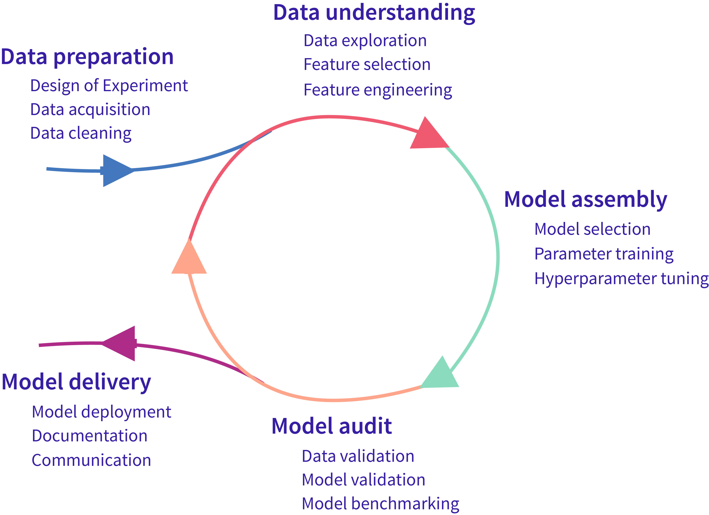
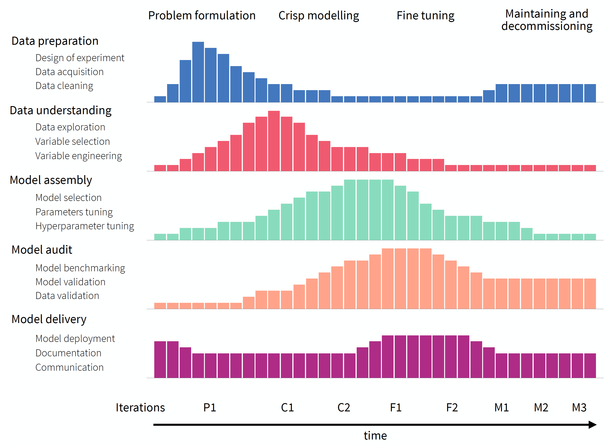
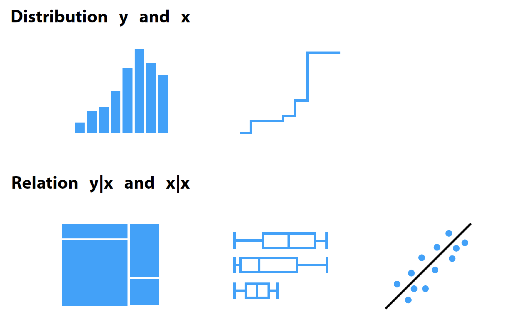

# Model Development {#modelDevelopmentProcess}

## Introduction {#MDPIntro}

In general, we can distinguish between two types of statistical modelling: *explanatory* and *predictive* [@Shmueli2010]. In *explanatory  modelling*, models are applied for inferential purposes, i.e., to test hypotheses resulting from some theoretical considerations related to the investigated phenomenon (for instance, related to the effect of a particular clinical factor on a probability of a disease).  In *predictive  modelling*, models are used for the purpose of predicting the value of a new or future observation (for instance, whether a person has got or will develop a disease). It is important to know what is the intended purpose of modelling, because it has got important consequences for the methods used in the model-development process. 

In this book, we focus on predictive modelling. Thus, we present mainly the methods relevant for predictive models. Nevertheless, we also show selected methods used in case of explanatory models, in order to discuss, if relevant,  substantive differences between the methods applied to the two types of models. 

Predictive models are created for various purposes. For instance, a team of data scientists may spend months on developing a single model that will be used for scoring risks of transactions in a large financial company. In that case, every aspect of the model is important, as the model will be used on a large scale and will have important long-term consequences for the company. Hence, the model-development process may be lengthy and tedious. On the other hand, if a small pizza-delivery chain may want to develop a simple model to roughly predict the demand for deliveries, the development process may be much shorter and less complicated. In that case, the model may be quickly updated or even discarded, without major consequences. 

Irrespectively of the model goals, model-development process involves similar steps. In this chapter, we briefly discuss these steps. 

## Model-development process {#MDPprocess}

Several approaches have been proposed to describe the process of model development. One of the most known general approaches is the Cross-industry Standard Process for Data Mining (CRISP-DM) [@crisp1999; @crisp2019wiki]. Methodologies specific for predictive models have been introduced by @r4ds2019, @misconceptions2019, and @mdp2019.  

The common goal of the approaches is to standardize the process. Standardization can help to plan resources needed to develop and maintain a model, and to make sure that no important steps are missed when developing the model.

CRISP-DM is a tool-agnostic procedure. It breaks the model-development process into six phases: *business understanding*, *data understanding*, *data preparation*, *modelling*, *evaluation*, and *deployment*. The phases can be iterated. Note that iterative phases are also considered by @r4ds2019 and @misconceptions2019.

Figure \@ref(fig:MDPwashmachine) presents a variant of the iterative process, divided into five steps. Data collection and preparation is needed prior to any modelling. One cannot hope for building a model with a good performance if the data are not of good quality. Once data have been collected, they have to be explored to understand their structure. Subsequently, a model can be selected and fitted to the data. The constructed model should be validated. The three steps: data understanding, model assembly, and model audit [TOMASZ: MODEL CONSTRUCTION, MODEL VALIDATION?], are often iterated to arrive at a point when, for instance, a model with the best predictive performance is obtained. Once the "best" model has been obtained, it can be "delivered," i.e., implemented in practice after performing tests and developing the necessary documentation.

(ref:MDPwashmachineCaption) Lifecycle of a predictive model. [TOMASZ: DESIGN OF EXPERIMENT A PART OF DATA PREPARATION? IF SO, CHANGE TO Design of experiment. ML LANGUAGE USED. MODIFY TO, E.G., FEATURE/VARIABLE SELECTION, PARAMETER ESTIMATION/TRAINING ETC. ].

```{r MDPwashmachine, echo=FALSE, fig.cap='(ref:MDPwashmachineCaption)', out.width = '60%', fig.align='center'}

```

The Model-development Process (MDP), proposed by @mdp2019, has been motivated by Rational Unified Process for Software Development [@rup1998; @usdp1999; @spiral1988]. MDP can be seen as an extension of the scheme presented  in Figure \@ref(fig:MDPwashmachine). MDP recognizes that fact that consecutive iterations are not identical, because the knowledge increases during the process and consecutive iterations are performed with different goals in mind. This is why MDP is presented in Figure \@ref(fig:mdpGeneral) as an untangled version of Figure \@ref(fig:MDPwashmachine). The five phases, present in CRIPSP-DM, are shown in the rows. A single bar in each row represents an amount of resources (for instance, a week-worth workload) that can be devoted to the project at a specific time-point (indicated on the horizontal axis). For a particular phase, resources can be used in different amounts depending on the current stage of the process, as indicated by the height of the bars. The stages are indicated at the top of the diagram in Figure \@ref(fig:mdpGeneral): *problem formulation*, *crisp modelling*, *fine tuning*, and *maintenance and decomissioning*. Problem formulation aims at defining the needs for the model, defining datasets that will be used for training and validation, and deciding which performance measures will be used for the evaluation of the performance of the final model. Crisp modelling focuses on creation of first versions of the model that may provide an idea about, for instance, how complex may the model have to be to yield the desired solution? Fine tuning focuses on improving the initial version(s) of the model and selecting the best one according to the pre-defined metrics. Finally, maintainance and decommissioning aims at monitoring the performance of the model after its implementation. Note that, unlike in CRISP-DM, the diagram in Figure \@ref(fig:mdpGeneral) indicates that the process may start with some resources being spent not on the data-preparation phase, but on the model-audit one. This is because, at the problem formulation stage, we may have to spend some time on defining the goals and model-performance metrics (that will be used in model benchmarking) before any attempt to collect the data.       

Figure \@ref(fig:mdpGeneral) also indicates that there may be several iterations of the different phases within each stage, as indicated at the bottom of the diagram. For instance, in the crisp-modelling stage, several versions of a model may be prepared in subsequent iterations.  

<!---
First iterations are usually focused on *formulation of the problem*. Sometimes the problem is well stated, however it's a rare situation valid maybe only for kaggle competitions. In most real-life problems the problem formulation requires lots of discussions and experiments. Once the problem is defined we can start building first prototypes, first *crisp versions of models*. These initial versions of models are needed to verify if the problem can be solved and how far we are form the solution. Usually we gather more information and go for the next phase, the *fine tuning*. We repeat these iterations until a final version of a model is developed. Then we move to the last phase *maintenance and* (one day) *decommissioning*.  
--->

(ref:mdpGeneralCaption) Overview of the model-development process. The process is split into five different phases (rows) and four stages (indicated at the top of the diagram). Horizontal axis presents the time from the problem formulation to putting the model into practice (decommissioning). For a particular phase, resources can be used in different amounts depending on the current stage of the process, as indicated by the height of the bars. There may be several iterations of different phases withhin each stage, as indicated at the bottom of the diagram. [TOMASZ: MODEL BENCHMARKING AS FIRST. CHANGE SENTENCE STYLE. CHANGE TO MODEL MAINTENANCE AND RELEASE? ALIGN TASKS WITH CRISP-DM. USE MODELLING WITH DOUBLE L.]

```{r mdpGeneral, echo=FALSE, fig.cap='(ref:mdpGeneralCaption)', out.width = '99%', fig.align='center'}

```

Methods presented in this book can be used to get a better understanding the data and the application domain (*exploration*), obtaining insight into model-based predictions (*model explanation*), and evaluation of model's performance (*model examination*). Thus, refering to MDP in Figure \@ref(fig:mdpGeneral), the methods are suitable for data understanding, model assembly, and model audit phases.

<!----
[TOMASZ: MOVED TO THE NEXT CHAPTER]
In this book we present various examples based on three use cases. Two introduced in Chapter \@ref(dataSetsIntro) (binary classification in surviving Titanic sinking and regression in apartments pricing) and one in Chapter \@ref(UseCaseFIFA) (estimation of soccer player value based on its skills). Due to space limitation we do not show the full life cycle of these problems, but we are focused on phases Crisp modelling and Fine tuning.
----> 

In the remainder of the chapter we provide a brief overview of the notation that will be used in the book, and the  methods commonly used for data exploration, model fitting, and model validation. 

## Notation {#notation}

Methods described in this book have been developed by different authors, who used different mathematical notations. 
We have made an attempt at keeping the mathematical notation consistent throughout the entire book. In some cases this may result in formulas with a fairly complex system of indices.

In this section, we provide a general overview of the notation we use. Whenever necessary, parts of the notation will be explained again in subsequent chapters.

We use capital letters like $X$ or $Y$ to denote (scalar) random variables. Observed values of these variables are denoted by lower-case letters like $x$ or $y$. Vectors and matrices are distinguished by underlining the letter. Thus, $\underline{X}$ and $\underline{x}$ denote matrix $X$ and (column) vector $x$, respectively. Note, however, that in some situations $\underline{X}$ may indicate a vector of (scalar) random variables. We explicitly mention this when needed. Transposition is indicated by the prime, i.e., $\underline{x}'$ is the row vector resulting from transposition of a column vector $\underline{x}$. 

We use notation $E(Y)$ and $Var(Y)$ to denote the expected (mean) value and variance of random variable $Y$. If needed, we use a subscript to indicate the distribution use to compute the parameters. Thus, for instance, we use 
$$E_{Y|X=x}(Y) = E_{Y|x}(Y) = E_{Y}(Y|X=x) $$
to indicate the conditional mean of $Y$ given that random variable $X$ assumes the value of $x$.     

We assume that the data available for modelling consist of $n$ observations/instances. For the $i$-th observation, we have got an observed value $y_i$ of a dependent (random) variable $Y$. We assume that $Y$ is a scalar, i.e., a single number. In case of dependent categorical variable, we usually consider $Y$ to be a binary indicator of observing a particular category. 

Additionally, each observation from a dataset is described by $p$ explanatory variables. We refer to the (column) vector of the explanatory variables, describing the $i$-th observation, by $\underline{x}_i$. We can thus consider observations as points in a $p$-dimensional space $\mathcal X \equiv \mathcal R^p$, with $\underline{x}_i \in \mathcal X$. We often collect all explanatory-variable data in the $n\times p$ matrix $\underline{X}$ that contains, in the $i$-th row, vector $\underline{x}'_i$.

When introducing some of the model-exploration methods, we often consider "an observation of interest," for which the vector of explanatory variables is denoted by $x_{*}$. As the observation may not necessarily belong to the analyzed dataset, we use of the asterisk in the subscript. Clearly, $\underline{x}_{*} \in \mathcal X$.
  
We refer to the $j$-th coordinate of vector $\underline{x}$ by using $j$ in superscript. Thus, $\underline{x}_i = ({x}^1_i, \ldots , {x}^p_i)'$, where ${x}^j_i$ denotes the $j$-th coordinate of vector $\underline{x}_i$ for the $i$-th observation from the analyzed dataset. If a power (for instance, a square) of ${x}^j_i$ is needed, it will be denoted by using parentheses, i.e., $\left({x}^j_i\right)^2$.   

If $\mathcal J$ denotes a subset of indices, then $\underline{x}^{\mathcal J}$ denotes the vector formed by the coordinates of $\underline{x}$ corresponding to the indices included in $\mathcal J$. 

We use $\underline{x}^{-j}$ to refer to a vector that results from removing the $j$-th coordinate from vector $\underline{x}$. By $\underline{x}^{j|=z}$, we denote a vector in which all coordinates are equal to  their values in $\underline{x}$, except of the $j$-th coordinate, which values is set equal to $z$. Thus,  $\underline{x}^{j|=z} = ({x}^1, \ldots, {x}^{j-1}, z, {x}^{j+1}, \ldots, {x}^p)'$.

Notation $\underline{X}^{*j}$ is used to denote a matrix with the values as in $\underline{X}$ except of the $j$-th column, for which elements are permuted.

In this book, a model is a function $f:\mathcal X \rightarrow \mathcal R$ that transforms a point from $\mathcal X$ into a real number. In most cases, the presented methods can be used directly for multi-variate dependent variables; however, we use examples with uni-variate responses to simplify the notation.

Typically, during the model development, we create many competing models. Formally, we shall index models to refer to a specific version fitted to a dataset. However, for the sake of simplicity, we will omit the index when it is not important. For the same reason we ignore in the notation the fact that, in practice, we never know true model coefficients and use the estimated values. 

We use the term  "model residual" to indicate the difference between the observed value of the dependent variable $Y$ for the $i$-th observation from a particular dataset and the model's prediction for the observation:

\begin{equation}
r_i = y_i - f(x_i) = y_i - \hat y_i,
(\#eq:modelResiduals)
\end{equation}

where $\hat y_i$ denotes the predicted (or fitted) value of $y_i$. More information about residuals is provided in Chapter \@ref(residualDiagnostic).

## Data understanding {#dataunderstanding}

As indicated in Figures \@ref(fig:MDPwashmachine) and \@ref(fig:mdpGeneral), before starting construction of any models, we have got to understand the data. Toward this aim, tools for data exploration such as visualization techniques, tabular summaries, and statistical methods can be used. The choice of the tools depend on the character of variables included in a dataset.

The most known introduction to data exploration is the famous book by @tukey1977. It introduces the (now classical) tools like, for example, box-and-whisker plots or stem-and-leaf plots. Good overviews of techniques for data exploration can also be found in books by @Nolan2015 and @Wickham2017.

In this book, we rely on five visualization techniques for data exploration, schematically presented in Figure \@ref(fig:UMEPEDA). Three of them (histogram, empirical cumulative-distribution (ECD) plot, and box plot) are used to summarize  the distribution of a random (explanatory or dependent) variable; the remaining two (mosaic plot, box plot, and scatter plot) are used to explore relationship between pairs of variables. Note that histogram can be used to explore the distribution of a continuous or a categorical variable, while the ECD plot and box plot are suitable for continuous variables. Mosaic plot is useful for exploring relationship between two categorical variables, while  scatter plot can be applied for two continuous variables. It is worth noting that box plots can also be used for evaluating a relation between a categorical variable and a continuous one, as illustrated in Figure \@ref(fig:UMEPEDA). 

(ref:UMEPEDACaption) Methods for visual exploration applied in the book.

```{r UMEPEDA, echo=FALSE, fig.cap='(ref:UMEPEDACaption)', out.width = '75%', fig.align='center'}

```

Exploration of data for the dependent variable usually focuses on the question related to the distribution of the variable. For instance, for a continuous variable, questions like approximate normality or symmetry of the distribution are most often of interest, because of the availability of many powerful methods and models that use the normality assumption. In case of asymmetry (skewness), a possibility of a transformation that could make the distirbution approximately symmetric or normal is usually investigated. For a categorical dependent variable, an important question is whether the proportion of observations in different categories is balanced or not. This is because, for instance, some methods related to the classification problem do not work well with if there is a substantial imbalance between the categories.

Exploration of data for explanatory variables may also include investigation of their distribution. This is because  the results may reveal, for instance, that there is little variability in the observed values of a variable. As a consequence, the variable might be deemed not interesting from a model-construction point of view. Usually, however, the exploration focuses on the relationship between explanatory variables themselves on one hand, and their relationship with the dependent variable on the other hand. The results may have important consequences for the model construction. For instance, if an explanatory variable does not appear to be related to the dependent variable, it may be dropped from a model (variable selection/filtering). The exploration results  may also suggest, for instance, a need for a transformation of an explanatory variable to make its relationship with the dependent variable linear (variable engineering). Detection of pairs of strongly-correlated explanatory variables is also of interest, as it may help in resolving issues with, for instance, instability of optimization algorithms used for fitting of a model.    

## Model assembly (fitting) {#fitting}

In statistical modelling, we are interested in the distribution of a dependent variable $Y$ given $\underline{x}$, the vector of values of explanatory variables. In the ideal world, we would like to know the entire conditional distribution. In practical applications, however, we usually do not evaluate the entire distribution, but just some of its characteristics, like the expected (mean) value, a quantile, or variance. Without loss of generality we will assume that we model the conditional expected value of $Y$, i.e., $E_{Y | \underline{x}}(Y)$.

Assume that we have got model $f()$, for which $f(\underline{x})$ is an approximation of $E_{Y | \underline{x}}(Y)$, i.e., $E_{Y | \underline{x}}(Y) \approx f(\underline{x})$. Note that, in our book, we do not assume that it is a "good" model, nor that the approximation is precise. We simply assume that we have got a model that is used to estimate the conditional expected value and to form predictions of the values of the dependent variable. Our interest lies in the evaluation of the quality of the predictions. If the model offers a "good" approximation of the conditional expected value, it should be reflected in its satisfactory predictive performance. 

Usually, when building a model, the available data are split into two parts. One part, often called a "training set" or "learning data," is used for estimation of the model coefficients. The other part, called a "testing set" or "validation data," is used for model validation. The splitting may be done repeatedly, as in k-fold cross- validation. We leave the topic of model validation for Chapter \@ref(modelPerformance).

The process of estimation of model coefficients based on the training data, i.e., "fitting" of the model, differs for different models. In most cases, however, it can be seen as an optimization problem. Let $\Theta$ be the space of all possible values of model coefficients. Model fitting (or training) is a procedure of selecting a value $\hat{\underline{\theta}} \in \Theta$ that minimizes some loss function $L()$:

\begin{equation}
\hat{\underline{\theta}} = \arg \min_{\underline{\theta} \in \Theta}  L\{\underline{y}, f(\underline{\theta};\underline{X})\}, 
(\#eq:modelTrainingEq0)
\end{equation}

where $\underline{y}$ is the vector of observed values of the dependent variable and $f(\underline{\theta}; \underline{X})\}$ is the corresponding vector of the model's predictions computed for model coefficients  $\underline{\theta}$ and matrix $\underline{X}$ of values of explanatory variables for the observations from the training dataset. Denote the estimated form of the model by $f(\hat{\underline{\theta}};\underline{X})$.

Consider predcition of a new observation for which the vector of explanatory variables assumes the value of $\underline{x}_0$, i.e., $f(\hat{\underline{\theta}};\underline{x}_0)$. Assume that $E_{Y | \underline{x}_0}(Y) = f(\underline{\theta};\underline{x}_0)$. It can be shown [@Hastie2009; @Shmueli2010] that the expected squared-error of prediction can be expressed as follows:   

\begin{equation}
E_{(Y,\hat{\underline{\theta}})|\underline{x}_0}\{Y-f(\hat{\underline{\theta}};\underline{x}_0)\}^2=
\phantom{E_{Y|\underline{x}_0}\{Y-f(\underline{\theta};\underline{x}_0)\}^2 + [f(\underline{\theta};\underline{x}_0)-E_{\underline{y}|\underline{x}_0}\{{f}(\hat{\underline{\theta}};\underline{x}_0)\}]^2 + E_{\underline{y}|\underline{x}_0}[{f}(\hat{\underline{\theta}};\underline{x}_0)-E_{\underline{y}|\underline{x}_0}\{{f}(\hat{\underline{\theta}};\underline{x}_0)\}]^2 }
\end{equation}
\begin{eqnarray}
&=&E_{Y|\underline{x}_0}\{Y-f(\underline{\theta};\underline{x}_0)\}^2 + [f(\underline{\theta};\underline{x}_0)-E_{\hat{\underline{\theta}}|\underline{x}_0}\{{f}(\hat{\underline{\theta}};\underline{x}_0)\}]^2 + E_{\hat{\underline{\theta}}|\underline{x}_0}[{f}(\hat{\underline{\theta}};\underline{x}_0)-E_{\hat{\underline{\theta}}|\underline{x}_0}\{{f}(\hat{\underline{\theta}};\underline{x}_0)\}]^2\\
&=& Var_{Y|\underline{x}_0}(Y)+Bias^2+Var_{\hat{\underline{\theta}}|\underline{x}_0}\{\hat{f}(\underline{x}_0)\}.   (\#eq:EPE) 
\end{eqnarray}

The first term on the right-hand-side of \@ref(eq:EPE) is the variability of $Y$ around its conditonal expected value $f(\underline{\theta};\underline{x}_0)$. In general, it cannot be reduced. The second term is the squared 
difference between the expected value and its estimate, i.e., the squared bias. Bias results from misspecifying the model by, for instance, using a more parsimonious or a simpler model. The third term is the variance of the estimate, due to the fact that we use training data to estimate the model. 

The decomposition presented in \@ref(eq:EPE) underlines an important difference between the explanatory and predictive modelling. In the explanatory modelling, the goal is to minimize the bias, as we are interested in obtaining the most accurate representation of the investigated phenomenon and the related theory. In the predictive modelling, the focus is on minimization of the sum of the (squared) bias and the estimation variance, because we are interested in minimization of the prediction error. Thus, sometimes we can accept a certain amount of bias, if it leads to a substantial gain in precision of estimation and, consequently, in a smaller prediction error [@Shmueli2010].

It follows that the choice of the loss function $L()$ in \@ref(eq:modelTrainingEq0) may differ for explanatory and predictive modelling. For the former, it is common to assume some family of probability distributions for the conditional distribution of $Y$ given $\underline{x}$. In such case, the loss function $L()$ may be defined as the negative logarithm of the likelihood function, where likelihood is the probability of observing $\underline{y}$, given $\underline{X}$, treated as a function of $\underline{\theta}$. The resulting estimate of $\underline{\theta}$ is usually denoted by $\hat{\underline{\theta}}$.

In predictive modelling, it is common to add term $\lambda(\underline{\theta})$ to the loss function that "penalizes" for the use of more complex models:

\begin{equation}
\tilde{\underline{\theta}} = \arg \min_{\underline{\theta} \in \Theta} \left[L\{\underline{y}, f(\underline{\theta};\underline{X})\} + \lambda(\underline{\theta})\right]. 
(\#eq:modelTrainingEq1)
\end{equation}

For example, in linear regression we assume that the observed vector $\underline{y}$ follows a multi-variate Gaussian distribution:  

$$
\underline{y} \sim \mathcal N(\underline{X}' \underline{\beta}, \sigma^2\underline{I}_n),
$$
where $\underline{\theta}' = (\underline{\beta}', \sigma^2)$ and $\underline{I}_n$ denotes the $n \times n$ identity matrix. In this case, equation \@ref(eq:modelTrainingEq1) becomes

\begin{equation}
\tilde{\underline{\theta}} = \arg \min_{\underline{\theta} \in \Theta}\left\{  \frac{1}{n}||\underline{y} - \underline{X}' \underline{\beta}||_{2} + \lambda(\underline{\beta}) \right\}= \arg \min_{\underline{\theta} \in \Theta} \left\{  \frac{1}{n}\sum_{i=1}^n (y_i-\underline{x}'_i\underline{\beta})^2+ \lambda(\underline{\beta}) \right\}. 
(\#eq:modelTrainingEq2)
\end{equation}

For the classcal linear regression, the penalty term $\lambda(\underline{\beta})$ is equal to $0$. In that case,  the optimal parameters $\hat{\underline{\beta}}$ and $\hat{\sigma}^2$, obtained from \@ref(eq:modelTrainingEq0), can be expressed in a closed form:

\begin{eqnarray*}
\hat{\underline{\beta}} &=& (\underline{X}'\underline{X})^{-1}\underline{X}'\underline{y},\\
\hat{\sigma}^2 &=& \frac{1}{n}||\underline{y} - \underline{X}' \hat{\underline{\beta}}||_{2} = \frac{1}{n}\sum_{i=1}^n (y_i-\underline{x}'_i\hat{\underline{\beta}})^2= \frac{1}{n}\sum_{i=1}^n (y_i-\hat{y}_i)^2.
\end{eqnarray*}

On the other hand, in ridge regression, the penalty function is defined as follows:

\begin{equation}
\lambda(\underline{\beta}) = \lambda \cdot ||\underline{\beta}||_2 = \lambda \sum_{k=1}^p (\beta^k) ^2.
(\#eq:ridgePenalty)
\end{equation}

In that case, the optimal parameters $\tilde{\underline{\beta}}$ and $\tilde{\sigma}^2$, obtained from equation \@ref(eq:modelTrainingEq1), can also be expressed in a closed form:

\begin{eqnarray*}
\tilde{\underline{\beta}} &=&  (\underline{X}'\underline{X} + \lambda  \underline{I}_n)^{-1}\underline{X}'\underline{y},\\
\tilde{\sigma}^2 &=& \frac{1}{n}||\underline{y} - \underline{X}' \tilde{\underline{\beta}}||_{2}.
\end{eqnarray*}

Note that ridge regression leads to non-zero squared-bias in \@ref(eq:EPE), but at the benefit of a reduced estimation variance [@Hastie2009].

Another possible form of penalty, used in the Least Absolute Shrinkage and Selection Operator (LASSO) regression, is given by 

\begin{equation}
\lambda(\underline{\beta}) = \lambda \cdot ||\underline{\beta}||_1 = \lambda \sum_{k=1}^p |\beta^k|.
(\#eq:lassoPenalty)
\end{equation}

In that case, $\tilde{\underline{\beta}}$ and $\tilde{\sigma}^2$ have to be estimated by using a numerical optimization procedure.

For a binary dependent variable, i.e., a classification problem, the natural choice for the distribution of $Y$ is the Bernoulli distribution. The resulting loss function, based on the logarithm of the Bernoulli likelihood, is

\begin{equation}
L(\underline{y},\underline{p})=-\frac{1}{n}\sum_{i=1}^n \{y_i\ln{p_i}+(1-y_i)\ln{(1-p_i)}\},
(\#eq:modelTrainingBernoulli)
\end{equation}

where $y_i$ is equal to 0 or 1 in case of "no response" and "response" (or "failure" and "success"), and $p_i$ is the probability of $y_i$ being equal to 1. Function \@ref(eq:modelTrainingBernoulli) is often called  "log-loss" or "binary cross-entropy" in machine-learning literature. 

A popular model for binary data is logistic regression, for which

$$
\ln{\frac{p_i}{1-p_i}}=\underline{x}_i'\underline{\beta}.
$$

In that case, the loss function in \@ref(eq:modelTrainingBernoulli) becomes equal to

\begin{equation}
L\{\underline{y},f(\underline{\beta},\underline{X})\}=-\frac{1}{n}\sum_{i=1}^n [y_i\underline{x}_i'\underline{\beta}-\ln\{1+\exp(\underline{x}_i'\underline{\beta})\}].
(\#eq:modelTrainingLogistic)
\end{equation}

Optimal values of parameters $\hat{\underline{\beta}}$, resulting from equation \@ref(eq:modelTrainingEq0), have to be found by numerical optimization algorithms.

Of course, one can combine the loss functions in \@ref(eq:modelTrainingBernoulli) and \@ref(eq:modelTrainingLogistic) with penalties \@ref(eq:ridgePenalty) or \@ref(eq:lassoPenalty) .

For a categorical dependent variable, i.e., a multilabel classification problem, the natural choice for the distribution of $Y$  is the multinomial distribution. The resulting loss function, in case of $K$ categories, is given by

\begin{equation}
L(\underline{Y},\underline{P})=-\frac{1}{n}\sum_{i=1}^n\sum_{k=1}^K y_{ik}\ln{p_{ik}},
(\#eq:modelTrainingMultinomial)
\end{equation}

where $y_{ik}=1$ if the $k$-th category was noted for the $i$-th observation and 0 otherwise, and $p_{ik}$ is the probability of $y_{ik}$ being equal to 1. Function \@ref(eq:modelTrainingMultinomial) is often called "categorical cross-entropy" in machine-learning literature. Also in this case, optimal parameters $\hat{\underline{\beta}}$, resulting from equation \@ref(eq:modelTrainingEq0), have to be found by numerical optimization algorithms.


<!---Apart from linear models for $y$ there is a large variety of predictive models. Find a good overview of different techniques for model development in ,,Modern Applied Statistics with S" [@MASSbook] or ,,Applied predictive modelling" [@Kuhn2013].
--->


## Model audit {#validation}

As indicated in Figure \@ref(fig:mdpGeneral), the modelling process starts with some crisp early versions that are fine tuned in consecutive iterations. To arrive at a final model, we usually have got to evaluate (audit) numerous candidate models that. In this book, we introduce techniques that allow: 

* decomposing a model's predictions into components that can be attributed to particular explanatory variables (Chapters \@ref(breakDown)--\@ref(LIME));
* conducting sensitivity analysis for a model's predictions (Chapter \@ref(ceterisParibus)--\@ref(localDiagnostics));
* summarizing the predictive performance of a model (Chapter \@ref(modelPerformance)). In particular, the presented measures are usually used to trace the progress in model development.
* assessing the importance of an explanatory variable (Chapter \@ref(featureImportance)). The techniques can be helpful in reducing the set of explanatory variables to be included in a model in the fine-tuning stage. 
* evaluating the effect of an explanatory variable on a model's predictions (Chapters \@ref(partialDependenceProfiles)--\@ref(accumulatedLocalProfiles)). 
* detailed examination of both overall and instance-specific model performance (Chapter \@ref(residualDiagnostic)).  These are residual-diagnostic tools that can help in identifying potential causes that may lead to issues with model performance.  

All those techniques can be used to evaluate the current version of a model and to get suggestions for possible improvements. The improvements may be developed and evaluated in the next crisp-modelling or fine-tuning phase.
