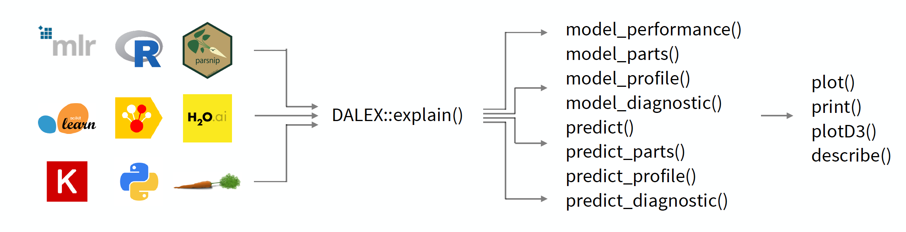

# Do-it-yourself with R  {#doItYourselfWithR}

In this book, we introduce various methods for instance-level and dataset-level exploration and explanation of predictive models. In each chapter, there is a section with code snippets for R and Python that shows how to use a particular method. In this chapter, we provide a short description of the steps that are needed to set-up the R environment with the required libraries.

## What to install?

Obviously, the R software [@RcoreT] is needed. It is always a good idea to use the newest version. At least R in version 3.6 is recommended. It can be downloaded from the CRAN website [https://cran.r-project.org/](https://cran.r-project.org/).

A good editor makes working with R much easier. There is plenty of choices, but, especially for beginners, it is worth considering the RStudio editor, an open-source and enterprise-ready tool for R. It can be downloaded from  https://www.rstudio.com/.

Once R and the editor are available, the required packages should be installed.

The most important one is the `DALEX` package in version 1.0 or newer. It is the entry point to solutions introduced in this book. The  package can be installed by executing the following command from the R command line:

```
install.packages("DALEX")
```

Installation of `DALEX` will automatically take care about installation of other requirements (packages required by it), like the `ggplot2` package for data visualization, `ingredients` and `iBreakDown` with specific methods for model exploration.

## How to work with `DALEX`? {#infoDALEX}

To conduct model exploration with `DALEX`, first, a model has to be created. Then the model has got to be prepared for exploration.

There are many packages in R that can be used to construct a model. Some packages are algorithm-specific, like `randomForest` for random-forest classification and regression models [@randomForest], `gbm` for generalized boosted regression models [@gbm], extensions for generalized linear models [@rms], and many others. There is also a number of packages that can be used for constructing models with different algorithm These include the `h2o` package [@h2oPackage], `caret` [@caret] and its successor `parsnip` [@parsnipPackage], a very powerful and extensible framework `mlr` [@mlr], or `keras` that is a wrapper to Python library with the same name [@kerasPackage].

While it is great to have such a large choice of tools for constructing models, the disadvantage is that different packages have different interfaces and different arguments. Moreover, model-objects created with different packages may have different internal structures. The main goal of the `DALEX` package is to create a level of abstraction around a model that makes it easier to explore and explain the model.

Function `DALEX::explain` is THE function for model wrapping. There is only one argument that is required by the function; it is `model`, which is used to specify the model-object with the fitted form of the model. However, the function allows additional arguments that extend its functionalities. They will be discussed in Section \@ref(ExplainersTitanicRCode).

<!---
* `data`, a data frame to which the model is to be applied; 
* `y`, observed values of the dependent variable for the validation data; it is an optional argument, required for explainers focused on model validation and benchmarking.
* `predict_function`, a function that returns prediction scores; if not specified, then a default `predict()` function is used. Note that, for some models, the default `predict()` function returns classes; in such cases, you should provide a function that will return numerical scores. 
* `label`, a name of a model; if not specified, then it is extracted from the `class(model)`. This name will be presented in figures, so it is recommended to make the name informative.
--->

(ref:DALEXarchitecture) The `DALEX` package creates a layer of abstraction around the models, allowing you to work with different models in a uniform way. The key function is the `explain` function, which wraps any model into a uniform interface. Then other functions from `DALEX` package can be used on the resulting object to explore the model.

```{r DALEXarchitecture, echo=FALSE, fig.cap='(ref:DALEXarchitecture)', out.width = '99%', fig.align='center'}

```


## How to work with `archivist`?

As we will focus on the exploration of predictive models, we prefer not to waste space nor time on replication of the code necessary for model development. This is where the `archivist` packages help.

The `archivist` package [@archivist] is designed to store, share, and manage R objects. We will use it to easily access pretrained R models and precalculated explainers. To install the package, the following command should be executed in the R command line:

```
install.packages("archivist")
```

Once the package has been installed, function `aread()` can be used to retrieve R objects from any remote repository. For this book, we use a GitHub repository `models` hosted at https://github.com/pbiecek/models. For instance, to download a model with the md5 hash `ceb40`, the following command has to be executed:

```{r, eval=FALSE}
archivist::aread("pbiecek/models/ceb40")
```

Since the md5 hash `ceb40` uniquely defines the model, referring to the repository object results in using exactly the same model and the same explanations. Thus, in the subsequent chapters, pre-constructed models will be accessed with `archivist` hooks. In the following sections, we will also use `archivist` hooks when referring to datasets.
