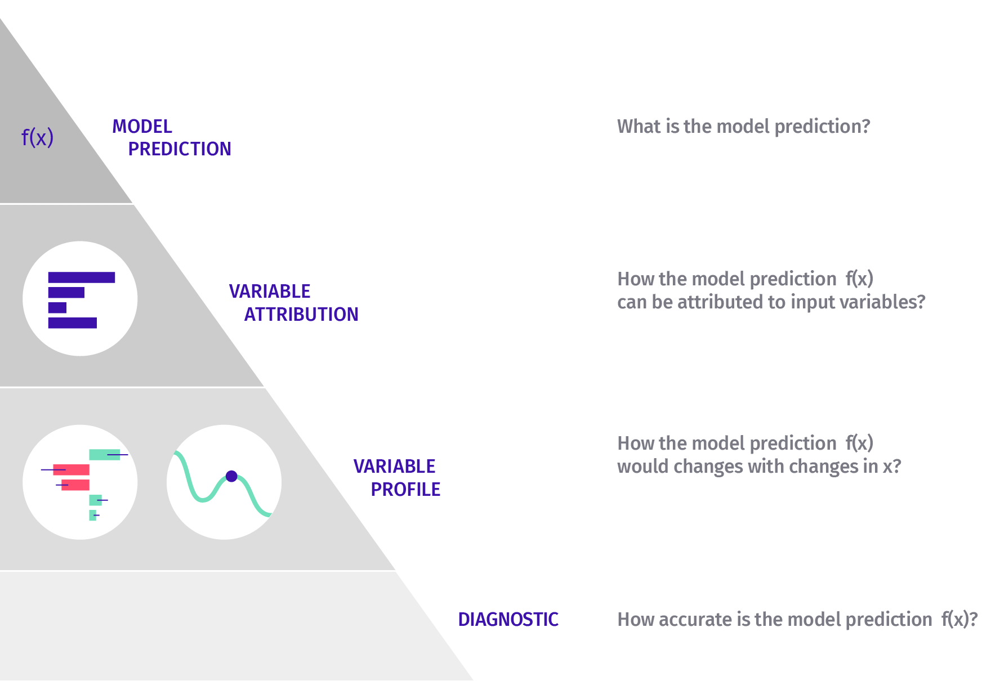

# (PART) Instance Level {-}

[TOMASZ: CORRECT QUESTIONS: HOW DOES A VARIABLE AFFECT THE PREDICTION? DOES THE MODEL FIT WELL AROUND THE PREDICTION?]

[TOMASZ: MAKE THE FIGURE ORIENTATION CONSISTENT WITH THE LEFT-HAND-SIDE OF THE PYRAMID.]

```{r UMEPpiramideInstance, echo=FALSE, out.width = '99%', fig.align='center'}

```

# Introduction to Instance-level Exploration {#InstanceLevelExploration}

Instance-level exploration methods help to understand how does a model yield a prediction for a particular single observation. We can think about the following situations as examples:

* We may want to evaluate effects of explanatory variables on the model's predictions. For instance, we may be interested in predicting the risk of heart attack based on person's age, sex, and smoking habits. A model may be used to construct a score (for instance, a linear combination of the explanatory variables representing age, sex, and smoking habits) that could be used for the purposes of prediction. For a particular patient we may want to learn how much do the different variables contribute to the score?
* We may want to understand how would the model's predictions change if values of some of the explanatory variables changed? For instance, what would be the predicted risk of heart attack if the patient cut the number of cigarettes smoked per day by half? 
* We may discover that the model is providing incorrect predictions and we may want to find the reason. For instance, a patient with a very low risk-score experienced a heart attack. What has driven the wrong prediction?

In this part of the book we describe the most popular approaches to instance-level exploration. They can be divided into three classes:

* One approach is to analyze how does the model's prediction for a particular instance differ from the average  prediction and how can the difference be distributed among explanatory variables? This method is often called the "variable attributions" approach. An example is provided in panel A of Figure \@ref(fig:cutsTechnikiReady). Chapters \@ref(breakDown)-\@ref(shapley) present various methods implementing this approach. 
* Another approach uses the interpretation of the model as a function and investigates the local behavior of this function around the point (observation) of interest $\underline{x}_*$. In particular, we analyze the curvature of the model response (prediction) surface around $\underline{x}_*$. In case of a black-box model, we may approximate it with a simpler glass-box model around $\underline{x}_*$. An example is provided in panel B of Figure \@ref(fig:cutsTechnikiReady). Chapter \@ref(LIME) presents the Local Interpretable Model-agnostic Explanations (LIME) method that exploits the concept of a "local model." 
* Yet another approach is to investigate how does the model's prediction change if the value of a single explanatory variable  changes? The approach is useful in the so-called "What-if" analyses. In particular, we can construct plots presenting the change in model-based predictions induced by a change of a single explanatory variable. Such plots are usually called ceteris-paribus (CP) profiles. An example is provided in panel C in Figure \@ref(fig:cutsTechnikiReady). Chapters \@ref(ceterisParibus)-\@ref(localDiagnostics) introduce the CP profiles and methods based on them.  

Each method has its own merits and limitations. They are briefly discussed in the corresponding chapters. Chapter \@ref(summaryInstanceLevel) offers a comparison of the methods.

(ref:cutsTechnikiReadyCaption) Illustration of different approaches to instance-level exploration. The plots present response (prediction) surface for a (black-box) model that is a function of two explanatory variables. We are interested in understanding the model response (prediction) at a single point (observation). Panel A illustrates the concept of variable attributions. Additive effect of each variable show how does the prediction for the particular observation differ from the average. Panel B illustrates the concept of explanations through local models. A simpler glass-box model is used to approximate the black-box model around the point (observation) of interest. It describes the local behavior of the model. Panel C presents a "What-if" analysis with a ceteris-paribus profile. The profile shows the model response (prediction) as a function of a single explanatory variable, while keeping the values of all other explanatory variables fixed.

```{r cutsTechnikiReady, echo=FALSE, fig.cap='(ref:cutsTechnikiReadyCaption)', out.width = '100%', fig.align='center'}
knitr::include_graphics("figure/cuts_techniki_ready.png")
```
