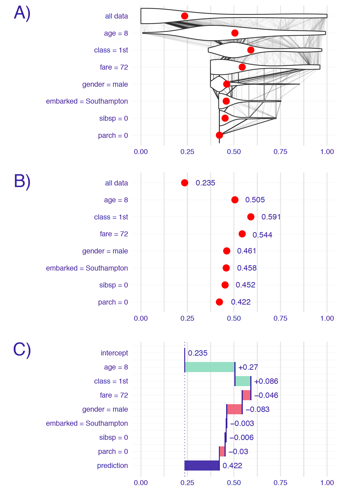

# Break-down Plots for Additive Attributions {#breakDown}

## Introduction {#BDIntroduction}

Probably the most common question asked when trying to understand model prediction for a single observation is: *which variables contributes to this result the most?* There is no single best approach that can be used to answer this question. In this chapter, we introduce break-down (BD) plots, which offer a possible solution. The plots can be used to present "variable attributions," i.e., the decomposition of the model prediction into parts that can be attributed to different explanatory variables. Note that the method is similar to the `EXPLAIN` algorithm introduced by @explainPaper and implemented in the `ExplainPrediction` package [@explainPackage].


## Intuition {#BDIntuition}

As mentioned in Section \@ref(fitting), we assume that the model prediction $f(\underline{x})$ is an approximation of the expected value of the dependent variable $Y$ given the values of the explanatory variables $\underline{x}$. The underlying idea of BD plots is to capture the contribution of an explanatory variable to the model prediction by computing the shift in the expected value of $Y$ while fixing the values of other variables. 

This idea is illustrated in Figure \@ref(fig:BDPrice4). Consider an example related to the prediction for the random-forest model `model_rf_v6` for the Titanic data (see Section \@ref(model-titanic-rf)). We are interested in probability of survival for Johny D, an 8-years-old passenger travelling in the first class (see Section \@ref(predictions-titanic)). Panel A of Figure \@ref(fig:BDPrice4) shows distribution of model predictions for observations from the Titanic dataset. In particular, the violin plot marked "all data" summarizes the distrbution of predictions for all 2207 observations from the dataset. The red dot indicates the mean value. It can be interpreted as an estimate of the expected value of the model predictions over the distribution of all explanatory variables. In this example, the expected value of the model prediction is equal to 23.5%.

To evaluate the contribution of individual explanatory variables to this particular single-instance prediction, we investigate the changes in model predictions when fixing the values of consecutive variables. For instance, the violin plot in the row marked  "class=1st" in Panel A of Figure \@ref(fig:BDPrice4) summarizes the distribution of the predictions obtained when the *class** variable takes the value "1st class", as for Johny D. Again, the red dot indicates the average of the predictions and it can be interpreted as an estimate of the expected value of the predictions over the distribution of all explanatory variables other than *class*. The violin plot in row "age=8" describes the distribution and the mean value of predictions with the values of variables *class*"* and *age* set to "1st class" and "8 years", respectively. Subsequent rows contain similar information for other explanatory variables included in the random-forest model. In the last row, all explanatory variables are fixed at the values describing Johny D. Hence, the last row contains only one point, the red dot, which corresponds to the model prediction, i.e., survival probability for Johny D.

The thin black lines in Panel A of Figure \@ref(fig:BDPrice4) show how the predictions for different individuals  change when the value of a particular explanatory variable is being replaced by the value indicated in the name of the row. For instance, the lines between the first and the second row indicate that fixing the value of the *class*  variable to "1st class" has a different effect for different individuals. For some individuals (most likely, passengers from the 1st class) the model prediction does not change at all. For others the predicted value increases (probably for the passengers from the 2nd or 3rd class) or decreases (most likely for the desk crew members).

Eventually, however, we may be interested in the mean predictions or even only in the changes of the means. Thus, simplified plots as shown in Panel B and C of Figure \@ref(fig:BDPrice4) may be of interest. Note that, in Panel C, the row marked "intercept" presents the overall mean value (0.235) of predictions for the entire dataset. Consecutive rows present changes in the mean prediction induced by fixing the value of a particular explanatory variable. Positive changes are indicated with green bars, while negative differences are indicated with red bars. The last row, marked "prediction," contains the sum of the overall mean value and the changes, i.e., the predicted value of survival probability for Johny D, indicated by the violet bar.

What can be learned from BD plots as those presented in Figure \@ref(fig:BDPrice4)? The plots offer a summary of effects of particular explanatory variables on model predictions. 

For instance, from Figure \@ref(fig:BDPrice4) we can conclude that the mean model prediction for the random-forest model for the Titanic dataset is equal to 23.5 percent. This is the predicted probability of survival averaged over all people on Titanic. Note that it is not the percentage of inidividuals that survived, but the mean model response. Thus, for a different model we would most likely obtain a different mean value.

The model prediction for Johny D is equal to 42.2 percent. It is much higher than the mean prediction. The two explanatory variables that influence this prediction the most are *class* (with the value "1st") and *age* (with the value equal to 8). By fixing the values of these two variables, we add to the mean prediction 33.5 percentage points. All other explanatory variables have smaller effects and they actually reduce the increase in the predicted value induced by *class* an *age*. For instance, *gender* (Johny D was a boy) reduces the predicted surival probability by about 6.6 percentage points. 

It is worth noting that the part of the prediction attributed to an explanatory variable depends not only on the variable, but also on the considered value. For instance, in the example presented in Figure \@ref(fig:BDPrice4), the effect of the *embarked harbor* is very small. This may be due to the fact that the variable is not very important for prediction. However, it is also possible that the variable is important, but the value considered for the particular single instance (Johny D, who embarked Titanic in Southampton) may have an average effect, as compared to all other possible values of the variable.


```{r BDPrice4, echo=FALSE, fig.cap="Break-down plots show how the contributions attributed to individual explanatory variables change the mean model prediction to yield the actual prediction for a particular single instance (observation). Panel A) The first row shows the distribution and the mean value (red dot) of model predictions for all data. The next rows show the distribution and the mean value of the predictions when fixing values of subsequent explanatory variables. The last row shows the prediction for the particular instance of interest. B) Red dots indicate the mean  predictions from Panel A. C) The green and red bars indicate, respectively, positive and negative changes in the mean predictions (contributions attributed to explanatory variables).", out.width = '70%', fig.align='center'}

```

It is also worth noting that, for models that include interactions, the part of the prediction attributed to an explanatory variable depends on the order, in which one sets the values of the explanatory variables. Figure \@ref(fig:ordering) presents an example for a random-forest model fitted to the Titanic data. Subsequently, we focus on the model's prediction for a 2-year old boy that travelled in the second class. The predicted probability of survival is equal to 0.964, more than a double of the mean model prediction of 0.407. We would like to understand which explanatory variables drive this prediction. Two possible explanations are illustrated in Figure \@ref(fig:ordering).

**Explanation 1:**
We first consider the explanatory variables *gender*, *class*, and *age*, in that order. Figure \@ref(fig:ordering) indicates negative contributions for the first two variables, and a positive contribution for the third one. Thus, the fact that the passenger was a boy decreases the chances of survival, as compared to the mean model prediction. He traveled in the second class, which further lowers the probability of survival. However, as the boy was very young, this substantially increases the odds of surviving. This last conclusion is the result of the fact that most passengers in the second class were adults; therefore, a kid from the second class had higher chances of survival.

**Explanation 2:**
We now consider the order of explanatory variables: *gender*, *age*, and *class*. Now Figure \@ref(fig:ordering) indicates a positive contribution of *class*, unlike in the first explanation. Again, the fact that the passenger was a boy decreases the chances of survival, as compared to the mean model prediction. However, he was very young, and this increases the probability of survival as compared to adult men. Finally, the fact that the boy traveled in the second class increases the chance even further. This last conclusion stems from the fact that most kids travelled in the third class; thus, being a child in the second class would increase chances of survival.
[TOMASZ: IT IS DIFFICULT TO PUT A FINGER ON A PARTICULAR INTERACTION HERE, AS IT IS NOT EXPLICIT IN THE MODEL OR IN THE PLOT.]

```{r ordering, echo=FALSE, fig.cap="An illustration of the order-dependence of the variable-contribution values. Two break-down plots for the same observation for a random-forest model for the Titanic data set. The contribution of class is negative in the top plot and positive in the bottom one. The difference is due to the difference in the ordering of explanatory variables used to construct the plots (as seen in the labelling of the rows). [TOMASZ: CHANGE SCENARIO TO EXPLANATION]", out.width = '50%', fig.align='center'}
knitr::include_graphics("figure/ordering.png")
```

## Method {#BDMethod}

In this section, we introduce more formally the method of variable atribution. We first focus on linear models,  because their simple and additive structure allows building intuition. Then we consider a more general case.

### Break-down for linear models {#BDMethodLin}

Assume a classical linear model for dependent variable $Y$ with $p$ explanatory variables, the values of which are  collected in vector $\underline{x}$, and a vector of $p$ coefficients $\underline{\beta}$. Note that we separately  consider $\beta^0$, which is the intercept. The prediction for $Y$ is given by the expected value of $Y$ conditional on $\underline{x}$. In particular, the expected value is given by the following linear combination:  

$$
E_Y(Y | \underline{x}) = f(\underline{x}) = \beta^0 + \underline{x}'\underline{\beta}.
$$  

Assume that we select a vector of values of explanatory variables $\underline{x}_* \in \mathcal R^p$. We are interested in the contribution of the $j$-th explanatory variable to model prediction $f(\underline{x}_*)$ for a single observation described by $\underline{x}_*$. Because of additive structure of the linear model, we expect that this contribution will be linked to ${x}_*^j{\beta}^j$, because the $j$-th variable occurs only in this term. As it will become clear in the sequel, it is easier to interpret the $j$-th explanatory variable contribution if it is centered by subtracting the expected value of $X^j$. This leads the following proposition for the *variable-importance measure*:

\begin{equation}
v(j, \underline{x}_*) = {\beta}^j \{{x}_*^j - E_{X^j}(X^j)\}.
(\#eq:singleBreakDownContribution)
\end{equation}

In equation \@ref(eq:singleBreakDownContribution), $v(j,\underline{x}_*)$ is the contribution of the $j$-th explanatory variable to the model prediction $f(\underline{x}_*)$. Assume that $E_Y(Y | \underline{x}_*) \approx f(\underline{x}_*)$, where $f(\underline{x}_*)$ is the model prediction for  $\underline{x}_*$. A possible approach to define $v(j,\underline{x}_*)$ is to measure how much the expected value of $Y$ changes after conditioning on $\underline{x}^j_*$. Using the notation $\underline{x}^{j|=X^j}_*$ (see Section \@ref(notation)) to indicate that we treat the value of the $j$-th coordinate as a random variable $X^j$, we can thus define:

\begin{equation}
v(j, \underline{x}_*) = E_Y(Y | \underline{x}_*) - E_{X^j}\left[E_Y\left\{Y | \underline{x}^{j|=X^j}_*\right\}\right]\approx f(x_*) - E_{X^j}\left\{f\left(\underline{x}^{j|=X^j}_*\right)\right\},
(\#eq:BDattr1)
\end{equation}

where the last expected value on the right-hand-side of \@ref(eq:BDattr1) is taken over the distribution of the $j$-th explanatory variable $X^j$ (treated as a random variable). For the classical linear model, and if the explanatory variables are independent, $v(j,\underline{x}_*)$ can be expressed as follows:

\begin{equation}
v(j, \underline{x}_*) =  \beta^0 + \underline{x}_*' \underline{\beta} - E_{X^j}\left\{\beta^0 + \left(\underline{x}^{j|=X^j}_*\right)' \underline{\beta}\right\} = {\beta}^j\{{x}_*^j - E_{X^j}(X^j)\}.
\end{equation}

In practice, given a dataset, the expected value of $X^j$ can be estimated by the sample mean $\bar x^j$. This leads to  

\begin{equation}
{v}(j, \underline{x}_*) = {\beta}^j ({x}_*^j - \bar x^j).
\end{equation}

Note that the linear-model-based prediction may be re-expressed in the following way:
$$
f(x_*) = \{\beta^0 + \bar x^1 {\beta}^1 + ... + \bar x^p {\beta}^p\} + \{({x}^1_* - \bar x^1) {\beta}^1 + ... + ({x}^p_* - \bar x^p) {\beta}^p\} 
$$
\begin{equation}
 \equiv (mean \ prediction) + \sum_{j=1}^p v(j, \underline{x}_*).
(\#eq:singleBreakDownResult)
\end{equation}

Thus, the contributions of the explanatory variables $v(j, \underline{x}_*)$ sum up to the difference between the model prediction for $\underline{x}_*$ and the mean model prediction.

**NOTE for careful readers**

Obviously, the sample mean $\bar x^j$ is an estimator of the expected value $E_{X^j}(X^j)$, calculated using a training dataset. For the sake of simplicity we do not emphasize these differences in the notation. Also, we ignore the fact that, in practice, we never know the true model coefficients and use with estimated coefficients. 

### Break-down for a general case {#BDMethodGen}

Again, let $v(j, \underline{x}_*)$ denote the variable-importance measure of the $j$-th variable and instance $\underline{x}_*$, i.e., the contribution of the $j$-th variable to model prediction at $\underline{x}_*$. 

We would like the sum of the $v(j, \underline{x}_*)$ for all explanatory variables to be equal to the instance prediction. This property is called *local accuracy*. Thus, we want that

\begin{equation}
f(\underline{x}_*) = v_0 + \sum_{j=1}^p v(j, \underline{x}_*),
(\#eq:generalBreakDownLocalAccuracy)
\end{equation}

where $v_0$ denotes the mean model prediction. Denote by $\underline{X}$ the vector of explanatory variables treated as random. We can then rewrite equation \@ref(eq:generalBreakDownLocalAccuracy) as follows:

\begin{equation}
E_{\underline{X}}\{f(\underline{X})|X^1 = {x}^1_*, \ldots, X^p = {x}^p_*\} = E_{\underline{X}}\{f(\underline{X})\} + \sum_{j=1}^p v(j, \underline{x}_*),
\end{equation}

then a natural proposal for $v(j, \underline{x}_*)$ is

\begin{equation}
v(j, \underline{x}_*) = E_{\underline{X}}\{f(\underline{X}) | X^1 = {x}^1_*, \ldots, X^j = {x}^j_*\} - E_{\underline{X}}\{f(\underline{X}) | X^1 = {x}^1_*, \ldots, X^{j-1} = {x}^{j-1}_*\}. 
(\#eq:generalBreakDownProposition)
\end{equation}

In other words, the contribution of the $j$-th variable is the difference between the expected value of the model prediction conditional on setting the values of the first $j$ variables equal to their values in $\underline{x}_*$ and the expected value conditional on setting the values of the first $j-1$ variables equal to their values in $\underline{x}_*$. 

Note that the definition does imply the dependence of $v(j, \underline{x}_*)$  on the order of the explanatory variables that is reflected in their indices (superscripts). 

To consider more general cases, let $J$ denote a subset of $K$ ($K\leq p$) indices from $\{1,2,\ldots,p\}$, i.e., $J=\{j_1,j_2,\ldots,j_K\}$ where each $j_k \in \{1,2,\ldots,p\}$. Furthermore, let $L$ denote another subset of $M$ ($M \leq p-K$) indices from ${1,2,\ldots,p}$ distinct from $J$. That is, $L=\{l_1,l_2,\ldots,l_M\}$ where each $l_m \in \{1,2,\ldots,p\}$ and $J \cap L = \emptyset$. Let us define now    

\begin{eqnarray}

\Delta^{L|J}(\underline{x}_*) &\equiv& E_{\underline{X}}\{f(\underline{X}) | X^{l_1} = {x}_*^{l_1},\ldots,X^{l_M} = {x}_*^{l_M},X^{j_1} = {x}_*^{j_1},\ldots,X^{j_K} = {x}_*^{j_K}\}\\
&-& E_{\underline{X}}\{f(\underline{X}) | X^{j_1} = {x}_*^{j_1},\ldots,X^{j_K} = {x}_*^{j_K}\}.
\end{eqnarray}

In other words, $\Delta^{L|J}(\underline{x}_*)$ is the change between the expected model prediction when setting the values of the explanatory variables with indices from the set $J \cup L$ equal to their values in $\underline{x}_*$ and the expected prediction conditional on setting the values of the explanatory variables with indices from the set $J$ equal to their values in $\underline{x}_*$. 

In particular, for the $l$-th explanatory variable, let
\begin{eqnarray}
\Delta^{l|J}(\underline{x}_*) \equiv \Delta^{\{l\}|J}(\underline{x}_*) &=& E_{\underline{X}}\{f(\underline{X}) | X^{j_1} = {x}_*^{j_1},\ldots,X^{j_K} = {x}_*^{j_K}, X^{l} = {x}_*^{l}\}\\
&-& E_{\underline{X}}\{f(\underline{X}) | X^{j_1} = {x}_*^{j_1},\ldots,X^{j_K} = {x}_*^{j_K}\}.
(\#eq:lcondJBD)
\end{eqnarray}

Thus, $\Delta^{l|J}$ is the change between the expected prediction when setting the values of the explanatory variables with indices from the set $J \cup \{l\}$ equal to their values in $\underline{x}_*$ and the expected prediction conditional on setting the values of the explanatory variables with indices from the set $J$ equal to their values in $\underline{x}_*$. Note that, if $J=\emptyset$, then 

\begin{equation}
\Delta^{l|\emptyset}(\underline{x}_*) = E_{\underline{X}}\{f(\underline{X}) | X^{l} = {x}_*^{l}\} - E_{\underline{X}}\{f(\underline{X})\} = E_{\underline{X}}\{f(\underline{X}) | X^{l} = {x}_*^{l}\} - v_0.
(\#eq:deltaBreakDownAdditive)
\end{equation}

It follows that

\begin{equation}
v(j, \underline{x}_*) = \Delta^{j|\{1,\ldots, j-1\}}(\underline{x}_*) = \Delta^{\{1,\ldots, j\}|\emptyset}(\underline{x}_*)-\Delta^{\{1,\ldots, j-1\}|\emptyset}(\underline{x}_*).
(\#eq:viBD)
\end{equation}

As it was mentioned in Section \@ref(BDIntuition), for models that include interactions, the value of the  variable-importance measure $v(j, \underline{x}_*)$ depends on the order of conditioning on explanatory variables. A heuristic approach to address this issue consists of choosing an order in which the variables with the largest contributions are selected first. In particular, the following two-step procedure can be considered. In the first step, the ordering is chosen based on the decreasing values of $|\Delta^{k|\emptyset}(\underline{x}_*)|$. Note that the use of absolute values is needed, because the variable contributions can be positive or negative. In the second step, the variable-importance measure for the $j$-th variable is calculated as 
$$
v(j, \underline{x}_*) = \Delta ^{j|J}(\underline{x}_*),
$$
where
$$
J = \{k: |\Delta^{k|\emptyset}(\underline{x}_*)| < |\Delta^{j|\emptyset}(\underline{x}_*)|\}.
$$
That is, $J$ is the set of indices of explanatory variables with scores $|\Delta^{k|\emptyset}(\underline{x}_*)|$ smaller than the corresponding score for variable $j$.

The time complexity of each of the two steps of the procedure is $O(p)$, where $p$ is the number of explanatory variables.

There are two other possible approaches. One consists of identifying the interactions that cause a difference in variable-importance measures for different orderings and focusing on those interactions. This approach is discussed in Chapter \@ref(iBreakDown). The other one consists of calculating an average value of the variance-importance measure across all possible orderings. This approach is presented in Chapter \@ref(shapley).

## Example: Titanic data {#BDExample} 

Let us consider the random-forest model `titanic_rf_v6` (see Section \@ref(model-titanic-rf)) and passenger Johny D (see Section \@ref(predictions-titanic)) as the instance of interest in the Titanic data. 

The mean of model predictions for all passengers is equal to $v_0 = 0.2353095$. Table \@ref(tab:titanicBreakDownDeltas) presents the scores $|\Delta^{j|\emptyset}(\underline{x}_*)|$ and the expected values $E_{\underline{X}}\{f(\underline{X}) | X^j = {x}^j_*\}$. Note that, given \@ref(eq:deltaBreakDownAdditive) and the fact that $E_{\underline{X}}\{f(\underline{X}) | X^j = {x}^j_*\}>v_0$ for all explanatory variables, we have got $E_{\underline{X}}\{f(\underline{X}) | X^j = {x}^j_*\}=|\Delta^{j|\emptyset}(\underline{x}_*)|+v_0$. 

Table: (\#tab:titanicBreakDownDeltas) Expected values $E_{\underline{X}}\{f(\underline{X}) | X^j = {x}^j_*\}$ and scores $|\Delta^{j|\emptyset}(\underline{x}_*)|$ for the random-forest model `titanic_rf_v6` and `johny_d` for the Titanic data. The scores are sorted in the decreasing order.

|variable $j$ | $E_{\underline{X}}\{f(\underline{X}) | X^j = {x}^j_*\}$ | $|\Delta^{j|\emptyset}(\underline{x}_*)|$  |
|:--------|---------:|---------:|
|age      | 0.7407795| 0.5051210|
|class    | 0.6561034| 0.4204449|
|fare     | 0.6141968| 0.3785383|
|sibsp    | 0.4786182| 0.2429597|
|parch    | 0.4679240| 0.2322655|
|embarked | 0.4602620| 0.2246035|
|gender   | 0.3459458| 0.1102873|

```{r, echo=FALSE, eval=FALSE}
library("iBreakDown")
avg = mean(predict(explain_rf_v6$model, type = "prob")[,2])

deltas <- iBreakDown:::calculate_1d_changes(explain_rf_v6$model, 
                                  johny_d, 
                                  explain_rf_v6$data[,colnames(johny_d)], 
                                  predict_function = explain_rf_v6$predict_function)
dftmp <- data.frame(variable = names(deltas), E = unlist(deltas) + 0.2356585, delta = unlist(deltas))
library("dplyr")
dftmp %>% arrange(-delta) %>% knitr::kable()

tmp <- break_down(explain_rf_v6, johny_d)
plot(tmp)
as.data.frame(tmp)[,c(1,5,2)] %>% knitr::kable()
```

Based on the ordering defined by the scores $|\Delta^{j|\emptyset}(\underline{x}_*)|$ from Table \@ref(tab:titanicBreakDownDeltas), we can compute the variable-importance measures based on the sequential contributions $\Delta^{j|J}(\underline{x}_*)$. The computed values are presented in Table \@ref(tab:titanicBreakDownDeltasConseq).

Table: (\#tab:titanicBreakDownDeltasConseq) Variable-importance measures $\Delta^{j|\{1,\ldots,j\}}(\underline{x}_*)$ for the random-forest model `titanic_rf_v6` and `johny_d` for the Titanic data, computed by using the ordering of variables defined in Table \@ref(tab:titanicBreakDownDeltas).


|variable $j$           |  $E_{\underline{X}}\left\{ f(\underline{X}) | \underline{X}^{\{1,\ldots,j\}} = \underline{x}^{\{1,\ldots,j\}}_*\right\}$ |  $\Delta^{j|\{1,\ldots,j\}}(\underline{x}_*)$ |
|:----------------------|-----------:|------------:|
|intercept $(v_0)$      |   0.2353095|    0.2353095|
|age = 8                |   0.5051210|    0.2698115|
|class = 1st            |   0.5906969|    0.0855759|
|fare = 72              |   0.5443561|   -0.0463407|
|gender = male          |   0.4611518|   -0.0832043|
|embarked = Southampton |   0.4584422|   -0.0027096|
|sibsp = 0              |   0.4523398|   -0.0061024|
|parch = 0              |   0.4220000|   -0.0303398|
|prediction             |   0.4220000|    0.4220000|


Results from Table \@ref(tab:titanicBreakDownDeltasConseq) are presented in Figure \@ref(fig:BDjohnyExample). The plot indicates that the largest positive contributions to the predicted probability of survival for Johny D come from explanatory variables *age* and *class*. The contributions of the remaining variables are smaller (in absolute values) and negative.

(ref:BDjohnyExampleDesc) Break-down plot for the random-forest model `titanic_rf_v6` and `johny_d` for the Titanic data.

```{r BDjohnyExample, echo=FALSE, warning=FALSE, message=FALSE, fig.cap='(ref:BDjohnyExampleDesc)', out.width = '70%', fig.align='center'}
library("randomForest")
library("DALEX")
library("ggplot2")
load("models/explain_rf_v6.rda")
load("models/johny_d.rda")
bd_rf <- variable_attribution(explain_rf_v6,
                 new_observation = johny_d,
                 type = "break_down")

plot(bd_rf) + ggtitle("Break-down plot for `titanic_rf_v6`")
```


## Pros and cons {#BDProsCons}

BD plots offer a model-agnostic approach that can be applied to any predictive model that returns a single number for a single instance. The approach offers several advantages. The plots are, in general, easy to understand. They are compact; results for many explanatory variables can be presented in a limited space. The approach reduces to an intuitive interpretation for linear models. Numerical complexity of the BD algorithm is linear in the number of explanatory variables.

An important issue is that BD plots may be misleading for models including interactions This is because the plots show only the additive contributions. Thus, the choice of the ordering of the explanatory variables that is used in the calculation of the variable-importance measures is important. Also, for models with a large number of variables, BD plots may be complex and include many expanatory variables with small contributions to the instance prediction.

To address the issue of dependence of the variable-importance measure on the ordering of the explanatory variables, the heuristic approach described in Section \@ref(BDMethodGen) can be applied. Alternative approaches are described in Chapters \@ref(iBreakDown) and \@ref(shapley).

## Code snippets for R {#BDR}

In this section, we use the `DALEX` package, which is a wrapper for `iBreakDown` R package [@iBreakDownRPackage]. The package covers all methods presented in this chapter. It is available on CRAN and GitHub. 

For illustration purposes, we use the `titanic_rf_v6` random-forest model for the Titanic data developed in Section \@ref(model-titanic-rf). Recall that the model is developed to predict the probability of survival for passengers of Titanic. Instance-level explanations are calculated for Henry - a 47-year-old passenger that travelled in the 1st class (see Section \@ref(predictions-titanic)).

`DALEX` explainers for the `titanic_rf_v6` model and the data for Henry are retrieved via the `archivist` hooks, as listed in Section \@ref(ListOfModelsTitanic). 

```{r, warning=FALSE, message=FALSE, eval=FALSE}
library("randomForest")
explain_rf_v6 <- archivist::aread("pbiecek/models/6ed54")

library("DALEX")
henry <- archivist::aread("pbiecek/models/a6538")
henry
```

```{r, warning=FALSE, message=FALSE, echo=FALSE}
library("randomForest")
library("DALEX")
load("models/explain_rf_v6.rda")
load("models/henry.rda")
henry
```

### Basic use of the `variable_attribution()` function

The `DALEX::variable_attribution()` function calculates the variable-importance measures for a selected model and the instance of interest. The result of applying the `variable_attribution()` function is a data frame containing the calculated measures. 

In the simplest call, the function requires three arguments:

* `explainer` - a model-explainer object, created with function `DALEX::explain()`; 
* `new_observation` - an observation to be explained; it should be a data frame with structure that matches the training dataset sturcture; 
* `type` - the method for calculation of variable attribution; the possible methods are `shap`, `oscillations`, `break_down`, and `break_down_interactions`.

In the code below, the argument `type = "break_down"` method is used. The code essentially re-creates the variable-importance values ($\Delta^{j|\{1,\ldots,j\}}(\underline{x}_*)$).

```{r, warning=FALSE, message=FALSE}
bd_rf <- variable_attribution(explainer = explain_rf_v6,
                 new_observation = henry,
                 type = "break_down")
bd_rf
```

Applying the generic `plot()` function to the object resulting from the application of the `variable_attribution()` function creates a BD plot, shown in Figure \@ref(fig:BDhenryExample).

(ref:BDhenryExampleDesc) Break-down plot obtained by the generic `plot()` function for the random-forest model `titanic_rf_v6` and `henry` for the Titanic data.

```{r BDhenryExample, warning=FALSE, message=FALSE,  fig.cap='(ref:BDhenryExampleDesc)', out.width = '70%', fig.align='center', fig.width=8, fig.height=5}
plot(bd_rf) 
```

Figure \@ref(fig:BDhenryExample) can be used to compare the explanatory-variable contributions obtained for Henry with those computed for Johny D (see Figure \@ref(fig:BDjohnyExample)). Both explanations refer to the same model random-forest `model_rf_v6`. We can see that the predicted survival probability for Henry (0.246) is almost the same as the mean prediction (0.235), while the probability for Johny D is higher (0.422). For Johny D, this result can be  mainly attributed to the positive contribution of *age* and *class*. For Henry, *class* still contributes positively to the chances of survival, but the effect of *age* is negative. For both passengers the effect of *gender* is negative. Thus, one could conclude that the difference in the predicted survival probabilities is mainly due to  different ages of Henry and Johny D.    

### Advanced use of the `variable_attribution()` function

Apart from `explainer`, `new_observation`, and `type`, function `variable_attribution()` includes additional arguments. The most commonly used are:

* `order` - a vector of characters (column names) or integers (column indexes) that specify order of explanatory variables to be used for computing the variable-importance measures; if not specified (default), then a one-step heuristic is used to determine the order;
* `keep_distributions` - a logical value; if `TRUE`, then additional diagnostic information about conditional distributions is stored in the resulting object and can be plotted with the generic `plot()` function.

In what follows, we illustrate the use of the arguments.

First, we specify the ordering of the explanatory variables. Toward this end, we can use integer indexes or variable names. The latter option is prerferable in most cases because of transparency. Additionally, to reduce clutter in the plot, we set `max_features = 3` argument in the `plot()` function. 

```{r, warning=FALSE, message=FALSE,  fig.cap="Break-down plot for top three variables for the random-forest model `titanic_rf_v6` and `henry` for the Titanic data.", out.width = '70%', fig.align='center', fig.width=8, fig.height=5}
bd_rf_order <- variable_attribution(explain_rf_v6,
         new_observation = henry, type = "break_down",
         order = c("class", "age", "gender", "fare", "parch", 
                           "sibsp", "embarked"))

plot(bd_rf_order, max_features = 3) 
```

We can use the `keep_distributions = TRUE` argument to enrich the resulting object with additional information about conditional distributions. Subsequently, we can apply the `plot_distributions = TRUE` argument in the `plot()` function to present the distributions as violin plots. Red dots in the plots indicate the mean model predictions.  Thin black lines between violin plots indicate changes in predictions for individual observations. They can be used to trace how model predictions change after consecutive conditionings. A similar code was used to create the plot in Panel A of Figure \@ref(fig:BDPrice4) for Johny D.  [TOMASZ: HOW TO REVERSE THE PLOT TO GET A SIMILAR ONE TO PANEL A IN THE INTRODUCTION?]

```{r, warning=FALSE, message=FALSE,  fig.cap="Break Down plot with distributions for a defined order of variables for the random-forest model `titanic_rf_v6` and `henry` for the Titanic data.", out.width = '70%', fig.align='center', fig.width=8, fig.height=5}
bd_rf_distr <- variable_attribution(explain_rf_v6,
          new_observation = henry, type = "break_down",
          order = c("class", "age", "gender", "fare", 
                           "parch", "sibsp", "embarked"),
          keep_distributions = TRUE)

plot(bd_rf_distr, plot_distributions = TRUE) 
```

