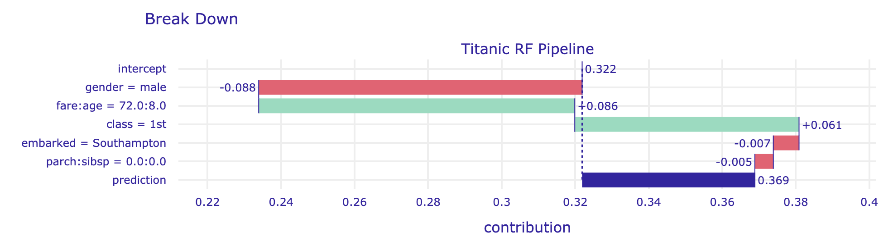

#  Break-down Plots for Interactions {#iBreakDown}

```{r, echo=FALSE, warning=FALSE}
source("code_snippets/ema_init.R")
```

In Chapter \@ref(breakDown), we presented a model-agnostic approach to the calculation of the attribution of an explanatory variable to a model's predictions. However, for some models, like models with interactions, the results of the method introduced in Chapter \@ref(breakDown) depend on the ordering of the explanatory variables that are used in computations. 

In this chapter, we present an algorithm that addresses the issue. In particular, the algorithm identifies interactions between pairs of variables and takes them into account when constructing break-down (BD) plots. In our presentation, we focus on pairwise interactions that involve pairs of explanatory variables, but the algorithm can be easily extended to interactions involving a larger number of variables.

## Intuition {#iBDIntuition}

Interaction (deviation from additivity) means\index{Interaction} that the effect of an explanatory variable depends on the value(s) of other variable(s). To illustrate such a situation, we use the Titanic dataset (see Section \@ref(TitanicDataset)). For the sake of simplicity, we consider only two variables, *age* and *class*. *Age* is a continuous variable, but we will use a dichotomized version of it, with two levels: boys (0-16 years old) and adults (17+ years old). Also, for *class*, we will consider just "2nd class" and "other".

Table \@ref(tab:titanicMaleSurvival) shows percentages of survivors for boys and adult men travelling in the second class and other classes on Titanic. Overall, the proportion of survivors among males is 20.5%. However, among boys in the second class, the proportion is 91.7%. How do *age* and *class* contribute to this higher survival probability? Let us consider the following two explanations.

**Explanation 1:** 

The overall probability of survival for males is 20.5%, but for the male passengers from the second class, the probability is even lower, i.e., 13.5%. Thus, the effect of the travel class is negative, as it decreases the probability of survival by 7 percentage points. Now, if, for male passengers of the second class, we consider their age, we see that the survival probability for boys increases by 78.2 percentage points, from 13.5% (for a male in the second class) to 91.7%. Thus, by considering first the effect of *class*, and then the effect of *age*, we can conclude the effect of $-7$ percentage points for *class* and $+78.2$ percentage points for *age* (being a boy).\index{Interaction break-down | plot}

**Explanation 2:** 

The overall probability of survival for males is 20.5%, but for boys the probability is higher, i.e., 40.7%. Thus, the effect of *age* (being a boy) is positive, as it increases the survival probability by 20.2 percentage points. On the other hand, for boys, travelling in the second class increases the probability further from 40.7% overall to 91.7%. Thus, by considering first the effect of *age*, and then the effect of *class*, we can conclude the effect of $+20.2$ percentage points for *age* (being a boy) and $+51$ percentage points for *class*.\index{Break-down|plot}

Table: (\#tab:titanicMaleSurvival) Proportion of survivors for men on Titanic.

|Class            |Boys (0-16)    |Adults (>16)     |Total            |
|:----------------|:--------------|:----------------|:----------------|
|2nd              |11/12 = 91.7%  |13/166 = 7.8%    |24/178 = 13.5%   |
|other            |22/69 = 31.9%  |306/1469 = 20.8% |328/1538 = 21.3% |
|Total            |33/81 = 40.7%  |319/1635 = 19.5% |352/1716 = 20.5% |

Thus, by considering the effects of *class* and *age* in a different order, we get very different attributions (contributions attributed to the variables). This is because there is an interaction: the effect of *class* depends on *age* and *vice versa*. In particular, from Table \@ref(tab:titanicMaleSurvival) we could conclude that the overall effect of the second class is negative ( $-7$ percentage points), as it decreases the probability of survival from 20.5% to 13.5%. On the other hand, the overall effect of being a boy is positive ($+20.2$ percentage points), as it increases the probability of survival from 20.5% to 40.7%. Based on those effects, we would expect a probability of $20.5\% - 7\% + 20.2\% = 33.7\%$ for a boy in the second class. However, the observed proportion of survivors is much higher, 91.7%. The difference $91.7\% - 33.7\% = 58\%$ is the interaction effect. We can interpret it as an additional effect of the second class specific for boys, or as an additional effect of being a boy for the male passengers travelling in the second class.   

```{r, eval=FALSE, echo=FALSE}
library(DALEX)

titanicM <- titanic[titanic$gender == "male",]
tab3 <- addmargins(table(titanicM$class, titanicM$age > 16, titanicM$survived))

table_formated <- apply(tab3, 1:2, function(x) {
  paste0(x[2], "/", sum(x), " = ", round(100*x[2]/sum(x), 1), "%")
})
knitr::kable(table_formated, booktabs = TRUE,
  caption = 'Caption.')
```

The example illustrates that interactions complicate the evaluation of the importance of explanatory variables with respect to a model's predictions. In the next section, we present an algorithm that allows including interactions in the BD plots. 

## Method {#iBDMethod}

Identification of interactions in the model is performed in three steps [@iBreakDownRPackage]:

1. For each explanatory variable, compute $\Delta^{j|\emptyset}(\underline{x}_*)$ as in equation \@ref(eq:deltaBreakDownAdditive) in Section \@ref(BDMethodGen). The measure quantifies the additive contribution of each variable to the instance prediction.
2. For each pair of explanatory variables, compute $\Delta^{\{i,j\}|\emptyset}(\underline{x}_*)$ as in equation \@ref(eq:deltaBreakDownAdditive) in Section \@ref(BDMethodGen), and then the "net effect" of the interaction 
\begin{equation}
\Delta^{\{i,j\}}_I(x_*) \equiv \Delta^{\{i,j\}|\emptyset}(\underline{x}_*)-\Delta^{i|\emptyset}(\underline{x}_*)-\Delta^{j|\emptyset}(\underline{x}_*).
(\#eq:deltaBreakDownInteractions)
\end{equation}
Note that $\Delta^{\{i,j\}|\emptyset}(\underline{x}_*)$ quantifies the joint contribution of a pair of variables. Thus, $\Delta^{\{i,j\}}_I(\underline{x}_*)$ measures the contribution related to the deviation from additivity, i.e., to the interaction between the $i$-th and $j$-th variable.
3. Rank the so-obtained measures for individual explanatory variables and interactions to determine the final ordering for computing the variable-importance measures. Using the ordering, compute variable-importance measures $v(j, \underline{x}_*)$, as defined in equation \@ref(eq:viBD) in Section \@ref(BDMethodGen).

The time complexity of the first step is $O(p)$, where $p$ is the number of explanatory variables. For the second step, the complexity is $O(p^2)$, while for the third step it is $O(p)$. Thus, the time complexity of the entire procedure is $O(p^2)$.\index{BD|see{Break-down}}\index{Break-down|method}\index{iBD| see {Interaction break-down}}\index{Interaction break-down}\index{Interaction break-down | method}

## Example: Titanic data {#iBDExample} 

Let us consider the random forest model `titanic_rf` (see Section \@ref(model-titanic-rf)) and passenger Johnny D (see Section \@ref(predictions-titanic)) as the instance of interest in the Titanic data.

Table \@ref(tab:titanicIBreakDownList) presents single-variable contributions $\Delta^{j|\emptyset}(\underline{x}_*)$, paired-variable contributions $\Delta^{\{i,j\}|\emptyset}(\underline{x}_*)$, and interaction contributions $\Delta_{I}^{\{i,j\}}(\underline{x}_*)$ for each explanatory variable and each pair of variables. All the measures are calculated for Johnny D, the instance of interest. 

Table: (\#tab:titanicIBreakDownList) Paired-variable contributions $\Delta^{\{i,j\}|\emptyset}(\underline{x}_*)$,  interaction contributions $\Delta_{I}^{\{i,j\}}(\underline{x}_*)$, and single-variable contributions $\Delta^{j|\emptyset}(\underline{x}_*)$ for the random forest model and Johnny D for the Titanic data.

|Variable        | $\Delta^{\{i,j\}|\emptyset}(\underline{x}_*)$ | $\Delta_{I}^{\{i,j\}}(\underline{x}_*)$|$\Delta^{i|\emptyset}(\underline{x}_*)$ |
|:---------------|------:|---------:|------:|
|age             |       |          |  0.270|
|fare:class      |  0.098|    -0.231|       |
|class           |       |          |  0.185|
|fare:age        |  0.249|    -0.164|       |
|fare            |       |          |  0.143|
|gender          |       |          | -0.125|
|age:class       |  0.355|    -0.100|       |
|age:gender      |  0.215|     0.070|       |
|fare:gender     |       |          |       |
|embarked        |       |          | -0.011|
|embarked:age    |  0.269|     0.010|       |
|parch:gender    | -0.136|    -0.008|       |
|sibsp           |       |          |  0.008|
|sibsp:age       |  0.284|     0.007|       |
|sibsp:class     |  0.187|    -0.006|       |
|embarked:fare   |  0.138|     0.006|       |
|sibsp:gender    | -0.123|    -0.005|       |
|fare:parch      |  0.145|     0.005|       |
|parch:sibsp     |  0.001|    -0.004|       |
|parch           |       |          | -0.003|
|parch:age       |  0.264|    -0.002|       |
|embarked:gender | -0.134|     0.002|       |
|embarked:parch  | -0.012|     0.001|       |
|fare:sibsp      |  0.152|     0.001|       |
|embarked:class  |  0.173|    -0.001|       |
|gender:class    |  0.061|     0.001|       |
|embarked:sibsp  | -0.002|     0.001|       |
|parch:class     |  0.183|     0.000|       |

The table illustrates the calculation of the contributions of interactions. For instance, the additive contribution of *age* is equal to 0.270, while for *fare* it is equal to 0.143. The joint contribution of these two variables is equal to 0.249. Hence, the contribution attributed to the interaction is equal to $0.249 - 0.270 - 0.143 = -0.164$.    

Note that the rows of Table \@ref(tab:titanicIBreakDownList)  are sorted according to the absolute value of the net contribution of the single explanatory variable or the net contribution of the interaction between two variables. For a single variable, the net contribution is simply measured by $\Delta^{j|\emptyset}(\underline{x}_*)$, while for an interaction it is given by $\Delta_{I}^{\{i,j\}}(\underline{x}_*)$. In this way, if two variables are important and there is little interaction, then the net contribution of the interaction is smaller than the contribution of any of the two variables. Consequently, the interaction will be ranked lower. This is the case, for example, of variables *age* and *gender* in Table \@ref(tab:titanicIBreakDownList). On the other hand, if the interaction is important, then its net contribution will be larger than the contribution of any of the two variables. This is the case, for example, of variables *fare* and *class* in Table \@ref(tab:titanicIBreakDownList).

Based on the ordering of the rows in Table \@ref(tab:titanicIBreakDownList), the following sequence of variables is identified as informative: 

* *age*, because it has the largest (in absolute value) net contribution equal to 0.270; 
* *fare:class* interaction, because its net contribution (-0.231) is the second largest (in absolute value);
* *gender*, because variables *class* and *fare* are already accounted for in the *fare:class* interaction and the  net contribution of *gender*, equal to 0.125, is the largest (in absolute value) among the remaining variables and interactions;
* *embarked* harbor (based on a similar reasoning as for *gender*);  
* then *sibsp* and *parch* as variables with the smallest net contributions (among single variables), which are larger than the contribution of their interaction.

<!---
Table: (\#tab:titanicIBreakDownList) Expected model's predictions $E_{\underline{X}}\{f(\underline{X})|X^i = \underline{x}_*^i, X^j = \underline{x}_*^j\}=\Delta^{\{i,j\}|\emptyset}(\underline{x}_*)+v_0$, paired-variable contributions $\Delta^{\{i,j\}|\emptyset}(\underline{x}_*)$, and interaction contributions $\Delta_{I}^{\{i,j\}}(\underline{x}_*)$ for the random forest model and passenger johny D in the Titanic data.

|Variable        |$\Delta^{\{i,j\}|\emptyset}(\underline{x}_*)+v_0$| $\Delta^{\{i,j\}|\emptyset}(\underline{x}_*)$ | $\Delta_{I}^{\{i,j\}}(\underline{x}_*)$|
|:---------------|-----:|------:|---------:|
|age             | 0.505|  0.270|          |
|fare:class      | 0.333|  0.098|    -0.231|
|class           | 0.420|  0.185|          |
|fare:age        | 0.484|  0.249|    -0.164|
|fare            | 0.379|  0.143|          |
|gender          | 0.110| -0.125|          |
|age:class       | 0.591|  0.355|    -0.100|
|age:gender      | 0.451|  0.215|     0.070|
|fare:gender     | 0.280|  0.045|     0.027|
|embarked        | 0.225| -0.011|          |
|embarked:age    | 0.504|  0.269|     0.010|
|parch:gender    | 0.100| -0.136|    -0.008|
|sibsp           | 0.243|  0.008|          |
|sibsp:age       | 0.520|  0.284|     0.007|
|sibsp:class     | 0.422|  0.187|    -0.006|
|embarked:fare   | 0.374|  0.138|     0.006|
|sibsp:gender    | 0.113| -0.123|    -0.005|
|fare:parch      | 0.380|  0.145|     0.005|
|parch:sibsp     | 0.236|  0.001|    -0.004|
|parch           | 0.232| -0.003|          |
|parch:age       | 0.500|  0.264|    -0.002|
|embarked:gender | 0.101| -0.134|     0.002|
|embarked:parch  | 0.223| -0.012|     0.001|
|fare:sibsp      | 0.387|  0.152|     0.001|
|embarked:class  | 0.409|  0.173|    -0.001|
|gender:class    | 0.296|  0.061|     0.001|
|embarked:sibsp  | 0.233| -0.002|     0.001|
|parch:class     | 0.418|  0.183|     0.000|
--->

<!---
|Variable        |$\Delta^{\{i,j\}|\emptyset}(\underline{x}_*)+v_0$| $\Delta^{\{i,j\}|\emptyset}(\underline{x}_*)$ | $\Delta_{I}^{\{i,j\}}(\underline{x}_*)$|$\Delta^{i|\emptyset}(\underline{x}_*)$ |
|:---------------|-----:|------:|---------:|------:|
|age             | 0.505|       |          |  0.270|
|fare:class      | 0.333|  0.098|    -0.231|       |
|class           | 0.420|       |          |  0.185|
|fare:age        | 0.484|  0.249|    -0.164|       |
|fare            | 0.379|       |          |  0.143|
|gender          | 0.110|       |          | -0.125|
|age:class       | 0.591|  0.355|    -0.100|       |
|age:gender      | 0.451|  0.215|     0.070|       |
|fare:gender     | 0.280|       |          |       |
|embarked        | 0.225|       |          | -0.011|
|embarked:age    | 0.504|  0.269|     0.010|       |
|parch:gender    | 0.100| -0.136|    -0.008|       |
|sibsp           | 0.243|       |          |  0.008|
|sibsp:age       | 0.520|  0.284|     0.007|       |
|sibsp:class     | 0.422|  0.187|    -0.006|       |
|embarked:fare   | 0.374|  0.138|     0.006|       |
|sibsp:gender    | 0.113| -0.123|    -0.005|       |
|fare:parch      | 0.380|  0.145|     0.005|       |
|parch:sibsp     | 0.236|  0.001|    -0.004|       |
|parch           | 0.232|       |          | -0.003|
|parch:age       | 0.500|  0.264|    -0.002|       |
|embarked:gender | 0.101| -0.134|     0.002|       |
|embarked:parch  | 0.223| -0.012|     0.001|       |
|fare:sibsp      | 0.387|  0.152|     0.001|       |
|embarked:class  | 0.409|  0.173|    -0.001|       |
|gender:class    | 0.296|  0.061|     0.001|       |
|embarked:sibsp  | 0.233| -0.002|     0.001|       |
|parch:class     | 0.418|  0.183|     0.000|       |
--->

Table \@ref(tab:titanicIBreakDownList2) presents the variable-importance measures computed by using the following ordering of explanatory variables and their pairwise interactions: *age*, *fare:class*, *gender*, *embarked*, *sibsp*, and *parch*. The table presents also the conditional expected values (see equations \@ref(eq:generalBreakDownLocalAccuracy) and \@ref(eq:viBD) in Section \@ref(BDMethodGen))
$$E_{\underline{X}}\left\{f(\underline{X}) | \underline{X}^{\{1,\ldots,j\}} = \underline{x}^{\{1,\ldots,j\}}_*\right\}=v_0+\sum_{k=1}^j v(k,\underline{x}_*)=v_0+\Delta^{\{1,\ldots\,j\}|\emptyset}(\underline{x}_*).$$
Note that the expected value presented in the last row, 0.422, corresponds to the model's prediction for the instance of interest, passenger Johnny D.
 
Table: (\#tab:titanicIBreakDownList2) Variable-importance measures $v(j,\underline{x}_*)$ and the conditonal expected values $v_0+\sum_{k=1}^j v(k,\underline{x}_*)$ computed by using the sequence  of variables *age*, *fare:class*, *gender*, *embarked*, *sibsp*, and *parch* for the random forest model and Johnny D for the Titanic data.

|Variable               |  $j$ | $v(j,\underline{x}_*)$ | $v_0+\sum_{k=1}^j v(k,\underline{x}_*)$|
|:----------------------|------:|------------:|-----------:|
|intercept  ($v_0$)     |       |             |   0.235    |
|age = 8                |   1   |    0.269    |   0.505    |
|fare:class = 72:1st    |   2   |    0.039    |   0.544    |
|gender = male          |   3   |   -0.083    |   0.461    |
|embarked = Southampton |   4   |   -0.002    |   0.458    |
|sibsp = 0              |   5   |   -0.006    |   0.452    |
|parch = 0              |   6   |   -0.030    |   0.422    |

<!---
|Variable               |  $\Delta^{\{1,\ldots, j\}|\emptyset}(\underline{x}_*)+v_0$|$v(j,\underline{x}_*)$ |
|:----------------------|------------:|-----------:|
|intercept              |    0.235    |            |
|age = 8                |    0.505    |    0.269   |
|fare:class = 72:1st    |    0.544    |    0.039   |
|gender = male          |    0.461    |   -0.083   |
|embarked = Southampton |    0.458    |   -0.002   |
|sibsp = 0              |    0.452    |   -0.006   |
|parch = 0              |    0.422    |   -0.030   |
--->

<!---
$E_{\underline{X}}\left\{f(\underline{X}) | X^{\{1,\ldots,j\}} = \underline{x}^{\{1,\ldots,j\}}_*\right\}$
--->

Figure \@ref(fig:iBreakDownTitanicExamplePlot) presents the interaction-break-down (iBD) plot corresponding to the results shown in Table \@ref(tab:titanicIBreakDownList2). The interaction between *fare* and *class* variables is included in the plot as a single bar. As the effects of these two variables cannot be disentangled, the plot uses just that single bar to represent the contribution of both variables. Table \@ref(tab:titanicIBreakDownList) indicates that *class* alone would increase the mean prediction by 0.185, while *fare* would increase the mean prediction by 0.143. However, taken together, they increase the average prediction only by 0.098.  A possible explanation of this negative interaction could be that, while the ticket fare of 72 is high on average, it is actually below the median when the first-class passengers are considered. Thus, if first-class passengers with "cheaper" tickets, as Johnny D, were, for instance, placed in cabins that made it more difficult to reach a lifeboat, this could lead to lower chances of survival as compared to other passengers from the same class (though the chances could be still higher as compared to passengers from other, lower travel classes).

(ref:iBreakDownTitanicExamplePlotDesc) Break-down plot with interactions for the random forest model and Johnny D for the Titanic data.

```{r iBreakDownTitanicExamplePlot, warning=FALSE, message=FALSE, echo=FALSE, fig.cap='(ref:iBreakDownTitanicExamplePlotDesc)', out.width = '100%', fig.align='center', fig.width=7, fig.height=4}
library("DALEX")
library("iBreakDown")
library("randomForest")
#titanic_rf <- archivist::aread("pbiecek/models/4e0fc")
#titanic_imputed <- archivist::aread("pbiecek/models/27e5c")
# load("models/titanic_rf.rda")
# load("models/titanic.rda")

explain_titanic_rf <- DALEX::explain(model = titanic_rf, 
                              data = titanic_imputed[,-9],
                              y = titanic_imputed$survived == "yes",
                              colorize = FALSE,
			      verbose = FALSE) 

johnny_d <- data.frame(
  class = factor("1st", levels = c("1st", "2nd", "3rd", "deck crew", "engineering crew", 
                                  "restaurant staff", "victualling crew")),
  gender = factor("male", levels = c("female", "male")),
  age = 8,
  sibsp = 0,
  parch = 0,
  fare = 72,
  embarked = factor("Southampton", levels = c("Belfast", "Cherbourg", "Queenstown", "Southampton"))
)

predict_function <- function(m,x) predict(m, x, type = "prob")[,2]
data <- titanic_imputed[,c(1:4,6:8)]
x <- titanic_rf
p <- ncol(data)
new_observation <- johnny_d

plot(break_down(explain_titanic_rf, johnny_d, interactions = TRUE))+ theme_ema + ggtitle("Break-down profile")
```

```{r iBreakDownTitanicExample, warning=FALSE, message=FALSE, echo=FALSE, eval=FALSE}
library("DALEX")
library("randomForest")
load("models/titanic_rf.rda")
load("models/titanic.rda")

explain_titanic_rf <- DALEX::explain(model = titanic_rf, 
                              data = titanic[,-9],
                              y = titanic$survived == "yes",
                              colorize = FALSE, 
                              verbose = FALSE)

johny_d <- data.frame(
  class = factor("1st", levels = c("1st", "2nd", "3rd", "deck crew", "engineering crew", 
                                  "restaurant staff", "victualling crew")),
  gender = factor("male", levels = c("female", "male")),
  age = 8,
  sibsp = 0,
  parch = 0,
  fare = 72,
  embarked = factor("Southampton", levels = c("Belfast", "Cherbourg", "Queenstown", "Southampton"))
)

predict_function <- function(m,x) predict(m, x, type = "prob")[,2]
data <- titanic[,c(1:4,6:8)]
x <- titanic_rf
p <- ncol(data)
new_observation <- johny_d

break_down(explain_titanic_rf, johny_d, interactions = TRUE)
interaction_preference <- 1
keep_distributions = FALSE
label = "rf_model"

common_variables <- intersect(colnames(new_observation), colnames(data))
new_observation <- new_observation[, common_variables, drop = FALSE]
data <- data[, common_variables, drop = FALSE]
          
target_yhat_all <- predict_function(x, new_observation)
selected_target <- 1
single_predict_function <- function(...) {
    predictions <- predict_function(...)
    if (!is.null(dim(predictions))) {
        return(predictions[selected_target])
    }
    predictions
}
target_yhat <- single_predict_function(x, new_observation)
baseline_yhat <- mean(single_predict_function(x, data))
average_yhats <- unlist(iBreakDown:::calculate_1d_changes(x, new_observation, 
    data, single_predict_function))
diffs_1d <- average_yhats - baseline_yhat
feature_path_1d <- data.frame(E = average_yhats, diff = diffs_1d, adiff = abs(diffs_1d), 
    diff_norm = diffs_1d, adiff_norm = abs(diffs_1d), 
    ind1 = 1:p, ind2 = NA)
rownames(feature_path_1d) <- gsub(rownames(feature_path_1d), 
    pattern = ".yhats", replacement = "")
inds <- data.frame(ind1 = unlist(lapply(2:p, function(i) i:p)), 
    ind2 = unlist(lapply(2:p, function(i) rep(i - 1, 
        p - i + 1))))
changes <- iBreakDown:::calculate_2d_changes(x, new_observation, data, 
    single_predict_function, inds, diffs_1d)
diffs_2d <- changes$average_yhats - baseline_yhat
diffs_2d_norm <- changes$average_yhats_norm - baseline_yhat
feature_path_2d <- data.frame(E = changes$average_yhats, diff = diffs_2d, adiff = abs(diffs_2d) * 
    interaction_preference, diff_norm = diffs_2d_norm, 
    adiff_norm = abs(diffs_2d_norm) * interaction_preference, 
    ind1 = inds$ind1, ind2 = inds$ind2)
feature_path <- rbind(feature_path_1d, feature_path_2d)
        
knitr::kable(feature_path[order(-feature_path$adiff_norm),c(1,2,4)])

knitr::kable(as.data.frame(break_down(explain_titanic_rf, johny_d, interactions = TRUE))[,c(1,2,5)])

```

## Pros and cons {#iBDProsCons}

iBD plots share many advantages and disadvantages of BD plots for models without interactions (see Section \@ref(BDProsCons)). However, in the case of models with interactions, iBD plots provide more correct explanations. 

Though the numerical complexity of the iBD procedure is quadratic, it may be time-consuming in case of models with a large number of explanatory variables. For a model with $p$ explanatory variables, we have got to calculate $p*(p+1)/2$ net contributions for single variables and pairs of variables. For datasets with a small number of observations, the calculations of the net contributions will be subject to a larger variability and, therefore, larger randomness in the ranking of the contributions.

It is also worth noting that the presented procedure of identification of interactions is not based on any formal statistical-significance test. Thus, the procedure may lead to false-positive findings and, especially for small sample sizes, false-negative errors.\index{False-negative ! error}

## Code snippets for R {#iBDRcode}

In this section, we use the `DALEX` package, which is a wrapper for `iBreakDown` R package. The package covers all methods presented in this chapter. It is available on `CRAN` and `GitHub`. 

For illustration purposes, we use the `titanic_rf` random forest model for the Titanic data developed in Section \@ref(model-titanic-rf). Recall that the model is constructed to predict the probability of survival for passengers of Titanic. Instance-level explanations are calculated for Henry, a 47-year-old passenger that travelled in the first class (see Section \@ref(predictions-titanic)).

First, we retrieve the `titanic_rf` model-object and the data for Henry via the `archivist` hooks, as listed in Section \@ref(ListOfModelsTitanic). We also retrieve the version of the `titanic` data with imputed missing values.

```{r, warning=FALSE, message=FALSE, eval=FALSE}
titanic_imputed <- archivist::aread("pbiecek/models/27e5c")
titanic_rf <- archivist:: aread("pbiecek/models/4e0fc")
(henry <- archivist::aread("pbiecek/models/a6538"))
```

```
  class gender age sibsp parch fare  embarked
1   1st   male  47     0     0   25 Cherbourg
```

Then we construct the explainer for the model by using the function `explain()` from the `DALEX` package (see Section \@ref(ExplainersTitanicRCode)). Note that, beforehand, we have got to load the `randomForest` package, as the model was fitted by using function `randomForest()` from this package (see Section \@ref(model-titanic-rf)) and it is important to have the corresponding `predict()` function available. 

```{r, warning=FALSE, message=FALSE, echo = FALSE, eval = TRUE}
library("DALEX")
library("randomForest")
explain_rf <- DALEX::explain(model = titanic_rf,  
                          data = titanic_imputed[, -9],
                             y = titanic_imputed$survived == "yes", 
                         label = "Random Forest",
                       verbose = FALSE)
```
```{r, warning=FALSE, message=FALSE, echo = TRUE, eval = FALSE}
library("DALEX")
library("randomForest")
explain_rf <- DALEX::explain(model = titanic_rf,  
                          data = titanic_imputed[, -9],
                             y = titanic_imputed$survived == "yes", 
                         label = "Random Forest")
```

The key function to construct iBD plots is the `DALEX::predict_parts()` function. The use of the function has already been explained in Section \@ref(BDR). In order to perform calculations that allow obtaining iBD plots, the required argument is `type = "break_down_interactions"`.

```{r, warning=FALSE, message=FALSE}
bd_rf <- predict_parts(explainer = explain_rf,
                 new_observation = henry,
                            type = "break_down_interactions")
bd_rf
```

We can compare the obtained variable-importance measures to those reported for Johnny D in Table \@ref(tab:titanicIBreakDownList2). For Henry, the most important positive contribution comes from *class*, while for Johnny D it is *age*. Interestingly, for Henry, a positive contribution of the interaction between *embarked* harbour and *fare* is found. For Johnny D, a different interaction was identified: for *fare* and *class*. Finding an explanation for this difference is not straightforward. In any case, in those two instances, the contribution of fare appears to be modified by effects of other variable(s), i.e., its effect is not purely additive.

By applying the generic `plot()` function to the object created by the `DALEX::predict_parts()` function we obtain the iBD plot. 

```{r, eval=FALSE}
plot(bd_rf)
```

(ref:iBDforHenryDesc) Break-down plot with interactions for the random forest model and Henry for the Titanic data, obtained by applying the generic `plot()` function in R.

```{r iBDforHenry, warning=FALSE, echo=FALSE, message=FALSE, fig.cap='(ref:iBDforHenryDesc)', out.width = '80%', fig.align='center', fig.width=7, fig.height=4}
plot(bd_rf) + theme_ema + ggtitle("Break-down profile")
```

The resulting iBD plot for Henry is shown in Figure \@ref(fig:iBDforHenry). It can be compared to the iBD plot for Johnny D that is presented in Figure  \@ref(fig:iBreakDownTitanicExamplePlot). 

## Code snippets for Python {#iBDPythonCode}

In this section, we use the `dalex` library for Python. The package covers all methods presented in this chapter. It is available on `pip` and `GitHub.` 

For illustration purposes, we use the `titanic_rf` random forest model for the Titanic data developed in Section \@ref(model-titanic-python-rf). Instance-level explanations are calculated for Henry, a 47-year-old passenger that travelled in the first class (see Section \@ref(predictions-titanic-python)).

In the first step, we create an explainer-object that provides a uniform interface for the predictive model. We use the `Explainer()` constructor for this purpose (see Section \@ref(ExplainersTitanicPythonCode)).

```{python,  eval = FALSE}
import pandas as pd
henry = pd.DataFrame({'gender': ['male'], 'age': [47],
           'class': ['1st'],
           'embarked': ['Cherbourg'], 'fare': [25],
           'sibsp': [0], 'parch': [0]},
           index = ['Henry'])
import dalex as dx
titanic_rf_exp = dx.Explainer(titanic_rf, X, y, 
           label = "Titanic RF Pipeline")
```

To calculate the attributions with the break-down method with interactions, we use the `predict_parts()` method with `type='break_down_interactions'` argument (see Section \@ref(BDPython)). The first argument indicates the data for the observation for which the attributions are to be calculated. 

Interactions are often weak and their net effects are not larger than the contributions of individual variables. If we would like to increase our preference for interactions, we can use the `interaction_preference` argument. The default value of $1$ means no preference, while larger values indicate a larger preference. Results are stored in the `result` field.

```{python,  eval = FALSE}
bd_henry = titanic_rf_exp.predict_parts(henry, 
                type = 'break_down_interactions', 
                interaction_preference = 10)
bd_henry.result
```

```{r, echo=FALSE, out.width = '100%'}
knitr::include_graphics("figure/ibd_python_2.png")
```


By applying the `plot()` method to the resulting object, we construct the corresponding iBD plot. 

```{python,  eval = FALSE}
bd_henry.plot()
```

The resulting plot for Henry is shown in Figure \@ref(fig:ibdPython2). 

(ref:ibdPython2Desc) Break-down plot with interactions for the random forest model and Henry for the Titanic data, obtained by applying the `plot()` method in Python. 

```{r ibdPython2, echo=FALSE, out.width = '90%', fig.align='center', fig.cap='(ref:ibdPython2Desc)'}

```

