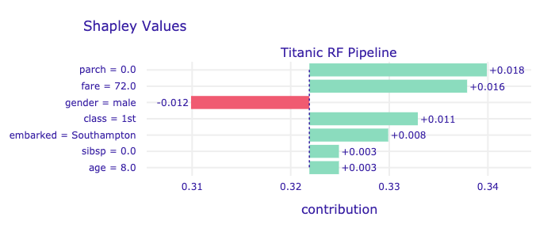

# Shapley Additive Explanations (SHAP) for Average Attributions {#shapley}

```{r, echo=FALSE}
source("code_snippets/ema_init.R")
```

In Chapter \@ref(breakDown), we introduced break-down (BD) plots, a procedure to calculate of the attribution of an explanatory variable for a model's prediction. We also indicated that, in the presence of interactions, the computed value of the attribution depends on the order of explanatory covariates that are used in calculations. One solution to the problem, presented in Chapter \@ref(breakDown), is to find an ordering in which the most important variables are placed at the beginning. Another solution, described in Chapter \@ref(iBreakDown), is to identify interactions and explicitly present their contributions to the predictions.

In this chapter, we introduce yet another approach to address the ordering issue. It is based on the idea of averaging the value of a variable's attribution overall, or a large number of, possible orderings. The idea is closely linked to "Shapley values" developed originally for cooperative games [@shapleybook1952]. The approach was first introduced by @imeJLMR and @Strumbelj2014. It was widely adopted after the publication of the paper by @SHAP and Python's library for SHapley Additive exPlanations, SHAP [@shapPackage]. The authors of SHAP introduced an efficient algorithm for tree-based models [@TreeSHAP]. They also showed that Shapley values could be presented as a unification of a collection of different commonly used techniques for model explanations [@SHAP].

## Intuition {#SHAPIntuition}

Figure \@ref(fig:shap10orderings) presents BD plots for ten random orderings (indicated by the order of the rows in each plot) of explanatory variables for the prediction for Johnny D (see Section \@ref(predictions-titanic)) for the random-forest model `titanic_rf` (see Section \@ref(model-titanic-rf)) for the Titanic dataset. The plots show clear differences in the contributions of various variables for different orderings. The most remarkable differences can be observed for variables *fare* and *class*, with contributions changing the sign depending on the ordering. 

(ref:shap10orderingsDesc) Break-down plots for ten random orderings of explanatory variables for the prediction for Johnny D for the random-forest model `titanic_rf` for the Titanic dataset. Each panel presents a single ordering, indicated by the order of the rows in the plot.

```{r shap10orderings, echo=FALSE, fig.cap='(ref:shap10orderingsDesc)', out.width = '100%', fig.align='center'}
knitr::include_graphics("figure/shap_10_replicates.png")
```

To remove the influence of the ordering of the variables, we can compute the mean value of the attributions. 
Figure \@ref(fig:shapOrdering) presents the averages, calculated over the ten orderings presented in Figure \@ref(fig:shap10orderings). Red and green bars present, respectively, the negative and positive averages Violet box plots summarize the distribution of the attributions for each explanatory variable across the different orderings. The plot indicates that the most important variables, from the point of view of the prediction for Johnny D, are *age*, *class* and *gender*.

(ref:shapOrderingDesc) Average attributions for ten random orderings. Red and green bars present the means. Box plots summarize the distribution of contributions for each explanatory variable across the orderings.

```{r shapOrdering, echo=FALSE, fig.cap='(ref:shapOrderingDesc)', out.width = '80%', fig.align='center'}
knitr::include_graphics("figure/shap_ordering.png")
```


```{r, message=FALSE, warning=FALSE, eval=FALSE, echo=FALSE}
library("DALEX")
library("iBreakDown")
library("randomForest")

#load("models/titanic_rf.rda")
#load("models/titanic.rda")

#explain_titanic_rf <- explain(model = titanic_rf, data = titanic[,-9], y = titanic$survived == "yes") 

#johny_d <- data.frame(
#  class = factor("1st", levels = c("1st", "2nd", "3rd", "deck crew", "engineering crew", 
#                                  "restaurant staff", "victualling crew")),
#  gender = factor("male", levels = c("female", "male")),
#  age = 8,
#  sibsp = 0,
#  parch = 0,
#  fare = 72,
#  embarked = factor("Southampton", levels = c("Belfast", "Cherbourg", "Queenstown", "Southampton"))
#)

titanic_imputed <- archivist::aread("pbiecek/models/27e5c")
titanic_rf <- archivist::aread("pbiecek/models/4e0fc")

explain_titanic_rf <- DALEX::explain(model = titanic_rf, 
                              data = titanic_imputed[,-9],
                              y = titanic_imputed$survived == "yes")

johnny_d <- archivist::aread("pbiecek/models/e3596")

library(patchwork)
library(ggplot2)
set.seed(13)

rsample <- lapply(1:10, function(i){
  new_order <- sample(1:7)
  bd <- break_down(explain_titanic_rf, johnny_d, order = new_order)
  bd$variable <- as.character(bd$variable)
  bd$variable[bd$variable == "embarked = Southampton"] = "embarked = S"
  bd$label = paste("random order no.", i)
  plot(bd) + scale_y_continuous(limits = c(0.1, 0.6), name = "", breaks = seq(0.1, 0.6, 0.1))
})

rsample[[1]] +
rsample[[2]] +
rsample[[3]] +
rsample[[4]] + 
rsample[[5]] + 
rsample[[6]] + 
rsample[[7]] + 
rsample[[8]] + 
rsample[[9]] + 
rsample[[10]] + plot_layout(ncol = 2)

plot(break_down(explain_titanic_rf, johnny_d, order = 1:7))

res <- iBreakDown::break_down_uncertainty(explain_titanic_rf, johnny_d)
plot(res)

library(ggplot2)
set.seed(8)
shap_attributions <- break_down_uncertainty(explain_titanic_rf, johnny_d, path = "average", B = 25)
shap_attributions$label = "The `titanic_rf` random forest model"
plot(shap_attributions) + ggtitle("Average attributions for Johnny D", "") + facet_null() + theme_ema

shap_attributions[shap_attributions$B == 0,"mean"]
knitr::kable(as.data.frame(shap_attributions[shap_attributions$B == 0,c(3,1)]))

```

## Method {#SHAPMethod}

SHapley Additive exPlanations (SHAP) are based on "Shapley values" developed by @shapleybook1952 in the cooperative game theory. Note that the terminology may be confusing at first glance. Shapley values are introduced for cooperative games. SHAP is an acronym for a method designed for predictive models. To avoid confusion, we will use the term "Shapley values".

Shapley values are a solution to the following problem. A coalition of players cooperates and obtains a certain overall gain from the cooperation. Players are not identical, and different players may have different importance. Cooperation is beneficial, because it may bring more benefit than individual actions. The problem to solve is how to distribute the generated surplus among the players? Shapley values offer one possible fair answer to this question [@shapleybook1952].

Let's translate this problem to the context of a model's predictions. Explanatory variables are the players, while model $f()$ plays the role of the coalition. The payoff from the coalition is the model's prediction. The problem to solve is how to distribute the model's prediction across particular variables?

The idea of using Shapley values for evaluation of local variable-importance was introduced by @imeJLMR. We will define the values here using the notation introduced in Section \@ref(BDMethodGen).

Let us consider a permutation $J$ of the set of indices $\{1,2,\ldots,p\}$ corresponding to an ordering of $p$ explanatory variables included in the model $f()$. Denote by $\pi(J,j)$ the set of the indices of the variables that are positioned in $J$ before the $j$-th variable. Note that, if the $j$-th variable is placed as the first, then $\pi(J,j) = \emptyset$. Consider the model's prediction $f(\underline{x}_*)$ for a particular instance of interest $\underline{x}_*$. The Shapley value is defined as follows:

\begin{equation}
\varphi(\underline{x}_*,j) = \frac{1}{p!} \sum_{J} \Delta^{j|\pi(J,j)}(\underline{x}_*),  
(\#eq:SHAP)
\end{equation}

where the sum is taken over all $p!$ possible permutations (orderings of explanatory variables) and the variable-importance measure $\Delta^{j|J}(\underline{x}_*)$ was defined in equation \@ref(eq:lcondJBD) in Section \@ref(BDMethodGen). Essentially, $\varphi(\underline{x}_*,j)$ is the average of the variable-importance measures across all possible orderings of explanatory variables.  

It is worth noting that the value of $\Delta^{j|\pi(J,j)}(\underline{x}_*)$ is constant for all permutations $J$ that share the same subset $\pi(J,j)$. It follows that equation \@ref(eq:SHAP) can be expressed in an alternative form:

\begin{eqnarray}
\varphi(\underline{x}_*,j) &=& \frac 1{p!}\sum_{s=0}^{p-1} \sum_{
\substack{
S \subseteq \{1,\ldots,p\}\setminus \{j\} \\ |S|=s
}}  \left\{s!(p-1-s)! \Delta^{j|S}(\underline{x}_*)\right\}\nonumber\\
&=&
\frac 1{p}\sum_{s=0}^{p-1} \sum_{
\substack{
S \subseteq \{1,\ldots,p\}\setminus \{j\} \\ |S|=s
}}  \left\{{{p-1}\choose{s}}^{-1} \Delta^{j|S}(\underline{x}_*)\right\},
(\#eq:SHAP1)
\end{eqnarray}

where $|S|$ denotes the cardinal number (size) of set $S$ and the second sum is taken over all subsets $S$ of explanatory variables, excluding the $j$-th one, of size $s$. 

Note that the number of all subsets of sizes from 0 to $p-1$ is $2^{p}-1$, i.e., it is much smaller than number of all permutations $p!$. Nevertheless, for a large $p$, it may be feasible to compute Shapley values neither using  \@ref(eq:SHAP) nor \@ref(eq:SHAP1). In that case, an estimate based on a sample of permutations may be considered. A Monte Carlo estimator was introduced by @Strumbelj2014. An efficient implementation of computations of Shapley values for tree based models was used in package SHAP [@SHAP]. 

From the properties of Shapley values for cooperative games it follows that, in the context of predictive models, they enjoy the following properties:

* Symmetry: if two explanatory variables $j$ and $k$ are interchangeable, i.e., for any set of explanatory variables $S \subseteq \{1,\dots,p\}\setminus \{j,k\}$ we have got
$$
\Delta^{j|S}(\underline{x}_*) = \Delta^{k|S}(\underline{x}_*),
$$
then their Shapley values are equal: 
$$
\varphi(\underline{x}_*,j) = \varphi(\underline{x}_*,k).
$$

* Dummy feature: if an explanatory variable $j$ does not contribute to any prediction for any set of explanatory variables $S \subseteq \{1,\dots,p\}\setminus \{j\}$, that is, if
$$
\Delta^{j|S}(\underline{x}_*) = 0,
$$
then its Shapley value is equal to 0:
$$
\varphi(\underline{x}_*,j) = 0.
$$

* Additivity: if model $f()$ is a sum of two other models $g()$ and $h()$, then the Shapley value calculated for model $f()$ is a sum of Shapley values for models $g()$ and $h()$.

* Local accuracy (see Section \@ref(BDMethodGen)): the sum of Shapley values is equal to the model's prediction, that is,
$$
f(\underline{x}_*) - E_{\underline{X}}\{f(\underline{X})\} = \sum_{j=1}^p	\varphi(\underline{x}_*,j), 
$$
where $\underline{X}$ is the vector of explanatory variables (corresponding to $\underline{x}_*$) that are treated as random values. 

```{r, warning=FALSE, message=FALSE, echo=FALSE}
library("DALEX")
library("randomForest")
library("ggplot2")

#titanic_imputed <- archivist::aread("pbiecek/models/27e5c")
#titanic_rf <- archivist::aread("pbiecek/models/4e0fc")

#load("models/titanic_rf.rda")
#load("models/titanic.rda")

explain_titanic_rf <- DALEX::explain(model = titanic_rf, 
                              data = titanic_imputed[,c(1:4,6:8)],
                              y = titanic_imputed$survived == "yes", 
                              label = "Random Forest v6",
                              colorize = FALSE,
                              verbose = FALSE)

#johnny_d <- archivist::aread("pbiecek/models/e3596")

#johnny_d <- data.frame(
#  class = factor("1st", levels = c("1st", "2nd", "3rd", "deck crew", "engineering crew", 
#                                  "restaurant staff", "victualling crew")),
#  gender = factor("male", levels = c("female", "male")),
#  age = 8,
#  sibsp = 0,
#  parch = 0,
#  fare = 72,
#  embarked = factor("Southampton", levels = c("Belfast", "Cherbourg", "Queenstown", "Southampton"))
#)
set.seed(11)
shap_johnny <- variable_attribution(explain_titanic_rf,
                 new_observation = johnny_d,
                 B = 25,
                 type = "shap")
```

## Example: Titanic data {#SHAPExample}

Let us consider the random-forest model `titanic_rf` (see Section \@ref(model-titanic-rf)) and passenger Johny D (see Section \@ref(predictions-titanic)) as the instance of interest in the Titanic data. 

Box plots in Figure \@ref(fig:shappJohny02) present the distribution of the contributions $\Delta^{j|\pi(J,j)}(\underline{x}_*)$ for each explanatory variable of the model for 25 random orderings of the explanatory variables. Red and green bars represent, respectively, the negative and positive Shapley values across the orderings. It is clear that the young age of Johny D results in a positive contribution for all orderings; the resulting Shapley value is equal to 0.2525. On the other hand, the effect of gender is in all cases negative, with the Shapley value equal to -0.0908.

The picture for variables *fare* and *class* is more complex, as their contributions can even change the sign, depending on the ordering. Note that Figure \@ref(fig:shappJohny02) presents Shapley values separately for each of the two variables. However, it is worth recalling that the iBD plot in Figure \@ref(fig:iBreakDownTitanicExamplePlot) indicated an important contribution of an interaction between the two variables. Hence, their contributions should not be separated. Thus, the Shapley values for *fare* and *class*, presented in Figure \@ref(fig:shappJohny02), should be interpreted with caution.

(ref:shappJohny02Desc) Explanatory-variable attributions for the prediction for Johnny D for the random-forest model `titanic_rf` and the Titanic data based on 25 random orderings. Left-hand-side plot: box plots summarize the distribution of the attributions for each explanatory variable across the orderings. Red and green bars present Shapley values. Right-hand-side plot: Shapley values (mean attributions) without box plots.

```{r shappJohny02, warning=FALSE, message=FALSE, echo=FALSE, fig.cap='(ref:shappJohny02Desc)', fig.width=11, fig.height=4, out.width = '100%', fig.align='center'}
library("patchwork")

pl1 <- plot(shap_johnny) + ggtitle("Average attributions for Johnny D") + facet_null() + theme_ema
pl2 <- plot(shap_johnny, show_boxplots = FALSE) + ggtitle("Average attributions for Johnny D") + facet_null() + theme_ema
pl1 + pl2
```

In most applications, the detailed information about the distribution of variable contributions across the considered orderings of explanatory variables may not be of interest. Thus, one could simplify the plot by presenting only the Shapley values, as illustrated in the right-hand-side panel of Figure \@ref(fig:shappJohny02). Table \@ref(tab:shapOrderingTable) presents the Shapley values underlying this plot. 

Table: (\#tab:shapOrderingTable) Shapley values for the prediction for Johnny D for the random-forest model `titanic_rf` and the Titanic data based on 25 random orderings.

|Variable      | Shapley value|
|:-------------|------------:|
|age = 8       |    0.2525   |
|class = 1st   |    0.0246   |
|embarked = Southampton |   -0.0032   |
|fare = 72     |    0.0140   |
|gender = male |   -0.0943   |
|parch = 0     |   -0.0097   |
|sibsp = 0     |    0.0027   |


## Pros and cons {#SHAProsCons}

Shapley values provide a uniform approach to decompose a model's predictions into contributions that can be attributed additively to different explanatory variables. @SHAP showed that the method unifies different approaches to additive variable attributions, like DeepLIFT [@DeepLIFT], Layer-Wise Relevance Propagation [@LWRP], or Local Interpretable Model-agnostic Explanations [@lime]. The method has got a strong formal foundation derived from the cooperative games theory. It also enjoys an efficient implementation in Python, with ports or re-implementations in R.

An important drawback of Shapley values is that they provide additive contributions (attributions) of explanatory variables. If the model is not additive, then the Shapley values may be misleading. This issue can be seen as arising from the fact that, in cooperative games, the goal is to distribute the payoff among payers. However, in the predictive modelling context, we want to understand how do the players affect the payoff? Thus, we are not limited to independent payoff-splits for players.

It is worth noting that, for an additive model, the approaches presented in Chapters \@ref(breakDown)--\@ref(iBreakDown) and in the current one lead to the same attributions. The reason is that, for additive models, different orderings lead to the same contributions. Since Shapley values can bee seen as the mean across all orderings, it is essentially an average of identical values, i.e., it also assumes the same value.

An important practical limitation of the general model-agnostic method is that, for large models, the calculation of Shapley values is time-consuming. However, sub-sampling can be used to address the issue. For tree-based models, effective implementations are available.
 
## Code snippets for R {#SHAPRcode}

In this section, we use the `DALEX` package, which is a wrapper for the `iBreakDown` R package. The package covers all methods presented in this chapter. It is available on CRAN and GitHub. Note that there are also other R packages that offer similar functionalities, like `iml` [@imlRPackage], `fastshap` [@fastshapRpackage] or `shapper` [@shapperPackage], which is a wrapper for the Python library `SHAP` [@shapPackage].

For illustration purposes, we use the `titanic_rf` random-forest model for the Titanic data developed in Section \@ref(model-titanic-rf). Recall that the model is developed to predict the probability of survival for passengers of Titanic. Instance-level explanations are calculated for Henry, a 47-year-old passenger that travelled in the first class (see Section \@ref(predictions-titanic)).

We first retrieve the `titanic_rf` model-object and the data frame for Henry via the `archivist` hooks, as listed in Section \@ref(ListOfModelsTitanic). We also retrieve the version of the `titanic` data with imputed missing values.

```{r, warning=FALSE, message=FALSE, eval=FALSE}
titanic_imputed <- archivist::aread("pbiecek/models/27e5c")
titanic_rf <- archivist:: aread("pbiecek/models/4e0fc")
(henry <- archivist::aread("pbiecek/models/a6538"))
```

```
  class gender age sibsp parch fare  embarked
1   1st   male  47     0     0   25 Cherbourg
```

Then we construct the explainer for the model by using function `explain()` from the `DALEX` package (see Section \@ref(ExplainersTitanicRCode)). We also load the `randomForest` package, as the model was fitted by using function `randomForest()` from this package (see Section \@ref(model-titanic-rf)) and it is important to have the corresponding `predict()` function  available. The model's prediction for Henry is obtained  with the help of the  function. 

```{r, warning=FALSE, message=FALSE, echo = FALSE, eval = TRUE}
library("randomForest")
library("DALEX")
explain_rf <- DALEX::explain(model = titanic_rf,  
                        data = titanic_imputed[, -9],
                           y = titanic_imputed$survived == "yes", 
                       label = "Random Forest",
                     verbose = FALSE)
predict(explain_rf, henry)
```
```{r, warning=FALSE, message=FALSE, echo = TRUE, eval = FALSE}
library("randomForest")
library("DALEX")
explain_rf <- DALEX::explain(model = titanic_rf,  
                        data = titanic_imputed[, -9],
                           y = titanic_imputed$survived == "yes", 
                       label = "Random Forest")
predict(explain_rf, henry)
```

To compute Shapley values for Henry, we apply function `predict_parts()` as in Section \@ref(BDR) to the explainer-object `explain_rf` and the data frame for the instance of interest, i.e., Henry. By specifying the `type="shap"` argument we indicate that we want to compute Shapley values. Additionally, the `B=25` argument indicates that we want to select 25 random orderings of explanatory variables for which the Shapley values are to be computed. Note that `B=25` is also the default value of the argument.

```{r, warning=FALSE, message=FALSE}
shap_henry <- predict_parts(explainer = explain_rf, 
                      new_observation = henry, 
                                 type = "shap",
                                    B = 25)
```

The resulting object `shap_henry` is a data frame with variable-specific attributions computed for every ordering. Printing out the object provides various summary statistics of the attributions including, of course, the mean.

```{r, warning=FALSE, message=FALSE}
shap_henry
```

By applying the generic function `plot()` to the `shap_henry` object we obtain the plot shown in Figure \@ref(fig:ShapforHenry). It includes the Shapley values and box plots summarizing the distributions of the variable contributions for the selected random orderings.

(ref:ShapforHenryDesc) A plot of Shapley values with box plots obtained by applying the generic `plot()` function to the explainer for the `titanic_rf` model and passenger Henry for the Titanic data.

```{r, warning=FALSE, message=FALSE, eval=FALSE}
plot(shap_henry)
```

```{r ShapforHenry, warning=FALSE, message=FALSE, echo=FALSE, fig.cap='(ref:ShapforHenryDesc)', out.width = '80%', fig.align='center', fig.width=7, fig.height=4}
plot(shap_henry) + theme_ema
```

To obtain a plot with only Shapley values, i.e., without the box plots, we apply the `show_boxplots=FALSE` argument in the `plot()` function call.

(ref:ShapOnlyforHenryDesc) A plot of Shapley values without box plots obtained by applying the generic `plot()` function to the explainer for the `titanic_rf` model and passenger Henry for the Titanic data.

```{r, warning=FALSE, message=FALSE, eval=FALSE}
plot(shap_henry, show_boxplots = FALSE) 
```

```{r ShapOnlyforHenry, warning=FALSE, message=FALSE, echo=FALSE, fig.cap='(ref:ShapOnlyforHenryDesc)', out.width = '70%', fig.align='center', fig.width=7, fig.height=4}
plot(shap_henry, show_boxplots = FALSE)  + theme_ema
```

The resulting plot, shown in Figure \@ref(fig:ShapOnlyforHenry), can be compared to the plot in the right-hand-side panel of Figure \@ref(fig:shappJohny02) for Johnny D. The most remarkable difference is related to the contribution of *age*. The young age of Johnny D markedly increases the chances of survival, in contrary to the negative contribution of the age of 47 for Henry. 


## Code snippets for Python {#SHAPPythonCode}

In this section, we use the `dalex` library for Python. The package covers all methods presented in this chapter. It is available on `pip` and `GitHub`. Note that the most popular implementation in Python is available in the `shap` library [@SHAP], but here we show implementations from the `dalex` library because it is consistent with other methods shown in this book. 

For illustration purposes, we use the `titanic_rf` random forest model for the Titanic data developed in Section \@ref(model-titanic-python-rf). Recall that the model is developed to predict the probability of survival for passengers of Titanic. Instance-level explanations are calculated for Henry, a 47-year-old passenger that travelled in the 1st class (see Section \@ref(predictions-titanic-python)).

In the first step we create an Explainer, an object that will provide a uniform interface for the predictive model. We use the `Explainer` constructor for this purpose.

```{python,  eval = FALSE}
import pandas as pd
henry = pd.DataFrame({'gender'   : ['male'],
                       'age'     : [47],
                       'class'   : ['1st'],
                       'embarked': ['Southampton'],
                       'fare'    : [25],
                       'sibsp'   : [0],
                       'parch'   : [0]},
                      index = ['Henry'])

import dalex as dx
titanic_rf_exp = dx.Explainer(titanic_rf, X, y, 
                  label = "Titanic RF Pipeline")
```

To calculate the attributions with the break down method with interactions one can use the `predict_parts` method with `type='shap'` argument. The first argument is the observation for which the attributions are to be calculated.  Results are stored in the `results` field. 

```{python,  eval = FALSE}
bd_henry = titanic_rf_exp.predict_parts(henry, type = 'shap')
bd_henry.result
```

To visualize these values just call the `plot()` function.

```{python,  eval = FALSE}
bd_henry.plot()
```

```{r shapPython2, echo=FALSE, out.width = '100%', fig.align='center'}

```

By default, shap values are calculated and plotted for all variables in the data. If one wants to limit the number of variables in the chart, use the argument `max_vars` of the `plot()` function.
