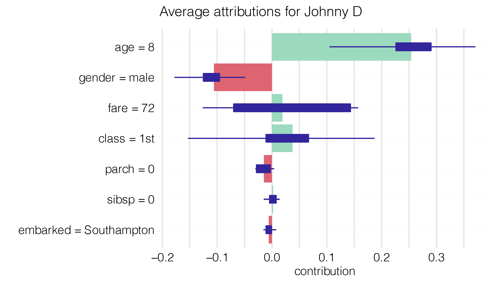

# Shapley Additive Explanations (SHAP) and Average Variable Attributions {#shapley}

In Chapter \@ref(breakDown), we introduced Break-down (BD) plots, a method of assessment of local variable-importance based on the contribution of an explanatory variable to model's prediction. We also indicated that, in the presence of  interactions, the computed value of the contribution depends on the order of explanatory covariates that is used in calculations. One solution to the problem is to find an ordering in which the most important variables are placed at the beginning. Another solution, described in Chapter \@ref(iBreakDown), is to identify interactions and explicitly present their contributions to the predictions.

In this chapter, we introduce yet another approach to address the ordering issue. It is based on the idea of averaging the value of a variable's contribution over all, or a large number of, possible orderings. The idea is closely linked to ,,Shapley values'' [@shapleybook1952], developed originally for cooperative games.

The approach was first introduced in ,,An Efficient Explanation of Individual Classifications Using Game Theory'' [@imeJLMR] and [@Strumbelj2014]. It was widely adopted after the publication of the NIPS paper ,,A Unified Approach to Interpreting Model Predictions'' [@SHAP] and Python's library SHAP [@shapPackage]. The authors of SHAP (SHapley Additive exPlanations) introduced an efficient algorithm for tree-based models [@TreeSHAP]. They also showed that SHAP values can be presented an unification of a collection of different commonly used techniques for model explanations [@SHAP].

## Intuition {#SHAPIntuition}

Figure \@ref(fig:shap10orderings) presents BD plots for ten random orderings (indicated by the order of the rows in each plot) of explanatory variables for the prediction for `johny_d` (see Section \@ref(predictions-titanic)) for the random-forest model (see Section \@ref(model-titanic-rf)) for the Titanic dataset. The plots show clear differences in the contributions of various variables for different orderings. The most remarkable differences can be observed for variables `fare` and `class`, with contributions changing the sign depending on the ordering. 

(ref:shap10orderingsDesc) Break-down plots for ten random orderings of explanatory variables for the prediction for `johny_d` for the random-forest model for the Titanic dataset. Each panel presents a single ordering, indicated by the order of the rows in the plot.

```{r shap10orderings, echo=FALSE, fig.cap='(ref:shap10orderingsDesc)', out.width = '100%', fig.align='center'}
knitr::include_graphics("figure/shap_10_replicates.png")
```

To remove the influence of the ordering of the variables, we can compute an average value of the contributions. 
Figure \@ref(fig:shapOrdering) presents the average contributions, calculated over the ten orderings presented in Figure \@ref(fig:shap10orderings). Red and green bars present, respectively, the negative and positive averages. Violet box-plots summarize the distribution of the contributions for each explanatory variable across different orderings. The plot indicates that the most important variables, from the point of view of the prediction for `johny_d` are `age` and `gender`.

```{r shapOrdering, echo=FALSE, fig.cap="Average contributions for ten random orderings. Red and green bars present the averages. Box-plots summarize the distribution of contributions for each explanatory variable across the orderings.", out.width = '70%', fig.align='center'}

```


```{r, message=FALSE, warning=FALSE, eval=FALSE, echo=FALSE}
library("DALEX")
library("iBreakDown")
library("randomForest")
load("models/titanic_rf_v6.rda")
load("models/titanic.rda")

explain_titanic_rf <- explain(model = titanic_rf_v6, 
                              data = titanic[,-9],
                              y = titanic$survived == "yes") 

johny_d <- data.frame(
  class = factor("1st", levels = c("1st", "2nd", "3rd", "deck crew", "engineering crew", 
                                  "restaurant staff", "victualling crew")),
  gender = factor("male", levels = c("female", "male")),
  age = 8,
  sibsp = 0,
  parch = 0,
  fare = 72,
  embarked = factor("Southampton", levels = c("Belfast", "Cherbourg", "Queenstown", "Southampton"))
)

library(patchwork)
library(ggplot2)
set.seed(13)

rsample <- lapply(1:10, function(i){
  new_order <- sample(1:7)
  bd <- break_down(explain_titanic_rf, johny_d, order = new_order)
  bd$variable <- as.character(bd$variable)
  bd$variable[bd$variable == "embarked = Southampton"] = "embarked = S"
  bd$label = paste("random order no.", i)
  plot(bd) + scale_y_continuous(limits = c(0.1, 0.6), name = "", breaks = seq(0.1, 0.6, 0.1))
})

rsample[[1]] +
rsample[[2]] +
rsample[[3]] +
rsample[[4]] + 
rsample[[5]] + 
rsample[[6]] + 
rsample[[7]] + 
rsample[[8]] + 
rsample[[9]] + 
rsample[[10]] + plot_layout(ncol = 2)

plot(break_down(explain_titanic_rf, johny_d, order = 1:7))

res <- iBreakDown::break_down_uncertainty(explain_titanic_rf, johny_d)
plot(res)

library(ggplot2)
shap_attributions <- break_down_uncertainty(explain_titanic_rf, johny_d, path = "average")
shap_attributions$label = "The `titanic_rf_v6` random forest model"
plot(shap_attributions) + ggtitle("Average attribbutions for Johny D")

shap_attributions[shap_attributions$B == 0,"mean"]
knitr::kable(as.data.frame(shap_attributions[shap_attributions$B == 0,c(3,1)]))

```

## Method {#SHAPMethod}

SHapley Additive exPlanations (SHAP) are based on ,,Shapley values,'' a concept in cooperative game theory developed by Lloyd Shapley [@shapleybook1952]. Note that the notation may be confusing at the first glance. Shapley values are introduced for cooperative games. SHAP is an acronym for a method designed for ML models. We will use the name Shapley values.

Consider the following problem. A coalition of players cooperates, and obtains a certain overall gain from the cooperation. Players are not identical, and different players may have different importance. Cooperation is beneficial, because it may bring more benefit than individual actions. The problem to solve is how to distribute the generated surplus among the players? The Shapley value provides one possible fair answer to this question [@shapleybook1952].

Now let's translate this problem to the context of model predictions. Explanatory variables are the players, while model $f()$ plays the role of the coalition. The payoff from the coalition is the model prediction. The problem to solve is how to distribute the model prediction across particular variables?

The idea of using Shapley values for evaluation of local variable-importance was introduced in ,,An Efficient Explanation of Individual Classifications Using Game Theory'' [@imeJLMR]. We define them here in the notation introduced in Section \@ref(BDMethod).

Let us consider a permutation $J$ of the set of indices $\{1,2,\ldots,p\}$ corresponding to an ordering of $p$ explanatory variables included in model $f()$. Denote by $\pi(J,j)$ the set of the indices of the variables that are positioned in $J$ before the $j$-th variable. Note that, if the $j$-th variable is placed as the first, then $\pi(J,j) = \emptyset$. Consider the model prediction $f(x_*)$ for a particular instance of interest $x_*$. The Shapley value is defined as follows:
\begin{equation}
\varphi(x_*,j) = \frac{1}{p!} \sum_{J} \Delta^{j|\pi(J,j)}(x_*),  
(\#eq:SHAP)
\end{equation}
where the sum is taken over all $p!$ possible permutations (orderings of explanatory variables) and the variable-importance measure $\Delta^{j|J}(x_*)$ was defined in Section \@ref(BDMethod). Essentially, $\varphi(x_*,j)$ is the average of the variable-importance measures across all possible orderings of explanatory variables.  

It is worth noting that the value of $\Delta^{j|\pi(J,j)}(x_*)$ is constant for all ordering $J$ that share with the same subset $\pi(J,j)$. It follows that equation \@ref(eq:SHAP) can be expressed in an alternative form:

\begin{eqnarray}
\varphi(x_*,j) &=& \frac 1{p!}\sum_{s=0}^{p-1} \sum_{
\substack{
S \subseteq \{1,\dots,p\}\setminus \{j\} \\ |S|=s
}}  \left[s!(p-1-s)! \Delta^{j|S}(x_*)\right]\nonumber\\
&=&
\frac 1{p}\sum_{s=0}^{p-1} \sum_{
\substack{
S \subseteq \{1,\dots,p\}\setminus \{j\} \\ |S|=s
}}  \left[{{p-1}\choose{s}}^{-1} \Delta^{j|S}(x_*)\right],
(\#eq:SHAP1)
\end{eqnarray}
where $|S|$ denotes the cardinal number (size) of set $S$ and the second sum is taken over all subsets $S$ of explanatory variables, excluding the $j$-th one, of size $s$. 

Note that the number of all subsets of sizes from 0 to $p-1$ is $2^{p}-1$, i.e., it is much smaller than number of all permutations $p!$. Nevertheless, for a large $p$, it may not be feasible to compute the Shapley values from Equations \@ref(eq:SHAP) nor \@ref(eq:SHAP1). In that case, an estimate based on a sample of permutations may be considered. A Monte Carlo estimator was introduced in ,,Explaining prediction models and individual predictions with feature contributions'' [@Strumbelj2014]. An efficient implementation of computations of Shapley values was introduced in package SHAP [@SHAP]. 

From the properties of Shapley values for cooperative games it follows that, in the context of predictive models, they enjoy the following properties:

* Symmetry: if two explanatory variables $j$ and $k$ are interchangeable, i.e., for any set of explanatory variables $S \subseteq \{1,\dots,p\}\setminus \{j,k\}$ we have got

$$
\Delta^{j|S}(x_*) = \Delta^{k|S}(x_*),
$$
then their Shapley values are equal: 

$$
\varphi(x_*,j) = \varphi(x_*,k).
$$

* Dummy feature: if an explanatory variable $j$ does not contribute to any prediction for any set of explanatory variables $S \subseteq \{1,\dots,p\}\setminus \{j\}$, that is,

$$
\Delta^{j|S}(x_*) = 0,
$$

then its Shapley value is equal to 0:

$$
\varphi(x_*,j) = 0.
$$

* Additivity: if model $f()$ is a sum of two other models $g()$ and $h()$, then the Shapley value calculated for model $f()$ is a sum of Shapley values for models $g()$ and $h()$.

* Local accuracy: the sum of Shapley values is equal to the model prediction, that is,

$$
f(x_*) - E_X[f(X)] = \sum_{j=1}^p	\varphi(x_*,j). 
$$

```{r, warning=FALSE, message=FALSE, echo=FALSE}
library("DALEX")
library("randomForest")
library("ggplot2")
load("models/titanic_rf_v6.rda")
load("models/titanic.rda")
explain_titanic_rf <- explain(model = titanic_rf_v6, 
                              data = titanic[,c(1:4,6:8)],
                              y = titanic$survived == "yes", 
                              label = "Random Forest v6",
                              colorize = FALSE,
                              verbose = FALSE)


johny_d <- data.frame(
  class = factor("1st", levels = c("1st", "2nd", "3rd", "deck crew", "engineering crew", 
                                  "restaurant staff", "victualling crew")),
  gender = factor("male", levels = c("female", "male")),
  age = 8,
  sibsp = 0,
  parch = 0,
  fare = 72,
  embarked = factor("Southampton", levels = c("Belfast", "Cherbourg", "Queenstown", "Southampton"))
)

shap_johny <- variable_attribution(explain_titanic_rf,
                 new_observation = johny_d,
                 B = 25,
                 type = "shap")
```

## Example: Titanic data {#SHAPExample}

Let us consider the random-forest model `titanic_rf_v6` (see Section \@ref(model-titanic-rf) and passenger `johny_d` (see Section \@ref(predictions-titanic)) as the instance of interest in the Titanic data. 

Box-plots in Figure \@ref(fig:shappJohny02) present the distribution of the contributions $\Delta^{j|\pi(J,j)}(x_*)$ for each explanatory variable of the model for 25 random orderings of the explanatory variables. Red and green bars represent, respectively, the negative and positive Shapley values across the orderings. It is clear that the young age of Johny D results in a positive contribution for all orderings. The Shapley value is equal to $0.2525$. On the other hand, the effect of gender is in all cases negative, with the Shapley value equal to $-0.0908$.

The picture for `fare` and `class` is more complex, as their contributions can even change the sign, depending on the ordering. While Figure \@ref(fig:shappJohny02) presents the Shapley values separately for each of the variables, it is worth noting that, by using the iBD plot in Section \@ref(iBDExample) the pair was identified as one for each an interaction effect was present. Hence, the effect of the variables should not be separated. 

(ref:shappJohny02Desc) Variable contributions for the prediction for `johny_d` for the random-forest model `titanic_rf_v6` and the Titanic data for 25 random orderings. Left plot: Box-plots summarize the distribution of the contributions for each explanatory variable across the orderings. Red and green bars present the Shapley values. Right plot: Average attributions without boxplots.

```{r shappJohny02, warning=FALSE, message=FALSE, echo=FALSE, fig.cap='(ref:shappJohny02Desc)', fig.width=11, fig.height=5.5, out.width = '100%', fig.align='center'}
library("patchwork")

pl1 <- plot(shap_johny) + ggtitle("Average attributions for Johny D")
pl2 <- plot(shap_johny, show_boxplots = FALSE) + ggtitle("Average attributions for Johny D")
pl1 + pl2
```

In most applications the detailed information about the distribution of variable contributions across the considered orderings of explanatory variables will not be necessary. Thus, one could simplify the plot by presenting only the Shapley values, as in right panel in Figure \@ref(fig:shappJohny02). Table \@ref(tab:shapOrderingTable) presents the Shapley values underlying this plot. 

Table: (\#tab:shapOrderingTable) Shapley values for the prediction for `johny_d` for the random-forest model `titanic_rf_v6` and the Titanic data for 25 random orderings.

|Variable      | Shapley value|
|:-------------|------------:|
|age = 8       |    0.2525   |
|class = 1st   |    0.0246   |
|embarked = Southampton |   -0.0032   |
|fare = 72     |    0.0140   |
|gender = male |   -0.0943   |
|parch = 0     |   -0.0097   |
|sibsp = 0     |    0.0027   |


## Pros and cons {#SHAProsCons}

Shapley values provide a uniform approach to decompose model predictions into parts that can be attributed additively to different explanatory variables. In ,,A Unified Approach to Interpreting Model Predictions'' [@SHAP] it is shown that the method unifies different approaches to additive features attribution, like DeepLIFT [@DeepLIFT], Layer-Wise Relevance Propagation [@LWRP], or LIME [@lime]. The method has got a strong formal foundation derived from the cooperative games theory. It also enjoys an efficient implementation in Python, with ports or re-implementations in R.

An important drawback of the Shapley values is that they are additive attributions of variable effects. If the model is not additive, then the Shapley values may be misleading. This issue can be seen as arising from the fact that, in the cooperative games, the goal is to distribute the payoff among payers. However, in the predictive modeling context, we want to understand how do the players affect the payoff? Thus, we are not limited to independent payoff-splits for players.

It is worth noting that, for an additive model, the approaches presented in Chapters \@ref(breakDown),   \@ref(iBreakDown), and in the current one lead to same variable contributions. It is because for additive models different orderings lead to same attributions. And since Shapley values can bee seen as an average across all ordering it's an average from identical values.

An important practical limitation of the method is that, for large models, the calculation of the Shapley values is time consuming. However, sub-sampling can be used to address the issue. 
 
## Code snippets for R {#SHAPRcode}

In this section, we use an `DALEX::variable_attribution()` function which is a wrapper for `iBreakDown` R package [@iBreakDownRPackage]. The  package covers all methods presented in this chapter. It is available on CRAN and GitHub. 
Note that there are also other R packages that offer similar functionality, like `shapper` [@shapperPackage], which is a wrapper for the Python library `SHAP` [@shapPackage], and `iml` [@imlRPackage].

For illustration purposes, we use the `titanic_rf_v6` random-forest model for the Titanic data developed in Section \@ref(model-titanic-rf). Recall that it is developed to predict the probability of survival from sinking of Titanic. Instance-level explanations are calculated for a single observation: `henry` - an 42-year-old passenger that travelled in the 1st class.

`DALEX` explainers for the model and the `jonhy_d` data are retrieved via `archivist` hooks as listed in Section \@ref(ListOfModelsTitanic). 

```{r, warning=FALSE, message=FALSE, eval=FALSE}
library("randomForest")
explain_rf_v6 <- archivist::aread("pbiecek/models/6ed54")

library("DALEX")
henry <- archivist::aread("pbiecek/models/e3596")
henry
```

```{r, warning=FALSE, message=FALSE, echo=FALSE}
library("randomForest")
library("DALEX")
load("models/explain_rf_v6.rda")
load("models/henry.rda")
henry
```

We obtain the model prediction for this instance with the help of the `predict()' function. 

```{r, warning=FALSE, message=FALSE}
predict(explain_rf_v6, henry)
```

With the help of function `variable_attribution()` we can re-create Figure \@ref(fig:shappJohny02). The function is applied to the explainer, created with the `explain()` function from the `DALEX` package, and a data frame for the instance of interest. Additionally, in the `B=25` argument we indicate that we want to select 25 random orderings of explanatory variables for which the Shapley values are to be computed. The resulting object is a data frame with variable contributions computed for every ordering. Applying the generic function `plot()` to the object constructs the plot that includes the Shapley values and the corresponding box-plots.

```{r, warning=FALSE, message=FALSE, fig.width=6, fig.height=4, out.width = '50%', fig.align='center'}
shap_henry <- variable_attribution(explain_rf_v6, 
                                   henry, 
                                   type = "shap",
                                   B = 25)
plot(shap_henry) 
```

To obtain a plot with only Shapley values, we can use the `show_boxplots=FALSE` argument in the `plot()` function call.

```{r, warning=FALSE, message=FALSE, fig.width=6, fig.height=4, out.width = '50%', fig.align='center'}
plot(shap_henry, show_boxplots = FALSE) 
```

When we compare this plot with the `johny_d` in Figure \@ref(fig:shappJohny02) the largest difference is related to effect of `age`. Young `johny_d` has larger than average chances of survival, much larger than 47 years old `henry`.


The object obtained as a result of the application of function `shap()` allows to compute other summary statistics beyond the average.

```{r, warning=FALSE, message=FALSE}
shap_henry
```


