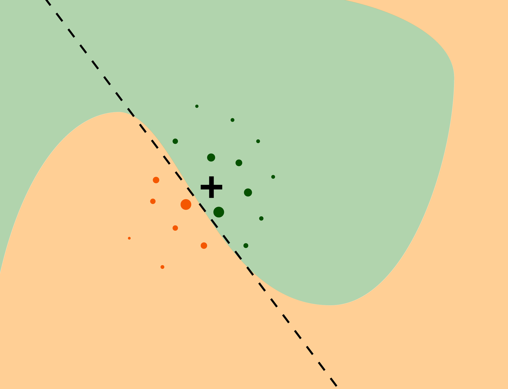
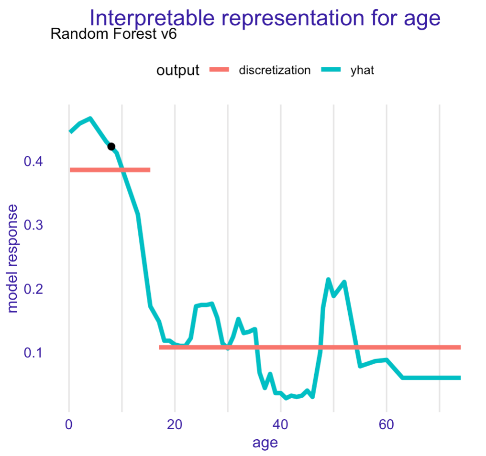
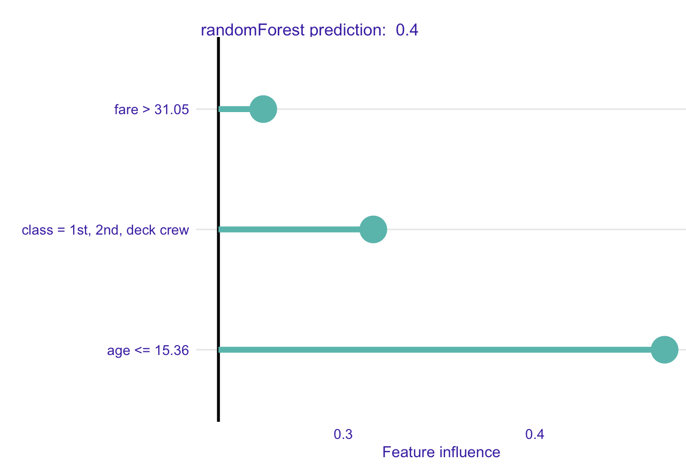

# Local Interpretable Model-agnostic Explanations (LIME) {#LIME}

## Introduction {#LIMEIntroduction}

Break-down (BD) and Shapley plots, introduced in Chapters \@ref(breakDown) and \@ref(shapley), respectively, are most suitable for models with a small or moderate number of explanatory variables. 

None of those approaches is well-suited for models with a very large number of explanatory variables. In genomics or image recognition, models with hundreds of thousands or millions of input variables are not uncommon. In such cases, sparse explainers with small number of non zero effects offer a useful alternative. The most popular example of such sparse explainers are Local Interpretable Model-agnostic Explanations (LIME) and their modifications.

The LIME method was originally proposed in ,,Why Should I Trust You?: Explaining the Predictions of Any Classifier'' [@lime]. The key idea behind this method is to locally approximate a black-box model by a simpler glass-box model, which is easier to interpret. In this chapter, we describe this approach.  

## Intuition {#LIMEIntuition}

The intuition behind the LIME method is explained in Figure \@ref(fig:limeIntroduction). We want to understand factors that influence a complex black-box model around a single instance of interest. Areas presented in Figure \@ref(fig:limeIntroduction) correspond to decision regions for a binary classifier, i.e., it pertains to a binary dependent variable. The axes represent the values of two continuous explanatory variables. The colored areas correspond to the decision regions, i.e., they indicate for which combinations of the variables the model classifies the observation to one of the two classes. The instance of interest is marked with the large black dot. By using an artificial dataset around the instance of interest, we can use a simpler glass-box model that will locally approximate the predictions of the black-box model. The glass-box model may then serve as a ''local explainer'' for the more complex model.

We may select different classes of glass-box models. The most typical choices are regularized linear models like LASSO regression [@Tibshirani94regressionshrinkage] or decision trees [@party2006]. The important point is to limit the complexity of the models, so that they are easier to explain. 

(ref:limeIntroductionDesc) The idea behind LIME approximation with local glass-box model. The colored areas correspond to decision regions for a complex binary classification model. The black cross corresponds to the instance of interest x*. Small dots correspond to the generated new data. Size of dots corresponds to proximity to the instance of interest, i.e. to weights w'. Dashed line correspond to a simple linear model fitted for the artificial data. It approximates the black box model around the instance of interest. The simple linear model ,,explains'' local behaviour of the black box model.

```{r limeIntroduction, echo=FALSE, fig.cap='(ref:limeIntroductionDesc)', out.width = '70%', fig.align='center'}

```

## Method {#LIMEMethod}

As an explanation, we want to find a model that locally approximates a black-box model $f()$ around the instance of interest $x_*$. Consider class $G$ of interpretable models (linear models or decision trees). To find the required approximation, we consider the following ,,loss function''

$$
\hat g = \arg \min_{g \in G} L(f, g, \Pi_{x_*}) + \Omega (g), 
$$

where model $g()$ belongs to class $G$, $\Pi_{x_*}$ defines a neighborhood of $x_*$ in which approximation is sought, $L()$ is a fidelity measure between models $f()$ and $g()$, and $\Omega(g)$ is a penalty for the complexity of model $g()$. The penalty is used to select simple models from class $G$. 

Note that the models $f()$ and $g()$ may operate on different variable spaces. The black-box model (function) $f(x):\mathcal X \rightarrow \mathcal R$ is defined on the original, large, p-dimensional space $\mathcal X$. The glass-box model (function) $g:\mathcal X' \rightarrow \mathcal R$ applies to a lower q-dimensional, interpretable space $\mathcal X'$, and usually $q << p$. We will present some examples of $\mathcal X'$ in the next section. For now we will just assume that some function $h()$ transforms $\mathcal X$ into $\mathcal X'$.

If we limit class $G$ to sparse linear models with $K$ non zero coefficients, the following algorithm may be used to find an interpretable glass-box model $g()$ that includes $K$ most important, interpretable explanatory variables: 

```
Input: x* - observation to be explained
Input: N  - sample size for the glass-box model 
Input: K  - complexity, number of variables for the glass-box model
Input: similarity - distance function in the original input space
1. Let x' = h(x*) be a version of x* in the interpretable space
2. for i in 1...N {
3.   z'[i] <- sample_around(x') 
     # prediction for a new observation z'[i] 
4.   y'[i] <- f(z[i]) 
5.   w'[i] <- similarity(x', z'[i]) 
6. }
7. return K-LASSO(y', x', w')
```

In Step 7, $K-LASSO(y', x', w')$ stands for a weighted LASSO linear-regression that selects $K$ variables based on new dataset $(y', x')$ with weights $w'$. 

The practical implementation of this idea involves three important steps, which are discussed in the subsequent subsections.

### Interpretable data representation

As it has been mentioned, the black-box model $f()$ and the glass-box model $g()$ operates on different data spaces. For example, let's consider a VGG16 neural network [@Simonyan15] trained for ImageNet data [@ImageNet]. The model uses an image of the size of $244 \times 244$ pixels as input and predicts to which of 1000 potential categories does the image belong to. The original data space is of dimension $3 \times 244 \times 244$ (three single-color channels *red, green, blue* for a single pixel $\times 244 \times 244$ pixels), i.e., the input space is 178,608-dimensional. Explaining predictions in such a high-dimensional space is difficult. Instead, the space can be transformed into superpixels, which are treated as binary features that can be turned on or off. Figure \@ref(fig:duckHorse06) presents an example of 100 superpixels created for an ambiguous picture. Thus, in this case the black-box model $f()$ operates in principle on data space $\mathcal X=R^{178,608}$, while the glass-box model $g()$ works on space $\mathcal X' = \{0,1\}^{100}$.

It is worth noting that superpixels are frequent choices for image data. For text data, words are frequently used as interpretable variables. To reduce to complexity of the data space, continuous variables are often discretized to obtain interpretable tabular data. In case of categorical variables, combination of categories is often used. We will present examples in the next section.

(ref:duckHorse06Desc) The left panel shows an ambiguous picture, half-horse and half-duck. The right panel shows 100 superpixels identified for this figure. Source: https://twitter.com/finmaddison/status/352128550704398338.

```{r duckHorse06, echo=FALSE, fig.cap='(ref:duckHorse06Desc)', out.width = '100%', fig.align='center'}
knitr::include_graphics("figure/duck_horse_06.png")
```

### Sampling around the instance of interest

To develop the locally-approximation glass-box model, we need new data points in the interpretable space around the instance of interest. It may not be enough to sample points from the original dataset, because in a high-dimensional data space the data are usually very sparse and data points are ,,far'' from each other. We need new artificial data points in the interpretable space. For this reason, the data for the development of the glass-box model are often created by using perturbations of the instance of interest. 

For a set of binary variables in the interpretable space, the common choice is to flip (from 0 to 1 or from 1 to 0) the value of a randomly-selected number of variables describing the instance of interest. 

For continuous variables, various proposals are introduced in different papers. For example ,,iml: An R package for Interpretable Machine Learning'' [@imlRPackage] and [@molnar2019] adds some Gaussian noise to continuous variables. In ,,lime: Local Interpretable Model-Agnostic Explanations'' [@limePackage] continuous variables are discretized with the use of quintiles and the perturbations are don on discretized variables. In ,,localModel: LIME-Based Explanations with Interpretable Inputs Based on Ceteris Paribus Profiles'' [@localModelPackage] continuous variables are discretized based on segmentation of local Ceteris Paribus profiles.


In the example of the duck-horse in Figure \@ref(fig:duckHorse06), the perturbations of the image would be created by randomly including or excluding some of the superpixels. 
See an example in Figure \@ref(fig:duckHorseProcess).


```{r duckHorseProcess, echo=FALSE, fig.cap="In the original input space image is described by RGB colors for each pixel (left panel). The image is transformed into the interpretable input space with 100 super pixels (central panel). The artificial data is a subset of superpixels (right panel).", out.width = '100%', fig.align='center'}
knitr::include_graphics("figure/duck_horse_process.png")
```


### Developing the glass-box model

Once the new data were sampled around the instance of interest, we may attempt to develop an interpretable glass-box model $g()$ from class $G$. 

The most common choices for $G$ are generalized linear models. To get sparse models, i.e., models with a limited number of variables, LASSO [@Tibshirani94regressionshrinkage] or similar regularization-modelling techniques are used. For instance, in the algorithm presented in Section \@ref(LIMEMethod), the K-LASSO method has been mentioned. An alternative choice are classification-and-regression trees [@CARTtree].

The VGG16 network for each picture predicts 1000 probabilities that corresponds to the 1000 classes used for training.
For the duck-horse picture the two most likely classes are *'standard poodle'* and *'goose'*. 
Figure \@ref(fig:duckHorse04) presents LIME explanations for these top two classes. The explanations were obtained with the K-LASSO method which selected $K$ superpixels that were the most influential from the model-prediction point of view. Here we show results for $K=15$. For each of the selected two classes, the $K$ superpixels with non-zero coefficients are highlighted. It is interesting to observe that the superpixel which contains the beak is influential for the prediction *'goose'*, while the superpixels linked with the white colour are influential for the prediction *'standard poodle'*. This is aligned with the intention thus such additional validation increases trust in model prediction.

```{r duckHorse04, echo=FALSE, fig.cap="LIME for two predictions ('standard poodle' and 'goose') obtained by the VGG16 network with ImageNet weights for the half-duck, half-horse image.", out.width = '100%', fig.align='center'}
knitr::include_graphics("figure/duck_horse_04.png")
```

## Example: Titanic data {#LIMEExample}

Most examples of LIME method are related to the text or image data. Here we present examples for tabular data to facilitate comparisons between methods introduced in different chapters.
Let us consider the random-forest model `titanic_rf_v6` (see Section \@ref(model-titanic-rf)) and passenger `johny_d` (see Section \@ref(predictions-titanic)) as the instance of interest in the Titanic data. 

First, we need to define an interpretable input space. One option would be to gather similar variables into larger constructs corresponding to concepts. For example `class` and `fare` variables can be combined into a concept `wealth`, `age` and `gender` into a concept `demography` and so on. In this example we have relatively small number of variables so we will use a simpler interpretable data representation in the form of a binary vector. Each variable is dychotomized into two levels. For example `age` is transformed into a binary variable `<=`/`>` than 15, `class` is transformed into a binary variable `1st`/`2nd`/`deck crew` and so on. 
The LIME algorithm is applied to this interpretable feature space and the K-LASSO method with $K=3$ is used to identify 3 most important variables that will be transformed into an explanation.

Once the interpretable variable space is defined, we need to transform `johny_d` to this space and generate a new dataset that will be used for K-LASSO approximations of random forest model. Figure \@ref(fig:LIMEexample01) shows coefficients estimated in this K-LASSO model.

The three variables that are identified as the most influential are: `age`, `gender`, and `class`. Note that, for age, a dichotomized version of the originally continuous variable is used. On the other hand, for class, a dichotomized version based on the combination of several original categories is used. 

(ref:LIMEexample01Desc) LIME method for the prediction for `johny_d` for the random-forest model `titanic_rf_v6` and the Titanic data. Presented values are beta coefficients in the K-LASSO model fitted locally to the  response from the original model.

```{r LIMEexample01, warning=FALSE, message=FALSE, echo=FALSE, fig.cap='(ref:LIMEexample01Desc)', out.width = '60%', fig.align='center'}
knitr::include_graphics("figure/LIMEexample01.png")
```

The interpretable features can be defined in a many different ways. One idea would to be use quartiles for the feature of interest. Another idea is to use Ceteris Paribus profiles (see Chapter \@ref(ceterisParibus) and change-point method [@picard_1985] to find a instance specific discretization.
Different implementations of LIME differ in the way how the interpretable feature space is created.  


## Pros and cons {#LIMEProsCons}

As mentioned by ,,Why Should I Trust You?: Explaining the Predictions of Any Classifier'' [@lime], the LIME method 

- is *model-agnostic*, as it does not imply any assumptions on the black-box model structure, 
- offers an *interpretable representation*, because the original data space is transformed into a more interpretable lower-dimension space (like transformation from individual pixels to super pixels for image data),
- provides *local fidelity*, i.e., the explanations are locally well-fitted to the black-box model.

The method has been widely adopted in text and image analysis, in part due to the interpretable data representation. Also, explanations are delivered as a subset of an image/text and our brain is good in the justification of such explanations. The underlying intuition for the method is easy to understand: a simpler model is used to approximate a more complex one. By using a simpler model, with a smaller number of interpretable explanatory variables, predictions are easier to explain. The LIME method can be applied to complex, high-dimensional models.

But there are several important limitations. For instance, despite several proposals, the issue of finding interpretable representations for continuous and categorical variables is not solved yet. Also, because the glass-box model is selected to approximate the black-box model, and the data themselves, the method does not control the quality of the local fit of the glass-box model to the data. Thus, the latter model may be misleading.

Finally, in high-dimensional data, data points are sparse. Defining a ''local neighborhood'' of the instance of interest may not be straightforward.
Importance of the local neighbourhood is presented for example in the article ,,On the Robustness of Interpretability Methods'' [@LIMESHAPstability]. Sometimes even slight changes in the neighbourhood affects strongly obtained explanations.

To summarise, the most useful applications of LIME are limited to high dimensional data for which one can defined a low-dimensional interpretable data representation, as in image analysis, text analysis or genomics.


## Code snippets for R {#LIMERcode}

LIME and similar methods are implemented in various R and Python packages. For example, `lime` [@limePackage] is a port of the LIME Python library [@shapPackage], while `live` [@R-live], `localModel` [@localModelPackage], and `iml` [@imlRPackage] are separate R packages that implements this method from scratch. 

Different implementations of LIME offer different algorithms for extraction of interpretable features, different methods for sampling, and different methods of weighting. For instance, regarding transformation of continuous variables into interpretable features, `lime` performs global discretization using quartiles, `localModel` performs local discretization using CP profiles, while `live` and `iml` work directly on continuous variables.
Due to these differences, the packages yield different results (explanations).

In what follows, for illustration purposes, we use the `titanic_rf_v6` random-forest model for the Titanic data developed in Section \@ref(model-titanic-rf). Recall that it is developed to predict the probability of survival from sinking of Titanic. Instance-level explanations are calculated for a single observation: `johny_d` - an 8-year-old passenger that travelled in the 1st class. `DALEX` explainers for the model and the `jonhy_d` data are retrieved via `archivist` hooks as listed in Section \@ref(ListOfModelsTitanic). 

```{r, warning=FALSE, message=FALSE, eval=FALSE}
library("DALEX")
library("randomForest")

titanic <- archivist::aread("pbiecek/models/27e5c")
titanic_rf_v6 <- archivist::aread("pbiecek/models/31570")
johny_d <- archivist::aread("pbiecek/models/e3596")
```

### The lime package

The key elements of the `lime` package are functions `lime()`, which creates an explainer, and `explain()`, which evaluates explanations.

The detailed results for the `titanic_rf_v6` random-forest model and `johny_d` are presented below. First we need to specify that we will work with a model for classification.

```{r, warning=FALSE, message=FALSE, eval=FALSE}
library("lime")
model_type.randomForest <- function(x, ...) "classification"
```

Second we need to create an explainer - an object with all elements needed for calculation of explanations. This can be done with the `lime` function, the dataset and the model.

```{r, warning=FALSE, message=FALSE, eval=FALSE}
lime_rf <- lime(titanic[,colnames(johny_d)], titanic_rf_v6)
```

In the last step we generate an explanation. The `n_features` set the K for K-LASSO method. Here we ask for explanations not larger than 4 variables.  The `n_permutations` argument defines how many points are to be sampled for a local model approximation. Here we use a set of 1000 artificial points for this.

```{r, warning=FALSE, message=FALSE, eval=FALSE}
lime_expl <- lime::explain(johny_d, lime_rf, labels = "yes", 
                           n_features = 4, n_permutations = 1000)
lime_expl

#      model_type case label label_prob  model_r2 model_intercept model_prediction
#1 classification    1    no      0.602 0.5806297       0.5365448        0.5805939
#2 classification    1    no      0.602 0.5806297       0.5365448        0.5805939
#3 classification    1    no      0.602 0.5806297       0.5365448        0.5805939
#4 classification    1    no      0.602 0.5806297       0.5365448        0.5805939
#  feature feature_value feature_weight  feature_desc                 data   prediction
#1    fare            72     0.00640936  21.00 < fare 1, 2, 8, 0, 0, 72, 4 0.602, 0.398
#2  gender             2     0.30481181 gender = male 1, 2, 8, 0, 0, 72, 4 0.602, 0.398
#3   class             1    -0.16690730   class = 1st 1, 2, 8, 0, 0, 72, 4 0.602, 0.398
#4     age             8    -0.10026475     age <= 22 1, 2, 8, 0, 0, 72, 4 0.602, 0.398
```

In this table the `feature_weight` column has coefficients for the K-LASSO method in the explanation. In the column `case` one will find an index of observation for which the explanation is calculated. Here it's 1 since we asked for explanation for only one observation. 
The `feature_weight` columns shows the $\beta$ coefficients in the K-LASSO model, `feature` column points out which variables have non zero coefficients in the K-LASSO method.  The `feature_value` column denotes values for the selected features for the observation of interest. The `feature_description` column shows how the original feature was transformed into a interpretable feature.

This implementation of the LIME method dichotomizes continuous variables by using quartiles. Hence, in the output we get a binary variable `age <= 22`. 

The corresponding local white box model is

$$
\hat y = 0.00640936 * 1_{fare > 21} + 0.30481181 * 1_{gender = male} - 
0.16690730 * 1_{class = 1st} -0.10026475 * 1_{age <= 22}
$$ 

Figure \@ref(fig:limeExplLIMETitanic) shows the graphical presentation of the results, obtained by applying the generic `plot()` function.

Color corresponds to the sign of the $\beta$ coefficient while length of the bar corresponds to the absolute value of  $\beta$ coefficient in the K-LASSO method.

```{r, warning=FALSE, message=FALSE, eval=FALSE}
plot_features(lime_expl)
```

(ref:limeExplLIMETitanicDesc) LIME-method results for the prediction for `johny_d` for the random-forest model `titanic_rf_v6` and the Titanic data, generated by the `lime` package.

```{r limeExplLIMETitanic, echo=FALSE, fig.cap='(ref:limeExplLIMETitanicDesc)', out.width = '60%', fig.align='center'}
knitr::include_graphics("figure/lime_expl_lime_titanic.png")
```

### The localModel package

The `localModel` package operates on  `DALEX::explain()` object. The main function in this package is `individual_surrogate_model()` which trains the local glass-box model.

The detailed results for the `titanic_rf_v6` random-forest model and `johny_d` are presented below. 


```{r, warning=FALSE, message=FALSE, eval=FALSE}
library("localModel")

explainer_titanic_rf <- DALEX::explain(model = titanic_rf_v6,
            data = titanic[,colnames(johny_d)])
local_model_rf <- individual_surrogate_model(explainer_titanic_rf, 
            johny_d, size = 1000, seed = 1313)
local_model_rf
#   estimated                    variable dev_ratio response
#1 0.23479837                (Model mean) 0.6521442         
#2 0.14483341                 (Intercept) 0.6521442         
#3 0.08081853 class = 1st, 2nd, deck crew 0.6521442         
#4 0.00000000     gender = female, NA, NA 0.6521442         
#5 0.23282293                age <= 15.36 0.6521442         
#6 0.02338929                fare > 31.05 0.6521442    
```

In the column `estimated` one will find $\beta$ coefficients for LASSO logistic regression while in the `variable` column one will find corresponding values.

The implemented version of LIME dichotomizes continuous variables by using CP profiles. The CP profile for `johny_d`, presented in Figure \@ref(fig:titanicCeterisProfile01D) in Chapter \@ref(ceterisParibus), indicated that, for age, the largest drop in the predicted probability of survival was observed for the age increasing beyond 15 years. Hence, in the output of the `individual_surrogate_model()`, we see a binary variable `age < 15.36`.   

Figure \@ref(fig:LIMEexample02) illustrates how the two levels for age can be extracted from the Ceteris Paribus profile.

```{r LIMEexample02, warning=FALSE, message=FALSE, echo=FALSE, fig.cap="Interpretable instance-level discretisation of age variable. Based on the Ceteris Paribus profiles we may estimate an optimal change-point as 15 years.", out.width = '60%', fig.align='center'}

```


```{r, warning=FALSE, message=FALSE, echo=FALSE, eval=FALSE, fig.width=5, fig.height=5, out.width="50%"}
load("models/explain_rf_v6.rda")
load("models/titanic.rda")
load("models/henry.rda")
library("localModel")
library("DALEX")
library("ggplot2")
library("randomForest")

localModel_lok <- individual_surrogate_model(explain_rf_v6, johny_d,
                                        size = 5000, seed = 1313)
localModel_lok
plot(localModel_lok) + facet_null() + ggtitle("localModel explanations for Johny D","Random Forest v6") + theme_drwhy_vertical()
plot_interpretable_feature(localModel_lok, "age") + ggtitle("Interpretable representation for age","Random Forest v6" ) + xlab("age") + ylab("model response")

```


The graphical presentation of the results, obtained by applying the generic `plot()` function is provided in Figure \@ref(fig:limeExplLocalModelTitanic). 
Bars correspond to $\beta$ coefficients in the LASSO model.

```{r, warning=FALSE, message=FALSE, eval=FALSE}
plot(local_model_rf)
```

(ref:limeExplLocalModelTitanicDesc) LIME-method results for the prediction for `johny_d` for the random-forest model `titanic_rf_v6` and the Titanic data, generated by the `localModel` package.

```{r limeExplLocalModelTitanic, echo=FALSE, fig.cap='(ref:limeExplLocalModelTitanicDesc)', out.width = '60%', fig.align='center'}

```

### The iml package

The key elements of the `iml` package are functions ``Predictor$new()``, which creates an explainer, and `LocalModel$new()`, which develops the local glass-box model.

The detailed results for the `titanic_rf_v6` random-forest model and `johny_d` are presented below. 

```{r, warning=FALSE, message=FALSE, eval=FALSE}
library("iml")
iml_rf = Predictor$new(titanic_rf_v6, data = titanic[,colnames(johny_d)])
iml_glass_box = LocalModel$new(iml_rf, x.interest = johny_d, k = 6)
iml_glass_box
#Interpretation method:  LocalModel 
#
#Analysed predictor: 
#Prediction task: unknown 
#
#Analysed data:
#Sampling from data.frame with 2207 rows and 7 columns.
#
#Head of results:
#          beta x.recoded     effect  x.original              feature
#1 -0.158368701         1 -0.1583687         1st            class=1st
#2  1.739826204         1  1.7398262        male          gender=male
#3  0.018515945         0  0.0000000           0                sibsp
#4 -0.001484918        72 -0.1069141          72                 fare
#5  0.131819869         1  0.1318199 Southampton embarked=Southampton
#6  0.158368701         1  0.1583687         1st            class=1st
```

In the `effect` column on can read $\beta$ coefficients for the LASSO method.

The implemented version of LIME does not transform continuous variables. The CP profile for `johny_d`, presented in Figure \@ref(fig:titanicCeterisProfile01D) in Chapter \@ref(ceterisParibus), indicated that, for boys younger than 15-year-old, the predicted probability of survival did not change very much. Hence, in the printed output, age does not appear as an important variable.  

The graphical presentation of the results, obtained by applying the generic `plot()` function to the object resulting from the application of the `explain()` function, is provided in Figure \@ref(fig:limeExplIMLTitanic). Note that only first 6 rows are listed in the table above. The whole table has 12 coefficients that corresponds to bars in the plot.

```{r, warning=FALSE, message=FALSE, eval=FALSE}
plot(iml_glass_box) 
```

(ref:limeExplIMLTitanicDesc) LIME-method results for the prediction for `johny_d` for the random-forest model `titanic_rf_v6` and the Titanic data, generated by the `iml` package. 

```{r limeExplIMLTitanic, echo=FALSE, fig.cap='(ref:limeExplIMLTitanicDesc)', out.width = '60%', fig.align='center'}
knitr::include_graphics("figure/lime_expl_iml_titanic.png")
```

