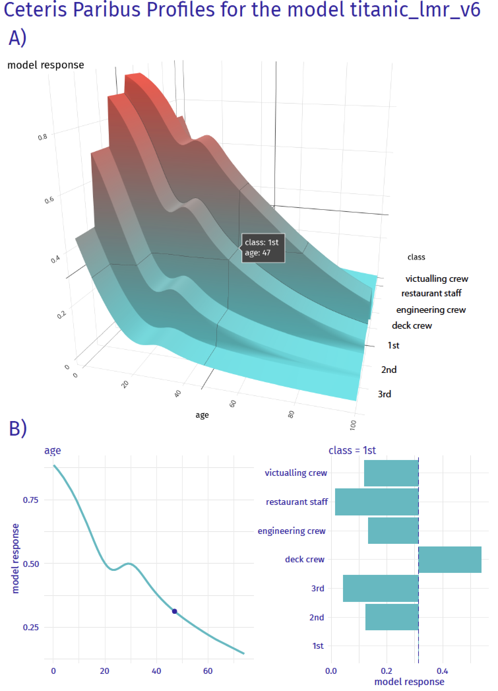

# Ceteris-paribus Profiles {#ceterisParibus}

## Introduction {#CPIntro}

Chapters \@ref(breakDown)--\@ref(LIME) are focused on the methods that quantified the importance of explanatory variables in the context of a single-instance prediction. They result in decomposition of a single prediction into components that could be attributed to particular variables. In this chapter, we focus on a method that analyses the effect of a selected variable in terms of changes of the model's prediction induced by changes in the variable's values. The method is based on the *ceteris paribus* principle. *"Ceteris paribus"* is a Latin phrase meaning "other things held constant" or "all else unchanged". The method examines the influence of an explanatory variable by assuming that the effects of all other variables are unchanged. The main goal is to understand how changes in the values of the variable affect the model's predictions. 

Explanation tools (explainers) presented in this chapter are linked to the second law introduced in Section \@ref(three-single-laws), i.e., the law of "Prediction's speculation". This is why the tools are also known as *What-if model analysis* or *Individual Conditional Expectations* [@ICEbox]. It appears that it is easier to understand how a black-box model is working if we can explore the model by investigating the influence of explanatory variables separately, changing one at a time. 

<!---
is the model response, or to what-if analysis, how the model response would change if input is changed. It is important to remember that the what-if analysis is performed not in the sense of causal modelling, but in the sense of model exploration. We need a causal model to do causal inference for the real-world phenomena. Here we focus on an explanatory analysis of the model behaviour. To show the difference between these two things, think about a model for survival for lung cancer patients based on some treatment parameters. We need a causal model to say how the survival would change if the treatment is changed. Techniques presented in this chapter will explore how the model result will change if the treatment is changed.
--->

## Intuition {#CPIntuition}

Ceteris-paribus (CP) profiles show how the model's prediction would change if the value of a single exploratory variable changed. In essence, a CP profile shows a conditional expectation of the dependent variable (response) for the particular explanatory variable. For example, panel A of Figure \@ref(fig:modelResponseCurveLine) presents response (prediction) surface for two explanatory variables, *age* and *class*, for the logistic-regression model `titanic_lmr` (see Section \@ref(model-titanic-lmr)) for the Titanic dataset (see Section \@ref(TitanicDataset)). We are interested in the change of the model's prediction for passenger Henry (see Section \@ref(predictions-titanic)) induced by each of the variables. Toward this end, we may want to explore the curvature of the response surface around a single point with *age* equal to 47 and *class* equal to "1st," indicated in the plot. CP profiles are one-dimensional profiles that examine the curvature across each dimension, i.e., for each variable. Panel B of Figure \@ref(fig:modelResponseCurveLine) presents CP profiles for *age* and *class*. Note that, in the CP profile for *age*, the point of interest is indicated by the dot. The plots for both variables suggest that the predicted probability of survival vary considerably for different ages and classes. 

(ref:modelResponseCurveLineDesc) Panel A) shows the model response (prediction) surface for two variables *age* and *class.* Ceteris-paribus (CP) profiles are conditional, one-dimensional profiles, that are marked with black curves. They help to understand the curvature of the surface while changing only a single explanatory variable. Panel B) CP profiles for individual variables, *age* (continuous) and *class* (categorical). 

```{r modelResponseCurveLine, echo=FALSE, fig.cap='(ref:modelResponseCurveLineDesc)', out.width = '60%', fig.align='center'}

```

(ref:modelResponseCurveAnimationDesc) Animated model response for 2D surface as in \@ref(fig:modelResponseCurveLine).

```{r modelResponseCurveAnimation, echo=FALSE, fig.cap='(ref:modelResponseCurveAnimationDesc)', out.width = '60%', fig.align='center'}
knitr::include_graphics("figure/profile_age_class.gif")
```

```{r, echo=FALSE, eval=FALSE}
# 3D animated map
age <- rep(0:100, each = 5)
class <- rep(c(3,2,1,4,5,6,7), each = 80)
ac <- expand.grid(age, class)
achenry <- henry[rep(1,nrow(ac)),]
achenry$age <- ac$Var1
achenry$class <- levels(titanic$class)[ac$Var2]

library("rms")
explain_lmr <- archivist::aread("pbiecek/models/2b9b6")

achenry$predict <- predict(explain_lmr, achenry)

library(plotly)
acmat <- matrix(achenry$predict, ncol = length(class))
p <- plot_ly(z = ~acmat) %>% add_surface()
p


achenry$class <- reorder(achenry$class, achenry$predict, mean)

gghenry <- ggplot(achenry[,c(1,3,8)], aes(class, age)) +
 geom_raster(aes(fill = predict)) + coord_flip() +
  scale_fill_gradient2(midpoint = 0.5)

library(rayshader)
plot_gg(gghenry, width = 5, height = 5,  multicore = TRUE, scale = 250, 
        zoom = 0.7, 
        theta = 10, phi = 30, windowsize = c(800, 800))
```


<!---
CP belongs to the class of techniques that examine local curvature of the model response surface. Other very popular technique from this class called LIME is presented in Chapter \@ref(LIME).

The difference between these two methods lies in the fact that LIME approximates the model of interest locally with a simpler glass-box model. Usually, the LIME model is sparse, i.e., contains fewer explanatory variables. Thus, one needs to investigate a plot across a smaller number of dimensions. On the other hand, the CP profiles present conditional predictions for a single variable and, in most cases, are easier to interpret. More detailed comparison of these techniques is presented in the Chapter \@ref(summaryInstanceLevel).
--->

## Method {#CPMethod}

In this section, we introduce more formally one-dimensional CP profiles. Recall (see Section \@ref(notation)) that we use $\underline{x}_i$ to refer to the vector of values of explanatory variables corresponding to the $i$-th observation in a dataset. A vector with arbitrary values (not linked to any particular observation in the dataset) is denoted by $\underline{x}_*$. Let $x^{j}_{*}$ denote the $j$-th element of $\underline{x}_{*}$, i.e., the value of the $j$-th explanatory variable. We use $\underline{x}^{-j}_{*}$ to refer to a vector resulting from removing the $j$-th element from $\underline{x}_{*}$. By $\underline{x}^{j|=z}_{*}$, we denote a vector resulting from changing the value of the $j$-th element of $\underline{x}_{*}$ to (a scalar) $z$. 

We define a one-dimensional CP profile $h()$ for model $f()$, the $j$-th explanatory variable, and point of interest $\underline{x}_*$ as follows:

\begin{equation}
h^{f,j}_{\underline{x}_*}(z) = f\left(\underline{x}_*^{j|=z}\right).
(\#eq:CPPdef)
\end{equation}

CP profile is a function that describes the dependence of the approximated expected value (prediction) of $Y$ on the value $z$ of the $j$-th explanatory variable. Note that, in practice, $z$ assumes values from the entire observed range for the variable, while values of all other explanatory variables are kept fixed at the values specified by $\underline{x}_*$. 

Note that in the situation when only a single model is considered, we will skip the model index and we will denote the CP profile for the $j$-th explanatory variable and the point of interest $\underline{x}_*$ by $h^{j}_{\underline{x}_*}(z)$.


## Example: Titanic data {#CPExample}

For continuous explanatory variables, a natural way to represent the CP function is to use a profile plot similar to one of those presented in Figure \@ref(fig:profileAgeRf). In the figure, the dot on the curves marks the instance-prediction of interest, i.e., prediction $f(\underline{x}_*)$ for a single observation $\underline{x}_*$. The curve itself shows how the prediction would change if the value of a particular explanatory variable changed. 

Figure \@ref(fig:profileAgeRf) presents CP profiles for the *age* variable in the logistic-regression model `titanic_lmr` and random-forest model `titanic_rf` for the Titanic dataset (see Sections \@ref(model-titanic-lmr) and \@ref(model-titanic-rf), respectively). The instance of interest is passenger Henry, a 47-year-old man who travelled in the first class (see Section \@ref(predictions-titanic)). It is worth observing that the profile for the logistic-regression model is smooth, while the one for the random-forest model is a step function with some variability. For Henry, the shape of the CP profiles is similar. If Henry were a newborn, with all other values kept unchanged, the prediction of both models would increase about 40 percentage points. And if Henry were 100 years old, the prediction of both models would decrease by more than 10 percentage points. 

```{r, warning=FALSE, echo=FALSE}
titanic_imputed <- archivist::aread("pbiecek/models/27e5c")
titanic_lmr <- archivist::aread("pbiecek/models/58b24")
titanic_rf <- archivist::aread("pbiecek/models/4e0fc")
henry <- archivist::aread("pbiecek/models/a6538")
johnny_d <- archivist:: aread("pbiecek/models/e3596")

library("randomForest")
library("rms")
library("DALEX")
explain_lmr <- DALEX::explain(model = titanic_lmr, data = titanic_imputed[, -9],
    y = titanic_imputed$survived == "yes", label = "Logistic Regression", verbose = FALSE)
explain_lmr$model_info$type = "classification"

explain_rf <- DALEX::explain(model = titanic_rf,  data = titanic_imputed[, -9],
    y = titanic_imputed$survived == "yes", label = "Random Forest", verbose = FALSE)

cp_titanic_rf <- predict_profile(explainer = explain_rf, new_observation = henry)
cp_titanic_lmr <- predict_profile(explainer = explain_lmr, new_observation = henry)

cpplot_age_rf  <- plot(cp_titanic_rf, variables = "age") + ggtitle("Ceteris Paribus for titanic_rf", "") + scale_y_continuous("model response", limits = c(0,1))
cpplot_age_lmr <- plot(cp_titanic_lmr, variables = "age") + ggtitle("Ceteris Paribus for titanic_lmr", "") + scale_y_continuous("model response", limits = c(0,1))
cpplot_class_rf <- plot(cp_titanic_rf, variables = "class", variable_type = "categorical", categorical_type = "bars")  + ggtitle("Ceteris Paribus for titanic_rf", "") 
cpplot_class_lmr <- plot(cp_titanic_lmr, variables = "class", variable_type = "categorical", categorical_type = "bars")  + ggtitle("Ceteris Paribus for titanic_lmr", "") 
```

(ref:profileAgeRfDesc) Ceteris-paribus profiles for variable *age* for the logistic-regression  (`titanic_lmr`) and random-forest (`titanic_rf` ) models that predict the probability of surviving based on the Titanic data. Dot indicates the value of the variable and of the prediction for passenger Henry.

```{r profileAgeRf, echo=FALSE, fig.cap='(ref:profileAgeRfDesc)', out.width = '70%', fig.align='center', fig.width=8, fig.height=4}
library(patchwork)
# knitr::include_graphics("figure/profile_age_rf.png")
cpplot_age_lmr + cpplot_age_rf 
```

For a categorical explanatory variable, a natural way to represent the CP function is to use a barplot similar to one of those presented in Figure \@ref(fig:profileAgeRf2). In particular, the figure presents CP profiles for the *class* variable in the logistic-regression and random-forest models for the Titanic dataset (see Sections \@ref(model-titanic-lmr) and \@ref(model-titanic-rf), respectively). For this instance (observation), passenger Henry, the predicted probability for the logistic-regression model would decrease substantially if the value of *class* changed to "2nd" or "3rd". On the other hand, for the random-forest model, the largest change would be marked if *class* changed to "desk crew".

(ref:profileAgeRf2Desc) Ceteris-paribus profiles for variable *class* for the logistic-regression (`titanic_lmr`) and random-forest (`titanic_rf` ) models that predict the probability of surviving of passenger Henry based on the Titanic data. 

```{r profileAgeRf2, echo=FALSE, fig.cap='(ref:profileAgeRf2Desc)', out.width = '70%', fig.align='center', fig.width=8, fig.height=4}
#knitr::include_graphics("figure/profile_class_rf.png")
cpplot_class_lmr + cpplot_class_rf 
```

Usually, black-box models contain a large number of explanatory variables. However, CP profiles are legible even for tiny subplots, created with techniques like sparklines or small multiples [@Tufte1986]. By using the techniques we can display a large number of profiles, while at the same time keeping profiles for consecutive variables in separate panels, as shown in Figure \@ref(fig:profileV4Rf) for the random-forest model for the Titanic dataset. It helps if the panels are ordered so that the most important profiles are listed first. A method to assess the importance of CP profiles is discussed in the next chapter. 

(ref:profileV4RfDesc) Ceteris-paribus profiles for all continuous explanatory variables for the random-forest model `titanic_rf` for the Titanic dataset and passenger Henry. Dot indicates the values of the variables and of the prediction for Henry. 

```{r profileV4Rf, echo=FALSE, fig.cap='(ref:profileV4RfDesc)', out.width = '90%', fig.align='center', fig.width=11, fig.height=3.5}
#knitr::include_graphics("figure/profile_v4_rf3.png")
plot(cp_titanic_rf) + facet_wrap(~`_vname_`, ncol = 4, scales = "free_x")  + ggtitle("Ceteris Paribus for titanic_lmr", "")
```


## Pros and cons {#CPProsCons}

One-dimensional CP profiles, as presented in this chapter, offer a uniform, easy to communicate, and extendable approach to model exploration. Their graphical representation is easy to understand and explain. It is possible to show profiles for many variables or models in a single plot. CP profiles are easy to compare, as we can overlay profiles for two or more models to better understand differences between the models. We can also compare two or more instances to better understand model-prediction's stability. CP profiles are also a useful tool for sensitivity analysis.

However, there are several issues related to the use of the CP profiles. One of the most impotant ones is related to the presence of correlated explanatory variables. For such variables, the application of the *ceteris paribus* principle may lead to unrealistic settings and misleading results, as it is not possible to keep one variable fixed while varying the other one. For example, variables like surface and number of rooms, which can be used in prediction of an apartment's price, are usually correlated. Thus, it is unrealistic to consider very small apartments with a large number of rooms. In fact, in a training dataset, there may be no such combinations. Yet, as implied by \@ref(eq:CPPdef), to compute a CP profile for the number-of-rooms variable for a particular instance of a small-surface apartment, we should consider the model's predictions $f\left(\underline{x}_*^{j|=z}\right)$ for all values of $z$ (i.e., numbers of rooms) observed in the training dataset, including large ones. This means that, especially for flexible models like, for example, regression trees, predictions for a large number of rooms $z$ may have to be obtained by extrapolating the results obtained for large-surface apartments. Needless to say, such extrapolation may be problematic. We will come back to this issue in Chapters \@ref(partialDependenceProfiles) and \@ref(accumulatedLocalProfiles).

A somewhat similar issue is related to the presence of interactions in a model, as they imply the dependence of the effect of one variable on other one(s). Pairwise interactions require the use of two-dimensional CP profiles that are more complex than one-dimensional ones. Needless to say, interactions of higher orders pose even a greater challenge.

A practical issue is that, in case of a model with hundreds or thousands of variables, the number of plots to inspect may be daunting. 

Finally, while barplots allow visualization of CP profiles for factors (categorical explanatory variables), their use becomes less trivial in case of factors with many nominal (unordered) categories (like, for example, a ZIP-code). 

## Code snippets for R {#CPR}

In this section, we present Ceteris paribus profiles as implemented in the `DALEX` package for R. Note that presented functions are, in fact, wrappers to package `ingredients` [@ingredientsRPackage] with simplified interface. There are also other R packages that offer similar functionalities, like `condvis` [@condvisRPackage], `pdp` [@pdpRPackage], `ICEbox` [@ICEbox], `ALEPlot` [@ALEPlotRPackage], or `iml` [@imlRPackage].

For illustration, we use two classification models developed in Chapter \@ref(TitanicDataset), namely the logistic-regression model `titanic_lmr` (Section \@ref(model-titanic-lmr)) and the random-forest model `titanic_rf` (Section \@ref(model-titanic-rf)). They are developed to predict the probability of survival after sinking of Titanic. Instance-level explanations are calculated for Henry, a 47-year-old male passenger that travelled in the first class (see Section \@ref(predictions-titanic)).

We first retrieve the `titanic_lmr` and `titanic_rf` model-objects and the data frame for Henry via the `archivist` hooks, as listed in Section \@ref(ListOfModelsTitanic). We also retrieve the version of the `titanic` data with imputed missing values.

```{r, warning=FALSE, message=FALSE, eval=FALSE}
titanic_imputed <- archivist::aread("pbiecek/models/27e5c")
titanic_lmr <- archivist::aread("pbiecek/models/58b24")
titanic_rf <- archivist::aread("pbiecek/models/4e0fc")
(henry <- archivist::aread("pbiecek/models/a6538"))
```
```
  class gender age sibsp parch fare  embarked
1   1st   male  47     0     0   25 Cherbourg
```

Then we construct the explainers for the model by using function `explain()` from the `DALEX` package (see Section \@ref(ExplainersTitanicRCode)). We also load the `rms` and `randomForest` packages as the models were fitted by using functions from those packages and it is important to have the corresponding `predict()` functions available. 

```{r, warning=FALSE, message=FALSE, echo = TRUE, eval = FALSE}
library("DALEX")
library("rms")
explain_lmr <- explain(model = titanic_lmr, 
                       data  = titanic_imputed[, -9],
                       y     = titanic_imputed$survived == "yes",
                       label = "Logistic Regression")
explain_lmr$model_info$type = "classification"

library("randomForest")
explain_rf <- DALEX::explain(model = titanic_rf,  
                       data  = titanic_imputed[, -9],
                       y     = titanic_imputed$survived == "yes", 
                       label = "Random Forest")
```

### Basic use of the `predict_profile()` function

The easiest way to create and plot CP profiles is to use the `predict_profile()` function and then apply the generic `plot()` function to the resulting object. By default, profiles for all explanatory variables are calculated, while profiles for all numeric (continuous) variables are plotted. One can limit the number of variables for which calculations and/or plots are necessary by using the `variables` argument. 

To compute the CP profiles, the `predict_profile()` function requires arguments `explainer`, which specifies the name of the explainer-object, and `new_observation`, which specifies the name of the data frame for the instance for which prediction is of interest. As a result, the function returns an object of class `ceteris_paribus_explainer`. It is a data frame with the model's predictions. Below we illustrate the use of the function for the random-forest model.

```{r, warning=FALSE, message=FALSE}
cp_titanic_rf <- predict_profile(explainer = explain_rf, 
                                 new_observation = henry)
cp_titanic_rf
```

To obtain a graphical representation of CP profiles, the generic `plot()` function can be applied to the data frame returned by the `predict_profile()` function. It returns a `ggplot2` object that can be processed further if needed. In the examples below, we use the `ggplot2` functions, like `ggtitle()` or `ylim()`, to modify plot's title or the range of the y-axis.

<!-- The resulting plot can be enriched with additional data by applying functions `ingredients::show_rugs` (adds rugs for the selected points), `ingredients::show_observations` (adds dots that shows observations), or `ingredients::show_aggreagated_profiles`. All these functions can take additional arguments to modify size, color, or line type. -->

Below we show the code that can be used to create plots similar to those presented in the upper part of Figure \@ref(fig:profileV4Rf). By default, the `plot()` function provides a graph with plots for all numerical variables. To limit the display to variables *age* and *fare*, the names of the variables are provided in the `variables` argument. The resulting plot is shown in Figure \@ref(fig:titanicCeterisProfile01). 

(ref:titanicCeterisProfile01Desc) Ceteris-paribus profiles for variables *age* and *fare* and the `titanic_rf` random-forest model for the Titanic data. Dots indicate the values of the variables and of the prediction for Henry.

```{r titanicCeterisProfile01, warning=FALSE, message=FALSE, fig.width=8, fig.height=4, fig.cap='(ref:titanicCeterisProfile01Desc)', out.width = '70%', fig.align='center'}
library("ggplot2")
plot(cp_titanic_rf, variables = c("age", "fare")) +
  ggtitle("Ceteris-paribus profile", "") + ylim(0, 0.8)
```

To plot CP profiles for categorical variables, we have got to add the `variable_type = "categorical"` argument to the `plot()` function. In the code below, we use argument `variables` to indicate that we want to create plots for *class* and *embarked* variables. The resulting plot is shown in Figure \@ref(fig:titanicCeterisProfile01). 

(ref:titanicCeterisProfile01BDesc) Ceteris-paribus profiles for variables *class* and *embarked* and the `titanic_rf` random-forest model for the Titanic data. Blue dots indicate the values of the variables and of the prediction for Henry. 

```{r titanicCeterisProfile01B, warning=FALSE, message=FALSE, fig.width=8, fig.height=4, fig.cap='(ref:titanicCeterisProfile01BDesc)', out.width = '80%', fig.align='center'}
plot(cp_titanic_rf, variables = c("class", "embarked"), 
     variable_type = "categorical", categorical_type = "bars") +
  ggtitle("Ceteris-paribus profile", "")
```


### Advanced use of the `predict_profile()` function

The `predict_profile()` function is very flexible. To better understand how can it be used, we briefly review its arguments:

* `explainer`, `data`, `predict_function`, `label` - they provide information about the model. If the object provided in the `explainer` argument has been created with the `DALEX::explain()` function, then values of the other arguments are extracted from the object; this is how we use the function in this chapter. Otherwise, we have got to specify directly the model-object, the data frame used for fitting the model, the function that should be used to compute predictions, and the model label.
* `new_observation` - a data frame with data for instance(s), for which we want to calculate CP profiles, with the same variables as in the data used to fit the model. Note, however, that it is best not to inlcude the dependent variable in the data frame.
* `y` - the observed values of the dependent variable corresponding to `new_observation`. The use of this argument is illustrated in Section  \@ref(cPLocDiagIntro). 
* `variables` - names of explanatory variables, for which CP profiles are to be calculated. By default `variables = NULL` and the profiles are constructed for all variables, which may be time consuming.
* `variable_splits` - a list of values for which CP profiles are to be calculated. By default `variable_splits = NULL` and the list includes all values for categorical variables and uniformly-placed values for continuous variables; for the latter, one can specify the number of the values with the `grid_points` argument (by default, `grid_points = 101`).

The code below uses argument `variable_splits` to specify that CP profiles are to be calculated for *age* and *fare*, together with the list of values at which the profiles are to be evaluated. 

```{r, warning=FALSE, message=FALSE}
variable_splits = list(age = seq(0, 70, 0.1), 
                      fare = seq(0, 100, 0.1))
cp_titanic_rf <- individual_profile(explainer = explain_rf, 
                                    new_observation = henry,
                              variable_splits = variable_splits)
```

Susbequently, to replicate the plots presented in the upper part of Figure \@ref(fig:profileV4Rf), a call to function `plot()` can be used as below. The resulting plot is shown in Figure \@ref(fig:titanicCeterisProfile01).

(ref:titanicCeterisProfile01CDesc) Ceteris-paribus profiles for variables *class* and *embarked* and the `titanic_rf` random-forest model. Blue dots indicate the values of the variables and of the prediction for Henry.

```{r titanicCeterisProfile01C, warning=FALSE, message=FALSE, fig.width=8, fig.height=4, fig.cap='(ref:titanicCeterisProfile01CDesc)', out.width = '70%', fig.align='center'}
plot(cp_titanic_rf, variables = c("age", "fare")) + 
  ylim(0, 1) +
  ggtitle("Ceteris-paribus profile", "")
```

<!-- To enhance the plot, additional functions can be used. The generic `plot()` function creates a `ggplot2` object with a single `geom_line` layer. Function `show_observations` adds `geom_point` layer, `show_rugs` adds `geom_rugs`, while `show_profiles` adds another `geom_line`. All these functions take, as the first argument, an object created with the `ceteris_paribus()` function. They can be combined freely  to superimpose profiles for different models or observations. -->

In the example below, we present the code to create CP profiles for two passengers, Henry and Johnny D (see Section \@ref(predictions-titanic)), for the random-forest model `titanic_rf` (Section \@ref(model-titanic-rf)). Toward this end, we first retrieve the `johnny_d` data frame via the `archivist` hook, as listed in Section \@ref(ListOfModelsTitanic). We then apply the `individual_profile()` function with the explainer-object `explain_rf` specified in the `explainer` argument and the combined data frame for Henry and Johnny D used in the `new_observation` argument. We apply argument `variable_splits` to specify that CP profiles are to be calculated for *age* and *fare*, together with the list of values at which the profiles are to be evaluated. 

<!---
{r, warning=FALSE, message=FALSE, eval=FALSE}
#johny_d <- archivist::aread("pbiecek/models/e3596")
#cp_titanic_rf2 <- variable_profile(explain_rf, rbind(henry, johny_d))
#load("models/johny_d.rda")
--->

```{r, warning=FALSE, message=FALSE}
(johnny_d <- archivist::aread("pbiecek/models/e3596"))
cp_titanic_rf2 <- individual_profile(explainer = explain_rf, 
                               new_observation = rbind(henry, johnny_d),
                               variable_splits = variable_splits)
```

To create the plots of CP profile, we apply the `plot()` function. We use the  `scale_color_manual` function to add names of passengers to the plot, and to control colors and positions.

(ref:titanicCeterisProfile01DDesc) Ceteris-paribus profiles for the `titanic_rf` model. Profiles for different passengers are color-coded. Dots indicate the values of the variables and of the predictions for the passengers.

```{r titanicCeterisProfile01D, warning=FALSE, message=FALSE, echo=TRUE, eval=TRUE, fig.width=7, fig.height=4, fig.cap='(ref:titanicCeterisProfile01DDesc)', out.width = '70%', fig.align='center'}
library(ingredients)
plot(cp_titanic_rf2, color = "_ids_", variables = c("age", "fare")) + 
  scale_color_manual(name = "Passenger:", breaks = 1:2, 
            values = c("#4378bf", "#8bdcbe"), 
            labels = c("henry" , "johny_d")) + 
  ggtitle("Ceteris-paribus profile", "")
```

The resulting graph, which includes CP profiles for Henry and Johnny D, is presented in Figure \@ref(fig:titanicCeterisProfile01D). For Henry, the predicted probability of survival is smaller than for Johnny D, as seen from the location of the large dots on the profiles.

The profiles for *age* indicate a somewhat larger effect of the variable for Henry, as the predicted probability, in general, decreases from about 0.6 to 0.1 with increasing values of the variable. For Johny D, the probability changes from about 0.45 to about 0.05, with a bit less monotonic pattern. For *fare*, the effect is smaller for both passengers, as the probability changes within a smaller range of about 0.2. For Henry, the changes are approximately limited to the interval [0.1, 0.3], while for Johnny D they are limited to the interval [0.4, 0.6]. 

### Comparison of models (challenger-champion analysis)

One of the most interesting uses of the CP profiles is the comparison for two or more of models.

To illustrate this possibility, first, we have go to construct profiles for the models. In our illustration, for the sake of clarity, we limit ourselves to the logistic-regression and random-forest models for the Titanic data. Moreover, we use Henry as the instance for which predictions are of interest. We use the `predict_profile()` function to compute the CP profiles for the two models.

```{r, warning=FALSE, message=FALSE, eval=TRUE}
cp_titanic_rf <- predict_profile(explain_rf, henry, variable_splits = variable_splits)
cp_titanic_lmr <- predict_profile(explain_lmr, henry, variable_splits = variable_splits)
```

<!---
{r, warning=FALSE, message=FALSE, eval=FALSE}
cp_titanic_rf <- ceteris_paribus(explain_rf, henry)
cp_titanic_lmr <- ceteris_paribus(explain_lmr, henry)
--->

Subsequently, we construct the plot with the help of the `plot()` function. Note that, for the sake of brevity, we use the `variables` argument to limit the plot only to profiles for variables *age* and *class*. Every `plot()` function can take a collection of explainers as arguments. In such case profiles for different models are combined in a single plot. In the code presented below, argument `color = "_label_"`  is used to specify that models are to be color-coded. The `_label_` refers to the name of the column in the CP explainer that contains the model name.

(ref:titanicCeterisProfile01EDesc) Comparison of the `titanic_lmr` and `titanic_rf` models for Henry. Profiles for different models are color-coded. Dots indicate the values of the variables and of the prediction for Henry.

```{r titanicCeterisProfile01E, warning=FALSE, message=FALSE, fig.width=7, fig.height=4, fig.cap='(ref:titanicCeterisProfile01EDesc)', out.width = '70%', fig.align='center'}
plot(cp_titanic_rf, cp_titanic_lmr, color = "_label_",  variables = c("age", "fare")) +
     ggtitle("Ceteris-paribus profiles for Henry", "")
```

The result is shown in Figure \@ref(fig:titanicCeterisProfile01E). For Henry, the predicted probability of survival is higher for the logistic-regression model than for the random-forest model. CP profiles for *age* show a similar shape, however, and indicate decreasing probability with age. For *fare*, the profile for the logistic-regression model suggests a slight increase of the probabilty, while for the random-forest a decreasing trend can be infered. The difference between the values of the CP profiles for *fare* increases with the increasing values of the variable.
We can only speculate what is the reason for the difference. Perhaps the cause is the correlation between the ticket *fare* and *class.* The logistic regression model handles the dependency of variables differently than the random forest model.

## Code snippets for Python {#CPPython}

In this section, we use the `dalex` library for Python. The package covers all methods presented in this chapter. It is available on `pip` and `GitHub`. 

For illustration purposes, we use the `titanic_rf` random forest model for the Titanic data developed in Section \@ref(model-titanic-python-rf). Recall that the model is developed to predict the probability of survival for passengers of Titanic. Instance-level explanations are calculated for Henry, a 47-year-old passenger that travelled in the 1st class (see Section \@ref(predictions-titanic-python)).

In the first step we create an Explainer, an object that will provide a uniform interface for the predictive model. We use the `Explainer` constructor for this purpose.

```{python,  eval = FALSE}
import pandas as pd
henry = pd.DataFrame({'gender': ['male'],
                       'age': [47],
                       'class': ['1st'],
                       'embarked': ['Southampton'],
                       'fare': [25],
                       'sibsp': [0],
                       'parch': [0]},
                      index = ['Henry'])

import dalex as dx
titanic_rf_exp = dx.Explainer(titanic_rf, X, y, label = "Titanic RF Pipeline")
```

To calculate the CP profile one can use the `predict_profile` method. The first argument is the observation for which the attributions are to be calculated. Results are stored in the `results` field. 

```{python,  eval = FALSE}
cp_johnny = exp_rf.predict_profile(johnny_d)
cp_johnny.result
```

The resulting object can be visualised with the `plot` method. One can specify the vector of `variables`. By default all continuous variables are plotted.

```{python,  eval = FALSE}
cp_johnny.plot(variables = ['age', 'fare'])
```

```{r cpPython1, echo=FALSE, out.width = '80%', fig.align='center'}
knitr::include_graphics("figure/cp_python_1.png")
```

If you want to plot categorical variables it is advised to additionaly set `variable_type = 'categorical'`.

```{python,  eval = FALSE}
cp_johnny.plot(variables = ['class', 'embarked'],
               variable_type = 'categorical')
```

```{r cpPython2, echo=FALSE, out.width = '80%', fig.align='center'}
knitr::include_graphics("figure/cp_python_2.png")
```

