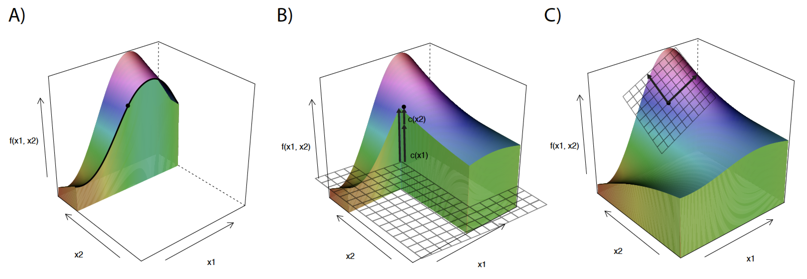

# Instance-level explanation {-}

```{r localDALEXsummary, echo=FALSE, fig.cap="(fig:localDALEXsummary) Summary of three approaches to local model exploration and explanation.", out.width = '99%', fig.align='center'}
knitr::include_graphics("figure/DALEX_local.png")
```


# Introduction {#PredictionExplainers}

Instance-level explainers help to understand how a model yields a prediction for a single observation. We can think about the following situations as examples:

- We may want to evaluate the effects of explanatory variables on model predictions. For instance, we may be interested in predicting the risk of heart attack based on person's age, sex, and smoking habits. A model may be used to construct a score (for instance, a linear combination of the explanatory variables representing  age, sex, and smoking habits) that could be used for the purposes of prediction. For a particular patient we may want to learn how much the different variables contribute to the patient's score?
- We may want to understand how models predictions would change if values of some of the explanatory variables changed. For instance, what would be the predicted risk of heart attack if the patient cut the number of cigarettes smoked per day by half? 
- We may discover that the model is providing incorrect predictions and we may want to find the reason. For instance, a patient with a very low risk-score experiences heart attack. What has driven that prediction?

A model is a function with a $p$-dimensional vector $x$ as an argument. The plot of the value(s) of the function can be constructed in a $p+1$-dimensional space. An example with $p=2$ is presented in Figure \@ref(fig:cutsSurfaceReady). We will use it as an illustration of key ideas. The plot provides an information about the values of the function in the vicinity of point $x^*$.  
 
```{r cutsSurfaceReady, echo=FALSE, fig.cap="(fig:cutsSurfaceReady) Response surface for a model that is a function of two variables. We are interested in understanding the response of a model in a single point x*", out.width = '60%', fig.align='center'}
knitr::include_graphics("figure/cuts_surface_ready_punkt.png")
```
There are many different tools that may be used to explore the predictions of the model around a single point $x^*$. In the following sections we will describe the most popular approaches. They can be divided into three classes. 

* One approach is to investigate how the model prediction changes if the value of a single explanatory variable  changes. The approach is useful in the so-called ,,What-If'' analyses. In particular, we can construct plots presenting the change in model-based predictions induced by a change of a single variable. Such plots are usually called Ceteris-paribus (CP) profiles. An example is provided in panel A of Figure \@ref(fig:cutsTechnikiReady). Chapters \@ref(ceterisParibus)-\@ref(ceterisParibusWankardu) introduce the CP profiles and methods based on them.  
* Another approach is to analyze how the model prediction for point $x^*$ is different from the average model prediction and how the difference can be distributed among explanatory variables. It is often called the ,,variable attributions'' approach. An example is provided in panel B of Figure \@ref(fig:cutsTechnikiReady). Chapters \@ref(breakDown)-\@ref(shapley) present various methods implementing this approach. 
* Yet another approach is to analyze the curvature of the response surface (see Figure \@ref(fig:cutsSurfaceReady)) around the point of interest $x^*$. Treating the model as a function, we are interested in the local behavior of this function around $x^*$. In case of a black-box model, we may approximate it with a simpler glass-box model around $x^*$. An example is provided in panel C of Figure \@ref(fig:cutsTechnikiReady). Chapter \@ref(LIME) presents the Local Interpretable Model-agnostic Explanations (LIME) method that exploits the concept of a ,,local model.'' 

Each method has its own merits and limitations. They are briefly discussed in the corresponding chapters. Chapter \@ref(CompareInstance) offers a comparison of the methods.

```{r cutsTechnikiReady, echo=FALSE, fig.cap="(fig:cutsTechnikiReady) Illustration of different approaches to instance-level explanation. Panel A presents a What-If analysis with Ceteris-paribus profiles. The profiles show the model response as a function of a value of a single variable, while keeping the values of all other explanatory variables fixed. Panel B illustrates the concept of variable attributions. Additive effects of each variable show how the model response differs from the average. Panel C illustrates the concept of local models. A simpler glass-box model is fitted around the point of interest. It describes the local behaviour of the black-box model. ", out.width = '99%', fig.align='center'}

```
