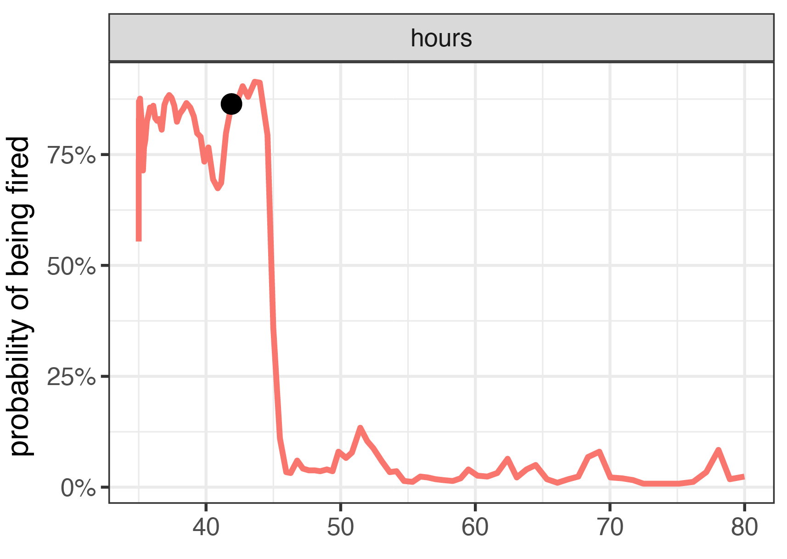
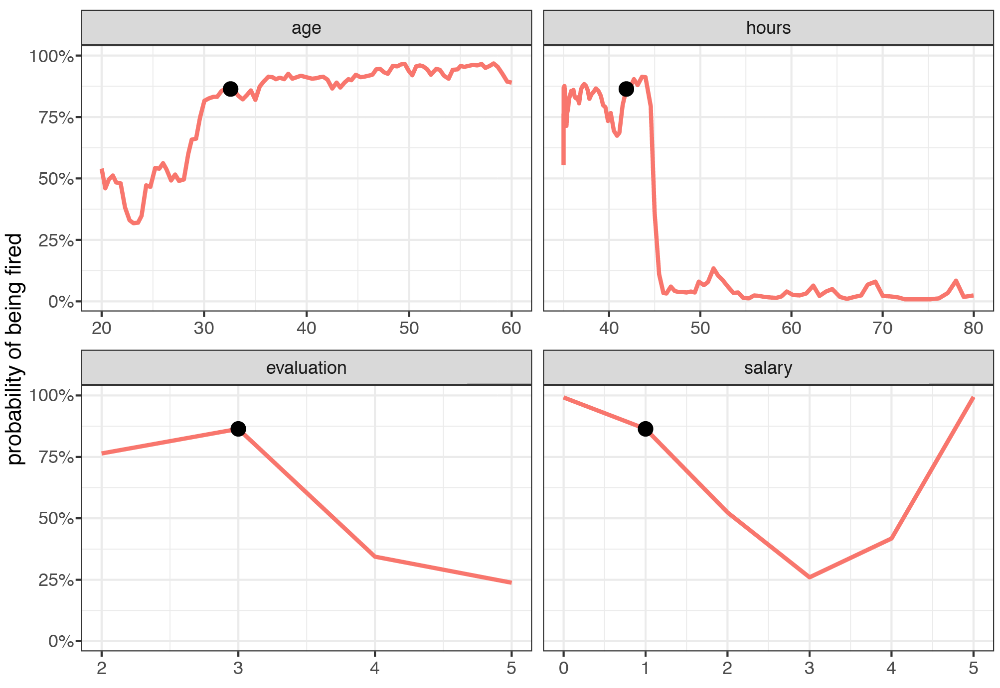
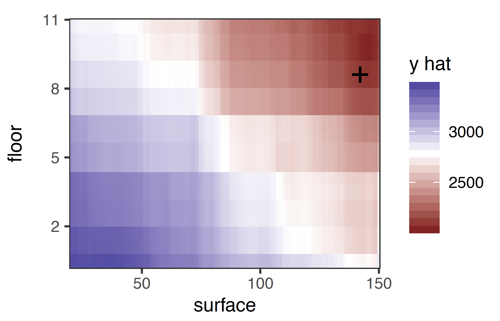
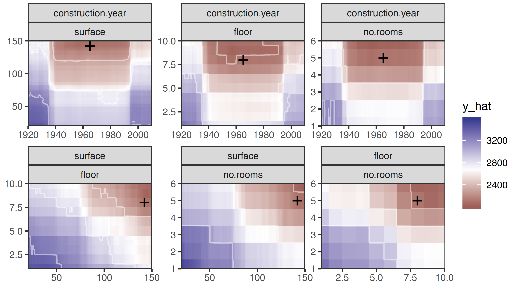
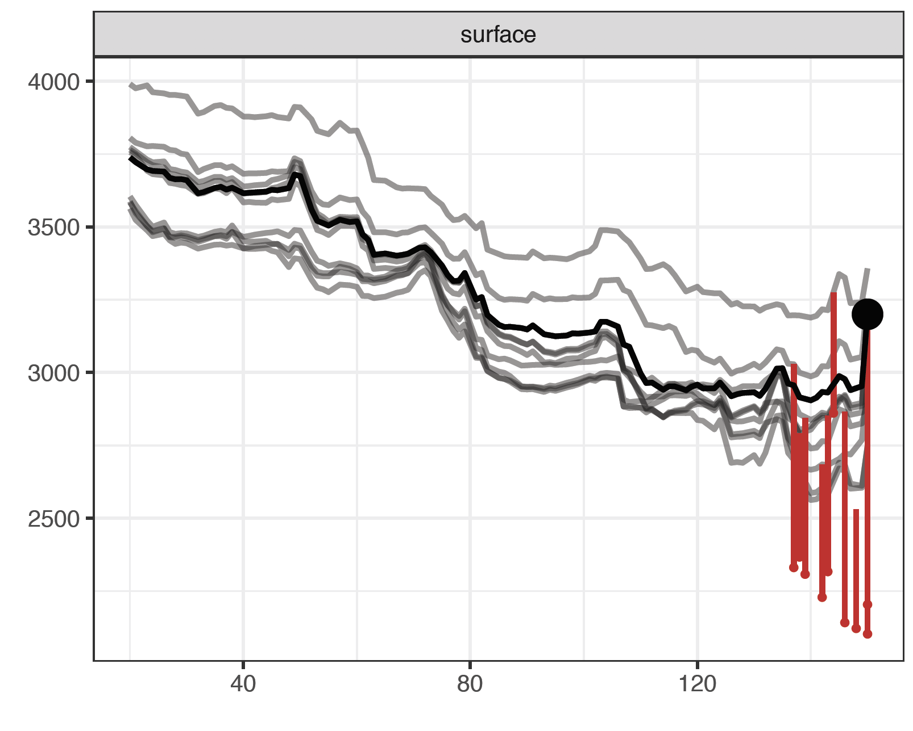
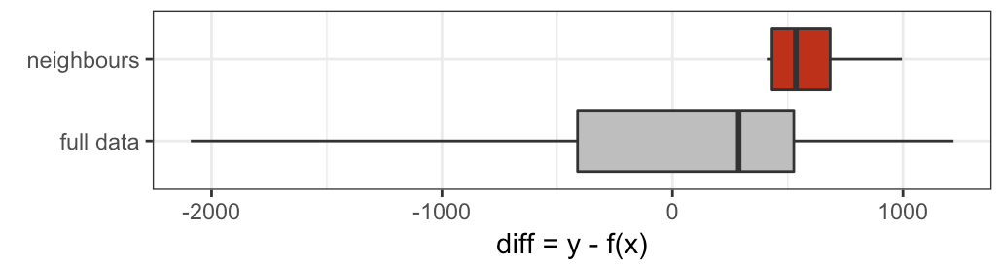

---
output:
  pdf_document: default
  html_document: default
---
# What-If analysis with the Ceteris-paribus Profiles {#ceterisParibus}

## Introduction

*Ceteris paribus* is a Latin phrase meaning "other things held constant" or "all else unchanged." In this chapter, we introduce a technique for model exploration based on the Ceteris paribus principle. In particular, we examine the influence of each explanatory variable, asumming that effects of all other variables are unchanged. The main goal is to understand how changes in a single explanatory variable affects model predictions. 

The presented tools (explainers) are linked to the second law introduced in Section \@ref(three-single-laws), i.e. the law of "Prediction's speculation." This is why the tools are also known as *What-If model analysis* or *Individual Conditional EXpectations* [@ICEbox]. It turns out that it is easier to understand how a black-box model is working if we can explore the model by investigating the influence of explanatory variables separately, changing one at a time. 


## Intuition

Panel A of Figure \@ref(fig:modelResponseCurveLine) presents a response surface for a model with two explanatory variables, *floor* and *construction.year*, from the *Apartment prices* dataset (see Section \@ref(ApartmentDataset)). We are interested in the change of the model prediction induced by each of the variables. Toward this end, we may want to explore the curvature of the response surface around a single point that is marked on the plot by a black dot. Ceteris-paribus (CP) profiles are one-dimensional profiles that examine the curvature across each dimension, i.e., for each variable. Panel B of Figure \@ref(fig:modelResponseCurveLine) presents the profiles corresponding to *floor* and *construction.year*. In essence, a CP profile shows a conditional expectation of the dependent variable (response) for the particular explanatory variable. 


```{r modelResponseCurveLine, echo=FALSE, fig.cap="(fig:modelResponseCurveLine) A) Model response (prediction) surface. Ceteris-paribus (CP) profiles marked with black curves help to understand the curvature of the surface while changing only a single explanatory variable. B) CP profiles for individual variables.", out.width = '70%', fig.align='center'}
knitr::include_graphics("figure/model_response_line.png")
```

CP technique is similar to the LIME method (see Section \@ref(LIME)). LIME and CP profiles examine the curvature of a model response-surface. The difference between these two methods lies in the fact that LIME approximates the black-box model of interest locally with a simpler white-box model. Usually, the LIME model is sparse, i.e., contains fewer variables, and thus we have got to graphically investigate a smaller number of dimensions. On the other hand, the CP profiles present conditional predictions for every variable and, in most cases, are easier to intepret. 

## Method

In this section we introduce more formally 1- and 2-dimensional CP profiles. <!-- We consider the case of a continuous dependent variable, but the profiles can be easily generalized for other types. -->


### One-dimensional (1D) Ceteris-paribus Profiles {#ceterisParibus1d}

Assume that $E_Y(Y | x^*) \approx f(x^*)$, where $f(x^*)$ is the value of the model at $x^*$. Note that $x^*$ is a vector containing values for explanatory covariates. We will use subscript $x^*_i$ to refer to the vector corresponding to the $i$-th observation in a dataset. We will use superscript $x^{*j}$ to refer to the $j$-th element of $x^*$, i.e., the $j$-th variable. Additionally, let $x^{*-j}$ denote a vector resultinig from removing the $j$-th element from vector $x^{*}$. Moreover, let $x^{*|j}=z$ denotes a vector in which the $j$-th element is equal to $z$ (a scalar). 

We define a one-dimensional CP profile for the model $f()$, $j$-th explanatory variable, and point $x^*$ as follows:

$$
CP^{f, j, x^*}(z) \equiv f(x^{*|j} = z).
$$
That is, CP profile is a function that provides the dependence of the (approximate) expected value (prediction) of the model for $Y$ on the value of $j$-th explanatory variable $z$, where $z$ is taken to go through the range of values typical for the variable and values of all other variables in $x^*$ are kept fixed at the values present in $x^*$. 

[TOMASZ: HOW ABOUT CP PROFILES FOR FACTORS?]

A natural way to represent the function is to use a profile plot similar to the one presented in Figure \@ref(fig:HRCPFiredHours). In the figure, the black dot presents an instance prediction, i.e., prediction $f(x^*)$ for a single observation decribed by $x^*$. The red curve shows how the prediction would change if the value of a particular explanatory variable (in this case, "hours"; see Section \@ref(HFDataset)) changed. It is worth oberving that the profile is not smooth and it expresses quite some variabilit. Moreovery, for this instance (observation), the prediction would drop substantially if the value of the explanatory variable became higher than 45.

```{r HRCPFiredHours, echo=FALSE, fig.cap="(fig:HRCPHiredHours) Ceteris-paribus profile for a Random Forest model that assesses the probability of being fired in a call center as a function of the average number of working hours", out.width = '50%', fig.align='center'}

```

Note that in the `HR` dataset the dependent variable is categorical with three classes. Thus, it is a good idea to plot the CP profile for each class in the same panel, as shown in Figure \@ref(fig:HRCPAllHours). In this way we can simultaneously compare the effect of "hours" on the probability of each of the three classes. Of course, for a categorical dependent variable the sum of the probabilities over all classes is equal 1. Thus, one of the profiles is redundant. However, plotting all profiles helps to understand how changes in a single explanatory variable affect the model predictions.

```{r HRCPAllHours, echo=FALSE, fig.cap="(fig:HRCPAllHours) Ceteris-paribus profiles for the probability of each of three classess predicted by the Random Forest model as a function of the average number of working hours", out.width = '60%', fig.align='center'}
knitr::include_graphics("figure/HR_cp_all_hours.png")
```

Usually, black-box models contain a large number of explanatory variables. However, CP profiles are legible even for tiny subplots, created with techniques like sparklines or small multiples. [TOMASZ: NO IDEA ABOUT THOSE TECHNIQUES. AT LEAST PROVIDE A REFERENCE?] In this way we can display a large number of profiles at the same time keeping profiles for consecutive variables in separate panels, as shown in Figure \@ref(fig:HRCPFiredAll). It helps if these panels are ordered so that the most important profiles are listed first. We discuss a method to assess importance of CP profiles in the next subsection.

```{r HRCPFiredAll, echo=FALSE, fig.cap="(fig:HRCPFiredAll) Ceteris-paribus profiles for all continuous explanatory variables in the `HR' dataset [TOMASZ: FOR WHICH MODEL?]", out.width = '70%', fig.align='center'}

```


### Profile Oscillations {#oscillations}

Visual examination of CP profiles is insightful, but for a model with a large number of explanatory variables we may end up with a large number of plots which may be overwhelming. To prioritize between profiles we need a measure that would summarize the impact of a selected variable on model's predictions. We will propose now a solution closely linked with CP profiles, but the issue is also discussed also in the next chapter.

To assign importance to CP profiles, we can use the concept of profile oscillations. In particular, the larger influence of an explanatory variable on prediction at a particular instance, the larger the fluctuations along the corresponding CP profile. For a variable that exercises little or no influence on model prediction, the profile will be flat or will barely change. Figure \@ref(fig:CPVIPprofiles) illustrates the idea behind measuring oscillations. The larger the highlighted area, the more important is the variable.

Let us formalize this concept now. Denote by $g^j(z)$ the probability density function of the distribution of the $j$-th explanatory variable. The summary measure of the variable's importance for model prediction at point $x$, $vip^{CP}_j(x)$, computed based on the variable's CP profile, is defined as follows: 

$$
vip^{CP}_j(x^*) = \int_{\mathcal R} |CP^{f,j,x^*}(z) - f(x^*)| g^j(z)dz=E_{X_j}[|CP^{f,j,x^*}(X_j) - f(x^*)|].
$$
Thus, $vip^{CP}_j(x^*)$ is the expected absolute deviation of the CP profile from the model prediction for $x^*$ over the distribution of the $j$-th explanatory variable. A straightforward estimator of $vip^{CP}_j(x^*)$ is

$$
\widehat{ vip^{CP}_j(x^*)} = \frac 1n \sum_{i=1}^n |CP^{f,j,x^*}(x^{*j}_i) - f(x^*)|,
$$
where index $i$ goes through all observations in a dataset. 

```{r CPVIPprofiles, echo=FALSE, fig.cap="(fig:CPVIPprofiles) The value of the red are area summarizes CP oscillations and provides the average absolute deviations between the CP profile and the instance prediction [TOMASZ: HERE WE USE ANOTHER DATASET, WITHOUT REFERRING TO A MODEL]", out.width = '50%', fig.align='center'}
knitr::include_graphics("figure/CP_VIP_profiles.png")
```

Figure \@ref(fig:CPVIP1) provides a plot of variable importance measures for different variables [TOMASZ: WHICH DATASET? WHICH MODEL?]. The wider the interval, the larger the CP-profile oscillations for a particular explanatory variable. Thus, Figure \@ref(fig:CPVIP1) indicates that the most important variable for prediction for observation with ID equal to 1001 is "surface", followed by "floor". 

```{r CPVIP1, echo=FALSE, fig.cap="(fig:CPVIP1) Variable-importance measures calculated for Ceteris-paribus profiles for observation ID: 1001 [TOMASZ: WHICH DATASET? WHICH MODEL? IT WOULD BE USEFUL TO SEE $x^*$ IN THE TITLE]", out.width = '40%', fig.align='center'}
knitr::include_graphics("figure/cp_vip_1.png")
```

Note that the importance of an explanatory variable for instance prediction may be very different for different points $x^*$. For example, consider model 
$$
f(x_1, x_2) = x_1 * x_2,
$$
where $x_1$ and $x_2$ take values in $[0,1]$. Consider prediction for an observation described by vector $x^* = (0,1)$. In that case, the importance of $X_1$ is larger than $X_2$. This is because the CP profile for the first variable, given by the values of function $f(z,1)=z$, will have oscillations, while the profile for the second variable will show no oscillation, because it is given by function $f(0,z)=0$. Obviously, the situation is reversed for $x^*=(1,0)$. 

### Two-dimensional (2D) Ceteris-paribus Profiles {#ceterisParibus2d}

The definition of CP profiles, given in Section \@ref(ceterisParibus1d), may be easily extended to two or more explanatory variables. Also, the definition of the variance importance measure $vip^{CP}_j(x^*)$ have a straightforward extension for a larger number of variables. For instance, a two-dimensional (2D) CP profile for model $f$, explanatory variables $j$ and $k$, and point $x^*$ is defined as follows:

$$
CP^{f, (j,k), x^*}(z_1, z_2) \equiv f(x^*|^{(j,k)} = (z_1,z_2)).
$$
Thus, 2D CP profile is a function that provides the dependence of the (approximate) expected value (prediction) of the model for $Y$ on the values of $j$-th and $k$-th explanatory variables $z_1$ and $z_2$, respectively, where $z_1$ and $z_2$ are taken to go through the range of values typical for the variables, and values of all other variables in $x^*$ are kept fixed at the values present in $x^*$.

The corresponding variance importance measure would be defined as follows: 
$$
vip^{CP}_{j,k}(x^*) = \int_{\mathcal R}\int_{\mathcal R} |CP^{f,(j,k),x^*}(z_1,z_2) - f(x^*)| g^{j,k}(z_1,z_2)dz_1dz_2=E_{X_j,X_k}[|CP^{f,j,x^*}(X_j,X_k) - f(x^*)|],
$$
where the expected value is taken over the joint distribution of the $j$-th and $k$-th explanatory variable.

Such multi-dimensional extensions are useful to check if, for instance, the model involves interactions. In particular, presence of pairwise interactions may be detected with two-dimensional (2D) CP profiles.

A natural way to visualise 2D CP profiles is to use a heatmap, as in Figure \@ref(fig:CP2Dsurflor). [TOMASZ: WHAT DOES THE PLOT SUGGEST?]

```{r CP2Dsurflor, echo=FALSE, fig.cap="(fig:CP2Dsurflor) Ceteris-paribus profile for a pair of explanatory variables (floor and surface) for a model for the price of an apartment. Black cross marks the coordinates of the point of interest.", out.width = '60%', fig.align='center'}

```

If the number of pairs of explanatory variables is small or moderate, then it is possible to present 2D CP profiles for all pairs of variables, as illustrated in Figure \@ref(fig:CP2Dall).  

```{r CP2Dall, echo=FALSE, fig.cap="(fig:CP2Dall) Ceteris-paribus profile for all pairs of explanatory variables  for a model for the price of an apartment.", out.width = '90%', fig.align='center'}

```

If the number of pairs is large, we can use the variable importance measure to order the pairs based on their importance and select the most important pairs for purposes of illustration.

## Example: Local Model Fidelity

It may happen that global performance of the model is good, while for some particular observations the fit is very bad. Local fidelity helps to understand how good is the model fit at a particular observation. In this section we show how to use CP profiles to validate local model fidelity. 

The idea behind fidelity plots is to select a number of observatons ("neighbors") from the validation dataset that are closest to the observation of interest. Then for the selected observations we plot CP profiles and check how stable they are. Additionally, if we know true values of the dependent variable for the selected neighbours, we may add residuals to the plot to evaluate the local fit of the model.

An example of a fidelity plot is presented in Figure \@ref(fig:CPfidelity1). [TOMASZ: WHICH DATA? WHICH MODEL? WHICH OBSERVATION WAS SELECTED? HOW THE NEIGHBORS WERE SELECTED?] The dark black line shows the CP profile for the observation of interest. Grey lines show CP profiles for the neihgbors. The red intervals indicate the residuals, i.e., the difference between the model prediction and the observed value of the dependent variable (indicated by the red dot). [TOMASZ: WHY ARE THERE INTERVALS THAT DO NOT START AT THE CP PROFILE?] In this example the intervals show that the predicted values are larger than the observed values of the dependent variable for all neighbors, i.e., all residuals are negative. Thus, the model may provide biased predictions around the observation of interest. [TOMASZ: IF WE FOCUS ON THE RESIDUALS, WHY DO WE NEED THE PROFILES?]

```{r CPfidelity1, echo=FALSE, fig.cap="(fig:CPfidelity1) Local fidelity plot [TOMASZ: WHICH DATA? WHICH OBSERVATION? WHICH MODEL?]. The black line shows the Cetris-paribus (CP) profile for the observation of interest. Grey lines show CP profiles for the neighbors of the observation from a validation dataset. Red intervals correspond to residuals - each interval extends from the model prediction for a selected neighbor to the observed value of the dependent variable (indicated by the red dot).", out.width = '70%', fig.align='center'}

```

This observation is confirmed by Figure \@ref(fig:CPfidelityBoxplot), which compares the distribution of all residuals from the validation dataset and the distribution of residuals for the neighbors. The plot shows that the  residuals for neighbors are shifted towards higher values. [TOMASZ: THIS MAKES NO SENSE. THE PLOT SUGGESTS POSITIVE RESIDUALS, WHEREAS ABOVE IT IS ARGUED THAT THE RESIDUALS ARE NEGATIVE.] This suggests that the model predictions  around the observation of interest are biased.


```{r CPfidelityBoxplot, echo=FALSE, fig.cap="(fig:CPfidelityBoxplot) Distribution of residuals for the entire  validation dataset (grey boxplot) and for 15 selected neighbors to the observation of interest (red boxplot).", out.width = '70%', fig.align='center'}

```

## Pros and cons

CP profiles offer a uniform, easy to comunicate and extendable approach to model exploration. Their graphical representation is easy to understand and explain. It is possible to present profiles for many variables or models in a single plot. By using the expected oscillations of CP profiles it is possible to select the most important variables for instane prediction. Two-dimensional CP profiles can be used to, for instance, identify the presence of pairwise interactions in a model. 

There are several issues related to the use of the CP profiles. If explanatory variables are correlated, then changing one variable implies a change in the other. In such case, the application of the *Ceteris paribus* principle may lead to unrealistic settings, as it is not possible to keep one variable fixed while changing the other one. A special case are interactions, which require the use of 2D CP profiles that are more complex than the 1D ones. Also, in case of a model with hundreds or thousands of variables, the number of plots to inspect may be daunting. Finally, visualization of CP profiles for factors (categorical explanatory variables) is not trivial, especially for factors with many nominal (unordered) categories (like, for example, a ZIP-code). 

## Code snippets for R

In this section we present key features of the R package `ingredients` [@R-ingredients] which is a part of `DALEXverse` and covers all methods presented in this chapter. More details and examples can be found at `https://modeloriented.github.io/ingredients/`.

There are also other R packages that offer similar methods. For example, an interesting approach to model exploration based on similar principles  [TOMASZ: CETERIS-PARIBUS? IF NOT, WHY MENTION IT HERE?] is implemented in the `condvis` package [@JSSv081i05].

In this section we use a random forest [@R-randomForest] model `model_titanic_rf` developed for the Titanic dataset (see Section \@ref{model_titanic_rf}). In particular, we deal with a binary classification problem - we want to predict the probability of survival for a selected passenger.

```{r, warning=FALSE, message=FALSE, echo=FALSE}
library("titanic")
titanic_small <- titanic_train[,c("Survived", "Pclass", "Sex", "Age", "SibSp", "Parch", "Fare", "Embarked")]
titanic_small$Survived <- factor(titanic_small$Survived)
titanic_small$Sex <- factor(titanic_small$Sex)
titanic_small$Embarked <- factor(titanic_small$Embarked)
levels(titanic_small$Embarked)[1] = "N"
titanic_small <- na.omit(titanic_small)
library("randomForest")
model_titanic_rf <- randomForest(Survived ~ Pclass + Sex + Age + SibSp + 
                           Parch + Fare + Embarked, 
                           data = titanic_small)

```

CP profiles are calculated in four steps with the `ingredients` package. 

**1. Create an explainer - wrapper around model and validation data.**

Model-objects created with different libraries may have different internal structures. Thus, first, we have got to create a wrapper around the model. Toward this end we use the `explain()` function from the `DALEX` package [@R-DALEX]. The function requires at least four arguments: a model-object, a validation data frame, observed values of the dependent variable for the validation data, and a function that returns prediction scores. In the example below we use the training data as the validation dataset. Moreover, we do not specify the fourth argument, because the prediction-score function for `randomForest` objects is pre-implemented. [TOMASZ: SO, THE STATEMENT OF THE REQUIREMENT OF FOUR ARGUMENTS IS NOT PRECISE.]

```{r, warning=FALSE, message=FALSE}
library("DALEX")
explainer_titanic_rf <- explain(model_titanic_rf, data = titanic_small, y = titanic_small$Survived)
```

**2. Define the instance (observation) of interest.** 

CP profiles explore model around a single observation. Thus, in the exampe below, we define data frame `johny_d` with a single row. It describes an 8-years old boy that travels in the first class without parents and siblings. Then, we obtain the model prediction for this instance with the help of the `predict()' function. In particular, we compute the probability for each category of the dependent binary variable. 

```{r, warning=FALSE, message=FALSE}
johny_d <- data.frame(
  Pclass = 1,
  Sex = factor("male", levels = c("female", "male")),
  Age = 8,
  SibSp = 0,
  Parch = 0,
  Fare = 72,
  Embarked = factor("C", levels = c("N","C","Q","S"))
)

predict(model_titanic_rf, johny_d, type = "prob")
```

**3. Calculate CP profiles**

To obtain CP profiles, we use the `ceteris_paribus()` function. It requires the explainer-object and the instance data frame as arguments. By default, CP profiles are calculated for all numerical variables. To select a subset of variables, the `variables` argument can be used. As a result, the function yields a data frame with model predictions around the instance of interest.

[TOMASZ: WHAT IS THE DEFAULT OUTPUT WHEN PRINTING THE RESULTING DATA FRAME?]
```{r, warning=FALSE, message=FALSE}
devtools::install_github("ModelOriented/ingredients")
library("ingredients")
cp_titanic_rf <- ceteris_paribus(explainer_titanic_rf, johny_d, 
                            variables = c("Age", "Fare", "Pclass", "SibSp"))
cp_titanic_rf
```

**4. Plot CP profiles.**

To obtain a graphical represenation of CP profiles, the generic `plot()` function can be applied to the data frame returend by the `ceteris_paribus()` function. It returns a `ggplot2` object that can be processed if needed. 

The resulting plot can be enriched with additional data by adding functions `show_rugs` (adds rugs for the selected points), `show_observations` (adds observations), or `show_aggreagated_profiles` (see Section \@ref{variableEngeneering}). All these functions can take additional arguments to modify size, color or linetype.

```{r, warning=FALSE, message=FALSE}
plot(cp_titanic_rf) +
  show_observations(cp_titanic_rf, 
        variables = c("Age", "Fare", "Pclass", "SibSp")) 
```

A very useful feature of the CP profiles is that profiles for two or more models may be superimposed in a single plot. Such an approach is sometimes called "contrastive explanations" and is very helpful for model comparisons. We will illustrate this approach by comparing the profiles for the random forest model with those obtained for a logistic regression model (see Section \@ref{model_titanic_lmr}).    

```{r, warning=FALSE, message=FALSE}
library("rms")
model_titanic_lmr <- lrm(Survived == "1" ~ Pclass + Sex + rcs(Age) + SibSp +
                   Parch + Fare + Embarked, titanic_small)
explainer_titanic_lmr <- explain(model_titanic_lmr, data = titanic_small, y = titanic_small$Survived,
                                 predict_function = function(m,x) predict(m,x,type = "fitted"))
cp_titanic_lmr <- ceteris_paribus(explainer_titanic_lmr, johny_d, 
        variables = c("Age", "Fare", "Pclass", "SibSp"))
cp_titanic_lmr
```

After obtaining the CP profiles for the logistic regression model, we can use function `plot()` to compare profiles for both models in a single chart. Toward this aim, we use both data frames as arguments for the function. The additional argument `color = "_label_"` sets color as a key for model.

```{r, warning=FALSE, message=FALSE}
plot(cp_titanic_rf, cp_titanic_lmr, color = "_label_") +
  show_observations(cp_titanic_rf, cp_titanic_lmr,
        variables = c("Age", "Fare", "Pclass", "SibSp")) 
```

[TOMASZ: WE SHOULD PROVIDE COMMENTS FOR THE RESULTING PLOT.]

**Oscillations**

To calculate the variable importance measures based on the oscillations of CP profiles, we use the `calculate_oscillations()` function. We apply the function to the data frame returned by the `ceteris_paribus()` function. The result for the prediction of the Random Forest model for `johny_d` indicates that the most important variable is the age. To obtain a graphical representaton of the result, we can apply function `plot()` to the object returned by the `calculate_oscillations()` function.    

```{r, warning=FALSE, message=FALSE}
co_titanic_rf <- calculate_oscillations(cp_titanic_rf)
co_titanic_rf
plot(co_titanic_rf)
```

**Two-dimensional Ceteris-paribus Profiles**

To create 2D CP profiles, we use the `ceteris_paribus_2d()` function. Its syntax resembles the one of the `ceteris_paribus()` function. 

```{r, warning=FALSE, message=FALSE}
cp2d_titanic_rf <- ceteris_paribus_2d(explainer_titanic_rf, observation = johny_d, 
                 variables = c("Age","Fare", "Pclass"))
plot(cp2d_titanic_rf, split_ncol = 2)
```

[TOMASZ: WE SHOULD PROVIDE COMMENTS FOR THE RESULTING PLOT.]

