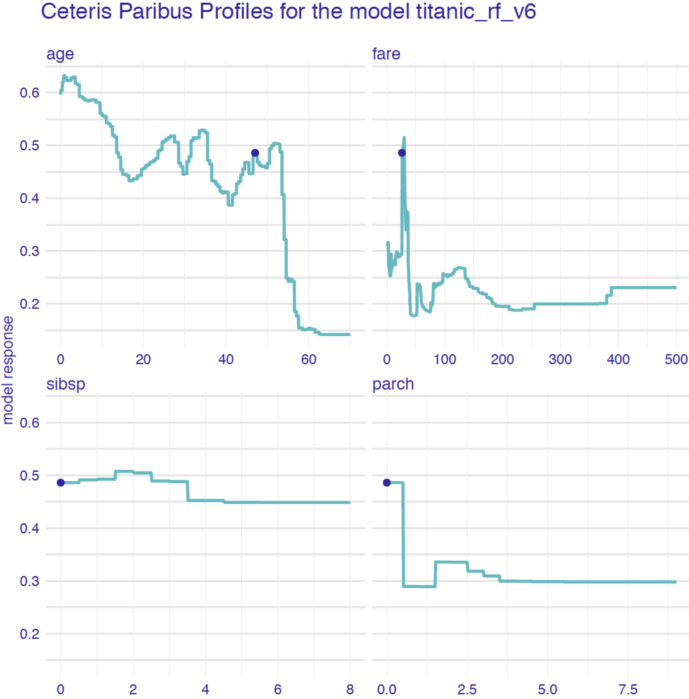

---
output:
  pdf_document: default
  html_document: default
---
# Ceteris Paribus Profiles - a tool for What-If analysis {#ceterisParibus}

## Introduction

*Ceteris paribus* is a Latin phrase meaning "other things held constant" or "all else unchanged." In this chapter, we introduce a technique for model exploration based on the Ceteris paribus principle. In particular, we examine the influence of each explanatory variable, asumming that effects of all other variables are unchanged. The main goal is to understand how changes in a single explanatory variable affects model predictions. 

Explainers presented in this chapter are linked to the second law introduced in Section \@ref(three-single-laws), i.e. the law of "Prediction's speculation." This is why the tools are also known as *What-If model analysis* or *Individual Conditional Expectations* [@ICEbox]. It turns out that it is easier to understand how a black-box model is working if we can explore the model by investigating the influence of explanatory variables separately, changing one at a time. 


## Intuition

Panel A of Figure \@ref(fig:modelResponseCurveLine) presents response (prediction) surface for the `titanic_lmr_v6` model for two explanatory variables, *age* and *class*, from the *titanic* dataset (see Section \@ref(TitanicDataset)). We are interested in the change of the model prediction induced by each of the variables. Toward this end, we may want to explore the curvature of the response surface around a single point with *age* equal to 47 and *class* equal to "1st," indicated in the plot. Ceteris-paribus (CP) profiles are one-dimensional profiles that examine the curvature across each dimension, i.e., for each variable. Panel B of Figure \@ref(fig:modelResponseCurveLine) presents the profiles corresponding to *age* and *class*. Note that, in the CP profile for *age*, the point of interest is indicated by the black dot. In essence, a CP profile shows a conditional expectation of the dependent variable (response) for the particular explanatory variable.  


```{r modelResponseCurveLine, echo=FALSE, fig.cap="(fig:modelResponseCurveLine) A) Model response (prediction) surface. Ceteris-paribus (CP) profiles marked with black curves help to understand the curvature of the surface while changing only a single explanatory variable. B) CP profiles for individual variables, age (continuous) and class (categorical).", out.width = '70%', fig.align='center'}
knitr::include_graphics("figure/profile_age_class.png")
```

CP technique is similar to the LIME method (see Chapter \@ref(LIME)). LIME and CP profiles examine the curvature of a model response-surface. The difference between these two methods lies in the fact that LIME approximates the black-box model of interest locally with a simpler white-box model. Usually, the LIME model is sparse, i.e., contains fewer variables, and thus we have got to graphically investigate a smaller number of dimensions. On the other hand, the CP profiles present conditional predictions for every variable and, in most cases, are easier to intepret. 

## Method

In this section we introduce more formally uni-dimensional CP profiles. <!-- We consider the case of a continuous dependent variable, but the profiles can be easily generalized for other types. -->

In predictive modeling we are interested a distribution of some target variable  $y$ given a vector containing values for explanatory covariates $x^*$. In the ideal world we would like to know the conditional distribution $Y | x^*$. Yet in practical applications we predict not the whole distribution but just some functions like expected value, some quantiles or variation. Without loss of generality we may assume that we model the expected value $E_Y(Y | x^*)$.

Our model $f(x^*)$ is some approximation of this value of interest $E_Y(Y | x^*) \approx f(x^*)$. Note, that we do not assume that it is a good model, nor taht the approximation is precise. Just treat $f(x^*)$ as *some* approximation of $E_Y(Y | x^*)$. We do not require the approximation to be "good" in any particular sense; we simply assume that we have got a model that is used to estimate the expected value and provide predictions of the dependent variable. Our interest lies in the evalution of the quality of the predictions. If the model offers a "good" approximation of the expected value, it should be reflected in its satisfactory predictive performance. 

We will use subscript $x^*_i$ to refer to the vector corresponding to the $i$-th observation in a dataset. We will use superscript $x^{*j}$ to refer to the $j$-th element of $x^*$, i.e., the $j$-th variable. Additionally, let $x^{*-j}$ denote a vector resultinig from removing the $j$-th element from vector $x^{*}$. Moreover, let $x^{*|j}=z$ denotes a vector in which the $j$-th element is equal to $z$ (a scalar). 

We define a one-dimensional CP profile for the model $f()$, $j$-th explanatory variable, and point $x^*$ as follows:

$$
CP^{f, j, x^*}(z) \equiv f(x^{*|j} = z).
$$
That is, CP profile is a function that provides the dependence of the (approximate) expected value (prediction) of the model for $Y$ on the value of $j$-th explanatory variable $z$, where $z$ is taken to go through the range of values typical for the variable and values of all other variables in $x^*$ are kept fixed at the values present in $x^*$. 

For continuous explanatory variables a natural way to represent the CP function is to use a profile plot similar to the ones presented in Figure \@ref(fig:profileAgeRf). In the figure, the dot on the curves marks an instance prediction, i.e., prediction $f(x^*)$ for a single observation $x^*$. The curve itself shows how the prediction would change if the value of a particular explanatory variable changed. Figure \@ref(fig:profileAgeRf) presents CP profiles for the *age* variable  in the logistic regression and random forest models for the Titanic dataset (see Section \@ref(HFDataset)). It is worth oberving that the profile for the logistic regression model is smooth, while for the random forest model it shows more variability. Moreover, for this instance (observation), the prediction would increase substantially if the value of the explanatory variable became lower than 20.

```{r profileAgeRf, echo=FALSE, fig.cap="(fig:profileAgeRf) Ceteris-paribus profiles for variable `age` for the logistic regression (`titanic_lmr_v6`) and random forest (`titanic_rf_v6` ) models that predict the probability of surviving based on the Titanic data", out.width = '70%', fig.align='center'}
knitr::include_graphics("figure/profile_age_rf.png")
```

For a categorical explanatory variable, a natural way to represent the CP function is to use a barplot similar to  the ones presented in Figure \@ref(fig:profileAgeRf2).

```{r profileAgeRf2, echo=FALSE, fig.cap="(fig:profileAgeRf2) Ceteris-paribus profiles for variable `class` for the logistic regression (`titanic_lmr_v6`) and random forest (`titanic_rf_v6` ) models that predict the probability of surviving based on the Titanic data", out.width = '70%', fig.align='center'}
knitr::include_graphics("figure/profile_class_rf.png")
```

Usually, black-box models contain a large number of explanatory variables. However, CP profiles are legible even for tiny subplots, created with techniques like sparklines or small multiples [@Tufte1986]. In this way we can display a large number of profiles at the same time keeping profiles for consecutive variables in separate panels, as shown in Figure \@ref(fig:profileV4Rf). It helps if these panels are ordered so that the most important profiles are listed first. We discuss a method to assess importance of CP profiles in the next chapter.

```{r profileV4Rf, echo=FALSE, fig.cap="(fig:profileV4Rf) Ceteris-paribus profiles for all continuous explanatory variables for the random forest (`titanic_rf_v6`) model for the `titanic` dataset", out.width = '70%', fig.align='center'}

```


## Pros and cons

One-dimensional CP profiles,as presented in this chapter, offer a uniform, easy to comunicate and extendable approach to model exploration. Their graphical representation is easy to understand and explain. It is possible to show profiles for many variables or models in a single plot.

There are several issues related to the use of the CP profiles. If explanatory variables are correlated, then changing one variable implies a change in the other. In such case, the application of the *Ceteris paribus* principle may lead to unrealistic settings, as it is not possible to keep one variable fixed while changing the other one. A special case are interactions, which require the use of two-dimensional CP profiles that are more complex than one-dimensional ones. Also, in case of a model with hundreds or thousands of variables, the number of plots to inspect may be daunting. Finally, while  barplots allow visualization of CP profiles for factors (categorical explanatory variables), their use becomes less trivial in case of factors with many nominal (unordered) categories (like, for example, a ZIP-code). 

## Code snippets for R

In this section we present key features of the R package `ingredients` [@ingredientsRPackage] which is a part of `DALEXverse` and covers all methods presented in this chapter. More details and examples can be found at `https://modeloriented.github.io/ingredients/`.

Note that there are also other R packages that offer similar functionality, like `condvis` [@JSSv081i05], `pdp` [@pdpRPackage], `ICEbox` [@ICEboxRPackage], `ALEPlot` [@ALEPlotRPackage], `iml` [@imlRPackage].

In this section we use the random forest [@R-randomForest] model `titanic_rf_v6` developed for the Titanic dataset (see Section \@ref(TitanicDataset)). In particular, we deal with a binary classification problem - we want to predict the probability of survival for a selected passenger.

```{r, warning=FALSE, message=FALSE, eval=FALSE}
library("DALEX")
library("randomForest")

titanic <- archivist::aread("pbiecek/models/27e5c")
titanic_rf_v6 <- archivist::aread("pbiecek/models/31570")
```

```{r, warning=FALSE, message=FALSE, echo=FALSE}
library("DALEX")
library("randomForest")
load("models/titanic_rf_v6.rda")
load("models/titanic.rda")
```

CP profiles are calculated in four steps with the `ingredients` package. 

**1. Create an explainer - wrapper around model and validation data.**

Model-objects created with different libraries may have different internal structures. Thus, first, we have got to create a wrapper around the model. Toward this end, we use the `explain()` function from the `DALEX` package [@R-DALEX]. The function requires five arguments: 

* `model` a model-object, 
* `data` a validation data frame, 
* `y` observed values of the dependent variable for the validation data, 
* `predict_function` a function that returns prediction scores, if not specified, then a default `predict()` function is used.
* `label` a function that returns prediction scores, if not specified then it is extracted from the `class(model)`. 

In the example below we use the training data as the validation dataset. 

```{r, warning=FALSE, message=FALSE}
explain_titanic_rf <- explain(model = titanic_rf_v6, 
                              data = titanic[,-9],
                              y = titanic$survived == "yes", 
                              label = "Random Forest v6")
```

**2. Define the instance (observation) of interest.** 

CP profiles explore model around a single observation. Thus, in the exampe below, we define data frame `johny_d` with a single row. It describes an 8-years old boy that travels in the first class without parents and siblings. Then, we obtain the model prediction for this instance with the help of the `predict()' function. In particular, we compute the probability for each category of the dependent binary variable. 

[TOMASZ: IN THE DATA CHAPTER WE HAD DATA FRAME HENRY. SHOULD NOT WE RE-USE IT HERE?]

```{r, warning=FALSE, message=FALSE}
johny_d <- data.frame(
  class = factor("1st", levels = c("1st", "2nd", "3rd", "deck crew", "engineering crew", 
                                  "restaurant staff", "victualling crew")),
  gender = factor("male", levels = c("female", "male")),
  age = 8,
  sibsp = 0,
  parch = 0,
  fare = 72,
  embarked = factor("Southampton", levels = c("Belfast", "Cherbourg", "Queenstown", "Southampton"))
)

predict(explain_titanic_rf, johny_d)
```

**3. Calculate CP profiles**

To obtain CP profiles, we use the `ceteris_paribus()` function. It requires the explainer-object and the instance data frame as arguments. By default, CP profiles are calculated for all numerical variables. To select a subset of variables, the `variables` argument can be used. 

As a result, the function yields an object od the class `ceteris_paribus_explainer`. It is a data frame with model predictions.

```{r, warning=FALSE, message=FALSE}
library("ingredients")
cp_titanic_rf <- ceteris_paribus(explain_titanic_rf, johny_d, 
                            variables = c("age", "fare", "class", "gender"))
cp_titanic_rf
```

**4. Plot CP profiles.**

To obtain a graphical represenation of CP profiles, the generic `plot()` function can be applied to the data frame returend by the `ceteris_paribus()` function. It returns a `ggplot2` object that can be processed if needed. 

The resulting plot can be enriched with additional data by applying functions `show_rugs` (adds rugs for the selected points), `show_observations` (adds observations), or `show_aggreagated_profiles` (see Chapter  \@ref(variableEngeneering)). All these functions can take additional arguments to modify size, color, or linetype.

```{r titanicCeterisProfile01, warning=FALSE, message=FALSE, echo=FALSE, fig.width=7, fig.height=4, fig.cap="Ceteris Paribus Profiles for the random forest model `titanic_rf_v6`.", out.width = '70%', fig.align='center'}
library("ggplot2")
plot(cp_titanic_rf) +
  show_observations(cp_titanic_rf, variables = c("age", "fare")) +
  ggtitle("Ceteris Paribus Profiles", "For the random forest model and titanic dataset")
```

