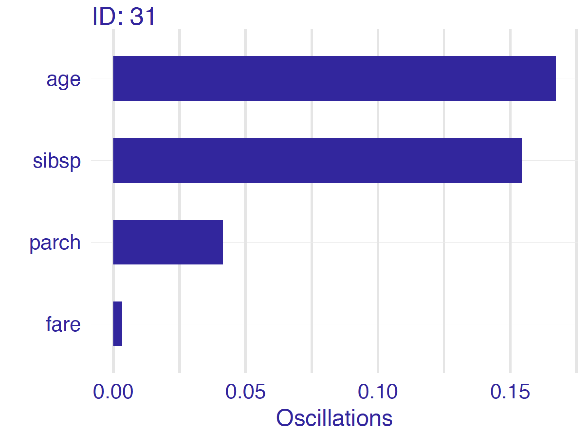

---
output:
  pdf_document: default
  html_document: default
---
# Ceteris-paribus Oscillations - a Tool for Local Variable-importance  {#ceterisParibusOscillations}

## Introduction {#CPOscIntro}

Visual examination of Ceteris-paribus (CP) profiles is insightful, but for a model with a large number of explanatory variables we may end up with a large number of plots which may be overwhelming. To prioritize between the profiles we need a measure that would summarize the impact of a selected variable on model's predictions. In this chapter we describe a solution closely linked with CP profiles. An alternative is also discussed in the Chapter XXX [TOMASZ: PROVIDE LINK].

## Intuition {#CPOscIntuition}

To assign importance to CP profiles, we can use the concept of profile oscillations. In particular, the larger influence of an explanatory variable on prediction at a particular instance, the larger the fluctuations along the corresponding CP profile. For a variable that exercises little or no influence on model prediction, the profile will be flat or will barely change. Figure \@ref(fig:CPVIPprofiles) illustrates the idea behind measuring oscillations. The figure corresponds to the CP profiles presented in Figure \@ref(fig:profileV4Rf). [TOMASZ: IN CHAPTER ON CP-PROFILES WE USED A FIGURE FOR THE RF MODEL. IT MIGHT BE WORTH TO USE CONSISTENTLY PICTURES FOR THE SAME MODEL TO BE ABLE TO LINK THE CONCEPTS. MOREOVER: SHOULD WE NOT USE "HENRY" AS THE EXAMPLE?] The larger the highlighted area, the more important is the variable.

```{r CPVIPprofiles, echo=FALSE, fig.cap="(fig:CPVIPprofiles) The value of the colored area summarizes the CP oscillations and provides the mean of the absolute deviations between the CP profile and the instance prediction. Example for the `titanic_lmr_v6` model.", out.width = '70%', fig.align='center'}
knitr::include_graphics("figure/oscillations_all_lmr.png")
```

## Method {#CPOscMethod}

Let us formalize this concept now. Denote by $g^j(z)$ the probability density function of the distribution of the $j$-th explanatory variable. The summary measure of the variable's importance for model prediction at point $x$, $vip^{CP}_j(x)$, computed based on the variable's CP profile, is defined as follows: 

$$
vip^{CP}_j(x^*) = \int_{\mathcal R} |CP^{f,j,x^*}(z) - f(x^*)| g^j(z)dz=E_{X_j}[|CP^{f,j,x^*}(X_j) - f(x^*)|].
$$
Thus, $vip^{CP}_j(x^*)$ is the expected absolute deviation of the CP profile from the model prediction for $x^*$ over the distribution of the $j$-th explanatory variable. A straightforward estimator of $vip^{CP}_j(x^*)$ is

$$
\widehat{ vip^{CP}_j(x^*)} = \frac 1n \sum_{i=1}^n |CP^{f,j,x^*}(x^{*j}_i) - f(x^*)|,
$$
where index $i$ goes through all observations in a dataset. 

Note that the importance of an explanatory variable for instance prediction may be very different for different points $x^*$. For example, consider model 
$$
f(x_1, x_2) = x_1 * x_2,
$$
where $x_1$ and $x_2$ take values in $[0,1]$. Consider prediction for an observation described by vector $x^* = (0,1)$. In that case, the importance of $X_1$ is larger than $X_2$. This is because the CP profile for the first variable, given by the values of function $f(z,1)=z$, will have oscillations, while the profile for the second variable will show no oscillation, because it is given by function $f(0,z)=0$. Obviously, the situation is reversed for $x^*=(1,0)$. 

## Example: Titanic data {#CPOscExample}

Figure \@ref(fig:CPVIP1) provides a plot of variable importance measures for different continuous explanatory variables for the logistic regression model (`titanic_lmr_v6`) for observation 31. [TOMASZ: SHOULD WE NOT USE "HENRY" AS THE EXAMPLE?] The wider the interval, the larger the CP-profile oscillations for a particular explanatory variable. Thus, Figure \@ref(fig:CPVIP1) indicates that the most important variable for prediction for the selected observation is `age`, followed by `sibsp`. [TOMASZ: WHY NO MEASURES FOR FACTORS?] 

```{r CPVIP1, echo=FALSE, fig.cap="(fig:CPVIP1) Variable-importance measures calculated for Ceteris-paribus oscillations for observation ID: 31 based on the `titanic_lmr_v6` model", out.width = '50%', fig.align='center'}

```

## Pros and cons {#CPOscProsCons}

Oscillations of CP profiels are easy to interpret and understand. By using the average of oscillations it is possible to select the most important variables for instance prediction. The methodology can easily be extended to two or more variables. 

There are several issues related to the use of the CP oscillations. For instance, the oscillations may not be of help in situations when the use of CP profiles may itself be problematic (e.g., in the case of correlated explanatory variables or interactions - see Section \@ref(CPProsCons)). An important issue is that the local variable importances do not sum up to the instance prediction for which they are calculated. In Chapter XXX we will introduce measures that address this problem.

## Code snippets for R {#CPOscR}

In this section, we present key features of the R package `ingredients` [@ingredientsRPackage], which is a part of `DALEXverse` and covers all methods presented in this chapter. More details and examples can be found at `https://modeloriented.github.io/ingredients/`.

As an example, we use the random forest [@R-randomForest] model `titanic_rf_v6` developed for the Titanic dataset (see Section \@ref(TitanicDataset)). In particular, we deal with a binary classification problem - we want to predict the probability of survival for a selected passenger.

```{r, warning=FALSE, message=FALSE, eval=FALSE}
titanic <- archivist::aread("pbiecek/models/27e5c")
titanic_rf_v6 <- archivist::aread("pbiecek/models/31570")
```

```{r, warning=FALSE, message=FALSE, echo=FALSE}
load("models/titanic_rf_v6.rda")
load("models/titanic.rda")
```

First, we have got to create a wrapper around the model (see Section \@ref(CPR)). 

```{r, warning=FALSE, message=FALSE}
library("DALEX")
library("randomForest")

explain_titanic_rf <- explain(model = titanic_rf_v6, 
                              data = titanic[, -9],
                              y = titanic$survived == "yes", 
                              label = "Random Forest v7")
```

Moreover, to calculate oscillations, we have got to calculate CP profiles for the selected observation. Let us use  `henry` as the instance prediction of interest.

[TOMASZ: WHY NOT USING THE PRE-DEFINED DATA FRAME?]

```{r, warning=FALSE, message=FALSE}
henry <- data.frame(
  class = factor("1st", levels = c("1st", "2nd", "3rd", "deck crew", "engineering crew", 
                                  "restaurant staff", "victualling crew")),
  gender = factor("male", levels = c("female", "male")),
  age = 8,
  sibsp = 0,
  parch = 0,
  fare = 72,
  embarked = factor("Southampton", levels = c("Belfast", "Cherbourg", "Queenstown", "Southampton"))
)
```

CP profiles are calculated by applying the `ceteris_paribus()` function to the wrapper object.

```{r titanicCeterisProfile02, warning=FALSE, message=FALSE, echo=FALSE, fig.width=7, fig.height=7, fig.cap="Ceteris-paribus profiles for the random forest model `titanic_rf_v6` and Henry.", out.width = '70%', fig.align='center'}
library("ingredients")
library("ggplot2")

cp_titanic_rf <- ceteris_paribus(explain_titanic_rf, henry, 
                            variables = c("age", "fare", "sibsp", "parch"))

plot(cp_titanic_rf) +
  show_observations(cp_titanic_rf, variables = c("age", "fare", "sibsp", "parch")) +
  ggtitle("Ceteris-paribus Profiles", "For the random forest, Titanic dataset, and Henry")
```

For the selected profiles, we calculate the average oscillations with the help of the `calculate_oscillations()` function. [TOMASZ: NO FACTORS?]

```{r, warning=FALSE, message=FALSE, fig.width=5, fig.height=3}
cpo_titanic_rf <- calculate_oscillations(cp_titanic_rf)
cpo_titanic_rf$`_ids_` = "Henry"
cpo_titanic_rf
```

The `calculate_oscillations()` function returns an object of class `ceteris_paribus_oscillations`, which has a form of a data frame, but has also an overloaded `plot()` function. We can use the latter function to plot the local variable-importance measures for the instance of interest.

```{r, warning=FALSE, message=FALSE, fig.width=5, fig.height=3}
plot(cpo_titanic_rf) +
  ggtitle("Ceteris Paribus Oscillations",
          "For model_titanic_rf")
```

It looks like that, for the prediction of probability of surviving of Henry, the two most important explanatory variables are `age` and `parch`. If Henry were older, this would significantly lower the chances of survival. One the other hand, Henry were not travelling alone, this would increase these chances. [TOMASZ: HOW CAN THHIS BE SEEN FROM THE PLOT? BARS FOR BOTH AGE AND PARCH ARE POSITIVE, AND YET THEIR INTERPRETATION GOES IN DIFFERENT DIRECTIONS?]
 
