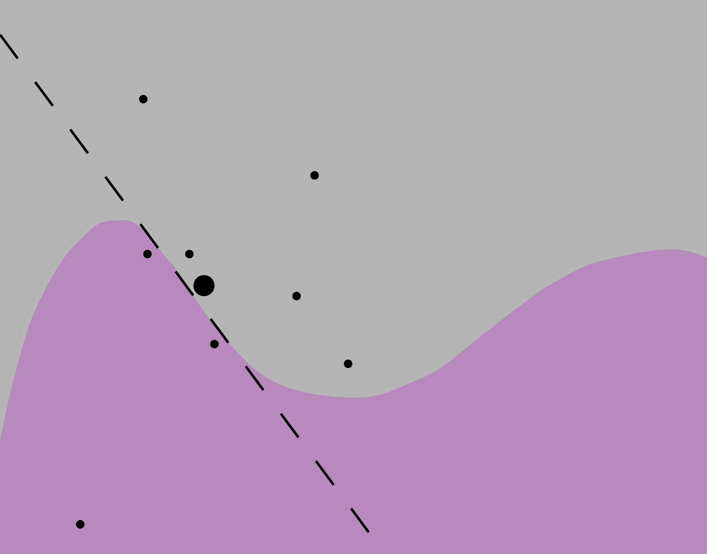

# Local Interpretable Model-Agnostic Explanations (LIME) {#LIME}

## Introduction

Ceteris Paribus profiles introduced in the Chapter \@ref(ceterisParibus) work best for models with small number of interpretable features. In this case it makes sense to explore feature by feature and analyze how a single feature affects model predictions

Break Down and Shapley attributions introduced in the Chapter \@ref(breakDown) work best for small and moderate number of features. These attributions are not as detailed as Ceteris Paribus profiles, but can handle more variables that are presented by narrow bars.

Both these approaches are not well suited for high-dimensional data. For instance in bioinformatics when working with gene expression, mutations or methylation it is not uncommon to have thousands or even million of features. If most of them are binary low/high, present/absent, wild/mutated then Ceteris Paribus and Break Down plots become unreadable. In such cases an useful alternatives are sparse explainers. The most popular example of such explainers is LIME and its modifications.

The LIME method was originally proposed in the paper *Why Should I Trust You?: Explaining the Predictions of Any Classifier* [@lime]. The acronym stands for Local Interpretable Model-Agnostic Explanations. The key idea behind this method is to locally approximate a black-box model by a sparse local glass-box surrogate model, which is easier to interpret.


## Intuition

The intuition behind LIME is presented in Figure \@ref(fig:limeEx). We want to understand a complex black-box model around a single instance. Here the black box model is a binary classifier and colored areas in the plot correspond to its decision regions. We are interested in instance explanation, and the instance of interest is marked with large black dot. Having some artificial dataset around this black dot we can train a glass-box model that will locally approximate the black-box model. The glass-box model may then serves as local explainer for the complex model.

We may select different classes of glass-box models, e.g. linear models. The important part is to keep it sparse and low-dimensions, this way the surrogate model is easier to explain. The most typical choices for glass-box models are regularized linear models like LASSO regression or decision trees. 

```{r limeEx, echo=FALSE, fig.cap="(fig:limeEx) A schematic idea behind local model approximations. Colors stand for decision regions for black-box model. We want to explain model decision for the largest black point. To do this we create artificial points around point of interest and train a glass-box model. Here it's a logistic regression presented as a dashed line.", out.width = '70%', fig.align='center'}

```

## Method

The objective is to find a local model $M_{*}$ that approximates a black box model $f$ around the point of interest $x_*$.
This intuition can be formalized in a following formula

$$
M(x_{*}) = \arg \min_{g \in G} L(f, g, \Pi_{x_*}) + \Omega (g). 
$$
For a selected instance $x_*$ we are looking for a local model $g$ from the class $G$ of interpretable models. The model shall be simple so we add penalty for the model complexity measured as $\Omega(g)$. And the white-box model $g$ shall approximate well the black-box model $f$ locally, where locality is defined by neighborhood $\Pi_{x_*}$ of $x^*$. The $L$ stands for some goodness of fit measure like for example likelihood.

Note that functions $f$ and $g$ may work on different data representations. The black-box $f(x):\mathcal X \rightarrow \mathcal R$ works on original feature space $\mathcal X$ while the glass-box function $g:\mathcal X' \rightarrow \mathcal R$ usually works on an interpretable feature space $\mathcal X'$, which is in many applications smaller. We will present some examples for $\mathcal X'$ in the next section, but for now let's just assume that function $h$ transforms $\mathcal X$ on $\mathcal X'$.

Let's limit the class $G$ of interpretable models to sparse linear models. Following algorithm may be used to find an interpretable surrogate model that selects $K$ most important interpretable features. 

```
Input: N - length of sample for surrogate model
Input: K - length of explanation
1. Let x' = h(x) be an interpretable version of x
2. for i in 1...N {
3.   z'[i] <- sample_around(x')
4.   y'[i] <- f(z[i]) # prediction for a new observation
5.   w'[i] <- similarity(x, z[i])
6. }
7. return K-LASSO(y', x', w')
```

Where $K-LASSO(y', x', w')$ stands for weighted LASSO linear regression that selects $K$ most important features based on new dataset $(y', x')$ weighted with $w'$. This algorithm selects $K$ most important interpretable features.

As it is presented in the paper [@lime], the LIME method has following properties: 

- *model-agnostic*, they do not imply any assumptions on model structure, $f$ can be any function, 
- *interpretable representation*, model input is transformed into a feature space that is easier to understand. One of applications comes from image data, single pixels are not easy to interpret, thus the LIME method decompose image into a series of super pixels, that are easier to interpret to humans,
- *local fidelity* means that the explanations shall be locally well fitted to the black-box model.


Where it comes to the implementation of this idea there are at least three important steps, which will be presented in consecutive subsections.

### Interpretable data representation

It is important to remember that functions $f$ and $g$ may work on different data representations. 

For example, let's consider a VGG16 neural network trained for ImageNet data. Such network takes an image of the size 244x244 pixels as an input and predicts an image category out of 1000 classes. The original input space is 3x244x244 = 178608 dimensional as single dimensional is a single color channel for a single pixel. Explanations in such input space would be hard to interpret. Instead, the input space is transformed into superpixels - binary features that can be turned on or off. Figure \@ref(fig:duckHorse06) shows an example 100 superpixels created for some ambiguous picture.

In this case the black box model $f$ works on $\mathcal X$ which is $\mathcal R^{178608}$ while $g$ works on interpretable binary space of 100 superpixels $\mathcal X' = [0,1]^{100}$.

Superpixels are frequent choices for image data. For text data words are frequently used as interpretable features. For tabular data sometimes continuous features are discretized.

```{r duckHorse06, echo=FALSE, fig.cap="(fig:duckHorse06) The left panel shows an ambiguous picture, half horse and hals duck. The right panel shows 100 superpixes identified for this figure.", out.width = '100%', fig.align='center'}
knitr::include_graphics("figure/duck_horse_06.png")
```


### Sampling around point of interest

In order to fit surrogate local model $g$ we need new data points around point of interest. It is not enough to sample points from original dataset, because in very highdimensional space the input dataset is very sparse and points are ,,far'' from each other. 

This is why the training data for surrogate model is created through some perturbations of the point of interest. 

For binary interpretable input space the common choice is to sample subset of features (i.e. new datapoints are the point of interest with some random number of features switched to 0). 

For nonbinary features various propositions are introduced in different papers. 

In our example with the duck-horse samples around the image are subsets of superpixels.

### Fitting a glass-box model

Once the new data are sampled around the point of interest we are ready to create an interpretable model $g$ from class $G$. 

The most common choices for $G$ are linear models (for regression) or generalized linear models (for classification). In order to get sparse models the LASSO or similar regularisation/feature selection is used. An alternative choice is classification and regression trees.

In our example we are using $K-LASSO$ method which selects $K$ super pixels that are the most influential when it comes to model prediction. In the Figure \@ref(fig:duckHorse04) we present explanations for the top 2 classes selected by the model VGG16. For each class the top $K$ superpixels / interpretabble features are highlighted

Interesting to see that the superpixel that shows the nib is influential when it comes to prediction *'goose'* and superpixels linked with white fur are linked with prediction *'standard poodle'*.

```{r duckHorse04, echo=FALSE, fig.cap="(fig:duckHorse04) LIME explanations for two classess identified by the VGG16 network with ImageNet weights.", out.width = '100%', fig.align='center'}
knitr::include_graphics("figure/duck_horse_04.png")
```


## Example: Titanic

Let us again consider explanation for prediction of the `titanic_rf_v6` model for *Johny D*, an 8-years old boy from 1st class. 

In Figure \@ref(fig:LIMEexample01) we have presented explanations generated with the LIME method. Three variables were identified as the most influential, age, gender and class.

```{r LIMEexample01, warning=FALSE, message=FALSE, echo=FALSE, fig.cap="(fig:LIMEexample01) LIME explanations for single instance Johny D and generated for Random Forest v6 model.", out.width = '60%', fig.align='center'}
knitr::include_graphics("figure/LIMEexample01.png")
```

It is important here to mention how interpretable features are created. For tabular data the most common approach is to discretized continuous variables and combine levels in categorical variables.

Figure \@ref(fig:LIMEexample02) shows how interpretable feature can be extracted from Ceteris Paribus Profile for the variable `age`. 

```{r LIMEexample02, warning=FALSE, message=FALSE, echo=FALSE, fig.cap="(fig:LIMEexample02) Interpretable local feature generated for age variable. LIME explanations for single instance Johny D and generated for Random Forest v6 model ", out.width = '60%', fig.align='center'}
knitr::include_graphics("figure/LIMEexample02.png")
```

Different implementations of the LIME method have different algorithms for extraction of interpretable features, different methods for sampling and different methods for weighting. 

In the section *Code snippets for R* we present different available implementations.


```{r, warning=FALSE, message=FALSE, echo=FALSE, eval=FALSE}
load("models/explain_rf_v6.rda")
load("models/titanic.rda")
load("models/henry.rda")
library("localModel")
library("DALEX")
library("ggplot2")
library("randomForest")

localModel_lok <- individual_surrogate_model(explain_rf_v6, johny_d,
                                        size = 5000, seed = 1313)
localModel_lok
plot(localModel_lok) + facet_null() + ggtitle("localModel explanations for Johny D","Random Forest v6") + theme_drwhy_vertical()
plot_interpretable_feature(localModel_lok, "age") + ggtitle("Interpretable representation for age","Random Forest v6" ) + xlab("age") + ylab("model response")

```

## Pros and cons

Local approximations are model agnostic, can be applied to any predictive model. Below we summarize key strengths and weaknesses of this approach.

**Pros**

* This method is highly adopted in text analysis and image analysis, in part thanks to the interpretable data representations. 
* The intuition behind the method is straightforward, fit simple model to approximate a complex model.
* Model explanations are sparse, thus only small number of features are in the surrogate models used what makes it easier to explain.
* The LIME method can be applied to high dimensional models.

**Cons**

* For continuous variables and tabular data it is not that easy to find interpretable representations. IMHO this problem is not solved yet.
* The black-box model approximated the data and the glass-box model approximates the black box model. We do not have control over the quality of local fit of the glass-box model, thus the surrogate model may be misleading.
* Due to the *curse of dimensionality*, for high dimensional space points are sparse. Measuring of being local is tricky.


## Code snippets for R

The LIME methods and it's clones are now implemented in various R and python packages, see for example `lime` [@R-lime] which is a port of LIME python library [@shapPackage], `live` [@R-live] and `localModel` [@localModelPackage] and `iml` [@imlRPackage]. 

These packages are different in a way how they turn continuous variables into interpretable features. For example, package `lime` performs global discretization using quartiles, `localModel` performs local discretization using Ceteris Paribus profiles, while `live` and `iml` works directly on continuous variables.
Also they differ in terms of which surrogate models they use and how new instances are being sampled. For these reasons these packages results different explanations.

Below we present explanations returned for these four methods for the Johny D and `titanic_rf_v6` model.

```{r, warning=FALSE, message=FALSE, eval=FALSE}
library("DALEX")
library("randomForest")

titanic <- archivist::aread("pbiecek/models/27e5c")
titanic_rf_v6 <- archivist::aread("pbiecek/models/31570")
johny_d <- archivist::aread("pbiecek/models/e3596")
```

### **The lime package**

An example code snippet for the `lime` package is presented below. Key parts are function `lime::lime` which creates an explainer and `lime::explain` which evaluates explanations.

Resulting explanations are presented in Figure \@ref(fig:limeExplLIMETitanic).

For continuous variables `lime` package discretizes features by using quartiles. This is why in the explanation we have `age < 22`. 

```{r, warning=FALSE, message=FALSE, eval=FALSE}
library("lime")
model_type.randomForest <- function(x, ...) "classification"
lime_rf <- lime(titanic[,colnames(johny_d)], titanic_rf_v6)
lime_expl <- lime::explain(johny_d, lime_rf, labels = "yes", n_features = 4, n_permutations = 1000)
lime_expl

#      model_type case label label_prob  model_r2 model_intercept model_prediction
#1 classification    1    no      0.602 0.5806297       0.5365448        0.5805939
#2 classification    1    no      0.602 0.5806297       0.5365448        0.5805939
#3 classification    1    no      0.602 0.5806297       0.5365448        0.5805939
#4 classification    1    no      0.602 0.5806297       0.5365448        0.5805939
#  feature feature_value feature_weight  feature_desc                 data   prediction
#1    fare            72     0.00640936  21.00 < fare 1, 2, 8, 0, 0, 72, 4 0.602, 0.398
#2  gender             2     0.30481181 gender = male 1, 2, 8, 0, 0, 72, 4 0.602, 0.398
#3   class             1    -0.16690730   class = 1st 1, 2, 8, 0, 0, 72, 4 0.602, 0.398
#4     age             8    -0.10026475     age <= 22 1, 2, 8, 0, 0, 72, 4 0.602, 0.398

plot_features(lime_expl)
```

```{r limeExplLIMETitanic, echo=FALSE, fig.cap="(fig:limeExplLIMETitanic) Explanations for Johny D generated by the lime package. ", out.width = '60%', fig.align='center'}
knitr::include_graphics("figure/lime_expl_lime_titanic.png")
```

### **The localModel package**

An example code snippet for the `localModel` package is presented below. Key parts are function `DALEX::explain` which creates an explainer and `individual_surrogate_model` which fits a local model.

Resulting explanations are presented in Figure \@ref(fig:limeExplLocalModelTitanic).

For continuous variables `localModel` package discretizes features by using local Ceteris Paribus Profiles. This is why in the explanation we have `age < 15`. As we show in the Ceteris Paribus Chapter \@ref(ceterisParibus) the largest drop in survival is observed around 15 years old boys. 

```{r, warning=FALSE, message=FALSE, eval=FALSE}
library("localModel")

localModel_rf <- DALEX::explain(model = titanic_rf_v6,
                     data = titanic[,colnames(johny_d)])
localModel_lok <- individual_surrogate_model(localModel_rf, johny_d,
                                        size = 1000, seed = 1313)
localModel_lok
#   estimated                    variable dev_ratio response
#1 0.23479837                (Model mean) 0.6521442         
#2 0.14483341                 (Intercept) 0.6521442         
#3 0.08081853 class = 1st, 2nd, deck crew 0.6521442         
#4 0.00000000     gender = female, NA, NA 0.6521442         
#5 0.23282293                age <= 15.36 0.6521442         
#6 0.02338929                fare > 31.05 0.6521442    
plot(localModel_lok)
```


```{r limeExplLocalModelTitanic, echo=FALSE, fig.cap="(fig:limeExplLocalModelTitanic) Explanations for Johny D generated by the localModel package. ", out.width = '60%', fig.align='center'}
knitr::include_graphics("figure/lime_expl_localModel_titanic.png")
```

### **The iml package**

An example code snippet for the `iml` package is presented below. Key parts are function `Predictor$new` which creates an explainer and `LocalModel$new` which fits local model.

Resulting explanations are presented in Figure \@ref(fig:limeExplIMLTitanic).

For continuous variables like `age` the `iml` package approximates this feature without any discretization. As we showed in the Ceteris Paribus Chapter \@ref(ceterisParibus), the profile for age is constant in the interval 0-15, this is why here age is not an important feature. 


```{r, warning=FALSE, message=FALSE, eval=FALSE}
library("iml")
iml_rf = Predictor$new(titanic_rf_v6, data = titanic[,colnames(johny_d)])
iml_glass_box = LocalModel$new(iml_rf, x.interest = johny_d, k = 6)
iml_glass_box
#Interpretation method:  LocalModel 
#
#Analysed predictor: 
#Prediction task: unknown 
#
#Analysed data:
#Sampling from data.frame with 2207 rows and 7 columns.
#
#Head of results:
#          beta x.recoded     effect  x.original              feature
#1 -0.158368701         1 -0.1583687         1st            class=1st
#2  1.739826204         1  1.7398262        male          gender=male
#3  0.018515945         0  0.0000000           0                sibsp
#4 -0.001484918        72 -0.1069141          72                 fare
#5  0.131819869         1  0.1318199 Southampton embarked=Southampton
#6  0.158368701         1  0.1583687         1st            class=1st

plot(iml_glass_box) 
```

```{r limeExplIMLTitanic, echo=FALSE, fig.cap="(fig:limeExplIMLTitanic) Explanations for Johny D generated by the iml package. ", out.width = '60%', fig.align='center'}
knitr::include_graphics("figure/lime_expl_iml_titanic.png")
```


