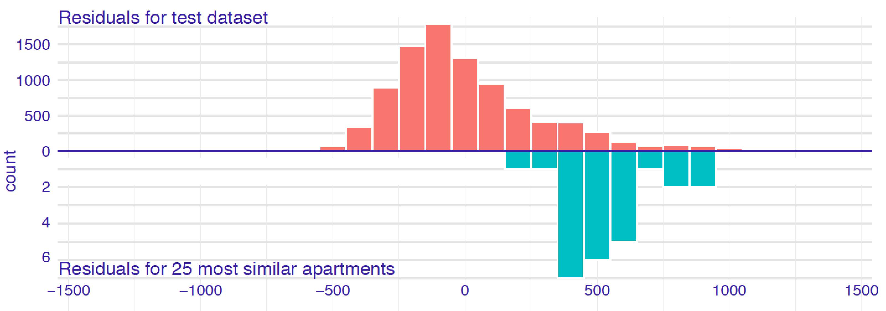
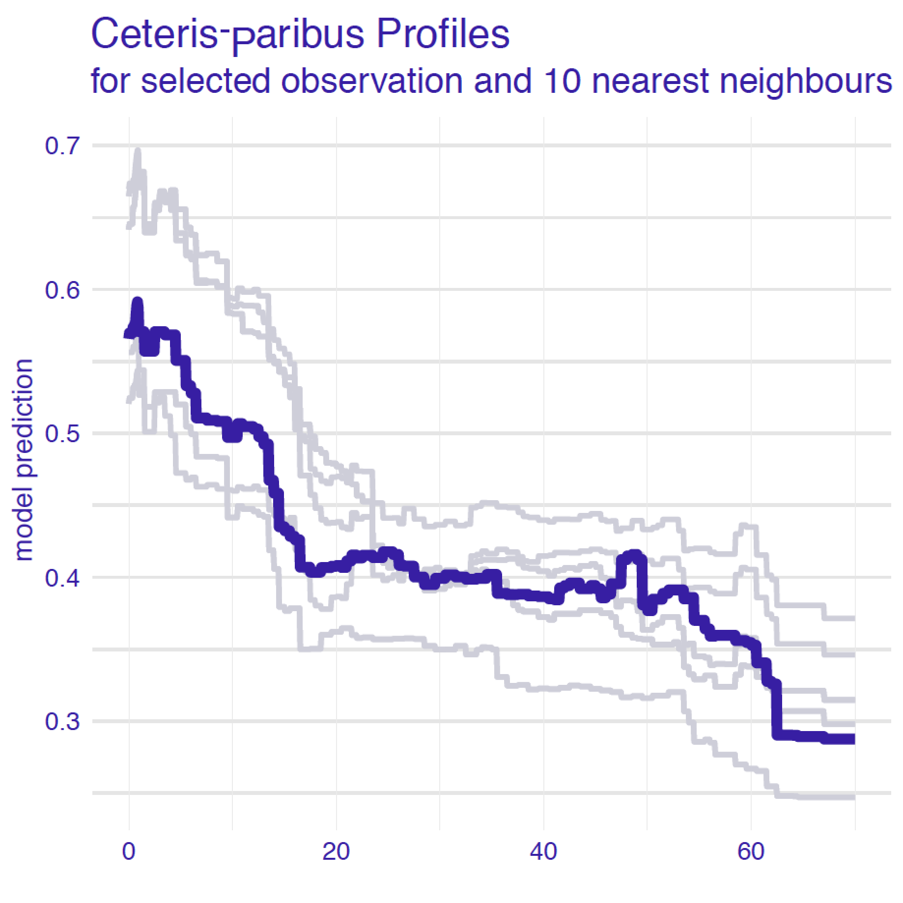
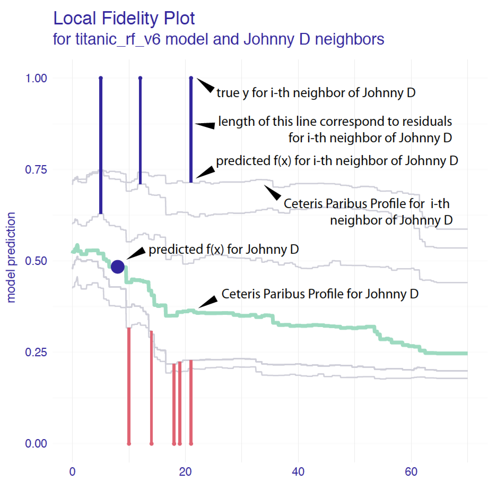

#  Local Diagnostics Plots {#localDiagnostics}

## Introduction {#cPLocDiagIntro}

It may happen that, while the global predictive performance of a model is good, the model predictions for some observations are very misfitted. We often say that the model does not cover well some areas of the input space.

For example, a model calibrated for typical patients in a certain hospital may not do well with exceptionally young patients. Or a model calibrated for the credit risk of spring holiday consumer loans may not work well on a group of autumn loans for Christmas holiday gifts. 
For this reason, we should not be satisfied with global measures of model performance. For important decisions, it is good to check how the model behaves for observations similar to the instance of interest.

In this chapter, we present two local-diagnostics techniques that address this issue, namely, *local fidelity plots* that show local performance around observation of interest and *local stability plots* that show the local stability around observation of interest. 

The general idea behind fidelity plots is to select a number of observations ("neighbors") from the validation dataset that are closest to the instance (observation) of interest. Then, for the selected observations, we plot CP profiles and check how stable they are. Additionally, if we know true values of the dependent variable for the selected neighbors, we may add residuals to the plot to evaluate the local fit of the model.

## Intuition {#cPLocDiagIntuition}

Assume that we have identified a set of observations from the training data similar in terms of dependent variables to the observation of interest.
The basic idea behind local fidelity plots is to compare distribution of residuals for these similar cases against distribution of all residuals. 

Figure \@ref(fig:profileBack2BackHist) presents histograms of residuals for the entire dataset and the selected neighbors for the random forest model for the Apartments dataset (Section \@ref(model-Apartments-rf)). The distribution of residuals for the entire dataset is rather symmetric and centered around 0, suggesting a reasonable average performance of the model. On the other hand, the residuals for the selected neighbors are centered around the value of 500. This suggests that for the apartment of interest around this apartment the model is biased towards values smaller than observed (residuals are positive, so on average $y$ is higher than $\hat y$, see \@ref(eq:modelResiduals)).

(ref:profileBack2BackHistDesc) Histograms of residuals for the `apartments_rf_v5` model for the Apartments dataset. Upper panel: residuals calculated for all observations from the dataset. Bottom panel: residuals calculated for 25 nearest neighbors of the instance of interest.

```{r profileBack2BackHist, echo=FALSE, fig.cap='(ref:profileBack2BackHistDesc)', out.width = '80%', fig.align='center'}

```


Another approach to local model diagnostics is to examine how stable is model behaviour around the observation of interest.
 Figure \@ref(fig:profileWith10NN) presents CP profiles for variable `age` for the instance of interest and its 10 nearest neighbors for the random forest model for the Titanic dataset (Section \@ref(model-titanic-rf)). The profiles are almost parallel and very close to each other. This suggests that model predictions are stable around the instance of interest, because small changes in the explanatory variables (represented by the nearest neighbors) have not got much influence on the predictions.

(ref:profileWith10NNDesc) Ceteris-paribus profiles for a selected instance (dark violet line) and 10 nearest neighbors (light grey lines) for the `titanic_rf_b6` model. The profiles are almost parallel and close to each other what suggests the stability of the model.

```{r profileWith10NN, echo=FALSE, fig.cap='(ref:profileWith10NNDesc)', out.width = '50%', fig.align='center'}

```

Of course CP profiles for different variables may be very different so a natural question arises which variables shall we examine. The most natural choice is to explore the most important variables according to results from the Break Down, SHAP, LIME od CP Oscillations methods.


## Method {#cPLocDiagMethod}

The proposed method is based on three steps:

* first, we need to select observations nearest to the observation of interest,
* for fidelity analysis we need to calculate and compare residuals for the neighbors.
* for stability analysis we need to calculate and visualize CP  profiles for the selected neighbors.

In what follows we discuss each of the elements in more detail.

### Nearest neighbors {#cPLocDiagNeighbors}

There are two important questions related to the selection of the neighbors "nearest" to the instance (observation) of interest:

* How many neighbors should we choose?
* What metric should be used to measure the "proximity" of observations?

The answer to both questions is *it depends*. 

* The smaller the number of neighbors, the more local is the analysis. However, a very small number will lead to a larger variability of the results. In many cases we found that 20 neighbors works fine. However, one should always take into account computational time (smaller number of neighbors results in quicker calculations) and the size of the dataset (for a small dataset, smaller sets of neighbors may be preferred). 
* The metric is very important. The more explanatory variables, the more important is the choice. In particular, the metric should be capable of accommodating variables of different nature (categorical, continuous). Our default choice is the Gower similarity measure:
$$
d_{gower}(x_i, x_j) = \frac 1p \sum_{k=1}^p d^k(x_i^k, x_j^k),
$$
where $x_i$ is a $p$-dimensional vector of explanatory covariates for the $i$-th observation and $d^k(x_i^k,x_j^k)$ is the distance between values of the $k$-th variable for the $i$-th and $j$-th observations. Note that $d^k()$ depends on the nature of the variable. For instance, for a continuous variable it is equal to  $|x_i^k-x_j^k|/\{max(x_1^k,\ldots,x_n^k)-min(x_1^k,\ldots,x_n^k)\}$, i.e., the absolute difference scaled by the observed range of the variable. On the other hand, for a categorical variable, it is simply $I(x_i^k = x_j^k)$, where $I()$ is the indicator function. Note that $p$ may be equal to the number of all explanatory variables included in the model, or only a subset of them. An advantage of Gower similarity measure is that it "deals" with heterogeneous vectors with both categorical and continuous variables.
The disadvantage of Gower similarity measure is that it does not take into account neither variable correlation nor variable importance. For high dimensional setting an interesting alternative would be the proximity measure in Random Forest [@randomForestBreiman]. It takes into account variable importance but requires a fitted Random Forest model.

Once we have decided on the number of neighbors, we can use the chosen metric to select the required number observations "closest" to the one of interest.

### Local-fidelity plot {#cPLocDiagLFplot}

Figure \@ref(fig:profileBack2BackHist) illustrates two distribution of residuals, for the whole dataset and for neighbours of the observation of interest.

For a typical observation these two distributions shall be similar. An alarming situation would be if the residuals for neighbours will be shifted towards the extremely positive of negative values. 

Apart from visual examination we may also use some statistical tests that compares these two distributions. Since we cannot assume any distribution for residuals we can use a nonparametric test like Wilcoxon test or Kolmogorov-Smirnov test. 

[TODO: maybe we need a better test for the stochastic dominance, or it is enough to have a test for location parameter?]


### Local-stability plot for neighbors {#cPLocDiagProfiles}

Once nearest neighbors have been identified, we can graphically compare CP profiles for selected (or all) variables. 

For a model with a large number of variables, we may end up with a large number of plots. In such a case a better strategy is to focus only on $K$ most important variables, selected by using the variable-importance measure (see for example Chapter  \@ref(ceterisParibusOscillations)).

CP profiles are helpful to assess the model stability. In addition, we can enhance the plot by adding residuals to it to allow evaluation of the local model fit. For model $f()$ and observation $i$ described by the vector of explanatory variables $x_i$, the residual is the difference between the observed and predicted value of the dependent variable $Y_i$. Let us recall the definition \@ref(eq:modelResiduals):

$$
r_i = y_i - f(x_i).
$$
Note that, for a binary variable, the residual is the difference between the value of 0 or 1, depending on how we code "success," and the value of the predicted probability of "success." This definition also applies to categorical responses, as it is common to define, in such case, a binary "success" indicator and compute the predicted probability of "success" for each category separately.

The plot that includes CP profiles for the nearest neighbors and the corresponding residuals is called a local-fidelity plot. See an example in Figure \@ref(fig:profileWith10NN).


## Example: Titanic  {#cPLocDiagExample}

As an example, we will use the predictions for the random forest model for the Titanic data (see Section \@ref(model-titanic-rf)). 

Figure \@ref(fig:localFidelityPlots) presents a detailed explanation of the elements of a local-fidelity plot for  *age*, a continuous explanatory variable. The plot includes eight nearest neighbors of Henry (see Section \@ref(predictions-titanic)). Profiles are quite apart from each other, which indicates potential instability of model predictions. However, the residuals included in the plots are positive and negative, indicating that, on average, the instance prediction should not be biased.

```{r localFidelityPlots, echo=FALSE, fig.cap="Elements of a local-stability plot for a continuous explanatory variable. The green line shows the Ceteris-paribus profile for the instance of interest. Profiles of the nearest neighbors are marked with grey lines. The vertical intervals correspond to residuals; the shorter the interval, the smaller the residual and the more accurate prediction of the model. Blue intervals correspond to positive residuals, red intervals to negative intervals. Stable model will have profiles close to each other; additive model will have parallel lines.", out.width = '70%', fig.align='center'}

```

Figure \@ref(fig:localFidelityPlots2) presents a local-fidelity plot for the categorical explanatory variable `class`. Henry and his neighbors traveled in the `1st` class. In different panels we see how the predicted probability of survival changes if  the `1st` class is replaced, for instance, by the `2nd` (in most cases, they probability will be reduced) or the `deck crew` (in most cases, the probability will increase). Such plots can help to detect interactions, as we see that the same change (let's say, from the `1st` to the `3rd` class) results in a different change of the model prediction.

(ref:localFidelityPlots2Desc) The local-stability plot for the categorical explanatory variable `class` in the random effects model for the Titanic data, `johny_d`, and his 10 neighbors. Each panel indicates how the model prediction would change if the class changed from  `1st` to another one. Dots indicate original model predictions for the neighbors; the end of the interval corresponds to model prediction after changing the class. The top-lef panel indicates that, for the majority of the neighbors, the change from the `1st` to the `2nd` class reduces the predicted value of the probability of survival. On the other hand, the top-right panel indicates that changing the lass to `deck crew` members increases the predicted probability.

```{r localFidelityPlots2, echo=FALSE, fig.cap='(ref:localFidelityPlots2Desc)', out.width = '70%', fig.align='center'}
knitr::include_graphics("figure/cp_fidelity_2.png")
```


## Pros and cons {#cPLocDiagProsCons}

Local fidelity and stability plots may be very helpful to check if

* the model is locally additive, as for such models the CP profiles should be parallel;
* the model is locally stable, as in that case the CP profiles should be close to each other;
* the model fit for the instance of interest is good, as in that case the residuals should be small and their distribution should be balanced around 0.

The drawback is that such plots are quite complex and lack objective measures of the quality of the model fit. Thus, they are mainly suitable for an exploratory analysis.

## Code snippets for R {#cPLocDiagR}

In this section, we show how to use the R package `DALEX` [@DALEX] to construct local-fidelity plots.

We use the random forest model `titanic_rf_v6` developed for the Titanic dataset (see Section \@ref(model-titanic-rf) ) as the example. Recall that we try to address a classification problem for a binary dependent variable - we want to predict the probability of survival for a selected passenger.

`DALEX` explainers for the model and the `henry` data frame are retrieved via `archivist` hooks, as listed in Section \@ref(ListOfModelsTitanic). 

```{r residualDistributionFidelity, warning=FALSE, message=FALSE, eval=TRUE}
library("randomForest")
library("DALEX")
explain_rf_v6 <- archivist::aread("pbiecek/models/6ed54")
henry <- archivist::aread("pbiecek/models/a6538")
henry
```

We will show how to construct fidelity plot as in Figure \@ref(fig:profileWith10NN). Toward this aim we need some number of passengers most similar to `henry`. 
Here we are using `individual_diagnostics` function from the `DALEX` package. First argument is an explainer, second the instance of interest, optional arguments are `neighbours` (number of neighbours) and `distance` (by default, the Gower distance is used).

This function needs to calculate residuals, so explainer shall be created with the `y` argument and also the `residual_function` argument.

```{r residualDistributionFidelityPlot, warning=FALSE, message=FALSE, eval=TRUE, fig.width=7, fig.height=4, out.width = '70%', fig.align='center'}
id_rf_v6 <- individual_diagnostics(explain_rf_v6,
                          henry,
                          neighbours = 100)
id_rf_v6
plot(id_rf_v6)
```


The function `individual_diagnostics()` can be also used for a local stability plot as in Figure \@ref(fig:localFidelityPlots) and \@ref(fig:residualDistributionStabilityPlotClass). To do this we need to also specify an `variables` argument.

Toward this aim, we use the `y` argument in the `individual_profile()` function. The argument takes numerical values. Our binary dependent variable `survived` assumes values `yes/no`; to convert them to numerical values, we use the `survived == "yes"` expression.


```{r residualDistributionStabilityPlot, warning=FALSE, message=FALSE, fig.width=7, fig.height=5, out.width = '70%', fig.align='center'}
id_rf_v6 <- individual_diagnostics(explain_rf_v6,
                          henry, 
                       neighbours = 10,
                       variables = "age")
id_rf_v6
plot(id_rf_v6)
```

As we see the 10 passengers closest to `henry` are all from the `1st` class with age span between 20 and 60. Profiles for both `age` and `class` looks stable.

```{r residualDistributionStabilityPlotClass, warning=FALSE, message=FALSE, fig.width=7, fig.height=5, out.width = '70%', fig.align='center'}
id_rf_v6 <- individual_diagnostics(explain_rf_v6,
                          henry, 
                       neighbours = 10,
                       variables = "class")
id_rf_v6
plot(id_rf_v6)
```


