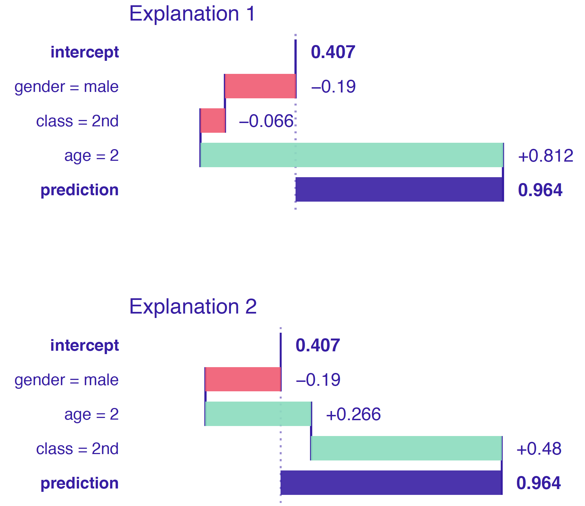

# Variable attribution

In this section we introduce method for additive decomposition of predictions. The main goal for these tools is to help understand how model output may be attributed to input variables or sets of variables. 

Presented explainers are linked with the first law introduced in Section \@ref(three-single-laws), i.e. law for prediction’s justifications. Note that there are more tools for variable attribution, some of them will be presented in next sections.

Think of following use cases:

* Think about a model for heart attack. A patient wants to know which factors have highest impact on the final heart risk score.
* Think about a model for apartment prices. An investor wants to know how much of the final price may be attributed to the location of an apartment.
* Think about a model for credit scoring. A customer wants to know if factors like gender, age or number of kids influence model decisions.

In the section \@ref(VAlinMod) we will introduce key concepts and intuitions beyond variable attribution based on linear models. This approach may be easily applied to additive models and generalized linear models. 
In sections \@ref(breakDown) and \@ref(shapley) we will present model agnostic extentions of this concept.


## Variable attribution for linear models {#VAlinMod}


Linear model with coefficients $\beta = (\beta_0, \beta_1, .., \beta_p)$ has following form.

$$
f(x) = \beta_0 + x_1 \beta_1 + \ldots + x_p \beta_p.
$$
In other words, model response is the sum of weighted elements of $x = (x_1, x_2, \ldots, x_p)$. 


From a global perspective of a model, we are usually interested in questions like, how good is the model, which variables are significant or how accurate are model predictions.

But in this chapter we are focues in a local perspective, i.e. for a single observation $x^*$ how to measure the contribution of  a variable $x_i$ on model prediction $f(x^*)$.

Let $v(f, x^*, i)$ stands for the contribution of variable $x_i$ on prediction of model $f()$ in point $x^*$. For linear models it is easy to define such contribution as
$$
v(f, x^*, i) = f(x^*) - E[f(x)|x_{-1} = x^*_{-1}] = \beta_i x^*_i  - E \beta_i X_i
$$
where the expected value can be estimated from the data
$$
v(f, x^*, i) = \beta_i x^*_i - \beta_i \bar x_i = \beta_i (x^*_i - \bar x_i)
$$

The logic behind the attribution is the following. 
Contribution of variable $x_i$ is the difference between model response for value $x_i^*$ minus the average model response.

### Wine quality example

It may be a surprise, that the attribution for variable $x_i$ is not the $\beta_i x_i$.
But, please consider following example. 
Figure \@ref(fig:attribution1) shows the relation between alcohol and wine quality, based on the wine dataset [@wine2009]. The corresponding linear model is

$$
quality(alcohol) = 2.5820 + 0.3135 * alcohol
$$

The weakest wine in this dataset has 8\% of alcohol, average alcohol concentration is 10.51, so the contribution of alcohol to the model prediction is $0.3135  *(8-10.51) = -0.786885$. It means that low value of alcohol for this wine (8\%) lower the prediction of quality by $-0.786885$.

Note, that it would be confusing to forget about normalisation and say, that for the alcohol contribution on quality is $0.3135*8 = 2.508$ as this is high positive value.


```{r attribution1, echo=FALSE, fig.cap="(fig:attribution1)Relation between wine quality and concentration of alcohol assessed with linear model", out.width = '50%', fig.align='center'}
knitr::include_graphics("figure/attribution_1.png")
```


```{r, echo=FALSE, eval=FALSE}
library(breakDown)
library(ggplot2)

lm(quality ~ alcohol, wine)
plot(quality ~ alcohol, wine)
ggplot(wine, aes(alcohol, quality)) +
  geom_point() + 
  geom_smooth(method="lm", se=FALSE, size=2, color="red") + theme_bw() + xlab("alcohol [%]") + 
  ylab("wine quality")

```


Note that the linear model ma be rewritten in a following way


$$
f(x) = baseline + (x_1 - \bar x_1) \beta_1 + ... + (x_p - \bar x_p) \beta_p
$$

where
$$
baseline = \mu + \bar x_1 \beta_1 + ... + \bar x_p \beta_p.
$$

Here $baseline$ is an average model response and variable contributions show how prediction for particular $x^*$ is different from the average response. 

** NOTE for careful readers **

There is a gap between expected value of $X_i$ and average calculated on some dataset $\bar x_i$. The latter depends on the data used for calculation of averages. For the sake of simplicity we do not emphasise these differences. To live with this just assume that we have access to a very large validation data that allows us to calculate $\bar x_i$ very accurately.

## Model agnostic variable attribution {#modelAgnosticAttribution}

In the Section \@ref(VAlinMod) we introduced a method for calculation of variable attributions for linear models.
This method is accurate, based directly on the structure of the model. But for most popular machine learning models we cannot assume that they are linear nor even additive. 

In next sections we introduce a model agnostic approach. Note that even if the model itself is not additive, the model attribution will be additive.

Again, let $v(f, x^*, i)$ stands for the contribution of variable $x_i$ on prediction of model $f()$ in point $x^*$. 

We expect that such contribution will sum up to the model prediction in a given point (property called *local accuracy*), so
$$
f(x^*) = baseline + \sum_{i=1}^p v(f, x^*, i)
$$
where $baseline$ stands for average model response.

Note that the equation above may be rewritten as

$$
E [f(X)|X_1 = x_1^*, \ldots, X+p = x_p^*] = E[f(X)] + \sum_{i=1}^p v(f, x^*, i)
$$
what leads to quite natural proposition for $v(f, x^*_i, i)$, such as

$$
v(f, x^*_i, i) = E [f(X) | X_1 = x_1^*, \ldots, X_i = x_i^*] - E [f(X) | X_1 = x_1^*, \ldots, X_{i-1} = x_{i-1}^*] 
$$
In other words the contribution of variable $i$ is the difference between expected model response conditioned on first $i$ variables minus the model response conditioned on first $i-1$ variables.

Such proposition fulfills the *local accuracy* condition, but unfortunatelly variable contributions depends on the ordering of variables. 

 
```{r ordering, echo=FALSE, fig.cap="(fig:ordering) Two different paths between average model prediction and the model prediction for a selected observation. Black dots stand for conditional average, red arrows stands for changes between conditional averages.", out.width = '100%', fig.align='center'}

```


See for example Figure \@ref(fig:ordering). In the first ordering the contribution of variable `age` is calculated as 0.01, while in the second the contribution is calculated as 0.13. Such differences are related to the lack of additivness of the model $f()$. Propositions presented in next two sections present different solutions for this problem.


```{r, eval=FALSE, echo=FALSE}
model_rf <- aread("9e4913a2f1257bd905945d960ed7072b")

new_observation <- data.frame(gender = factor("male", levels = c("male", "female")),
                      age = 57.7,
                      hours = 42.3,
                      evaluation = 2,
                      salary = 2)

predict(model_rf, new_observation, type = "prob")

p1 <- c()
p2 <- c()
tmp <- HR
p1[1] <- mean(predict(model_rf, tmp, type = "prob")[,1])

tmp$hours <- 42.3
p1[2] <- mean(predict(model_rf, tmp, type = "prob")[,1])

tmp$age <- 57.7
p1[3] <- mean(predict(model_rf, tmp, type = "prob")[,1])

tmp$gender <- factor("male", levels = c("male", "female"))
p1[4] <- mean(predict(model_rf, tmp, type = "prob")[,1])

#####
tmp <- HR
p2[1] <- mean(predict(model_rf, tmp, type = "prob")[,1])

tmp$gender <- factor("male", levels = c("male", "female"))
p2[2] <- mean(predict(model_rf, tmp, type = "prob")[,1])

tmp$age <- 57.7
p2[3] <- mean(predict(model_rf, tmp, type = "prob")[,1])

tmp$hours <- 42.3
p2[4] <- mean(predict(model_rf, tmp, type = "prob")[,1])

p1
diff(p1)
p2
diff(p2)
df <- data.frame(id=c(1:4,1:4),co=rep(1:2,each = 4),E=c(p1, p2))
ggplot(df, aes(E, id)) +
  geom_point() +
  facet_wrap(~co, ncol = 1) + theme_bw() +
  scale_y_reverse()
```


