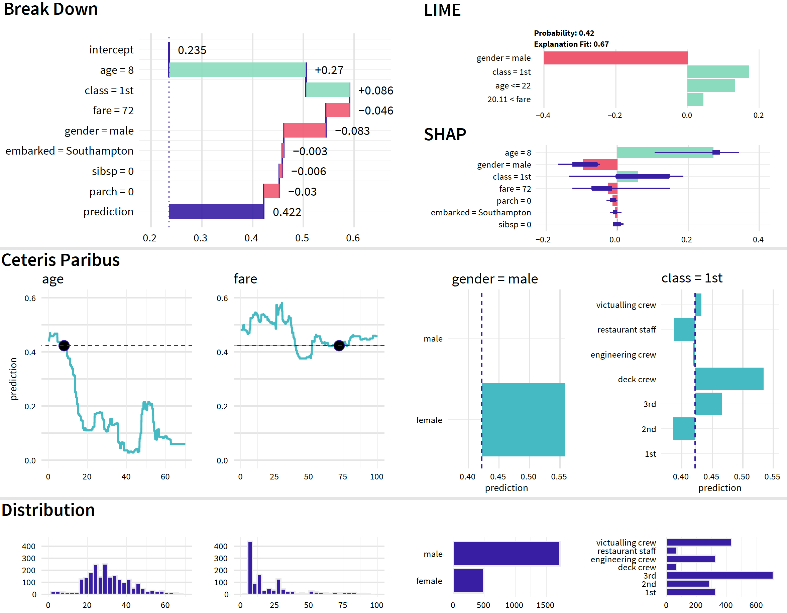

# Summary of Instance-level Explainers {#summaryInstanceLevel}

In the first part of the book, we introduced a number of techniques for exploration and explanation of model predictions for individual instances. 
In each chapter we introduced and presented a single technique.
But in practice these techniques rarely shall be used separately. It's more informative to combine different views offered by each technique into a more holistic overview.

See an example in Figure \@ref(fig:instanceLevelExplainers). Four different approaches to the explanation of the random forest model are used. 
First row shows results from variable attribution methods like LIME, SHAP and Break Down. All these method agree that the most important variables for `johny_d` are his `age`, `gender`, `class` and `fare.` Since `fare` and `class` are correlated and possibly `age` is in the interaction with `gender` then the additive decomposition is 	ambiguous. 
Second row shows Ceteris Paribus profiles for these four most important variables. We see that higher age or being in the `2nd` class in he `restaurant staff` would decrease the model response while lower fare (which is counter intuitive), being a female or in the `deck crew` would increase the model response. 
Third row show univariate distributions of particular variables. We see that `fare=72` is very high as for a ticket and that only small fraction of people on the titanic were children (no kids in the crew). Combination of different perspectives supplement each other.

(ref:instanceLevelExplainersDesc) Instance-level explanations of the fandom forest model for the titanic data and `johny_d` an 8-years old boy that travels in the 1ts class.

```{r instanceLevelExplainers, echo=FALSE, fig.cap='(ref:instanceLevelExplainersDesc)', out.width = '100%', fig.align='center'}

```

In the Chapter \@ref(UseCaseFIFA) we show an example how instance level explanations may be combined with dataset level explanations on a new use-case related to FIFA 19 data.


On one hand it is good to supplement different techniques for explanation with each other, but on another hand these techniques are different and may be more or less suitable for some selected problems. Below we discuss some differences. 


## Number of explanatory variables in the model

One of the most important criteria for selection of model exploration and explanation methods is the number of explanatory variables in the model.

### Low to medium number of explanatory variables

A low number of variables usually implies that the particular variables have a very concrete meaning and interpretation. An example are models for the Titanic data presented in Sections \@ref(model-titanic-lmr)-\@ref(model-titanic-gbm).
 
In such a situation, the most detailed information about the influence of the variables on the model predictions is provided by the CP profiles. In particular, the variables that are most influential for model predictions are selected by considering CP-profile oscillations (see Chapter \@ref(ceterisParibusOscillations)) and then illustrated graphically with the help of individual-variable CP profiles (see Chapter \@ref(ceterisParibus)).


### Medium to large number of explanatory variables

In models with a medium or large number of variables, it is still possible that most (or all) of them are interpretable. An example of such a model is a car-insurance pricing model in which we need to estimate the value of an insurance based on behavioral data that includes 100+ variables about characteristics of the driver and characteristics of the car. 

When the number of explanatory variables increases, it becomes harder to show CP profile for each individual variable. In such situation, the most common approach is to use BD plots, presented in Chapter \@ref(breakDown), or plots of Shapley values, discussed in Chapter \@ref(shapley)). They allow a quick evaluation whether a particular variable has got a positive or negative effect on model's prediction; we can also judge the size of the effect. If necessary, it is possible to limit the plots only to the variables with the largest effects.

### Very large number of explanatory variables

When the number of explanatory variables is very large, it may be difficult to interpret the role of each single variable. An example of such situation are models for processing of images or texts. In that case, explanatory variables may be individual pixels in image processing or individual characters in text analysis. As such, their individual interpretation is limited. Due to additional issues with computational complexity, it is not feasible to use CP profiles, BD plots, nor Shapley values to evaluate influence of individual values on model's predictions. Instead, the most common approach is to use LIME, presented in Chapter \@ref(LIME), which works on context-relevant groups of variables.

## Correlated explanatory variables

When we derived some properties for presented methods we assumed that explanatory variables are independent. Obviously, this is not always the case. For instance, in the case of the data on apartment prices (see Chapter \@ref(ApartmentDataset)), the number of rooms and surface of an apartment will most likely be positively associated same is true for the class variable and fare for titanic data. 

Of course all presented methods can be applied for correlated features, however sometimes it may be harder to analyze these features independently from each other.

To address the issue, the two most common approaches are:
* to create new features that are independent (sometimes it is possible due to domain knowledge; sometimes it can e achieve by using principal components analysis or a similar technique),
* construct two-dimensional extensions for CP plots (model response is plotted as a 2d surface) or permute variables in blocks to preserve the correlation structure of variables. 

## Models with interactions

In models with interactions, the effect of one explanatory variable may depend on values of other variables. For example, the probability of survival on Titanic may decrease with age, but the effect may be different for different classes of passengers. 
In such a case, to explore and explain model's predictions, we have got to consider not individual variables, but sets of variables included in interactions. To identify interactions, we can use BD plots as described in Chapter \@ref(iBreakDown). To show effects of an interaction we may use a set of CP profiles. For the Titanic example we may use CP profiles for age with to instances that differ only in gender. The less parallel are such profiles the higher the effect of an interaction.

## Sparse explanations

Predictive models may use hundreds of explanatory variables to yield a prediction for a particular instance. However, for a meaningful interpretation and illustration, most of human beings can handle only a very limited (say, less than 10) number of variables. Thus, sparse explanations are of interest. The most common method that is used to construct such explanations is LIME (Chapter \@ref(LIME)). However, constructing a sparse explanation for a complex model is not trivial and may be misleading. Hence, care is needed when applying LIME to very complex models.

## Additional uses of model exploration and explanation 

In the previous chapters we focused on the application of the presented methods to exploration and explanation of predictive models. However, the methods can also be used to other aims:

* Model improvement. If a model prediction is particularly bad for a selected observation, then the investigation of the reasons for such a bad performance may provide some hints about how to improve the model. In case of instance predictions it is easier to note that a selected explanatory variable should have a different effect than the observed one.

* Additional domain-specific validation. Understanding which factors are important for model predictions helps in evaluation of the plausibility of the model. If the effects of some variables on the predictions are inconsistent with the domain knowledge, then this may provide a ground for criticising the model and, eventually, replacing it by another one. On the other hand, if the influence of the variables on model predictions is consistent with prior expectations, the user may become more confident with the model. Such a confidence is fundamental when the model predictions are used as a support for taking decisions that may lead to serious consequences, like in the case of, for example, predictive models in medicine.

* Model selection. In case of multiple candidate models, one may use results of the model explanation techniques to select one of the candidates. It is possible that, even if two models are similar in terms of a global model fit, the fit of one of them is locally much better. Consider the following, highly hypothetical example. Assume that a model is sought to predict whether it will rain on a particular day in a region where it rains on a half of the days. Two models are considered: one which simply predicts that it will rain every other day, and another that predicts that it will rain every day since October till March. Arguably, both models are rather unsophisticated (to say the least), but they both predict that, on average, half of the days will be rainy. However, investigation of the instance predictions (for individual days) may lead to a preference for one of them. 


## Champion Challenger analysis

The techniques for explaining and exploring models have many applications. One of them is the opportunity to compare models.

Why compare models? 
One scenario is the Champion-Challenger analysis. Let's assume that some institution uses a predictive model but wants to know if they could get a better model using other modeling techniques. For example, the risk department in a bank uses logistical regression to assess credit risk. The model has some efficiency and is the so-called champion - the best model considered in the class of logistic regression models.
However, it is worth checking whether using more complex models, so called challengers, e.g. boosting or random trees, will not be more effective. And if they are more effective, the question will arise as to how these challengers differ from the champion.

Another reason why we want to compare models is because of the iterativness of the modeling process itself (see \@ref(MDPprocess)). During the modeling process many versions of the models are created, often with different structures, sometimes with very similar efficiency. Comparative analysis allows for better understanding how these models differ from each other.


Below is an example of champion-challenger analysis for Random Forest model `model_titanic_rf`, logistic regression model `model_titanic_lmr`, boosting model of `model_titanic_gbm` and support-vector machines (SVM) model of `model_titanic_svm`.

Each of these models has a different way of functioning. Random forest and boosting models are on trees, so the response curves will be stepped one. The logistic regression and booster models have continuous and smooth response curves. 


Figure \@ref(fig:championChallengerSHAP) shows the Shapley values for the four models built in chapter \@ref(TitanicDataset) using the example of `john_d`. For three models, namely random forest, boosting and logistic regression, similar variables are indicated as important: `class`, `age` and `gender`. For the SVM model the most important variable is `gender`, followed by `age` and `parch`.


```{r championChallengerSHAP, warning=FALSE, message=FALSE, echo=FALSE, fig.width=10, fig.height=5, fig.cap="SHAP plots for four different models for the Titanic data.", out.width = '100%', fig.align='center'}
library("iBreakDown")
library("randomForest")
library("gbm")
library("e1071")
library("rms")
library("DALEX")
load("models/models_titanic.rda")
load("models/explain_rf_v6.rda")
explain_titanic_rf <- explain_rf_v6
load("models/johny_d.rda")

set.seed(1313)
sp_rf_johny <- variable_attribution(explain_titanic_rf, johny_d, type = "shap")
sp_gbm_johny <- variable_attribution(explain_titanic_gbm, johny_d, type = "shap")
sp_svm_johny <- variable_attribution(explain_titanic_svm, johny_d, type = "shap")
sp_lmr_johny <- variable_attribution(explain_titanic_lmr, johny_d, type = "shap")

library(patchwork)
scale_y <- scale_y_continuous("", limits = c(-0.16, 0.32))
(plot(sp_rf_johny) + scale_y | plot(sp_gbm_johny) + scale_y) / 
  (plot(sp_svm_johny) + scale_y | plot(sp_lmr_johny) + scale_y) +
  plot_annotation(title = "Shap values for johny_d", 
                  theme = DALEX::theme_drwhy())

```


Shapley values show an additive distribution for model predictions. In the chapter \@ref(iBreakDown) we discussed what to do if the add-on attribute may not reflect the exact behaviour of the model. 
Figure \@ref(fig:championChallengerBD) compares Break Down plots with interactions for the four models under consideration.

Each of these models obviously has a different estimate for the chances of survival for `johny_d`. The highest estimate has the logistic regression model $0.764$ while the lowest estimate has the random forest model $0.441$. For the SVM model, the most important variable is `gender` and for the other models, `age` and `class`. The Random Forest model included interactions of `fare:class` and the SVM model included interactions of `fare:age`.


```{r championChallengerBD, warning=FALSE, message=FALSE, echo=FALSE, fig.width=10, fig.height=5, fig.cap="Break Down plots for four different models for the Titanic data.", out.width = '100%', fig.align='center'}
set.seed(1)
bd_rf_johny <- variable_attribution(explain_titanic_rf, johny_d, type = "break_down_interactions")
bd_gbm_johny <- variable_attribution(explain_titanic_gbm, johny_d, type = "break_down_interactions")
bd_svm_johny <- variable_attribution(explain_titanic_svm, johny_d, type = "break_down_interactions")
bd_lmr_johny <- variable_attribution(explain_titanic_lmr, johny_d, type = "break_down_interactions")

library(patchwork)
scale_y <- scale_y_continuous("", limits = c(0,1))
(plot(bd_rf_johny) + scale_y | plot(bd_gbm_johny) + scale_y) / 
  (plot(bd_svm_johny) + scale_y | plot(bd_lmr_johny) + scale_y) +
  plot_annotation(title = "Break Down plot for johny_d", 
                  theme = DALEX::theme_drwhy())
```

Figure \@ref(fig:championChallengerCP) shows Ceteris Paribus profiles for the four models considered for the `age` and `fare` variables. 
The logistic regression and GBM models behave in a similar way. Random forest and SVM models are much less sensitive to the `age` variable.


```{r championChallengerCP, warning=FALSE, message=FALSE, echo=FALSE, fig.width=8, fig.height=5, fig.cap="Ceteris Paribus profiles for four different models for the Titanic data.", out.width = '100%', fig.align='center'}
splits <- list(age = seq(0,70,0.1), fare = seq(0,100,0.2))

cp_rf_johny <- individual_profile(explain_titanic_rf, johny_d, 
                                  variable_splits = splits)
cp_gbm_johny <- individual_profile(explain_titanic_gbm, johny_d, 
                                   variable_splits = splits)
cp_svm_johny <- individual_profile(explain_titanic_svm, johny_d, 
                                   variable_splits = splits)
cp_lmr_johny <- individual_profile(explain_titanic_lmr, johny_d, 
                                   variable_splits = splits)

plot(cp_rf_johny, cp_gbm_johny, cp_svm_johny, cp_lmr_johny, variables = c("age", "fare"),
     color = "_label_") +
  guides(col = guide_legend(nrow = 1)) + scale_color_discrete("Model:") +
  ggtitle("Ceteris Paribus profile for johny_d")
```

Each of the four models under consideration has a different structure and each of them is for some reason a complex model. Random forest and boosting models are complex due to the large number of trees used for prediction. The SVM model is complex due to the non-linear function of the kernel and the logistic regression model due to spline transformations. 

The compilation of the operating profile of the models side-by-side allows for a better understanding of the similarities and differences in the signals that these models have learned.

