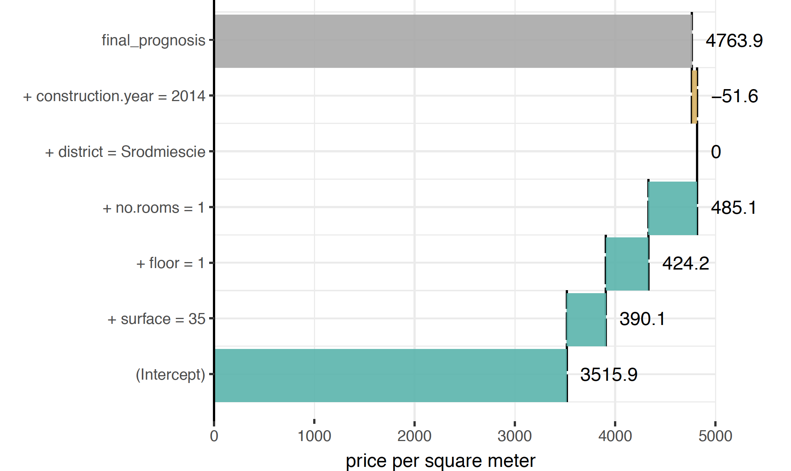

# Break Down

In this section we introduce tools based on variable relaxation principle. The main goal for these tools is to help understand how model output may be attributed to input variables or sets of variables. Attribution is in most cases additive, thus the model response is decomposed into parts that may be assigned to variables.


Presented explainers are linked with the first law introduced in Section \@ref(three-single-laws), i.e. law for prediction’s justifications. Note that there are more tools for variable attribution, some of them will be presented in next sections.

Think of following use cases:

* Think about a model for hart attack. A patient wants to know which factors have highest impact on the final heart risk score.
* Think about a model for apartment prices. An investor wants to know how much of the final price may be attributed to the location of an apartment.
* Think about a model for credit scoring. A customer wants to know if factors like gender, age or number of kids influence model decisions.


## Introduction

The name *Break Down Plots* comes from the way how Break Down plots are working. 
The main goal is to decompose model predictions into parts that can be additively attributed to particular variables. See an example in Figure \@ref(fig:BDPrice1).

It is straightforward for linear (and more general: additive) models. But not that obvious for more complex models. In this section we present uniform, model agnostic approach to variable attribution.
 
```{r BDPrice1, echo=FALSE, fig.cap="(fig:BDPrice1) An illustration of Break Down Plots. Model prediction for Random Forest models for a single observation (grey bar, 4763.9) is decomposed into parts that can be attributed to population average (the bottom bar, 3515.9) and effects of particular variables. ", out.width = '70%', fig.align='center'}

```


Similar to the Shapley method introduced in the Section \@ref(shapley), Break Down Plots show additive decomposition of model output. As we will show later, the Shapely method may be perceived as an average from all possible Break Down Paths.
In the last subsection we discuss pros and cons of this approach.


## How to read Break Down Plots?

The intuition behind *Break Down* Plots is to show how model prediction would change if observations in general population will be made more similar to the observation of interest.

This idea is described in Figure \@ref(BDPrice4) and let's trace it step by step.
For a black-box model (here random forest model, but it's structure is not relevant) we want to decompose prediction for following point:

* surface: 35
* floor: 1
* no.rooms: 1
* district: Srodmiescie
* construction year: 2014

The model prediction is 4763.9. How to attribute following features to it?

Baseline for this decomposition is the distribution of model predictions for whole population. In the last row of panel A denoted by `all data` the violin plot shows distribution of model prediction for whole population (here calculated on the validation dataset). Red dot stand for the average, and the average model prediction, averaged over all points is 3515.9.

Then we check how model prediction would change, if every observation in the population would have variable `surface` equal to `35`. New distribution for these modified observation is presented in the second row `+ surface = 35`. Black intervals between these two rows show how individual prediction change from original model prediction to the prediction calculated with coordinate `surface` set to `35`. Again, the red dot stands for the average from model predictions for such modified population. This time the average is 3906.

In the next step we modify all observations in the population again, this time we set the `floor` variable to `1`. Again, model prediction will change and black intervals show how individual prediction change. Also the average from all these modified prediction will change. This time the new average is 4330.2. 

Such steps are repeated for consecutive variables till all variables are set to the point of interest. In this last step all observations in the population will have coordinates changed to the observation of interests and all model predictions are equal 4763.9. 

Tracing distributions is not easy, thus instead of distributions we are focused on averages.
Panel B) shows how the average of distribution changes after each step. The average for whole population was 3515.9. After setting `surface` to `35` the average changed by `+390.1`. In the next step, when all observations were changed to `floor = 1` the average changed by `+424.1`. 

Break Down Plots, presented in the panel C) shows only these differences. Positive values are presented with green bars while negative differences are marked with yellow bar. They sum up to final model prediction, which is denoted by a grey bar in this example.

**NOTE** 

If the considered model is additive, then the order in which variables are added does not matter. 
If the model is not additive, then different orders will lead to different effects. 

Simplest way to choose an order is to use a greedy procedure in which we first include variables with largest influence to the average.

Find more details about to this procedure in the next section.


```{r BDPrice4, echo=FALSE, fig.cap="(fig:BDPrice4) Break Down Plots show how variables move the model prediction from population average to the model prognosis for a single observation. A) The last row shows distribution of predictions for the validation dataset. Then the second row shows distribution for all observations with variable surface set to 35. Each new row fixes a new variable and the last row shows model prediction for a single point. Red dots stands for averages. B) Blue arrows shows how the average change after each new variable is set. The longer the arrow, the largest is the effect of particular variable. C) Detailed information about distribution is removed and only changes in average are presented. ", out.width = '70%', fig.align='center'}
knitr::include_graphics("figure/bd_price_4.png")
```

## How to construct Break Down Plots

Let us use the following notation: $x = (x_1, x_2, ..., x_d) \in \mathcal R^d$ is a vector with features. $f_M(x):R^{d} \rightarrow R$ is a model  under consideration. It may be a regression or classification model. Additionally $X$ is a dataset with $n$ observations, this dataset will be used to learn joint distribution of features.

For a single observation $x$ the model prediction is equal to $f(x)$. Our goal is to attribute parts of this score to variables (dimensions) in the $R^{d}$ space. 

**Model agnostic approach**

The intuition behind this approach is to identify components of $x$ that cannot be changed without a significant change in the prediction $f(x)$. In order to present this approach in a more formal way, we first need to introduce some definitions.

*Relaxed model prediction*

Let $f^{IndSet}(x^{*})$ denotes an expected model prediction for $x^{*new*}$ relaxed on the set of indexes $IndSet \subset \{1, \ldots, p\}$.

$$
f^{IndSet}(x^{*}) = E[f(x)|x_{IndSet} = x^{*}_{IndSet}].
$$

Thus $f^{IndSet}(x^{*})$ is an expected value for model response conditioned on variables from set $IndSet$ in such a way, that $\forall_{i\in IndSet} x_i = x^{*}_i$.


The intuition behind relaxed prediction is that we are interested in an average model response for observations that are equal to $x^{*}$ for features from $IndSet^C$ set and follow the population distribution for features from $IndSet$ set. Clearly, two extreme cases are

$$
f^{\{1, \ldots, p\}}(x^{*}) = f(x^{*}),
$$
which is the case of no relaxation, and
$$
f^{\emptyset}(x^{new}) = E [f(x)].
$$
which corresponds to full relaxation.

We will say that a variable was relaxed, when we do not fix its value and we let it follow the population distribution.

This will play a crucial part in the algorithm presented in this section.

Since we do not know the joint distribution of $x$, we will use its estimate instead. 
$$
\widehat {f^{IndSet}(x^{*})} = \frac 1n \sum_{i = 1}^n f(x^i_{-IndSet},x^{*}_{IndSet}).
$$
We will omit the dashes to simplify the notation.


*Distance to relaxed model prediction*

Let us define the distance between model prediction and relaxed model prediction for a set of indexes $IndSet$.

$$
d(x^{*}, IndSet) := |f^{IndSet}(x^{*}) - f(x^{*})|.
$$


It is the difference between model prediction for observation $x^{*}$ and observation relaxed on features $indSet$. 
The smaller the difference, the less important are variables in the $indSet$ set.

*Added feature contribution* 

For j-th feature we define its contribution relative to a set of indexes $IndSet$ (*added contribution*) as

$$
\text{contribution}^{IndSet}(j) = f^{IndSet \cup \{j\}}(x^{*}) - f^{IndSet}(x^{*}).
$$

It is the change in model prediction for $x^{*}$ after relaxation on $j$.


The model agnostic feature contribution is based on distances to relaxed model predictions. In this approach we look for a series of variables that can be relaxed in such a way so as to move model prediction from $f(x^{*})$ to a fully relaxed prediction $E [f(x)]$ (expected value for all model predictions). The order of features in this series is important. But here we use a greedy strategy in which we add features to the $indSet$ iteratively (one feature per iteration) and minimize locally the distance to relaxed model prediction. 


The greedy search can start from a null set of indexes (then in each step a single feature is being relaxed) or it can start from a full set of relaxed features (then in each step a single feature is removed from the set).
The above approaches are called *step-up* and *step-down*, respectively.


The algorithm \ref{alg:relaxedalg} presents the procedure that generates a sequence of variables with increasing contributions. This sequence corresponds to variables that can be relaxed in such a way so as to minimize the distance to the original prediction. The resulting sequence of $Contributions$ and $Variables$ may be plotted with Break Down Plots. By relaxing consecutive variables one finds a path between single prediction and average model prediction.


**Model agnostic break down of model predictions. The *step-down* approach.**

1.  $p := $ number of variables
2.  $IndSet := \{1, \ldots, p\}$, i.e. set of indexes of all variables
3. FOR $i \in \{1, \ldots, p\}$
4. Find new variable that can be relaxed with small loss in relaxed distance to $f(x^{*})$
5. FOR $j in IndSet$
6. Calculate relaxed distance with $j$ removed
7. $dist(j) := d(x^{*}, IndSet \setminus \{j\})$
8. END FOR 5.
9. Find and remove $j$ that minimizes loss
10. $j_{min} := \text{arg}\min_j dist(j)$ 
11. $Contribution^{IndSet}(i) := f^{IndSet}(x^{new}) - f^{IndSet \setminus \{j_{min}\}}(x^{*})$
12. $Variables(i) := j_{min}$
13. $IndSet := IndSet \setminus \{j_{min}\}$
14. END FOR 3.


**Approach for linear models**


For linear models (and also generalized linear models) the scoring function (e.g. link function) may be expressed as linear combination of feature vectors.

$$
f(x^{*}) = (1, x^{*}) (\mu, \beta)^T = \mu + x^{*}_1 \beta_1 + \ldots + x^{*}_p \beta_p.
$$

In this case it is easy to attribute the impact of feature $x_i$ to prediction $f(x^{*})$. The most straightforward approach would be to use the $x^{*}_i \beta_i$ as the attribution. However, it is easier to interpret variable attributions if they are invariant to scale-location transformations of $x_i$, such as change of the unit or origin.  This is why for linear models the variable attributions are defined as  $(x^{*}_i - \bar x_i) \beta_i$. 

Previous equation may be rewritten as follows:

$$
f(x^{*}) = (1, x^{*}) (\mu, \beta)^T = baseline + (x^{*}_1 - \bar x_1) \beta_1 + ... + (x^{*}_p - \bar x_p) \beta_p
$$

where

$$
baseline = \mu + \bar x_1 \beta_1 + ... + \bar x_p \beta_p.
$$

Components $(x^{*}_i - \bar x_i) \beta_i$ are all expressed in the same units. 


## Interactions


```{r bdInter1, echo=FALSE, fig.cap="(fig:bdInter1) Break Down plot with interactions ", out.width = '70%', fig.align='center'}
knitr::include_graphics("figure/bd_inter_1.png")
```


## Pros and cons

Break Down Plots gives a uniform approach to decompose model prediction into parts that can be attributed additively to variables. Below we summarize key strengths and weaknesses of this approach. 

**Pros**

- Graphical representation of Break Down plots is easy to understand.
- Break Down plots are compact, many variables may be presented in a small space.
- Break Down plots are model agnostic yet they reduce to intuitive interpretation for linear Gaussian and generalized models.
- Break Down plots are faster than other approaches to variable attribution.

**Cons**

- If the model is non-additive then showing only additive contributions may be misleading.
- For large number of variables the Break Down plot may be messy with many variables having small contributions.
- For non-additive models the Break Down plot will depend on the order of variables being relaxed.


## Code snippets for R

In this section we present key features of the `breakDown` package for R [@R-breakDown]. This package covers all features presented in this chapter. It is available on CRAN and GitHub. Find more examples at the website of this package `https://pbiecek.github.io/breakDown/`.

**Model preparation**

In this section we will present examples based on the `apartments` dataset. See section TODO for more details.

```{r, warning=FALSE, message=FALSE}
library("DALEX")
head(HR)
```

The problem here is to predict average price for square meter for an apartment. Let's build a random forest model with `randomForest` package  [@R-randomForest].

```{r, warning=FALSE, message=FALSE}
library("randomForest")
model <- randomForest(status ~ gender + age + hours + evaluation + salary, data = HR)
model
```

Model exploration with `breakDown` package is performed in three steps. 

**1. Create an explainer - wrapper around model and validation data.**

Since all other functions work in a model agnostic fashion, first we need to define a wrapper around the model. Here we are using the `explain()` function from `DALEX` package [@R-DALEX].

```{r, warning=FALSE, message=FALSE}
explainer_rf_fired <- explain(model,
                 data = HR,
                 y = HR$status == "fired",
                 predict_function = function(m,x) predict(m,x, type = "prob")[,1],
                 label = "fired")
```

**2. Define point of interest.** 

Break Down Plots decompose model prediction around a single point.

```{r, warning=FALSE, message=FALSE}
new_observation <- data.frame(gender = factor("male", levels = c("male", "female")),
                      age = 57.7,
                      hours = 42.3,
                      evaluation = 2,
                      salary = 2)

predict(model, new_observation, type = "prob")
```

**3. Calculate BD decomposition**

The `break_down()` function calculates BP decomposition for selected model around selected observation. 

The result from  `break_down()` function is a data frame with variable attributions.

```{r, warning=FALSE, message=FALSE}
library("breakDown")
bd_rf <- break_down(explainer_rf_fired,
                 new_observation,
                 keep_distributions = TRUE)

bd_rf

plot(bd_rf) 
plot(bd_rf, plot_distributions = TRUE) 
```


```{r, warning=FALSE, message=FALSE, eval=FALSE, echo=FALSE}

bd_rf <- broken(rf_model, new_apartment, data = apartmentsTest, direction = "up", keep_distributions = TRUE)
bd_rf

plot(bd_rf) + theme_bw() + scale_y_continuous("price per square meter", expand = c(0,0), limits = c(0,6300)) + theme(legend.position = "none")

plot(bd_rf, plot_distributions = TRUE) + theme_bw() + scale_y_continuous("price per square meter", expand = c(0,0), limits = c(0,6300)) + theme(legend.position = "none")


plot(bd_rf) + theme_bw()+ scale_y_continuous("price per square meter", expand = c(0,0)) 
```


