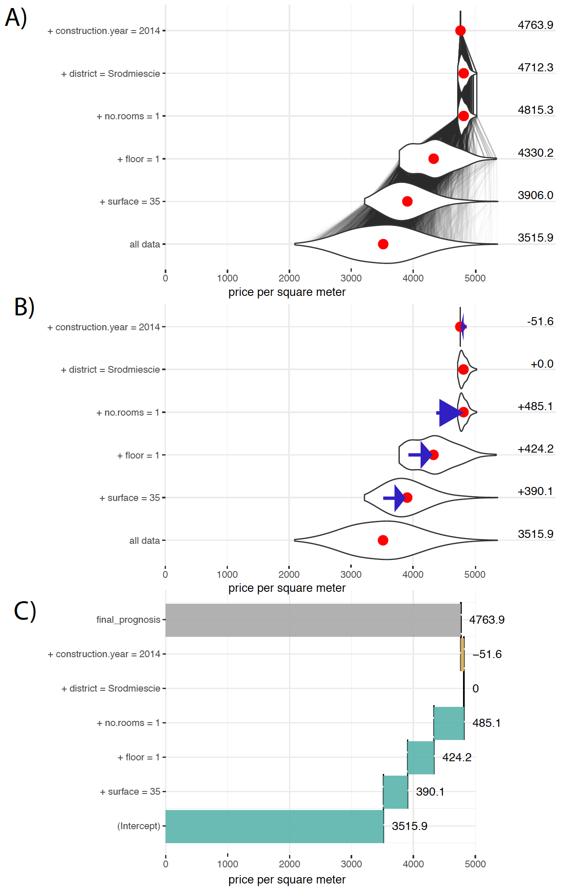

# Break Down {#breakDown}

The approach for variable attribution presented in the Section \@ref(modelAgnosticAttribution) has the property of *local accuracy*, but variable contributions depends on the variable ordering.

The Break Down method solves this problem by using two-step procedure. In the first step variables are ordered and in the second step the consecutive conditioning is applied to ordered variables.


## The Algorithm

First step of this algorithm is to determine the order of variables for conditioning. 
It seems to be reasonable to include first variables that are likely to be most important, leaving the noise variables at the end.
This leads to order based on following scores

$$
score(f, x^*, i) = \left| E [f(X)] - E [f(X)|X_i = x^*_i] \right|
$$
Note, that the absolute value is needed as variable contributions can be both positive and negative. 

Once the ordering is determined in the second step variable contributions are calculated as

$$
v(f, x^*_i, i) = E [f(X) | X_{I \cup \{i\}} = x_{I \cup \{i\}}^*] - E [f(X) | X_{I} = x_{I}^*] 
$$
where $I$ is the set of variables that have scores smaller than score for variable $i$.

$$
I = \{j: score(f, x^*, j) < score(f, x^*, i)\}
$$

The time complexity of the first step id $O(p)$ where $p$ is the number of variables and the time complexity of the second step is also $O(p)$.


## HR dataset: Hire or Fire?

Let us consider a random forest model created for HR data. The average model response is $\bar f(x) = 0.385586$. For a selected observation $x^*$ the table below presents scores for particular variables.

|           |  Ei f(X)|    scorei|
|:----------|--------:|---------:|
|hours      | 0.616200|  0.230614|
|salary     | 0.225528|  0.160058|
|evaluation | 0.430994|  0.045408|
|age        | 0.364258|  0.021328|
|gender     | 0.391060|  0.005474|

Once we determine the order we can calculate sequential contributions

|variable         | cumulative| contribution|
|:----------------|-----------:|------------:|
|(Intercept)      |    0.385586|     0.385586|
|* hours = 42     |    0.616200|     0.230614|
|* salary = 2     |    0.400206|    -0.215994|
|* evaluation = 2 |    0.405776|     0.005570|
|* age = 58       |    0.497314|     0.091538|
|* gender = male  |    0.778000|     0.280686|
|final_prognosis  |    0.778000|     0.778000|

## Break Down Plots

Once we calculated variable attributions we may plot them in an intuitive form.
This intuition behind Break Down Plots is described in Figure \@ref(BDPrice4). 

The variable ordering determined in the first step of Break Down Algorithm is reflected by the ordering of variables in rows of the plot. 

The last row of a plot shows the $baseline$, i.e. an average model prediction. The next row corresponds to average model prediction for observations with variable `surface` fixed to value `35`. The next for corresponds to average model prediction with variables `surface` set to `35` and `floor` set to `1`, and so on. The first row corresponds to model response for $x^*$.

In panels A and B violines show distribution of model predictions for selected points, while red dots stands for averages. 

The most minimal form that shows important information is presented in the panel C.
Positive values are presented with green bars while negative differences are marked with yellow bar. They sum up to final model prediction, which is denoted by a grey bar in this example.


```{r BDPrice4, echo=FALSE, fig.cap="(fig:BDPrice4) Break Down Plots show how variables move the model prediction from population average to the model prognosis for a single observation. A) The last row shows distribution of model predictions. Next rows show conditional distributions, every row a new variable is added to conditioning. The first row shows model prediction for a single point. Red dots stand for averages. B) Blue arrows shows how the average conditional response change, these values are variables contributions. C) Only variable contributions are presented. ", out.width = '70%', fig.align='center'}

```


## Pros and cons

Break Down approach is model agnostic, can be applied to any predictive model that returns a single number. It leads to additive variable attribution. Below we summarize key strengths and weaknesses of this approach. 


**Pros**

- Break Down Plots are easy to understand and decipher.
- Break Down Plots are compact; many variables may be presented in a small space.
- Break Down Plots are model agnostic yet they reduce to intuitive interpretation for linear Gaussian and generalized models.
- Complexity of Break Down Algorithm is linear in respect to the number of variables.

**Cons**

- If the model is non-additive then showing only additive contributions may be misleading.
- Selection of the ordering based on scores is subjective. Different orderings may lead to different contributions.
- For large number of variables the Break Down Plot may be messy with many variables having small contributions.


## Code snippets for R

In this section we present key features of the `breakDown` package for R [@R-breakDown]. This package covers all features presented in this chapter. It is available on CRAN and GitHub. Find more examples at the website of this package `https://pbiecek.github.io/breakDown/`.

**Model preparation**

In this section we will present an example based on the `HR` dataset and Random Forest model [@R-randomForest]. See the Section \@ref(HRdataset) for more details.

```{r, warning=FALSE, message=FALSE}
library("DALEX")
library("randomForest")
model <- randomForest(status ~ gender + age + hours + evaluation + salary, data = HR)
model
```

Model exploration with the `breakDown` package is performed in three steps. 

**1. Create an explainer - wrapper around model and validation data.**

Since all other functions work in a model agnostic fashion, first we need to define a wrapper around the model. Here we are using the `explain()` function from `DALEX` package [@R-DALEX].

```{r, warning=FALSE, message=FALSE}
explainer_rf_fired <- explain(model,
                 data = HR,
                 y = HR$status == "fired",
                 predict_function = function(m,x) predict(m,x, type = "prob")[,1],
                 label = "fired")
```

**2. Select an observation of interest.** 

Break Down Plots decompose model prediction around a single observation. Let's construct a data frame with corresponding values.

```{r, warning=FALSE, message=FALSE}
new_observation <- data.frame(gender = factor("male", levels = c("male", "female")),
                      age = 57.7,
                      hours = 42.3,
                      evaluation = 2,
                      salary = 2)

predict(model, new_observation, type = "prob")
```

**3. Calculate Break Down decomposition**

The `break_down()` function calculates Break Down contributions for a selected model around a selected observation. 

The result from `break_down()` function is a data frame with variable attributions.

```{r, warning=FALSE, message=FALSE}
library("breakDown")
bd_rf <- break_down(explainer_rf_fired,
                 new_observation,
                 check_interactions = FALSE,
                 keep_distributions = TRUE)

bd_rf
```

The generic `plot()` function creates a Break Down plots. 
```{r, warning=FALSE, message=FALSE}
plot(bd_rf) 
```

Add the `plot_distributions = TRUE` argument to enrich model response with additional information.

```{r, warning=FALSE, message=FALSE}
plot(bd_rf, plot_distributions = TRUE) 
```


```{r, warning=FALSE, message=FALSE, eval=FALSE, echo=FALSE}

bd_rf <- broken(rf_model, new_apartment, data = apartmentsTest, direction = "up", keep_distributions = TRUE)
bd_rf

plot(bd_rf) + theme_bw() + scale_y_continuous("price per square meter", expand = c(0,0), limits = c(0,6300)) + theme(legend.position = "none")

plot(bd_rf, plot_distributions = TRUE) + theme_bw() + scale_y_continuous("price per square meter", expand = c(0,0), limits = c(0,6300)) + theme(legend.position = "none")


plot(bd_rf) + theme_bw()+ scale_y_continuous("price per square meter", expand = c(0,0)) 
```


# Break Down for Interactions

In the Section \@ref(breakDown) we presented model agnostic approach for additive decomposition of a model prediction for a single observation. 

For non-additive models the variables contributions depend on values of other variables. 

In this section we present an algorithm that identifies interactions between pairs of variables and include such interactions in variable decomposition plots. Here we present an algorithm for pairs of variables, but it can be easily generalized to larger number of variables.

## The Algorithm

This algorithm is also composed out of two steps. In the first step variables and pairs of variables are ordered in terms of their importance, while in the second step the consecutive conditioning is applied to ordered variables.


To determine an importance of variables and pairs of variables following scores are being calculated.

For a single variable

$$
score_1(f, x^*, i) = \left| E [f(X)|X_i = x^*_i]  - E [f(X)]\right|
$$
For pairs of variables

$$
score_2(f, x^*, (i,j)) = \left| E [f(X)|X_i = x^*_i, X_j = x^*_j] - E [f(X)|X_i = x^*_i] - E [f(X)| X_j = x^*_j]+ E [f(X)] \right|
$$
Note that this is equivalent to 

$$
score_2(f, x^*, (i,j)) = \left| E [f(X)|X_i = x^*_i, X_j = x^*_j] - score_1 (f, x^*, i) - score_1 (f, x^*, j) + baseline \right|
$$
In other words the $score_1(f, x^*, i)$ measures how much the average model response changes if variable $x_i$ is set to $x_i^*$, which is some index of local variable importance. On the other hand the $score_2(f, x^*, (i,j))$ measures how much the change is different than additive composition of changes for $x_i$ and $x_j$, which is some index of local interaction importance.

Note, that for additive models $score_2(f, x^*, (i,j))$ shall be close to zero. So the larger is this value the larger deviation from additivness.


The second step of the algorithm is the sequential conditioning. In this version in every new step we condition on a single variable of pair of variables in an order determined by $score_1$ and $score_2$.

The complexity of the first step id $O(p^2)$ where $p$ stands for the number of variables. The complexity of the second step is $O(p)$.

## HR dataset: Hire or Fire?

Again, let us consider a HR dataset. 
The table below shows $score_1$ and $score_2$ calculated for consecutive variables.

|                  | Ei f(X) |    score1|  score2  |
|:-----------------|--------:|---------:|---------:|
|hours             | 0.616200|  0.230614|          |
|salary            | 0.225528| -0.160058|          |
|age:gender        | 0.516392|          |  0.146660|
|salary:age        | 0.266226|          |  0.062026|
|salary:hours      | 0.400206|          | -0.055936|
|evaluation        | 0.430994|  0.045408|          |
|hours:age         | 0.635662|          |  0.040790|
|salary:evaluation | 0.238126|          | -0.032810|
|age               | 0.364258| -0.021328|          |
|evaluation:hours  | 0.677798|          |  0.016190|
|salary:gender     | 0.223292|          | -0.007710|
|evaluation:age    | 0.415688|          |  0.006022|
|gender            | 0.391060|  0.005474|          |
|hours:gender      | 0.626478|          |  0.004804|
|evaluation:gender | 0.433814|          | -0.002654|

Once we determined the order, we can calculate sequential conditionings. In the first step we condition over variable `hours`, then over `salary`. The third position is occupied by interaction between `age:gender` thus we add both variables to the conditioning

|variable               | cumulative| contribution|
|:----------------------|-----------:|------------:|
|(Intercept)            |    0.385586|     0.385586|
|* hours = 42           |    0.616200|     0.230614|
|* salary = 2           |    0.400206|    -0.215994|
|* age:gender = 58:male |    0.796856|     0.396650|
|* evaluation = 2       |    0.778000|    -0.018856|
|final_prognosis        |    0.778000|     0.778000|


## Break Down Plots

Break Down Plots for interactions are similar in structure as plots for single variables. The only difference is that in some rows pair of variable is listed in a single row. See an example in Figure \@ref(BDPrice4). 

```{r bdInter1, echo=FALSE, fig.cap="(fig:bdInter1) Break Down Plot for variable attrbution with interactions ", out.width = '70%', fig.align='center'}
knitr::include_graphics("figure/bd_inter_1.png")
```


## Pros and cons

Break Down for interactions shares many features of Break Down for single variables. Below we summarize unique strengths and weaknesses of this approach. 


**Pros**

- If interactions are present in the model, then additive contributions may be misleading. In such case the identification of interactions leads to better explanations. 
- Complexity of Break Down Algorithm is quadratic, what is not that bad if number of features is small or moderate.

**Cons**

- For large number of variables, the consideration of all interactions is both time consuming and sensitive to noise as the number of $score_2$ scores grow faster than number of $score_1$. 


## Code snippets for R

The algorithm for Break Down for Interactions is also implemented in the `break_down` function from  `breakDown` package. 

It is enough to set argument `check_interactions = TRUE`  to identify interactions.

**Model preparation**

First a model needs to be trained.

```{r, warning=FALSE, message=FALSE}
library("DALEX")
library("randomForest")
model <- randomForest(status ~ gender + age + hours + evaluation + salary, data = HR)
model
```

Model exploration with the `breakDown` package is performed in three steps. 

**1. Create an explainer - wrapper around model and validation data.**

Since all other functions work in a model agnostic fashion, first we need to define a wrapper around the model. Here we are using the `explain()` function from `DALEX` package.

```{r, warning=FALSE, message=FALSE}
explainer_rf_fired <- explain(model,
                 data = HR,
                 y = HR$status == "fired",
                 predict_function = function(m,x) predict(m,x, type = "prob")[,1],
                 label = "fired")
```

**2. Select an observation of interest.** 

Break Down Plots decompose model prediction around a single observation. Let's construct a data frame with corresponding values.

```{r, warning=FALSE, message=FALSE}
new_observation <- data.frame(gender = factor("male", levels = c("male", "female")),
                      age = 57.7,
                      hours = 42.3,
                      evaluation = 2,
                      salary = 2)

predict(model, new_observation, type = "prob")
```

**3. Calculate Break Down decomposition**

The `break_down()` function calculates Break Down contributions for a selected model around a selected observation. 

Note that `check_interactions = TRUE` is needed to identify interactions.

The result from `break_down()` function is a data frame with variable attributions.

```{r, warning=FALSE, message=FALSE}
library("breakDown")
bd_rf <- break_down(explainer_rf_fired,
                 new_observation,
                 check_interactions = TRUE)

bd_rf
```

The generic `plot()` function creates a Break Down plots. 
```{r, warning=FALSE, message=FALSE}
plot(bd_rf) 
```


