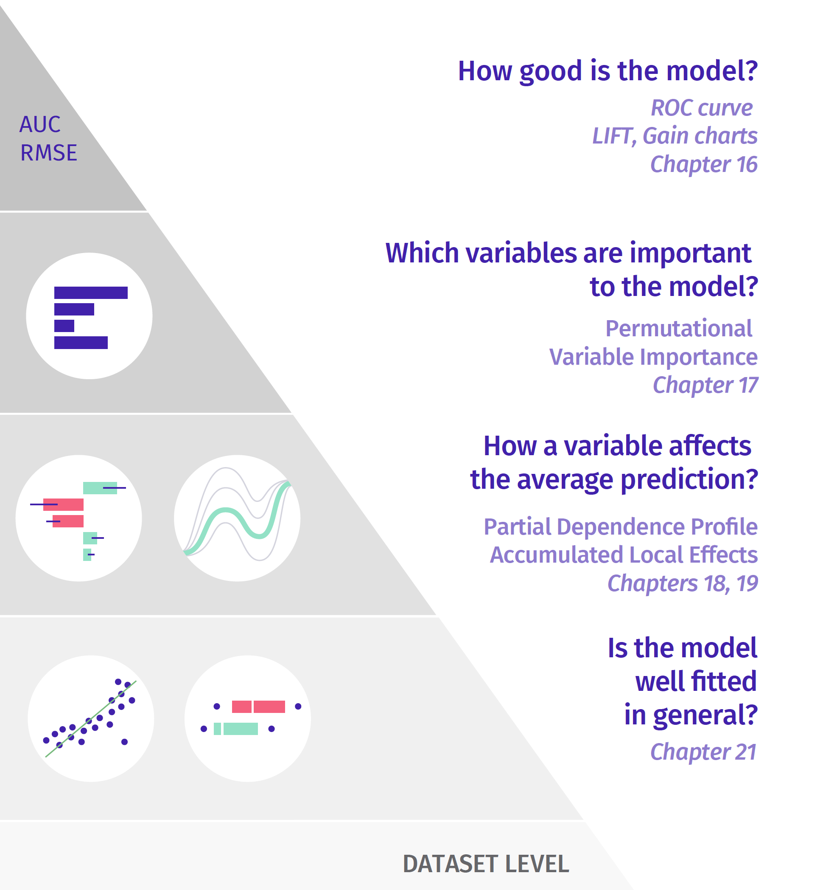

# Dataset Level {-}

```{r UMEPpiramideDataset, echo=FALSE, out.width = '99%', fig.align='center'}

```

# Model-level exploration {#modelLevelExploration}

In Part I, we focused on instance-level explainers, which help to understand how a model yields a prediction for a single observation (instance). 

In Part II, we concentrate on model-level explainers, which help to understand how model's predictions perform overall, for a set of observations. Assuming that the observations form a representative sample from a general population, model-level explainers can provide an information about the quality of predictions for the population.

The following examples illustrate situations in which model-level explainers may be useful:

* We may want to learn which variables are ''important'' in the model. For instance, we may be interested in predicting the risk of heart attack by using explanatory variables that are obtained based on results of some medical examinations. If some of the variables do not influence model's predictions, we could simplify the model by removing the variables.
* We may want to understand how a selected variable influences model's predictions. For instance, we may be interested in predicting prices of apartments. Apartment's location is an important factor, but we may want to know which locations lead to higher prices? 
* We may want to discover whether there are any observations, for which the model yields wrong predictions. For instance, for a model predicting the probability of survival after a risky treatment, we might know whether there are patients for whom the model predictions are extremely wrong. Identifying such a group of patients might point to, for instance, an incorrect form of a explanatory variable or even a missed variable. 

Model-level explainers focus on four main aspects of a model:

* Variable's importance: which explanatory variables are ''important'', and which are not?
* Variable's effect: how does a variable influence average model's predictions? 
* Model's performance: how ''good'' is the model? Is one model ''better'' than another?
* Model's fit: which observations are misfitted by the model, where residual are the largest? 

In all cases, measures capturing a particular aspect of the model have to be defined. We will discuss them in subsequent chapters. In particular, in Chapter \@ref(modelPerformance), we discuss measures that are useful for the evaluation of the overall predictive model performance. In Chapter \@ref(featureImportance), we focus on methods that allow evaluation of a variable's effect on model's predictions. Chapter \@ref(partialDependenceProfiles) and Chapter \@ref(accumulatedLocalProfiles) focus on exploration of the effect of selected variables on model response. Chapter \@ref(residualDiagnostic) presents an overview of the classical residual-diagnostics tools. Finally, in Chapter \@ref(UseCaseFIFA), we present an example of an analysis that illustrates the use of the model-level explainers introduced in the previous chapters. 

