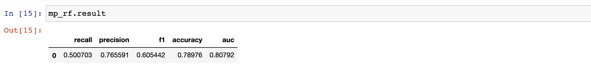
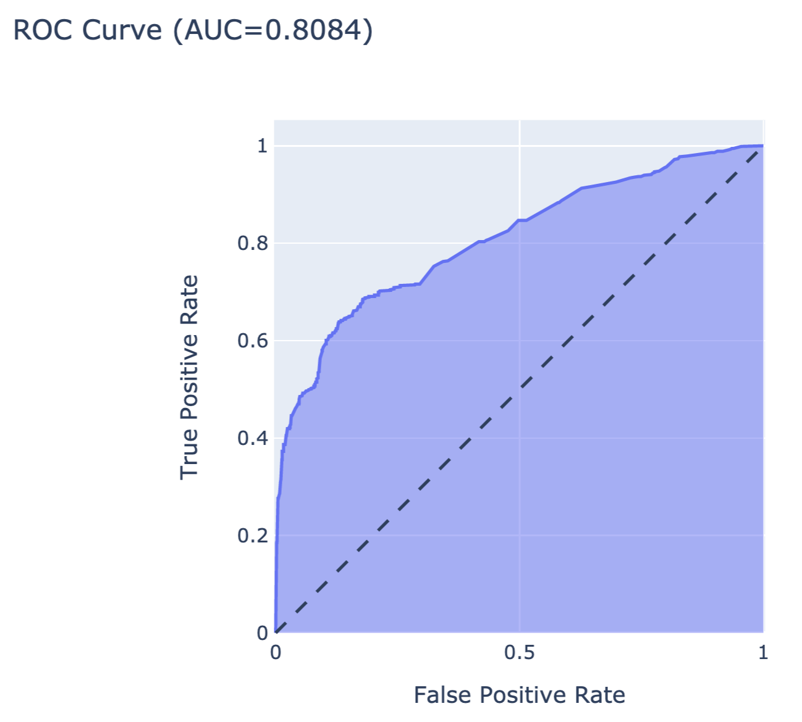
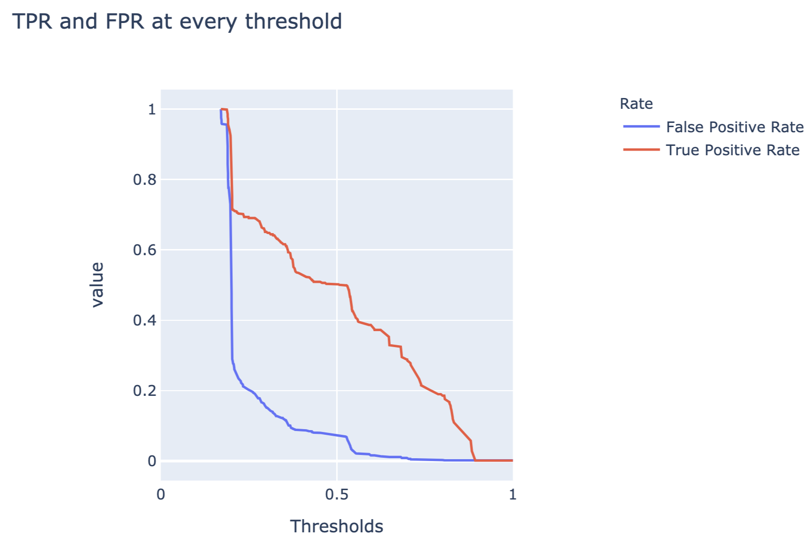

```{r load_models_VIb, warning=FALSE, message=FALSE, echo=FALSE, eval = FALSE}
source("models/models_titanic.R")
```

```{r, echo=FALSE, warning=FALSE}
source("code_snippets/ema_init.R")
```

# Model-performance Measures {#modelPerformance}

## Introduction {#modelPerformanceIntro}

<!---As it was pointed out in Section \@ref(fitting), we are interested in predictions for the random variable $Y$. Some of this information can be extracted from the observed independent variables $\underline X$, so in modelling, we are focused on understanding the conditional distribution of $Y|\underline X$. We're trying to approximates expected value with the class of models $f(\underline\theta; \underline X)$. Based on the observed data, we're constructing the $f(\underline{\hat\theta}; \underline X)$ model. [TOMASZ: THIS IS CONFUSING HERE. ALSO, IT IS BETTER TO AVOID MATHEMATICAL NOTATION IN INTRODUCTION, WHICH SHOULD BE ACCESSIBLE TO EVERYONE.  ]---> 

In this chapter, we present measures that are useful for the evaluation of the overall performance of a (predictive) model. 

As it was mentioned in Sections \@ref(MDPIntro) and \@ref(fitting), in general, we can distinguish between the explanatory and predictive approaches to statistical modelling.  @twoCultures indicates that validation of a model can be based on evaluation of *goodness-of-fit* (GoF) or on evaluation of predictive accuracy (which we will term *goodness-of-predicton*, GoP). In principle, GoF is mainly used for explanatory models, while GoP is applied for predictive models.\index{Explanatory ! modelling} In a nutshell, GoF pertains to the question: how well do the model's predictions explain (fit) dependent-variable values of the observations used for developing the model? On the other hand, GoP is related to the question: how well does the model predict the value of the dependent variable for a new observation? For some measures, their interpretation in terms of GoF or GoP depends on whether they are computed by using training or testing data.\index{GoF| see {Goodness-of-fit}}\index{Goodness-of-fit}\index{Testing (data)set}\index{Training (data)set}

The measures may be applied for several purposes, including:
 
* model evaluation: we may want to know how good the model is, i.e., how reliable are the model's predictions (how frequent and how large errors may we expect)?;
* model comparison: we may want to compare two or more models in order to choose between them;
* out-of-sample and out-of-time comparisons: we may want to check a model's performance when applied to new data to evaluate if performance has not worsened.\index{Out-of-sample}\index{Out-of-time}

Depending on the nature of the dependent variable (continuous, binary, categorical, count, etc.), different model-performance measures may be used. Moreover, the list of useful measures is growing as new applications emerge. In this chapter, we discuss only a selected set of measures, some of which are used in dataset-level exploration techniques introduced in subsequent chapters. We also limit ourselves to the two basic types of dependent variables continuous (including count) and categorical (including binary) considered in our book. 

## Intuition {#modelPerformanceIntuition}

Most model-performance measures are based on the comparison of the model's predictions with the (known) values of the dependent variable in a dataset. For an ideal model, the predictions and the dependent-variable values should be equal. In practice, it is never the case, and we want to quantify the disagreement.

In principle, model-performance measures may be computed for the training dataset, i.e., the data used for developing the model. However, in that case there is a serious risk that the computed values will overestimate the quality of the model's predictive performance. A more meaningful approach is to apply the measures to an independent testing dataset. Alternatively, a bias-correction strategy can be used when applying them to the training data. Toward this aim, various strategies have been proposed, such as cross-validation\index{Cross-validation} or bootstrapping [@Kuhn2013;@Harrell2015;@Steyerberg2019]. In what follows, we mainly consider the simple data-split strategy, i.e., we assume that the available data are split into a training set and a testing set. The model is created on the former, and the latter set is used to assess the model's performance.

It is worth mentioning that there are two important aspects of prediction: *calibration* and *discrimination* [@Harrell1996]\index{Calibration}\index{Discrimination}. Calibration refers to the extent of bias in predicted values, i.e., the mean difference between the predicted and true values. Discrimination refers to the ability of the predictions to distinguish between individual true values. For instance, consider a model to be used for weather forecasts in a region where, on average, it rains half the year. A simple model that predicts that every other day is rainy is well-calibrated because, on average, the resulting predicted risk of a rainy day in a year is 50\%, which agrees with the actual situation. However, the model is not very much discriminative (for each calendar day, the probability of a correct prediction is 50\%, the same as for a fair-coin toss) and, hence, not very useful. 

Thus, in addition to overall measures of GoP, we may need separate measures for calibration and discrimination of a model. Note that, for the latter, we may want to weigh differently the situation when the prediction is, for instance, larger than the true value, as compared to the case  when it is smaller. Depending on the decision on how to weigh different types of disagreement, we may need different measures.

In the best possible scenario, we can specify a single model-performance measure before the model is created and then  optimize the model for this measure. But, in practice, a more common scenario is to use several performance measures, which are often selected after the model has been created.

## Method {#modelPerformanceMethod}

Assume that we have got a training dataset with $n$ observations on $p$ explanatory variables and on a dependent variable $Y$. Let $\underline{x}_i$ denote the (column) vector of values of the explanatory variables for the $i$-th observation, and $y_i$ the corresponding value of the dependent variable. We will use $\underline{X}=(x'_1,\ldots,x'_n)$ to denote the matrix of explanatory variables for all $n$ observations, and $\underline{y}=(y_1,\ldots,y_n)'$ to denote the (column) vector of the values of the dependent variable. \index{Accuracy}\index{k-fold cross-validation}

The training dataset is used to develop model $f(\underline{\hat{\theta}}; \underline X)$, where $\underline{\hat{\theta}}$ denotes the estimated values of the model's coefficients. Note that could also use here the "penalized" estimates $\underline{\tilde{\theta}}$ (see Section \@ref(fitting)). 
Let $\widehat{y}_i$ indicate the model's prediction corresponding to $y_i.$ <!--In what follows we will ignore the fact that, in practice, one uses the estimated form of the model, and we will use $f()$ to denote it as well. --> 

The model performance analysis is often based on an independent dataset called a testing set. In some cases, model-performance mesures are based on a leave-one-out approach.\index{Leave-one-out} We will denote by $\underline{X}_{-i}$ the matrix of explanatory variables when excluding the $i$-th observation and by $f(\underline{\hat{\theta}}_{-i}; \underline{X}_{-i})$ the model developed for the reduced data. It is worth noting here that the leave-one-out model $f(\underline{\hat{\theta}}_{-i}; \underline{X}_{-i})$ is different from the full-data model $f(\underline{\hat{\theta}}; \underline X)$. But often they are close to each other and conclusions obtained from one can be transferred to the other. We will use $\widehat{y}_{i(-i)}$ to denote the prediction for $y_i$ obtained from model $f(\underline{\hat{\theta}}_{-i}; \underline{X}_{-i})$. 

In the subsequent sections, we present various model-performance measures. <!-- by assuming that they are computed based on a training dataset--> The measures are applied in essentially the same way if a training or a testing dataset is used. If there is any difference in the interpretation or properties of the measures between the two situations, we will explicitly mention them. Note that, in what follows, we will ignore in the notation the fact that we consider the estimated model $f(\underline{\hat{\theta}}; \underline X)$ and we will use $f()$ as a generic notation for it.

### Continuous dependent variable {#modelPerformanceMethodCont}

#### Goodness-of-fit {#modelPerformanceMethodContGOF}

The most popular GoF measure for models for a continuous dependent variable is the mean squared-error, defined as\index{MSE| see {Mean squared-error}}\index{Mean |squared-error}\index{MSPE| see {Mean squared-prediction-error}}

\begin{equation}
MSE(f,\underline{X},\underline{y}) = \frac{1}{n} \sum_{i}^{n} (\widehat{y}_i - y_i)^2 = \frac{1}{n} \sum_{i}^{n} r_i^2,
(\#eq:MSE)
\end{equation}

where $r_i$ is the residual for the $i$-th observation (see also Section \@ref(notation)). Thus, MSE can be seen as a sum of squared residuals. MSE is a convex differentiable function, which is important from an optimization point of view (see Section \@ref(fitting)). As the measure weighs all differences equally, large residuals have got a high impact on MSE. Thus, the measure is sensitive to outliers. For a "perfect" model, which predicts (fits) all $y_i$ exactly, $MSE = 0$.

Note that MSE is constructed on a different scale from the dependent variable. Thus, a more interpretable variant of this measure is the root-mean-squared-error (RMSE), defined as\index{RMSE| see {Root-mean-squared-error}}\index{Root-mean-squared-error}

\begin{equation}
RMSE(f, \underline{X}, \underline{y}) = \sqrt{MSE(f, \underline{X}, \underline{y})}.
(\#eq:RMSE)
\end{equation}

<!---

(ref:prepareMPBoxplotDesc) The distribution of the residuals in the Random Forest model for the Titanic data. The red dot indicates RMSE.

```{r prepareMPBoxplot, message=FALSE, warning=FALSE, echo= FALSE, fig.width=8, fig.height=2, fig.cap='(ref:prepareMPBoxplotDesc)', out.width = '80%', fig.align='center'}
library("DALEX")
library("randomForest")
library("ggplot2")

#titanic_imputed <- archivist::aread("pbiecek/models/27e5c")
#titanic_rf <- archivist::aread("pbiecek/models/4e0fc")

explain_rf <- DALEX::explain(model = titanic_rf, 
                              data = titanic_imputed[,-9],
                              y = titanic_imputed$survived == "yes", 
                              label = "Random Forest",
                              verbose = FALSE)

plot(model_performance(explain_rf), geom = "boxplot") +
  theme(legend.position = "none") + theme_ema
```
--->

A popular variant of RMSE is its normalized version, $R^2$, defined as

\begin{equation}
R^2(f, \underline{X}, \underline{y}) = 1 - \frac{MSE(f, \underline{X}, \underline{y})}{MSE(f_0, \underline{X},\underline{y})}.
(\#eq:R2)
\end{equation}

In \@ref(eq:R2), $f_0()$ denotes a "baseline" model. For instance, in the case of the classical linear regression, $f_0()$ is the model that includes only the intercept, which implies the use of the mean value of $Y$ as a prediction for all observations. $R^2$ is normalized in the sense that the "perfectly" fitting model leads to $R^2 = 1$, while $R^2 = 0$ means that we are not doing better than the baseline model. In the context of the classical linear regression, $R^2$ is the familiar coefficient of determination\index{Coefficient of determination} and can be interpreted as the fraction of the total variance of $Y$ "explained" by model $f()$.\index{$R^2$| see {Coefficient of determination}}

Given sensitivity of MSE to outliers, sometimes the median absolute-deviation (MAD) is considered:\index{MAD| see {Median absolute-deviation}}\index{Median absolute-deviation}

\begin{equation}
MAD(f, \underline{X} ,\underline{y}) = median( |r_1|, ..., |r_n| ).
(\#eq:MAD)
\end{equation}

MAD is more robust to outliers than MSE. A disadvantage of MAD are its less favourable mathematical properties. 

Section \@ref(modelPerformanceApartments) illustrates the use of measures for the linear regression model and the random forest model for the apartment-prices data. 

#### Goodness-of-prediction {#modelPerformanceMethodContGOP}

Assume that a testing dataset is available. In that case, we can use model $f()$, obtained by fitting the model to training data, to predict the values of the dependent variable observed in the testing dataset. Subsequently, we can compute MSE as in \@ref(eq:MSE) to obtain the mean squared-prediction-error (MSPE) as a GoP measure [@Kutner2005]. By taking the square root of MSPE, we get the root-mean-squared-prediction-error (RMSPE). \index{GoP| see {Goodness-of-prediction}}\index{Goodness-of-prediction}\index{RMSPE| see {Root-mean-squared-prediction-error}}\index{Root-mean-squared-prediction-error}

In the absence of testing data, one of the most known GoP measures for models for a continuous dependent variable is the predicted sum-of-squares (PRESS), defined as\index{PRESS| see {Predicted sum-of-squares}}\index{Predicted sum-of-squares}

\begin{equation}
PRESS(f,\underline{X},\underline{y}) = \sum_{i=1}^{n} (\widehat{y}_{i(-i)} - y_i)^2.
(\#eq:PRESS)
\end{equation}

Thus, PRESS can be seen as a result of the application of the leave-one-out strategy to the evaluation of GoP of a model using the training data. Note that, for the classical linear regression model, there is no need to re-fit the model $n$ times to compute PRESS [@Kutner2005]. 

Based on PRESS, one can define the predictive squared-error $PSE=PRESS/n$ and the standard deviation error in prediction $SEP=\sqrt{PSE}=\sqrt{PRESS/n}$ [@SummariesTutorial]. Another measure gaining in popularity is \index{PSE| see {Predictive squared-error}}\index{Predictive squared-error}\index{$Q^2$| see {Cross-validated $R^2$}}\index{Cross-validated $R^2$}\index{SEP| see {Standard deviation error in prediction}}\index{Standard deviation error in prediction}

\begin{equation}
Q^2(f,\underline{X},\underline{y}) = 1- \frac{ PRESS(f,\underline{X},\underline{y})}{\sum_{i=1}^{n} ({y}_{i} - \bar{y})^2}.
(\#eq:Q2)
\end{equation}

It is sometimes called the cross-validated $R^2$\index{Cross-validated $R^2$} or the coefficient of prediction [@Landram2005]. It appears that $Q^2 \leq R^2$, i.e., the expected accuracy of out-of-sample predictions measured by $Q^2$ cannot exceed the accuracy of in-sample estimates [@Landram2005]. For a "perfect" predictive model, $Q^2=1$. It is worth noting that, while $R^2$ always increases if an explanatory variable is added to a model, $Q^2$ decreases when "noisy" variables are added to the model [@SummariesTutorial].

The aforementioned measures capture the overall predictive performance of a model. A measure aimed at evaluating discrimination is the *concordance index* (c-index)\index{c-index| see{Concordance index}\index{Concordance index} [@Harrell1996;@Brentnall2018]. It is computed by considering all pairs of observations and computing the fraction of the pairs in which the ordering of the predictions corresponds to the ordering of the true values [@Brentnall2018]. The index assumes the value of 1 in case of perfect discrimination and 0.25 for random discrimination. 

Calibration can be assessed by a scatter plot of the predicted values of $Y$ in function of the true ones [@Harrell1996;@vanHouwelingen2000;@Steyerberg2010]. The plot can be characterized by its intercept and slope. In case of perfect prediction, the plot should assume the form of a straight line with intercept 0 and slope 1. A deviation of the intercept from 0 indicates overall bias in predictions ("calibration-in-the-large"), while the value of the slope smaller than 1 suggests overfitting of the model [@vanHouwelingen2000;@Steyerberg2010]. The estimated values of the coefficients can be used to re-calibrate the model [@vanHouwelingen2000]. 

### Binary dependent variable {#modelPerformanceMethodBin}

To introduce model-performance measures, we, somewhat arbitrarily, label the two possible values of the dependent variable as "success" and "failure". Of course, in a particular application, the meaning of the "success" outcome does not have to be positive nor optimistic; for a diagnostic test, "success" often means detection of disease. We also assume that model prediction $\widehat{y}_i$ takes the form of the predicted probability of success. \index{Classification}

#### Goodness-of-fit {#modelPerformanceMethodBinGOF}

If we assign the value of 1 to success and 0 to failure, it is possible to use MSE, RMSE, and MAD, as defined in Equations \@ref(eq:MSE), \@ref(eq:RMSE), \@ref(eq:MAD), respectively, as a GoF measure. In fact, the MSE obtained in that way is equivalent to the Brier score\index{Brier score}, which can be also expressed as 
$$
\sum_{i=1}^{n} \{y_i(1-\widehat{y}_i)^2+(1-y_i)(\widehat{y}_i)^2\}/n.
$$
Its minimum value is 0 for a "perfect" model and 0.25 for an "uninformative" model that yields the predicted probability of 0.5 for all observations. The Brier score is often also interpreted as an overall predictive-performance measure for models for a binary dependent variable because it captures both calibration and the concentration of the predictive distribution [@Rufibach2010].

One of the main issues related to the summary measures based on MSE is that they penalize too mildly for wrong predictions. In fact, the maximum penalty for an individual prediction is equal to 1 (if, for instance, the model yields zero probability for an actual success). To address this issue, the log-likelihood function based on the Bernoulli distribution (see also \@ref(eq:modelTrainingBernoulli)) can be considered:

\begin{equation}
l(f, \underline{X},\underline{y}) =  \sum_{i=1}^{n} \{y_i \ln(\widehat{y}_i)+ (1-y_i)\ln(1-\widehat{y}_i)\}.
(\#eq:bernoulli)
\end{equation}

Note that, in the machine-learning world, function $-l(f, \underline{X} ,\underline{y})/n$ is often considered (sometimes also with $\ln$ replaced by $\log_2$) and termed "log-loss" or "cross-entropy"\index{Cross-entropy}. The log-likelihood heavily "penalizes" the cases when the model-predicted probability of success $\widehat{y}_i$ is high for an actual failure ($y_i=0$) and low for an actual success ($y_i=1$). \index{Log-loss}

The log-likelihood \@ref(eq:bernoulli) can be used to define $R^2$-like measures (for a review, see, for example, @Allison2014). One of the variants most often used is the measure proposed by @Nagelkerke1991:

\begin{equation}
R_{bin}^2(f, \underline{X}, \underline{y}) = \frac{1-\exp\left(\frac{2}{n}\{l(f_0, \underline{X},\underline{y})-l(f, \underline{X},\underline{y})\}\right)}
{1-\exp\left(\frac{2}{n}l(f_0, \underline{X},\underline{y})\right)} .
(\#eq:R2bin)
\end{equation}

It shares properties of the "classical" $R^2$, defined in \@ref(eq:R2). In \@ref(eq:R2bin), $f_0()$ denotes the model that includes only the intercept, which implies the use of the observed fraction of successes as the predicted probability of success. If we denote the fraction by $\hat{p}$, then 

$$
l(f_0, \underline{X},\underline{y}) = n \hat{p} \ln{\hat{p}} + n(1-\hat{p}) \ln{(1-\hat{p})}. 
$$

#### Goodness-of-prediction {#modelPerformanceMethodBinGOP}

In many situations, consequences of a prediction error depend on the form of the error. For this reason, performance measures based on the (estimated values of) probability of correct/wrong prediction are more often used. \index{Prediction | error}

To introduce some of those measures, we assume that, for each observation from the testing dataset, the predicted probability of success $\widehat{y}_i$ is compared to a fixed cut-off threshold, $C$ say. If the probability is larger than $C$, then we assume that the model predicts success; otherwise, we assume that it predicts failure. As a result of such a procedure, the comparison of the observed and predicted values of the dependent variable for the $n$ observations in a dataset can be summarized in a table similar to Table \@ref(tab:confMat).  

Table: (\#tab:confMat) Confusion table for a classification model with scores $\widehat{y}_i$.

|                       |True value: `success`    |True value: `failure`            |Total      |
|-----------------------|-------------------------|---------------------------------|-----------|
| $\widehat{y}_i \geq C$, predicted: `success` | True Positive: $TP_C$ | False Positive (Type I error): $FP_C$ | $P_C$ |
| $\widehat{y}_i < C$, predicted: `failure` | False Negative  (Type II error): $FN_C$ | True Negative: $TN_C$ | $N_C$ |
| Total                 | $S$                       | $F$                               | $n$       |

In the machine-learning world, Table \@ref(tab:confMat) is often referred to as the "confusion table" or "confusion matrix".\index{Confusion | matrix}\index{Confusion | table} In statistics, it is often called the "decision table".\index{Decision | table} The counts $TP_C$ and $TN_C$ on the diagonal of the table correspond to the cases when the predicted and observed value of the dependent variable $Y$ coincide. $FP_C$ is the number of cases in which failure is predicted as a success. These are false-positive, or Type I error, cases.\index{False-positive ! error} On the other hand, $FN_C$ is the count of false-negative, or Type II error, cases, in which success is predicted as failure. Marginally, there are $P_C$ predicted successes and $N_C$ predicted failures, with $P_C+N_C=n$. In the testing dataset, there are $S$ observed successes and $F$ observed failures, with $S+F=n$.

<!---
[TOMASZ: THIS IS A COMPLETELY NEW EXAMPLE. I DO NOT LIKE THAT. THE TABLE INCLUDES MEASURES THAT ARE DEFINED ONLY LATER. TO THE EXTENT POSSIBLE, WE SHOULD KEEP THE EXAMPLES IN A SEPARATE SECTION AND JUST REFER TO THEM.]

Let's illustrate the "confusion table" based on an example of pregnancy detection with a very simple pregnancy test - morning sickness. The table below shows a sample population of 1000 women aged 20-30 years. Information about the sensitivity and specificity of the test is taken from [@pregnancyMarkers].


|                         |True value: `pregnant`    |True value: `not pregnant`            |     Prevalence: 10\%|
|-----------------------|-------------------------|---------------------------------|-----------|
| Morning Sickness         |      39|     150|    Precision: 20.6\%|
| Lack of Morning Sickness |      61|     850|    NPV:       93.3\%|
|                  | Recall, Sensitivity: 39.0\%  |     Specificity: 85.0\%  | Accuracy: 80.8\%, F1: 26.9\%|
--->

The effectiveness of such a test can be described by various measures. Let us present some of the most popular examples.

The simplest measure of model performance is *accuracy*, defined as

$$
ACC_C = \frac{TP_C+TN_C}{n}.
$$

It is the fraction of correct predictions in the entire testing dataset. Accuracy is of interest if true positives and true negatives are more important than their false counterparts. However, accuracy may not be very informative when one of the binary categories is much more prevalent (so called unbalanced labels). For example, if the testing data contain 90\% of successes, a model that would always predict a success would reach an accuracy of 0.9, although one could argue that this is not a very useful model. \index{True negative}\index{True positive} 

There may be situations when false positives and/or false negatives may be of more concern. In that case, one might want to keep their number low. Hence, other measures, focused on the false results, might be of interest.

In the machine-learning world, two other measures are often considered: *precision* and *recall*. Precision is defined as\index{Recall}

$$
Precision_C = \frac{TP_C}{TP_C+FP_C} = \frac{TP_C}{P_C}.
$$

Precision is also referred to as the *positive predictive value*. It is the fraction of correct predictions among the predicted successes. Precision is high if the number of false positives is low. Thus, it is a useful measure when the penalty for committing the Type I error (false positive) is high. For instance, consider the use of a genetic test in cancer diagnostics, with a positive result of the test taken as an indication of an increased risk of developing a cancer. A false-positive result of a genetic test might mean that a person would have to unnecessarily cope with emotions and, possibly, medical procedures related to the fact of being evaluated as having a high risk of developing a cancer. We might want to avoid this situation more than the false-negative case. The latter would mean that the genetic test gives a negative result for a person that, actually, might be at an increased risk of developing a cancer. However, an increased risk does not mean that the person will develop cancer. And even so, we could hope that we could detect it in due time. \index{Positive predictive value}

Recall is defined as

$$
Recall_C = \frac{TP_C}{TP_C+FN_C} = \frac{TP_C}{S}.
$$

Recall is also referred to as *sensitivity* or the *true-positive rate*. It is the fraction of correct predictions among the true successes. Recall is high if the number of false negatives is low. Thus, it is a useful measure when the penalty for committing the Type II error (false negative)\index{False negative} is high. For instance, consider the use of an algorithm that predicts whether a bank transaction is fraudulent. A false-negative result means that the algorithm accepts a fraudulent transaction as a legitimate one. Such a decision may have immediate and unpleasant consequences for the bank, because it may imply a non-recoverable loss of money. On the other hand, a false-positive result means that a legitimate transaction is considered as a fraudulent one and is blocked. However, upon further checking, the legitimate nature of the transaction can be confirmed with, perhaps, the annoyed client as the only consequence for the bank. \index{Sensitivity}\index{True-positive rate}\index{Type I error| see {False positive }}\index{Type II error| see {False negative}}

The harmonic mean of these two measures defines the *F1 score*: \index{F1 score}\index{Precision}

$$
F1\ score_C = \frac{2}{\frac{1}{Precision_C} + \frac{1}{Recall_C}} = 2\cdot\frac{Precision_C \cdot Recall_C}{Precision_C + Recall_C}.
$$

F1 score tends to give a low value if either precision or recall is low, and a high value if both precision and recall are high. For instance, if precision is 0, F1 score will also be 0 irrespectively of the value of recall. Thus, it is a useful measure if we have got to seek a balance between precision and recall. 

In statistics, and especially in applications in medicine, the popular measures are *sensitivity* and *specificity*. Sensitivity is simply another name for recall. Specificity is defined as\index{Specificity}\index{Sensitivity}

$$
Specificity_C = \frac{TN_C}{TN_C + FP_C} = \frac{TN_C}{F}.
$$

Specificity is also referred to as the *true-negative rate*. It is the fraction of correct predictions among the true failures. Specificity is high if the number of false positives is low. Thus, as precision, it is a useful measure when the penalty for committing the Type I error (false positive)\index{False positive} is high.\index{True-negative rate}

The reason why sensitivity and specificity may be more often used outside the machine-learning world is related to the fact that their values do not depend on the proportion $S/n$ (sometimes termed *prevalence*)\index{Prevalence} of true successes. This means that, once estimated in a sample obtained from a population, they may be applied to other populations, in which the prevalence may be different. This is not true for precision, because one can write 

$$
Precision_C = \frac{Sensitivity_C \cdot \frac{S}{n}}{Sensitivity_C \cdot \frac{S}{n}+Specificity_C \cdot \left(1-\frac{S}{n}\right)}.
$$

All the measures depend on the choice of cut-off $C$. To assess the form and the strength of dependence, a common approach is to construct the Receiver Operating Characteristic (ROC) curve. The curve plots $Sensitivity_C$ in function of $1-Specificity_C$ for all possible, ordered values of $C$. Figure \@ref(fig:exampleROC) presents the ROC curve for the random forest model for the Titanic dataset. Note that the curve indicates an inverse relationship between sensitivity and specificity: by increasing one measure, the other is decreased.\index{Receiver operating characteristic curve}\index{ROC curve| see {Receiver operating characteristic curve}}
      
The ROC curve is very informative. For a model that predicts successes and failures at random, the corresponding curve will be equal to the diagonal line. On the other hand, for a model that yields perfect predictions, the ROC curve reduces to two intervals that connect points (0,0), (0,1), and (1,1). \index{AUC|see{Area under the (ROC) curve}}\index{Area under the (ROC) curve}

Often, there is a need to summarize the ROC curve with one number, which can be used to compare models. A popular measure that is used toward this aim is the area under the curve (AUC). For a model that predicts successes and failures at random, AUC is the area under the diagonal line, i.e., it is equal to 0.5. For a model that yields perfect predictions, AUC is equal to 1. It appears that, in this case, AUC is equivalent to the c-index (see Section \@ref(modelPerformanceMethodContGOP)).

Another ROC-curve-based measure that is often used is the *Gini coefficient* $G$.\index{Gini coefficient} It is closely related to AUC; in fact, it can be calculated as $G = 2 \times AUC - 1$. For a model that predicts successes and failures at random, $G=0$; for a perfect-prediction model, $G = 1$. Figure \@ref(fig:exampleROC) illustrates the calculation of the Gini coefficient for the random forest model for the Titanic dataset (see Section \@ref(model-titanic-rf)). 

A variant of ROC curve based on precision and recall is a called a precision-recall curve. Figure \@ref(fig:examplePRC) the curve for the random forest model for the Titanic dataset. \index{Precision-recall curve}

The value of the Gini coefficient or, equivalently, of $AUC-0.5$ allows a comparison of the model-based predictions with random guessing. A measure that explicitly compares a prediction model with a baseline (or null) model is the *lift*. Commonly, random guessing is considered as the baseline model. In that case,

$$
Lift_C  = \frac{\frac{TP_C}{P_C}}{\frac{S}{n}} = n\frac{Precision_C}{S}.
$$

Note that $S/n$ can be seen as the estimated probability of a correct prediction of success for random guessing. On the other hand, $TP_C/P_C$ is the estimated  probability of a correct prediction of a success given that the model predicts a success. Hence, informally speaking, the lift indicates how many more (or less) times does the model do  better in predicting success as compared to random guessing. As other measures, the lift depends on the choice of cut-off $C$. The plot of the lift as a function of $P_C$ is called the *lift chart*. Figure \@ref(fig:examplePRC) presents the lift chart for the random forest model for the Titanic dataset. \index{Lift}

Calibration of predictions can be assessed by a scatter plot of the predicted values of $Y$ in function of the true ones. A complicating issue is a fact that the true values are only equal to 0 or 1. Therefore, smoothing techniques or grouping of observations is needed to obtain a meaningful plot [@Steyerberg2010;@Steyerberg2019].

There are many more measures aimed at measuring the performance of a predictive model for a binary dependent variable. An overview can be found in, e.g., @Berrar2019.

### Categorical dependent variable {#modelPerformanceMethodCateg}

To introduce model-performance measures for a categorical dependent variable, we assume that $\underline{y}_i$ is now a vector of $K$ elements. Each element $y_{i}^k$ ($k=1,\ldots,K$) is a binary variable indicating whether the $k$-th category was observed for the $i$-th observation. We assume that, for each observation, only one category can be observed. Thus, all elements of $\underline{y}_i$ are equal to 0 except one that is equal to 1. Furthermore, we assume that a model's prediction takes the form of a vector, $\underline{\widehat{y}}_i$ say, of the predicted probabilities for each of the $K$ categories, with ${\widehat{y}}_i^k$ denoting the probability for the $k$-th category. The predicted category is the one with the highest predicted probability.

#### Goodness-of-fit {#modelPerformanceMethodCatGOF}

The log-likelihood function \@ref(eq:bernoulli) can be adapted to the categorical dependent variable case as follows:

\begin{equation}
l(f, \underline{X} ,\underline{y}) =  \sum_{i=1}^{n}\sum_{k=1}^{K} y_{i}^k \ln({\widehat{y}}_i^k).
(\#eq:multinom)
\end{equation}

It is essentially the log-likelihood function based on a multinomial distribution. Based on the likelihood, an $R^2$-like measure can be defined, using an approach similar to the one used in \@ref(eq:R2bin) for construction of $R_{bin}^2$  [@Harrell2015]. \index{Multinomial distribution}

#### Goodness-of-prediction {#modelPerformanceMethodCatGOP}

It is possible to extend measures like accuracy, precision, etc., introduced in Section  \@ref(modelPerformanceMethodBin) for a binary dependent variable, to the case of a categorical one. Toward this end, first, a confusion table is created for each category $k$, treating the category as "success" and all other categories as "failure". Let us denote the counts in the table by $TP_k$, $FP_k$, $TN_k$, and $FN_k$. Based on the counts, we can compute the average accuracy across all classes as follows:

\begin{equation}
\overline{ACC_C} = \frac{1}{K}\sum_{k=1}^K\frac{TP_{C,k}+TN_{C,k}}{n}.
(\#eq:accmacro)
\end{equation}

Similarly, one could compute the average precision, average sensitivity, etc. In the machine-learning world, this approach is often termed "macro-averaging" [@Sokolova2009;@Tsoumakas2010]. The averages computed in that way treat all classes equally.  \index{Macro-averaging}

An alternative approach is to sum the appropriate counts from the confusion tables for all classes, and then form a measure based on the so-computed cumulative counts. For instance, for precision, this would lead to 

\begin{equation}
\overline{Precision_C}_{\mu} = \frac{\sum_{k=1}^K TP_{C,k}}{\sum_{k=1}^K (TP_{C,k}+FP_{C,k})}.
(\#eq:precmicro)
\end{equation}

In the machine-learning world, this approach is often termed "micro-averaging"  [@Sokolova2009;@Tsoumakas2010], hence subscript $\mu$ for "micro" in \@ref(eq:precmicro). Note that, for accuracy, this computation still leads to  \@ref(eq:accmacro). The measures computed in that way favour classes with larger numbers of observations.\index{Micro-averaging}

### Count dependent variable {#modelPerformanceMethodCount}

In case of counts, one could consider using MSE or any of the measures for a continuous dependent variable mentioned in Section \@ref(modelPerformanceMethodContGOF). However, a particular feature of count dependent variables is that  their variance depends on the mean value. Consequently, weighing all contributions to MSE equally, as in  \@ref(eq:MSE), is not appropriate, because the same residual value $r_i$ indicates a larger discrepancy for a smaller  count $y_i$ than for a larger one. Therefore, a popular measure of performance of a predictive model for counts is Pearson's statistic: \index{Pearson’s statistic}

\begin{equation}
\chi^2(f,\underline{X},\underline{y}) = \sum_{i=1}^{n} 
\frac{(\widehat{y}_i - y_i)^2}{\widehat{y}_i} = 
\sum_{i=1}^{n} \frac{r_i^2}{\widehat{y}_i}.
(\#eq:Pearson)
\end{equation}

From \@ref(eq:Pearson) it is clear that, if the same residual is obtained for two different observed counts, it is assigned a larger weight for the count for which the predicted value is smaller. 

Of course, there are more measures of model performance as well as types of model responses (e.g., censored data). A complete list, even if it could be created, would be beyond the scope of this book.\index{Censored data}

## Example

### Apartment prices {#modelPerformanceApartments}

Let us consider the linear regression model `apartments_lm` (see Section \@ref(model-Apartments-lr)) and the random forest model `apartments_rf` (see Section \@ref(model-Apartments-rf)) for the apartment-prices  data (see Section \@ref(ApartmentDataset)). Recall that, for these data, the dependent variable, the price per square meter, is continuous. Hence, we can use the performance measures presented in Section \@ref(modelPerformanceMethodCont). In particular, we consider MSE and RMSE. 

Figure \@ref(fig:prepareMPBoxplotEx) presents a box plot of the absolute values of residuals for the linear regression and random forest models, computed for the testing-data. The computed values of RMSE are also indicated in the plots.  The values are very similar for both models; we have already noted that fact in Section \@ref(predictionsApartments). 

(ref:prepareMPBoxplotDesc) Box plot for the absolute values of residuals for the linear regression and random forest models for the apartment-prices data. The red dot indicates the RMSE.

```{r prepareMPBoxplotEx, message=FALSE, warning=FALSE, echo= FALSE, fig.width=8, fig.height=2.5, fig.cap='(ref:prepareMPBoxplotDesc)', out.width = '80%', fig.align='center'}
library("DALEX")
library("ggplot2")
library("randomForest")

#apartments_lr <- archivist:: aread("pbiecek/models/55f19")
#apartments_rf <- archivist:: aread("pbiecek/models/fe7a5")

explainer_apartments_lr <- DALEX::explain(apartments_lr, data = apartments_test, y = apartments_test$m2.price, label = "Linear Regression", verbose = FALSE)
explainer_apartments_rf <- DALEX::explain(apartments_rf, data = apartments_test, y = apartments_test$m2.price, label = "Random Forest", verbose = FALSE)

mp_lr <- model_performance(explainer_apartments_lr)
mp_rf <- model_performance(explainer_apartments_rf)

mse_lr <- as.integer(mp_lr$measures$mse)
rmse_lr <- round(mp_lr$measures$rmse,2)
r2_lr <- round(mp_lr$measures$r2,3)
mad_lr <- round(mp_lr$measures$mad,1)

mse_rf <- as.integer(mp_lr$measures$mse)
rmse_rf <- round(mp_rf$measures$rmse,2)
r2_rf <- round(mp_rf$measures$r2,3)
mad_rf <- round(mp_rf$measures$mad,1)

plot(mp_lr, mp_rf, geom = "boxplot") +
  theme(legend.position = "none") + theme_ema
```

In particular, MSE, RMSE, $R^2$, and MAD values for the linear regression model are equal to `r mse_lr`, `r rmse_lr`, `r r2_lr`, and `r mad_lr`, respectively. For the random forest model, they are equal to `r mse_rf`, `r rmse_rf`, `r r2_rf`, and `r mad_rf` respectively. The values of the measures suggest that the predicitve performance of the random forest model is slightly better. But is this difference relevant? It should be remembered that development of  any random forest model includes a random component. This means that, when a random forest model is fitted to the same dataset several times, but using a different random-number-generation seed, the value of MSE or MAD for the fitted models will fluctuate. Thus, we should consider the values obtained for the linear regression and random forest models for the apartment-prices data as indicating a similar performance of the two models rather than a superiority of one of them.

```{r prepareExplainersMP, message=FALSE, echo=FALSE, eval=FALSE}
library("DALEX")
library("randomForest")

explainer_apartments_lr <- archivist:: aread("pbiecek/models/78d4e")
explainer_apartments_rf <- archivist:: aread("pbiecek/models/b1739")

DALEX::model_performance(explainer_apartments_lr)
## Model label:  Linear Regression v5 
##           score name
## mse  80137.9850  mse
## rmse   283.0865 rmse
## mae    263.3246  mae

DALEX::model_performance(explainer_apartments_rf)
## Model label:  Random Forest v5 
##           score name
## mse  80061.7697  mse
## rmse   282.9519 rmse
## mae    214.4939  mae
```


(ref:prepareMPBoxplotDesc2) The histogram of the residuals in the Random Forest model and Linear Regression model for the Titanic data. 

```{r prepareMPBoxplotEx2, message=FALSE, warning=FALSE, echo= FALSE, eval=FALSE, fig.width=8, fig.height=4, fig.cap='(ref:prepareMPBoxplotDesc2)', out.width = '80%', fig.align='center'}
plot(mp1, mp2, geom = "histogram") +
  theme(legend.position = "none") + theme_ema
```


### Titanic data {#modelPerformanceTitanic}

Let us consider the random forest model `titanic_rf` (see Section \@ref(model-titanic-rf)) and the logistic regression model `titanic_lmr` (see Section \@ref(model-titanic-lmr)) for the Titanic data (see Section \@ref(TitanicDataset)). Recall that, for these data, the dependent variable is binary, with success defined as survival of the passenger. \index{Logistic regression}

First, we take a look at the random forest model. We will illustrate the "confusion table" by using threshold $C$ equal to 0.5, i.e., we will classify passengers as "survivors" and "non-survivors" depending on whether their model-predicted probability of survival was larger than 50\% or not, respectively. Table  \@ref(tab:confMatRF) presents the resulting table.  

Table: (\#tab:confMatRF) Confusion table for the random forest model for the Titanic data. Predicted survival status is equal to *survived* if the model-predicted probability of survival $\hat y_i$ is larger than 50\%. 

|                          |Actual: survived|Actual: died| Total |
|--------------------------|---------------------|----------------------|-------|
| Predicted: survived |                  454|                    60|    514|
| Predicted: died|                  257|                  1436|   1693|
| Total                    |                  711|                  1496|   2207|

Based on the table, we obtain the value of accuracy equal to (454 + 1436) / 2207 = 0.8564. The values of precision and recall (sensitivity) are equal to $454 / 514 = 0.8833$ and $454 / 711 = 0.6385$, respectively, with the resulting F1 score equal to 0.7412. Specificity is equal to $1436 / 1496 = 0.9599$. 

```{r prepareMP, message=FALSE, warning=FALSE, echo= FALSE, eval = TRUE}
library("DALEX")
library("rms")
library("randomForest")

#titanic_imputed <- archivist::aread("pbiecek/models/27e5c")
#titanic_lmr <- archivist::aread("pbiecek/models/58b24")
#titanic_rf <- archivist::aread("pbiecek/models/4e0fc")

#load("models/titanic_rf.rda")
#load("models/titanic.rda")

explain_titanic_rf <- DALEX::explain(model = titanic_rf, 
                              data = titanic_imputed[,-9],
                              y = titanic_imputed$survived == "yes", 
                              label = "Random Forest",
                              verbose = FALSE)

explain_titanic_lmr <- DALEX::explain(model = titanic_lmr, data = titanic_imputed[, -9],
    y = titanic_imputed$survived == "yes", label = "Logistic Regression", verbose = FALSE,type = "classification")

eva_rf <- DALEX::model_performance(explain_titanic_rf)
predlab_rf <- (eva_rf$residuals$predicted>=.5)
library(caret)
cm_rf <- confusionMatrix(data=as.factor(predlab_rf), reference=as.factor(eva_rf$residuals$observed == 1), 
 positive = "TRUE", dnn = c("Predicted status","True status"))
#cm_rf
## Confusion Matrix and Statistics
## 
##                 True status
## Predicted status FALSE TRUE
##            FALSE  1436  257
##            TRUE     60  454
##                                          
##                Accuracy : 0.8564         
##                  95% CI : (0.841, 0.8707)
##     No Information Rate : 0.6778         
##     P-Value [Acc > NIR] : < 2.2e-16      
##                                          
##                   Kappa : 0.6453         
##                                          
##  Mcnemar's Test P-Value : < 2.2e-16      
##                                          
##             Sensitivity : 0.6385         
##             Specificity : 0.9599         
##          Pos Pred Value : 0.8833         
##          Neg Pred Value : 0.8482         
##              Prevalence : 0.3222         
##          Detection Rate : 0.2057         
##    Detection Prevalence : 0.2329         
##       Balanced Accuracy : 0.7992         
##                                          
##        'Positive' Class : TRUE

eva_lr <- DALEX::model_performance(explain_titanic_lmr)
predlab_lr <- (eva_lr$residuals$predicted>=.5)
library(caret)
cm_lr <- confusionMatrix(data=as.factor(predlab_lr), reference=as.factor(eva_lr$residuals$observed == 1), 
 positive = "TRUE", dnn = c("Predicted status","True status"))
# cm_lr
## Confusion Matrix and Statistics
## 
##                 True status
## Predicted status FALSE TRUE
##            FALSE  1359  295
##            TRUE    137  416
##                                           
##                Accuracy : 0.8043          
##                  95% CI : (0.7871, 0.8206)
##     No Information Rate : 0.6778          
##     P-Value [Acc > NIR] : < 2.2e-16       
##                                           
##                   Kappa : 0.5241          
##                                           
##  Mcnemar's Test P-Value : 4.232e-14       
##                                           
##             Sensitivity : 0.5851          
##             Specificity : 0.9084          
##          Pos Pred Value : 0.7523          
##          Neg Pred Value : 0.8216          
##              Prevalence : 0.3222          
##          Detection Rate : 0.1885          
##    Detection Prevalence : 0.2506          
##       Balanced Accuracy : 0.7468          
##                                           
##        'Positive' Class : TRUE

#explainer_titanic_rf <- archivist:: aread("pbiecek/models/6ed54")
#explain_titanic_lmr <- archivist:: aread("pbiecek/models/ff1cd")

# DALEX::model_performance(explain_titanic_rf)
# DALEX::model_performance(explain_titanic_lmr)
```

Figure \@ref(fig:exampleROC) presents the ROC curve for the random forest model. AUC is equal to 0.8595, and the Gini coefficient is equal to 0.719. 

(ref:exampleROCDesc) Receiver Operating Characteristic curve for the random forest model for the Titanic dataset. The Gini coefficient can be calculated as 2$\times$ area between the ROC curve and the diagonal (this area is highlighted). The AUC coefficient is defined as an area under the ROC curve.

```{r exampleROC, warning=FALSE, message=FALSE, fig.width=4.5, fig.height=4.5, echo=FALSE, fig.cap='(ref:exampleROCDesc)', out.width = '50%', fig.align='center'}
#knitr::include_graphics("figure/ROCcurve.png")
plot(model_performance(explain_rf), geom = "roc") +
  geom_ribbon(aes(ymin = tpr, ymax=fpr), fill = "#371ea3") +
  theme(legend.position = "none") + theme_ema
```

Figure \@ref(fig:examplePRC) presents the precision-recall curve (left-hand-side panel) and lift chart (right-hand-side panel) for the random forest model. \index{Lift | chart}

(ref:examplePRCDesc) Precision-recall curve (left panel) and lift chart (right panel) for the random forest model for the Titanic dataset. 

```{r examplePRC, warning=FALSE, message=FALSE, fig.width=9, fig.height=4.5, echo=FALSE, fig.cap='(ref:examplePRCDesc)', out.width = '100%', fig.align='center'}
#knitr::include_graphics("figure/ROCcurve.png")
pl1 <- plot(model_performance(explain_rf), geom = "prc") +
  geom_line(aes(recall, precis), size=1.4, color = "#371ea3") + ylim(0,1.05)+
  theme(legend.position = "none") + theme_ema

pl2 <- plot(model_performance(explain_rf), geom = "lift") +
  geom_line(aes(pr, lift/0.3222), size=1.4, color = "#371ea3") +  theme(legend.position = "none") + theme_ema + ylim(1,3.13)

library(patchwork)
pl1 + pl2
```

<!--
Figure \@ref(fig:exampleLift) presents the lift chart for the random forest model. 

(ref:exampleLiftDesc) Lift chart for the random forest model for the Titanic dataset. 

```{r exampleLift, warning=FALSE, message=FALSE, fig.width=4.5, fig.height=4.5, echo=FALSE, fig.cap='(ref:exampleLiftDesc)', out.width = '50%', fig.align='center'}
#knitr::include_graphics("figure/ROCcurve.png")
plot(model_performance(explain_rf), geom = "lift") +
  geom_line(aes(pr, lift/0.3222), size=1.4, color = "#371ea3") +  theme(legend.position = "none") + theme_ema + ylim(1,3.13)
```

-->

Table \@ref(tab:confMatLR) presents the confusion table for the logistic regression model for threshold $C$ equal to 0.5. The resulting values of accuracy, precision, recall (sensitivity), F1 score, and specificity are equal to 0.8043, 0.7522, 0.5851, 0.6582, and 0.9084. The values are smaller than for the random forest model, suggesting a better performance of the latter. 

Table: (\#tab:confMatLR) Confusion table for the logisitic regression model for the Titanic data. Predicted survival status is equal to TRUE if the model-predicted probability of survival is larger than 50\%. 

|                          |Actual: survived|Actual: died| Total |
|--------------------------|---------------------|----------------------|-------|
| Predicted: survived |                  416|                   137|    653|
| Predicted: died|                  295|                  1359|   1654|
| Total                    |                  711|                  1496|   2207|

Left-hand-side panel in Figure \@ref(fig:titanicROC) presents ROC curves for both the logistic regression and the random forest model. The curve for the random forest model lies above the one for the logistic regression model for the majority of the cut-offs $C$, except for the very high values of the cut-off $C$. AUC for the logistic regression model is equal to 0.8174 and is smaller than for the random forest model. Right-hand-side panel in Figure \@ref(fig:titanicROC) presents lift charts for both models. Also in this case the curve for the random forest suggests a better performance than for the logistic regression model, except for the very high values of cut-off $C$.

<!--(ref:titanicLiftDesc) Lift charts for the random forest and logistic regression models for the Titanic dataset.-->

(ref:titanicROCDesc) Receiver Operating Characteristic curves (left panel) and lift charts (right panel) for the random forest and logistic regression models for the Titanic dataset.

```{r titanicROC, warning=FALSE, message=FALSE, echo=FALSE, fig.width=9, fig.height=4.5, out.width = '100%', fig.cap='(ref:titanicROCDesc)', fig.align='center'}
library("DALEX")
library("rms")
library("randomForest")

# plot results
eva_rf <- DALEX::model_performance(explain_titanic_rf)
eva_lr <- DALEX::model_performance(explain_titanic_lmr)
pl3 <- plot(eva_rf, eva_lr, geom = "roc") + theme_ema

pl4 <- plot(eva_rf, eva_lr, geom = "lift") + theme_ema
pl3 + pl4
```

<!--
Figure \@ref(fig:titanicLift) presents lift charts for both models. Also in this case the curve for the random forest suggests a better performance than for the logistic regression model, except for the very high values of cut-off $C$.

(ref:titanicLiftDesc) Lift charts for the random forest and logistic regression models for the Titanic dataset.

```{r titanicLift, warning=FALSE, message=FALSE, echo=FALSE, fig.width=5, fig.height=5, out.width = '50%', eval = FALSE, fig.cap='(ref:titanicLiftDesc)', fig.align='center'}
plot(eva_rf, eva_lr, geom = "lift") + theme_ema
```
-->
```{r titanicGain, warning=FALSE, message=FALSE, echo=FALSE, eval=FALSE, fig.width=5, fig.height=5, out.width = '50%', fig.cap="Cumulative-gain chart for the random forest model and the logistic regression model for the Titanic dataset.", fig.align='center'}
plot(eva_rf, eva_lr, geom = "gain")
```

## Pros and cons {#modelPerformanceProsCons}

All model-performance measures presented in this chapter are subject to some limitations. For that reason, many measures are available, as the limitations of a particular measure were addressed by developing an alternative one. For instance, RMSE is frequently used and reported for linear regression models. However, as it is sensitive to outliers, MAD has been proposed as an alternative. In case of predictive models for a binary dependent variable, measures like accuracy, F1 score, sensitivity, and specificity are often considered, depending on the consequences of correct/incorrect predictions in a particular application. However, the value of those measures depends on the cut-off value used for creating predictions. For this reason, ROC curve and AUC have been developed and have become very popular. They are not easily extended to the case of a categorical dependent variable, though. 

Given the advantages and disadvantages of various measures and the fact that each may reflect a different aspect of the predictive performance of a model, it is customary to report and compare several of them when evaluating a model's performance.

## Code snippets for R {#modelPerformanceR}

In this section, we present model-performance measures as implemented in the `DALEX` package for R. The package covers the most often used measures and methods presented in this chapter. More advanced measures of performance are available in the `auditor` package for R [@R-auditor]. Note that there are also other R packages that offer similar functionality. These include, for instance, packages `mlr` [@mlr], `caret` [@caret], `tidymodels` [@tidymodels], and `ROCR` [@ROCR].\index{package | auditor}\index{package | mlr}\index{package | tidymodels}\index{package | ROCR}\index{package | caret}

For illustration purposes, we use the random forest model `titanic_rf` (see Section \@ref(model-titanic-rf)) and the logistic regression model `titanic_lmr` (see Section \@ref(model-titanic-lmr)) for the Titanic data (see Section \@ref(TitanicDataset)). Consequently, the `DALEX` functions are applied in the context of a binary classification problem. However, the same functions can be used for, for instance, linear regression models.

To illustrate the use of the functions, we first retrieve the `titanic_lmr` and `titanic_rf` model-objects via the `archivist` hooks, as listed in Section \@ref(ListOfModelsTitanic). We also retrieve the version of the `titanic` data with imputed missing values.

```{r, warning=FALSE, message=FALSE, eval=FALSE}
titanic_imputed <- archivist::aread("pbiecek/models/27e5c")
titanic_lmr <- archivist::aread("pbiecek/models/58b24")
titanic_rf <- archivist::aread("pbiecek/models/4e0fc")
```

Then we construct the explainers for the models by using function `explain()` from the `DALEX` package (see Section \@ref(ExplainersTitanicRCode)). We also load the `rms` and `randomForest` packages, as the models were fitted by using functions from those packages and it is important to have the corresponding `predict()` functions available. 

```{r, warning=FALSE, message=FALSE, echo = FALSE, eval = TRUE}
library("randomForest")
library("rms")
library("DALEX")
explain_lmr <- DALEX::explain(model = titanic_lmr, 
                       data = titanic_imputed[, -9],
                       y = titanic_imputed$survived == "yes", 
                       label = "Logistic Regression",
                      verbose=FALSE,
                      type = "classification")
explain_rf <- DALEX::explain(model = titanic_rf,  
                      data = titanic_imputed[, -9],
                      y = titanic_imputed$survived == "yes", 
                      label = "Random Forest",
                      verbose=FALSE)
```

```{r, warning=FALSE, message=FALSE, echo = TRUE, eval = FALSE}
library("rms")
library("DALEX")
explain_lmr <- explain(model = titanic_lmr, 
                       data = titanic_imputed[, -9],
                       y = titanic_imputed$survived == "yes", 
                       type = "classification",
                       label = "Logistic Regression")

library("randomForest")
explain_rf <- explain(model = titanic_rf,  
                      data = titanic_imputed[, -9],
                      y = titanic_imputed$survived == "yes", 
                      label = "Random Forest")
```

Function `model_performance()` calculates, by default, a set of selected model-performance measures. These include MSE, RMSE, $R^2$, and MAD for linear regression models, and recall, precision, F1, accuracy, and AUC for models for a binary dependent variable. The function includes the `cutoff` argument that allows specifying the cut-off value for the measures that require it, i.e., recall, precision, F1 score, and accuracy. By default, the cut-off value is set at 0.5. Note that, by default, all measures are computed for the data that are extracted from the explainer object; these can be training or testing data.  

```{r modelPerformanceMeasureRF, message=FALSE}
(eva_rf <- DALEX::model_performance(explain_rf))
```

```{r modelPerformanceMeasureLMR, message=FALSE}
(eva_lr <- DALEX::model_performance(explain_lmr))
```

Application of the `DALEX::model_performance()` function returns an object of class "model_performance", which includes estimated values of several model-performance measures, as well as a data frame containing the observed and predicted values of the dependent variable together with their difference, i.e., residuals. An ROC curve or lift chart can be constructed by applying the generic `plot()` function to the object. The type of the required plot is indicated by using argument `geom`. In particular, the argument allows values `geom = "lift"` for lift charts, `geom = "roc"` for ROC curves, `geom = "histogram"` for histograms of residuals, and `geom = "boxplot"` for box-and-whisker plots of residuals. The `plot()` function returns a `ggplot2` object. It is possible to apply the function to more than one object. In that case, the plots for the models corresponding to each object are combined in one graph. In the code below, we create two `ggplot2` objects: one for a graph containing precision-recall curves for both models, and one for a histogram of residuals. Subsequently, we use the `patchwork` package to combine the graphs in one display.

```{r, warning=FALSE, message=FALSE, eval=FALSE}
p1 <- plot(eva_rf, eva_lr, geom = "histogram") 
p2 <- plot(eva_rf, eva_lr, geom = "prc") 
```
```{r, warning=FALSE, message=FALSE, echo=FALSE}
p1 <- plot(eva_rf, eva_lr, geom = "histogram") + theme_ema
p2 <- plot(eva_rf, eva_lr, geom = "prc") + theme_ema
```

(ref:titanicMEexamplesDesc) Precision-recall curves and histograms for residuals obtained by the generic `plot()` function in R for the logistic regression model `titanic_lmr` and the random forest model `titanic_rf` for the Titanic dataset.

```{r titanicMEexamples, warning=FALSE, message=FALSE, eval=TRUE, fig.cap='(ref:titanicMEexamplesDesc)', fig.width=9, fig.height=5, fig.align='center'}
library("patchwork")
p1 + p2
```

The resulting graph is shown in Figure \@ref(fig:titanicMEexamples). Combined with the plot of ROC curves and the lift charts presented in both panels of Figure \@ref(fig:titanicROC), it provides additional insight into the comparison of performance of the two models. 

<!---
Both plots can be supplemented with boxplots for residuals. Toward this end, the residuals have got to be computed and added to the explainer object with the help of the `model_performance()` function. Subsequently, the `plot()` can be applied to the resulting object.   

```{r titanicBoxplots, fig.cap="Boxplots for residuals for two models on Titanic dataset.",  warning=FALSE, message=FALSE, eval=FALSE, fig.width=7, fig.height=3, fig.align='center'}
plot(eva_rf, eva_lr, geom = "boxplot")
```
---->

## Code snippets for Python {#modelPerformancePython}

In this section, we use the `dalex` library for Python. A collection of numerous metrics and performance charts is also available in the popular `sklearn.metrics` library. 

For illustration purposes, we use the `titanic_rf` random forest model for the Titanic data developed in Section \@ref(model-titanic-python-rf). Recall that the model is developed to predict the probability of survival for passengers of Titanic. 

In the first step, we create an explainer-object that will provide a uniform interface for the predictive model. We use the `Explainer()` constructor for this purpose.

```{python,  eval = FALSE}
import dalex as dx
titanic_rf_exp = dx.Explainer(titanic_rf, X, y, 
                  label = "Titanic RF Pipeline")
```

To calculate selected measures of the overall performance, we use the `model_performance()` method. In the syntax below, we apply the `model_type` argument to indicate that we deal with a classification problem, and the `cutoff` argument to specify the cutoff value equal to 0.5. It is worth noting that we get different results than in R. In both cases, the models may differ slightly in implementation and are also trained with a different random seed.

```{python,  eval = FALSE}
mp_rf = titanic_rf_exp.model_performance(model_type = "classification", 
          cutoff = 0.5)
mp_rf.result
```
```{r examplePythonMP1, echo=FALSE, out.width = '60%'}

```

The resulting object can be visualised in many different ways. The code below constructs an ROC curve with AUC measure. Figure \@ref(fig:examplePythonMP4) presents the created plot.

```{python,  eval = FALSE}
import plotly.express as px
from sklearn.metrics import roc_curve, auc
y_score = titanic_rf_exp.predict(X)
fpr, tpr, thresholds = roc_curve(y, y_score)
fig = px.area(x=fpr, y=tpr,
    title=f'ROC Curve (AUC={auc(fpr, tpr):.4f})',
    labels=dict(x='False Positive Rate', y='True Positive Rate'),
    width=700, height=500)
fig.add_shape(
    type='line', line=dict(dash='dash'),
    x0=0, x1=1, y0=0, y1=1)
fig.update_yaxes(scaleanchor="x", scaleratio=1)
fig.update_xaxes(constrain='domain')
fig.show()
```

(ref:examplePythonMP4Desc) The ROC curve for the random forest model for the Titanic dataset.  

```{r examplePythonMP4, echo=FALSE, out.width = '60%', fig.align='center',  fig.cap='(ref:examplePythonMP4Desc)'}

```

The code below constructs a plot of FP and TP rates as a function of different thresholds. Figure \@ref(fig:examplePythonMP3) presents the created plot.

```{python,  eval = FALSE}
df = pd.DataFrame({'False Positive Rate': fpr,
        'True Positive Rate': tpr }, index=thresholds)
df.index.name = "Thresholds"
df.columns.name = "Rate"
fig_thresh = px.line(df, 
    title='TPR and FPR at every threshold', width=700, height=500)
fig_thresh.update_yaxes(scaleanchor="x", scaleratio=1)
fig_thresh.update_xaxes(range=[0, 1], constrain='domain')
fig_thresh.show()
```

(ref:examplePythonMP3Desc) False-positive and true-positive rates as a function of threshold for the random forest model for the Titanic dataset.  

```{r examplePythonMP3, echo=FALSE, out.width = '80%', fig.align='center', fig.cap='(ref:examplePythonMP3Desc)'}

```


