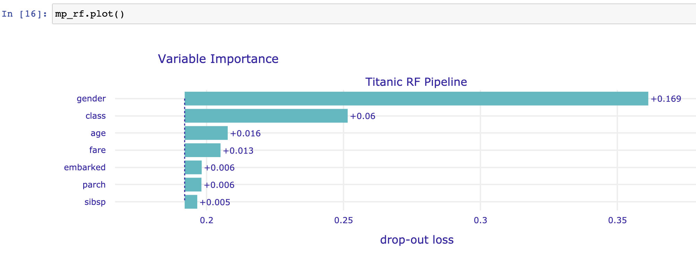

```{r load_models_VI, warning=FALSE, message=FALSE, echo=FALSE, eval=FALSE}
source("models/models_titanic.R")
```

```{r, echo=FALSE}
source("code_snippets/ema_init.R")
```

# Variable-importance Measures {#featureImportance}

## Introduction {#featureImportanceIntro}

In this chapter, we present a method that is useful for the evaluation of the importance of an explanatory variable. The method may be applied for several purposes.
  
* Model simplification: variables that do not influence a model's predictions may be excluded from the model. 
* Model exploration: comparison of variables' importance in different models may help in discovering interrelations between the variables. Also, the ordering of variables in the function of their importance is helpful in deciding in which order should we perform further model exploration. 
* Domain-knowledge-based model validation: identification of the most important variables may be helpful in assessing the validity of the model based on domain knowledge. 
* Knowledge generation: identification of the most important variables may lead to the discovery of new factors involved in a particular mechanism.

The methods for assessment of variable importance can be divided, in general, into two groups: model-specific and model-agnostic.

For linear models and many other types of models, there are methods of assessing of explanatory variable's importance that exploit particular elements of the structure of the model. These are model-specific methods. For instance, for linear models, one can use the value of the normalized regression coefficient or its corresponding p-value as the variable-importance measure. For tree-based ensembles, such a measure may be based on the use of a particular variable in particular trees (a great example is the variable importance measure based on out-of-bag data for a random forest model [@randomForestBreiman], but there are also other approaches like methods implemented in the `XgboostExplainer` package [@xgboostExplainer] for gradient boosting and `randomForestExplainer` [@randomForestExplainer] for random forest).

In this book, we focus on a model-agnostic method that does not assume anything about the model structure. Therefore, it can be applied to any predictive model or ensemble of models. Moreover, and perhaps even more importantly, it allows comparing an explanatory-variable's importance between models with different structures.

## Intuition {#featureImportanceIntuition}

We focus on the method described in more detail by @variableImportancePermutations. The main idea is to measure how much does a model's performance change if the effect of a selected explanatory variable, or of a group of variables, is removed? To remove the effect, we use perturbations, like resampling from an empirical distribution or permutation of the values of the variable. 

The idea is borrowed from the variable-importance measure proposed by @randomForestBreiman for random forest. If a variable is important, then we expect that, after permuting the values of the variable, the model's performance (as captured by one of the measures discussed in Chapter \@ref(modelPerformance)) will worsen. The larger the change in the performance, the more important is the variable.

Despite the simplicity of the idea, permutation-based-approach to measuring an explanatory-variable's importance is a very powerful model-agnostic tool for model exploration. Variable-importance measures obtained in this way may be compared between different models. This property is discussed in detail in Section \@ref(featureImportanceProsCons).

## Method {#featureImportanceMethod}

Consider a set of $n$ observations for a set of $p$ explanatory variables and dependent variable $Y$. Let $\underline{X}$ denote the matrix containing, in rows, the (transposed column-vectors of) observed values of the explanatory variables for all observations. Denote by $\underline{y}$ the column vector of the observed values of $Y$. Let $\hat{\underline{y}}=(f(\underline{x}_1),\ldots,f(\underline{x}_n))'$ denote the corresponding vector of predictions for $\underline{y}$ for model $f()$. 

Let $\mathcal L(\hat{\underline{y}}, \underline X, \underline{y})$ be a loss function that quantifies goodness-of-fit of model $f()$. For instance, $\mathcal L()$ may be the value of log-likelihood (see Chapter \@ref(modelPerformance)) or any other model performance measure discussed in previous chapter. Consider the following algorithm:

1. Compute $L^0 = \mathcal L(\hat{\underline{y}}, \underline X, \underline{y})$, i.e., the value of the loss function for the original data. Then, for each explanatory variable $X^j$ included in the model, do steps 2-5.
2. Create matrix $\underline{X}^{*j}$ by permuting the $j$-th column of $\underline{X}$, i.e., by permuting the vector of observed values of $X^j$.
3. Compute model predictions $\hat{\underline{y}}^{*j}$ based on the modified data $\underline{X}^{*j}$.
4. Compute the value of the loss function for the modified data:
$$
L^{*j} = \mathcal L(\hat{\underline{y}}^{*j}, \underline{X}^{*j}, \underline{y}).
$$
5. Quantify the importance of $X^j$ by calculating $vip_{Diff}^j = L^{*j} - L^0$ or $vip_{Ratio}^j = L^{*j} / L^0$. 

Note that the use of resampling or permuting data in Step 2 involves randomness. Thus, the results of the procedure may depend on the obtained configuration of resampled/permuted values. Hence, it is advisable to repeat the procedure several (many) times. In this way, the uncertainty associated with the calculated variable-importance values can be assessed.

The calculations in Step 5 "normalize" the value of the variable-importance measure with respect to $L^0$. However, given that $L^0$ is a constant, the normalization has no effect on the ranking of explanatory variables according to $vip_{Diff}^j$ nor $vip_{Ratio}^j$. Thus, in practice, often the values of $L^{*j}$ are simply used to quantify a variable's importance.

## Example: Titanic data {#featureImportanceTitanic}

In this section, we illustrate the use of the permutation-based variable-importance evaluation by applying it to the random-forest model for the Titanic data (see Section \@ref(model-titanic-rf)). Recall that the goal is to predict survival probability of passengers based on their gender, age, class in which they travelled, ticket fare, the number of persons they travelled with, and the harbour they embarked the ship on. 

We use the area under the ROC curve (AUC, see Section \@ref(modelPerformanceMethodBinGOP)) as the model-performance measure. Figure \@ref(fig:TitanicRFFeatImp) shows, for each explanatory variable included in the model, the values of $1-AUC^{*j}$ obtained by the algorithm described in the previous section. Additionally, the plot indicates the value of $L^0$ by the vertical dashed-line at the left-hand-side of the plot. The lengths of the bars correspond to $vip_{Diff}^j$ and provide the variable-importance measures.

```{r titanic1, warning=FALSE, message=FALSE, echo=FALSE}
library("randomForest")
library("dplyr")
library("DALEX")

#titanic_imputed <- archivist::aread("pbiecek/models/27e5c")
#titanic_rf_v6 <- archivist::aread("pbiecek/models/4e0fc")

explain_titanic_rf <- DALEX::explain(model = titanic_rf, 
                              data = titanic_imputed[,-9],
                              y = titanic_imputed$survived == "yes", 
                              label = "Random Forest",
                              verbose = FALSE)
```
  
(ref:TitanicRFFeatImpDesc) Single-permutation-based variable-importance measures for the explanatory variables included in the random-forest model for the Titanic data using 1-AUC as the loss function.

```{r TitanicRFFeatImp, warning=FALSE, message=FALSE, echo=FALSE, fig.width=6, fig.height=4, fig.cap='(ref:TitanicRFFeatImpDesc)', out.width = '70%', fig.align='center'}
library("ingredients")
library("ggplot2")
set.seed(1259)
fi_rf <- model_parts(explain_titanic_rf, loss_function = loss_one_minus_auc, B = 1, N = NULL) 
plot(fi_rf[-2,], show_boxplots = FALSE, bar_width = 7) + 
  ggtitle("Permutation-based variable importance","") + 
  ylab("Loss function: 1-AUC") + ylim(0.1, 0.35) + theme_ema
```

The plot in Figure \@ref(fig:TitanicRFFeatImp) suggests that the most important variable in the model is *gender*. This agrees with the conclusions drawn in the exploratory analysis presented in Section \@ref(exploration-titanic). The next three important variables are *class* (first-class patients had a higher chance of survival), *age* (children had a higher chance of survival), and *fare* (owners of more expensive tickets had a higher chance of survival).

To take into account the uncertainty related to the use of permutations, we can consider computing the mean values of $L^{*j}$ over a set of, say, 10 permutations. The plot in Figure \@ref(fig:TitanicRFFeatImp10) presents the mean values.  The only remarkable difference, as compared to Figure \@ref(fig:TitanicRFFeatImp), is the change in the ordering of the *sibsp* and *parch* variables.

(ref:TitanicRFFeatImp10Desc) Means (over 10 permutations) of permutation-based variable-importance measures for the explanatory variables included in the random-forest model for the Titanic data using 1-AUC as the loss function.

```{r TitanicRFFeatImp10, warning=FALSE, message=FALSE, echo=FALSE, fig.width=6, fig.height=4, fig.cap='(ref:TitanicRFFeatImp10Desc)', out.width = '70%', fig.align='center'}
set.seed(1259)
fi_rf <- model_parts(explain_titanic_rf, loss_function = loss_one_minus_auc, B = 10, N = NULL) 
plot(fi_rf[-2,], bar_width = 7) + 
  ggtitle("Permutation-based variable-importance","") + 
  ylab("Loss function: 1-AUC") + ylim(0.1,0.35) + theme_ema
```

Plots similar to those presented in Figures  \@ref(fig:TitanicRFFeatImp) and  \@ref(fig:TitanicRFFeatImp10) are useful for comparisons of a variable's importance in different models. Figure \@ref(fig:TitanicFeatImp) presents single-permutation results for the random-forest, logistic-regression (see Section \@ref(model-titanic-lmr)), and gradient-boosting (see Section \@ref(model-titanic-gbm)) models. The best result, in terms of the smallest value of $L^0$, is obtained for the random-forest model (as indicated by the location of the dashed lines in the plots). Note that the indicated $L^0$ value for the model is different from the one indicated in Figure \@ref(fig:TitanicRFFeatImp). This is due to the difference in the set of (random) permuations used to compute the two values.   

(ref:TitanicFeatImpDesc) Single-permutation-based variable-importance measures for the random-forest, gradient-boosting, and logistic-regression models for the Titanic data with 1-AUC as the loss function. Note that the bars start at different places for different methods. This is due to the fact that the output AUC value calculated on the original data is highest for random forest and lowest for linear regression. For less important variables such as embarked we see that even after its permutation the quality of the random forest model is better than the output of the additive linear regression models.

```{r TitanicFeatImp, warning=FALSE, message=FALSE, echo=FALSE, fig.width=7, fig.height=8, fig.cap='(ref:TitanicFeatImpDesc)', out.width = '70%', fig.align='center'}
library("gbm")
library("rms")
#titanic_lmr_v6 <- archivist::aread("pbiecek/models/58b24")
explain_titanic_lmr <- DALEX::explain(model = titanic_lmr, data = titanic_imputed[, -9],
    y = titanic_imputed$survived == "yes", label = "Logistic Regression", verbose = FALSE)
explain_titanic_lmr$model_info$type = "classification"
#titanic_gbm_v6 <- archivist:: aread("pbiecek/models/b7078")
explain_titanic_gbm <- DALEX::explain(model = titanic_gbm, data = titanic_imputed[, -9],
    y = titanic$survived == "yes", label = "Generalized Boosted Regression", verbose = FALSE)

set.seed(1259)
fi_rf <- model_parts(explain_titanic_rf, N = NULL)
set.seed(1259)
fi_gbm <- model_parts(explain_titanic_gbm, N = NULL)
set.seed(1259)
fi_glm <- model_parts(explain_titanic_lmr, N = NULL)

plot(fi_rf, fi_gbm, fi_glm, bar_width = 5) + ggtitle("Permutation-based variable importance","")+ 
  ylab("Loss function: 1-AUC") + theme_ema
```

The plots in Figure \@ref(fig:TitanicFeatImp) indicate that *gender* is the most important explanatory variable in all three models, followed by *class* and *age*. Variable *fare*, which is highly correlated with *class*, is important in the random-forest and SVM models, but not in the logistic-regression model. On the other hand, variable *parch* is, essentially, not important neither in the gradient-boosting nor in the logistic-regression model, but it has some importance in the random-forest model. *Country* is not important in any of the models. Overall, Figure \@ref(fig:TitanicFeatImp) indicates that, in the random-forest model, all variables (except of *country*) have got some importance, while in the other two models the effect is mainly limited to *gender*, *class*, and *age* (and *fare* for the gradient-boosting model).   

## Pros and cons {#featureImportanceProsCons}

Permutation-based variable importance offers several advantages. It is a model-agnostic approach to the assessment of the influence of an explanatory variable on a model's performance. The plots of variable-importance measures are easy to understand, as they are compact and present the most important variables in a single graph. The measures can be compared between models and may lead to interesting insights. For example, if variables are correlated, then models like random forest are expected to spread importance across many variables, while in regularized-regression models the effect of one variable may dominate the effect of other correlated variables.  

The same approach can be used to measure the importance of a single explanatory variable or a group of variables. The latter is useful for "aspects," i.e., groups of variables that are complementary to each other or are related to a similar concept. For example, in the Titanic example, the *fare* and *class* variables are related to the financial status of a passenger. Instead of assessing the importance of each of these variables separately, we may be interested in their joint importance. Toward this aim, we may compute the permutation-based measure by permuting the values of both variables at the same time.

The main disadvantage of the permutation-based variable-importance measure is its dependence on the random nature of the permutations. As a result, for different permutations, we will, in general, get different results. Also, the value of the measure depends on the choice of the loss function $\mathcal L()$. Thus, there is no single, "absolute" measure.

## Code snippets for R {#featureImportanceR}

In this section, we present variable importance metrics as implemented in the `DALEX` package for R. The package covers the most often used measures and methods presented in this chapter.  In particular, it includes function `model_parts()` that allows computation of the permutation-based variable-importance measures. For the purposes of the computation, one can choose among several loss fuctions that include `loss_sum_of_squares()`, `loss_root_mean_square()`, `loss_accuracy()`, `loss_cross_entropy()`, and `loss_one_minus_auc()`. For the definitions of the loss functions, see Chapter \@ref(modelPerformance).

For illustration purposes, we use the random-forest model `apartments_rf` for the apartment-prices data (see Section \@ref(model-Apartments-rf)). 

We first load the model-object via the `archivist` hook, as listed in Section \@ref(ListOfModelsApartments). We also load the `randomForest` package, as the model was fitted by using function `randomForest()` from this package (see Section \@ref(model-Apartments-rf)) and it is important to have the corresponding `predict()` function available.  
Then we construct the explainer for the model by using the function `explain()` from the `DALEX` package (see Section \@ref(ExplainersTitanicRCode)). Note that we use the `apartments_test` data frame without the first column, i.e., the *m2.price* variable, in the `data` argument. This will be the dataset to which the model will be applied (see Section \@ref(ExplainersApartmentsRCode)). The *m2.price* variable is explicitly specified as the dependent variable in the `y` argument. 

```{r, warning=FALSE, message=FALSE, eval=FALSE}
library("DALEX")
library("randomForest")
apartments_rf <- archivist::aread("pbiecek/models/fe7a5")
explainer_rf <- DALEX::explain(model = apartments_rf, 
                               data = apartments_test[,-1], 
                               y = apartments_test$m2.price, 
                               label = "Random Forest")
```
```{r, warning=FALSE, message=FALSE, echo=FALSE}
library("DALEX")
library("randomForest")
explainer_rf <- DALEX::explain(model = apartments_rf, 
                               data = apartments_test[,-1], 
                               y = apartments_test$m2.price, 
                               label = "Random Forest", 
                               colorize = FALSE)
```

A popular loss function is the root-mean-square-error (RMSE) function \@ref(eq:RMSE). It is implemented in the `DALEX` package as the `loss_root_mean_square()` function. The latter requires two arguments: `observed`, which indicates the vector of observed values of the dependent variable, and `predicted`, which specifies the object (either vector or a matrix, as returned from the model-specific `predict()` function) with the predicted values. The original-testing-data value $L^0$ of RMSE for the random-forest model can be obtained by applying the `loss_root_mean_square()` in the form given below.  

```{r, warning=FALSE, message=FALSE}
loss_root_mean_square(observed = apartments_test$m2.price, 
                   predicted = predict(apartments_rf, apartments_test))
```

To compute the permutation-based variable-importance measure, we apply the `model_parts()` function. Note that it is a wrapper for function `feature_importance()` from the `ingredients` package. The only required argument is `explainer`, which indicates the explainer-object (obtained with the help of the `explain()` function, see Section \@ref(ExplainersTitanicRCode)) for the model to be explained. The other arguments are:

* `loss_function`, the loss function to be used (by default, it is the `loss_root_mean_square` function);     
* `type`, the form of the variable-importance measure, with values "raw" resulting in the computation of $\mathcal L()$, "difference" yielding $vip_{Diff}^j$, and "ratio" providing $vip_{Ratio}^j$ (see Section \@ref(featureImportanceMethod));
* `variables`, a character vector providing the names of the explanatory variables, for which the variable-importance measure is to be computed. By default, `variables = NULL`, in which case computations are performed for all variables in the dataset.
* `variable_groups`, a list of character vectors of names of explanatory variables. For each vector, a single variable-importance measure is computed for the joint effect of the variables which names are provided in the vector. By default, `variable_groups = NULL`, in which case variable-importance measures are computed separately for all variables indicated in the `variables` argument.
* `B`, the number of permuations to be used for the purpose of calculation of the (mean) variable-importance measures, with `B = 10` used by default. To get a single-permutation-based measure, use `B = 1`.
* `N`, the number of observations that are to be sampled from the data available in the explainer-object  for the purpose of calculation of the variable-importance measure; by default, `N = 1000` is used; if `N = NULL`, the entire dataset is used.

To compute a single-permutation-based value of the RMSE for all the explanatory variables included in the random-forest model `apartments_rf`,  we apply the `model_parts()` function to the model's explainer-object as shown below. We use the `set.seed()` function to make the process of random selection of the permutation repeateable.

```{r, warning=FALSE, message=FALSE}
set.seed(1980)
model_parts(explainer = explainer_rf, 
        loss_function = loss_root_mean_square,
                    B = 1)
```

Note that the outcome is identical to the following call below (results not shown).

```{r, warning=FALSE, message=FALSE, eval=FALSE}
set.seed(1980)
model_parts(explainer = explainer_rf, 
        loss_function = loss_root_mean_square,
                    B = 1,
            variables = colnames(explainer_rf$data))
```

However, if we use a different ordering of the variables in the `variables` argument, the result is slightly different:

```{r, warning=FALSE, message=FALSE}
set.seed(1980)
vars <- c("surface","floor","construction.year","no.rooms","district")
model_parts(explainer = explainer_rf, 
        loss_function = loss_root_mean_square,
                    B = 1,
            variables = vars)
```

This is due to the fact that, despite the same seed, the first permutation is now selected for the *surface* variable, while in the previous code the same permutation was applied to the values of the *floor* variable.  

To compute the mean variable-importance measure based on 50 permutations and using the RMSE difference $vip_{Diff}^j$ (see Section \@ref(featureImportanceMethod)), we have got to specify the appropriate values of the `B` and `type` arguments.

```{r, warning=FALSE, message=FALSE}
set.seed(1980)
(vip.50 <- model_parts(explainer = explainer_rf, 
                   loss_function = loss_root_mean_square,
                               B = 50,
                            type = "difference"))
```

To obtain a graphical illustration, we apply the `plot()` function to the `vip.50` object. 

(ref:featureImportanceUnoPlotDesc) Mean variable-importance calculated using 50 permutations and the root-mean- squared-error loss for the random-forest model `apartments_rf` for the apartment-prices data. 

```{r, warning=FALSE, message=FALSE, eval=FALSE}
library("ggplot2")
plot(vip.50) +
  ggtitle("Mean variable-importance over 50 permutations", "") 
```
```{r featureImportanceUnoPlot, fig.cap='(ref:featureImportanceUnoPlotDesc)', echo=FALSE, warning=FALSE, message=FALSE, fig.width=6, fig.height=2.5, fig.align='center', out.width = '70%'}
library("ggplot2")
plot(vip.50, bar_width = 5) +
  ggtitle("Mean variable-importance over 50 permutations", "") + theme_ema
```

The resulting graph is presented in Figure \@ref(fig:featureImportanceUnoPlot). The bars in the plot indicate the mean values of the variable-importance measures for all explanatory variables. Box plots are added to the bars to provide an idea about the distribution of the values of the measure across the permutations. 

Variable-importance measures are a very useful tool for model comparison. We will illustrate this application by considering the random-forest model, linear-regression model (Section \@ref(model-Apartments-lr)), and support-vector-machine (SVM) model (Section \@ref(model-Apartments-svm)) for the apartment prices dataset. The models differ in their flexibility and structure; hence, it may be of interest to compare them. 

We first load the necessary model-objects via the `archivist` hooks, as listed in Section \@ref(ListOfModelsApartments). 

```{r, warning=FALSE, message=FALSE, echo=TRUE, eval=FALSE}
apartments_lm  <- archivist::aread("pbiecek/models/55f19")
apartments_svm <- archivist::aread("pbiecek/models/d2ca0")
```

Then we construct the corresponding explainer-objects. We also load the `e1071` package as it is important to have a suitable `predict()` function available for the SVM model.  

```{r, warning=FALSE, message=FALSE, echo=FALSE}
explainer_lm <- DALEX::explain(model = apartments_lm, 
                               data = apartments_test[,-1], 
                               y = apartments_test$m2.price, 
                               label = "Linear Regression", 
                               verbose = FALSE)

library("e1071")
explainer_svm <- DALEX::explain(model = apartments_svm, 
                                data = apartments_test[,-1], 
                                y = apartments_test$m2.price, 
                                label = "Support Vector Machine", 
                                verbose = FALSE)
```
```{r, warning=FALSE, message=FALSE, eval=FALSE}
explainer_lm <- DALEX::explain(model = apartments_lm, 
                               data = apartments_test[,-1], 
                               y = apartments_test$m2.price, 
                               label = "Linear Regression")

library("e1071")
explainer_svm <- DALEX::explain(model = apartments_svm, 
                                data = apartments_test[,-1], 
                                y = apartments_test$m2.price, 
                                label = "Support Vector Machine")
```

Subsequently, we compute mean values of the permutation-based variable-importance measure for 50 permutations and the RMSE loss function. Note that we use the `set.seed()` function to make the process of random selection of the permutation repeatable. By specifying `N = NULL` we include all the data from the apartments dataset in the calculations.

```{r, warning=FALSE, message=FALSE}
vip_lm  <- model_parts(explainer = explainer_lm,  B = 50, N = NULL)
vip_rf  <- model_parts(explainer = explainer_rf,  B = 50, N = NULL)
vip_svm <- model_parts(explainer = explainer_svm, B = 50, N = NULL)
```

Finally, we apply the `plot()` function to the created objects to obtain a single plot with the variable-importance measures for all three models. 

(ref:featureImportanceTriPlotDesc) Mean variable-importance calculated using 50 permutations and the root-mean-squared-error loss for the random-forest, support-vector-machine, and linear-regression models for the apartment-prices data. 

```{r, warning=FALSE, message=FALSE, eval=FALSE}
library("ggplot2")
plot(vip_rf, vip_svm, vip_lm) +
  ggtitle("Mean variable-importance over 50 permutations", "") 
```
```{r featureImportanceTriPlot, fig.cap='(ref:featureImportanceTriPlotDesc)',  warning=FALSE, echo=FALSE, message=FALSE, fig.width=8, fig.height=6, fig.align='center', out.width = '70%'}
library("ggplot2")
plot(vip_rf, vip_svm, vip_lm, bar_width = 5) +
  ggtitle("Mean variable-importance over 50 permutations", "") + theme_ema
```

The resulting graph is presented in Figure \@ref(fig:featureImportanceTriPlot). The plots suggest that the best result, in terms of the smallest value of $L^0$, is obtained for the SVM model (as indicated by the location of the dashed lines in the plots). The length of bars indicates that *district* is the most important explanatory variable in all three models, followed by *surface* and *floor*. *Construction year* is the fourth most important variable for the random-forest and SVM models, but it is not important in the linear-regression model at all. We will investigate the reason for this difference in the next chapter.


## Code snippets for Python {#featureImportancePython}

In this section, we use the `dalex` library for Python. The package covers all methods presented in this chapter. It is available on `pip` and `GitHub`. 

For illustration purposes, we use the `titanic_rf` random forest model for the Titanic data developed in Section \@ref(model-titanic-python-rf). Recall that the model is developed to predict the probability of survival for passengers of Titanic. 

In the first step we create an Explainer, an object that will provide a uniform interface for the predictive model. We use the `Explainer` constructor for this purpose.

```{python,  eval = FALSE}
import dalex as dx
titanic_rf_exp = dx.Explainer(titanic_rf, X, y, 
                  label = "Titanic RF Pipeline")
```

To calculate the model performance one can use the `model_parts` method. 

```{python,  eval = FALSE}
mp_rf = titanic_rf_exp.model_parts()
mp_rf.result
```

```{r examplePythonFIM1, echo=FALSE, out.width = '90%', fig.align='center'}
knitr::include_graphics("figure/python_model_parts_2.png")
```

The resulting object can be visualised with the `plot` method. 

```{python,  eval = FALSE}
mp_rf.plot()
```


```{r examplePythonFIM2, echo=FALSE, out.width = '90%', fig.align='center'}

```

The `model_parts` method has similar arguments as the corresponding R version. Among others, the user can set: `loss_function` e.g. `rmse` or `1-auc`; `type` one of `variable_importance`, `ratio`, `difference`; `variable_groups` groups of variables that shall be tested together.

For example, if we want to analyse the importance of groups of variables, we can set these groups in the following manner.

```{python,  eval = FALSE}
vi_grouped = titanic_rf_exp.model_parts(
                variable_groups={'personal': ['gender', 'age', 
                                              'sibsp', 'parch'],
                                   'wealth': ['class', 'fare']})
vi_grouped.result
```
