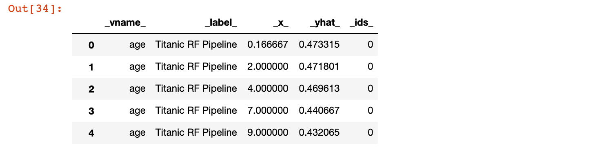
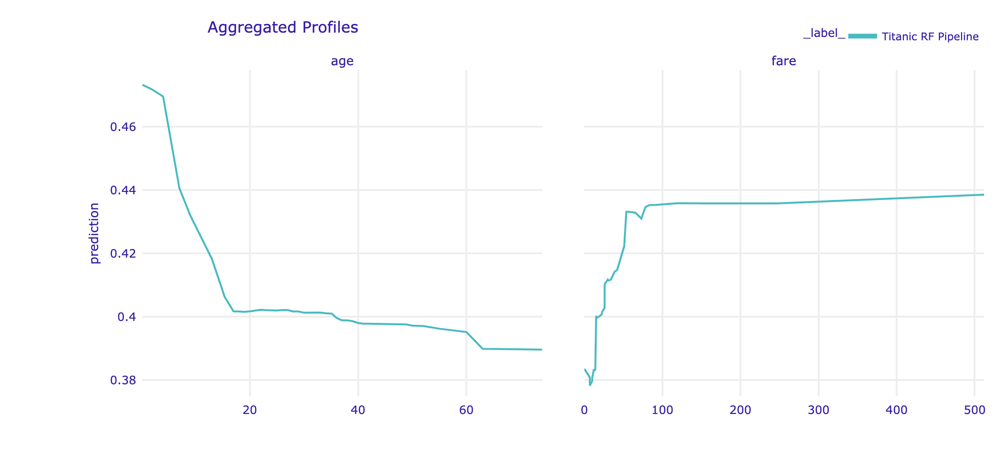
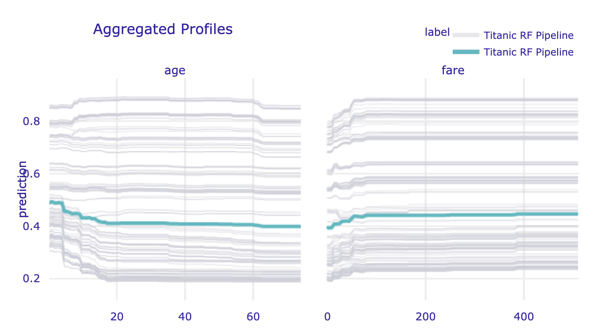
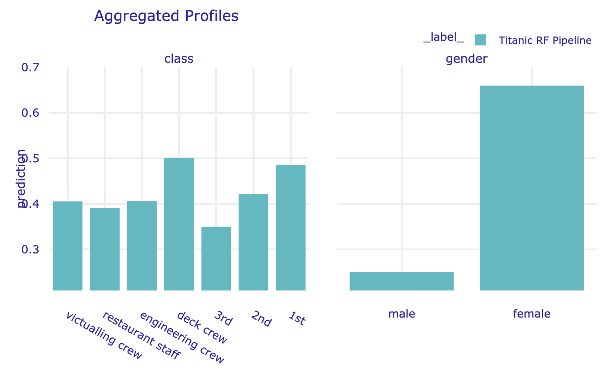
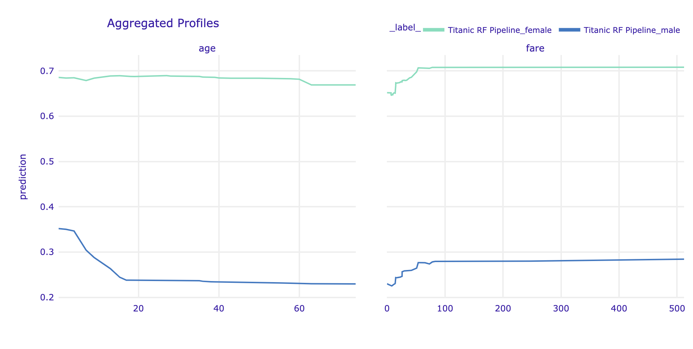

```{r load_models_FE, warning=FALSE, message=FALSE, echo=FALSE, eval=FALSE}
source("models/models_titanic.R")
source("models/models_apartments.R")
```

```{r, echo=FALSE, warning=FALSE}
source("code_snippets/ema_init.R")
```

# Partial-dependence Profiles {#partialDependenceProfiles}

## Introduction {#PDPIntro}

In this chapter, we focus on partial-dependence (PD) plots, sometimes also called PD profiles. They were introduced in the context of gradient boosting machines (GBM) by @Friedman00greedyfunction. For many years, PD profiles went unnoticed in the shadow of GBM. However, in recent years, they have become very popular and are available in many data-science-oriented packages like `DALEX` [@DALEX], `iml` [@imlRPackage], `pdp` [@pdpRPackage] or `PDPbox` [@PDPbox].

The general idea underlying the construction of PD profiles is to show how does the expected value of model prediction behave as a function of a selected explanatory variable? For a single model, one can construct an overall PD profile by using all observations from a dataset, or several profiles for sub-groups of the observations. Comparison of sub-group-specific profiles may provide important insight into, for instance, the stability of the model's predictions. 

PD profiles are also useful for comparisons of different models:

* *Agreement between profiles for different models is reassuring.* Some models are more flexible than others. If PD profiles for models, which differ with respect to flexibility, are similar, we can treat it as a piece of evidence that the more flexible model is not overfitting and that the models capture the same relationship.
* *Disagreement between profiles may suggest a way to improve a model.* If a PD profile of a simpler, more interpretable model disagrees with a profile of a flexible model, this may suggest a variable transformation that can be used to improve the interpretable model. For example, if a random forest model indicates a non-linear relationship between the dependent variable and an explanatory variable, then a suitable transformation of the explanatory variable may improve the fit or performance of a linear-regression model.
* *Evaluation of model performance at boundaries.* Models are known to have different behaviour at the boundaries of the possible range of a dependent variable, i.e., for the largest or the lowest values. For instance, random forest models are known to shrink predictions towards the average, whereas support-vector machines are known for a larger variance at edges. Comparison of PD profiles may help to understand the differences in models' behaviour at boundaries.

<!-- General idea is to show how the expected model response behaves as a function of a selected feature. Here the term ,,expected''  will be estimated simply as the average over the population of individual Ceteris Paribus Profiles introduced in Chapter \@ref(ceterisParibus).
-->

## Intuition {#PDPIntuition}

To show how does the expected value of model prediction behave as a function of a selected explanatory variable, the average of a set of individual ceteris-paribus (CP) profiles can be used. Recall that a CP profile (see Chapter \@ref(ceterisParibus)) shows the dependence of an instance-level prediction on an explanatory variable. A PD profile is estimated by the mean of the CP profiles for all instances (observations) from a dataset.

Note that, for additive models, CP profiles are parallel. In particular, they have got the same shape. Consequently, the mean retains the shape, while offering a more precise estimate. However, for models that, for instance, include interactions, CP profiles may not be parallel. In that case, the mean may not necessarily correspond to the shape of any particular profile. Nevertheless, it can still offer a summary of how (in general) do the model's predictions depend on changes in a given explanatory variable.

The left-hand-side panel of Figure \@ref(fig:pdpIntuition) presents CP profiles for the explanatory variable *age* in the random forest model `titanic_rf` (see Section \@ref(model-titanic-rf)) for 25 randomly selected instances (observations) from the Titanic dataset (see Section \@ref(TitanicDataset)). Note that the profiles are not parallel, indicating non-additive effects of explanatory variables. The right-hand-side panel shows the mean of the CP profiles, which offers an estimate of the PD profile. Clearly, the shape of the PD profile does not capture, for instance, the shape of the group of five CP profiles shown at the top of the panel. Nevertheless, it does seem to reflect the fact that the majority of CP profiles suggest a substantial drop in the predicted probability of survival for the ages between 2 and 18. 

(ref:pdpIntuitionDesc) Ceteris-paribus (CP) and partial-dependence (PD) profiles for the random forest model for 25 randomly selected observations from the Titanic dataset. Left-hand-side plot: CP profiles for *age*; blue dots indicate the age and the corresponding prediction for the selected observations. Right-hand-side plot: CP profiles (grey lines) and the corresponding PD profile (blue line).

```{r pdpIntuition, warning=FALSE, message=FALSE, echo=FALSE, fig.width=8, fig.height=5,  fig.cap='(ref:pdpIntuitionDesc)', fig.align='center', out.width='100%'}
library("DALEX")
library("randomForest")
library("ggplot2")

#titanic_imputed <- archivist::aread("pbiecek/models/27e5c")
#titanic_rf <- archivist::aread("pbiecek/models/4e0fc")
explain_titanic_rf <- DALEX::explain(model = titanic_rf, 
                              data = titanic_imputed[,-9],
                              y = titanic_imputed$survived == "yes", 
                              label = "Random Forest",
                              verbose = FALSE)
set.seed(30)
selected_passangers <- titanic_imputed[sample(1:nrow(titanic_imputed), 25),]
cp_rf <- predict_profile(explain_titanic_rf, selected_passangers, variables = "age",
                         variable_splits = list(age = seq(0, 70, 0.1)))
class(cp_rf) <- c("ceteris_paribus_explainer", "data.frame")
pl1 <- plot(cp_rf, variables = "age", color = "#46bac1") + 
      ingredients::show_observations(cp_rf, size = 3, variables = "age") +  
  scale_y_continuous(limits=c(0,1)) +
  ggtitle("Ceteris-paribus profiles","")  + theme_ema

pdp_rf <- model_profile(explain_titanic_rf, variables = "age")
class(cp_rf) <- c("ceteris_paribus_explainer", "data.frame")
pdp_rf$cp_profiles <- cp_rf
pl2 <- plot(pdp_rf, geom = "profiles") +
  scale_y_continuous(limits=c(0,1)) +
  ggtitle("Partial-dependence profile","")  + theme_ema

library("gridExtra")
grid.arrange(pl1, pl2, ncol = 2)
```

## Method {#PDPMethod}

### Partial-dependence profiles {#PDPs}

The value of a PD profile for model $f()$ and explanatory variable $X^j$ at $z$ is defined as follows:

\begin{equation}
g_{PD}^{j}(z) = E_{\underline{X}^{-j}}\{f(X^{j|=z})\}.
(\#eq:PDPdef0)
\end{equation}

Thus, it is the expected value of the model predictions when $X^j$ is fixed at $z$ over the (marginal) distribution of $\underline{X}^{-j}$, i.e., over the joint distribution of all explanatory variables other than $X^j$. Or, in other words, it is the expected value of the CP profile for $X^j$, defined in \@ref(eq:CPPdef), over the distribution of $\underline{X}^{-j}$. 

Usually, we do not know the true distribution of $\underline{X}^{-j}$. We can estimate it, however, by the empirical distribution of $n$, say, observations available in a training dataset. This leads to the use of the mean of CP profiles for $X^j$ as an estimator of the PD profile:

\begin{equation}
\hat g_{PD}^{j}(z) =  \frac{1}{n} \sum_{i=1}^{n} f(\underline{x}_i^{j|=z}).
(\#eq:PDPest)
\end{equation}

<!--
This formula comes from two steps.

1. Calculate ceteris paribus profiles for observations from the dataset.

As it was introduced in \@ref(ceterisParibus) ceteris paribus profiles show how model response change is a selected variable in this observation is modified.

$$
h^{f, j}_x(z) := f(x|^j = z).
$$

So for a single model and a single variable, we get a bunch of *what-if* profiles. In the figure \@ref(fig:pdpPart1) we show an example for 100 observations. Despite some variation (random forest are not as stable as we would hope) we see that most profiles are decreasing. So the older the passengers is the lower is the survival probability.

2. Aggregate Ceteris Paribus into a single Partial Dependency Profile

The simple pointwise average across CP profiles. If the number of CP profiles is large, it is enough to sample some number of them to get reasonably accurate PD profiles.
This way we get the formula \@ref(eq:PDPprofile).
-->

### Clustered partial-dependence profiles {#clusteredPDPs}

As it has been already mentioned, the mean of CP profiles is a good summary if the profiles are parallel. If they are not parallel, the average may not adequately represent the shape of a subset of profiles. To deal with this issue, one can consider clustering the profiles and calculating the mean separately for each cluster. To cluster the CP profiles, one may use standard methods like K-means or hierarchical clustering. The similarities between observations can be calculated based on the Euclidean distance between CP profiles.

Figure \@ref(fig:pdpPart4) illustrates an application of that approach to the random forest model `titanic_rf` (see Section \@ref(model-titanic-rf)) for 100 randomly selected instances (observations) from the Titanic dataset. The CP profiles for the *age* variable are marked in grey. It can be noted that they could be split into three clusters: one for a group of passengers with a substantial drop in the predicted survival probability for ages below 18 (with the average represented by the blue line), one with an almost linear decrease of the probability over the age (with the average represented by the red line), and one with almost constant predicted probability (with the average represented by the green line). The plot itself does not allow to identify the variables that may be linked with these clusters, but the additional exploratory analysis could be performed for this purpose.

(ref:pdpPart4Desc) Clustered partial-dependence profiles for *age* for the random forest model for 100 randomly selected observations from the Titanic dataset. Grey lines indicate ceteris-paribus profiles that are clustered into three groups with the average profiles indicated by the blue, green, and red lines.

```{r pdpPart4, warning=FALSE, message=FALSE, echo=FALSE, fig.width=6.5, fig.height=5.5,  fig.cap='(ref:pdpPart4Desc)', fig.align='center', out.width='75%'}
library("DALEX")
pdp_rf <- model_profile(explain_titanic_rf, 
                           variables = "age",
                           k = 3,  
                        variable_splits = list(age = seq(0, 70, 0.1)))
plot(pdp_rf, geom = "profiles") +
  ggtitle("Three clusters for 100 ceteris-paribus profiles for age","")  + theme_ema
```

### Grouped partial-dependence profiles {#groupedPDPs}

It may happen that we can identify an explanatory variable that influences the shape of CP profiles for the explanatory variable of interest. The most obvious situation is when a model includes an interaction between the variable and another one. In that case, a natural approach is to investigate the PD profiles for the variable of interest within the groups of observations defined by the variable involved in the interaction. 

Figure \@ref(fig:pdpPart5) illustrates an application of the approach to the random forest model `titanic_rf` (see Section \@ref(model-titanic-rf)) for 100 randomly selected instances (observations) from the Titanic dataset. The CP profiles for the explanatory-variable *age* are marked in grey. The red and blue lines present the PD profiles for females and males, respectively. The gender-specifc averages have different shapes: the predicted survival probability for females is more stable across different ages, as compared to males. Thus, the PD profiles clearly indicate an interaction between age and gender.

(ref:pdpPart5Desc) Partial-dependence profiles for two genders for the random forest model for 100 randomly selected observations from the Titanic dataset. Grey lines indicate ceteris-paribus profiles for *age*.

```{r pdpPart5, warning=FALSE, message=FALSE, echo=FALSE, fig.width=6.5, fig.height=5.5,  fig.cap='(ref:pdpPart5Desc)', fig.align='center', out.width='75%'}
pdp_rf <- model_profile(explain_titanic_rf, 
                           variables = "age",
                           groups = "gender",
                         variable_splits = list(age = seq(0, 70, 0.1)))
plot(pdp_rf, geom = "profiles") +
  ggtitle("Ceteris-paribus profiles for age, grouped by gender","") + theme_ema
```

### Contrastive partial-dependence profiles {#contrastivePDPs}

Comparison of clustered or grouped PD profiles for a single model may provide important insight into, for instance, the stability of the model's predictions. PD profiles can also be compared between different models.

Figure \@ref(fig:pdpPart7) presents PD profiles for *age* for the random forest model (see Section \@ref(model-titanic-rf)) and the logistic regression model with splines for the Titanic data (see Section \@ref(model-titanic-rf)). The profiles are similar with respect to a general relationship between *age* and the predicted probability of survival (the younger the passenger, the higher chance of survival). However, the profile for the random forest model is flatter. The difference between both models is the largest at the left edge of the age scale. This pattern can be seen as expected because random forest models, in general, shrink predictions towards the average and they are not very good for extrapolation outside the range of values observed in the training dataset.

(ref:pdpPart7Desc) Partial-dependence profiles for *age* for the random forest (green line) and logistic regression (blue line) models for the Titanic dataset.

```{r pdpPart7, warning=FALSE, message=FALSE, echo=FALSE, fig.width=6.5, fig.height=5.5,  fig.cap='(ref:pdpPart7Desc)', fig.align='center', out.width='75%'}

#cp_gbm <- partial_dependency(explain_titanic_gbm, selected_passangers)
#pdp_gbm <- aggregate_profiles(cp_gbm, variables = "age")
library("rms")
#titanic_lmr <- archivist::aread("pbiecek/models/58b24")
explain_titanic_lmr <- DALEX::explain(model = titanic_lmr, data = titanic_imputed[, -9],
    y = titanic_imputed$survived == "yes", label = "Logistic Regression", verbose = FALSE,type = "classification")

pdp_glm <- model_profile(explain_titanic_lmr, variables = "age",  variable_splits = list(age = seq(0, 70, 0.1)))
pdp_rf <- model_profile(explain_titanic_rf, variables = "age",  variable_splits = list(age = seq(0, 70, 0.1)))

plot(pdp_rf$agr_profiles, pdp_glm$agr_profiles) +
  ggtitle("Partial-dependence profiles for age for two models", "") + theme_ema 
```

## Example: apartment-prices data {#PDPExample}

In this section, we use PD profiles to evaluate performance of the random forest model (see Section \@ref(model-Apartments-rf)) for the apartment-prices dataset (see Section \@ref(ApartmentDataset)). Recall that the goal is to predict the price per square meter of an apartment. In our illustration, we focus on two explanatory variables, *surface* and *construction year*. We consider the predictions for the training dataset `apartments`. 

### Partial-dependence profiles

Figure \@ref(fig:pdpApartment1) presents CP profiles (grey lines) for 100 randomly-selected apartments together with the estimated PD profile (blue line) for *construction year* and *surface*.

PD profile for *surface* suggests an approximately linear relationship between the explanatory variable and the predicted price. On the other hand, PD profile for *construction year* is U-shaped: the predicted price is the highest for the very new and very old apartments. Note that, while the data were simulated, they were generated to reflect the effect of a lower quality of building materials used in rapid housing construction after the World War II.

(ref:pdpApartment1Desc) Ceteris-paribus and partial-dependence profiles for *construction year* and  *surface* for 100 randomly-selected apartments for the random forest model for the apartment-prices dataset.

```{r pdpApartment1, warning=FALSE, message=FALSE, echo=FALSE, fig.width=8, fig.height=5.5, fig.cap='(ref:pdpApartment1Desc)', fig.align='center', out.width='100%'}
library("randomForest")
#apartments_rf <- archivist::aread("pbiecek/models/fe7a5")
explain_apartments_rf <- DALEX::explain(model = apartments_rf, data = apartments[,-1],
    y = apartments$m2.price, label = "Random Forest", verbose = FALSE)
pd_rf <- model_profile(explain_apartments_rf, variables = c("construction.year","surface"))
plot(pd_rf, variables = c("construction.year","surface"), geom = "profiles") + 
  ggtitle("Partial-dependence profiles on the predicted price per square meter","") + theme_ema 
```

### Clustered partial-dependence profiles

Almost all CP profiles for *construction year*, presented in Figure \@ref(fig:pdpApartment1), seem to be U-shaped. The same shape is observed for the PD profile. One might want to confirm that the shape is, indeed, common for all the observations. The left-hand-side panel of Figure \@ref(fig:pdpApartment1clustered) presents clustered PD profiles for *construction year* for three clusters derived from the CP profiles presented in Figure \@ref(fig:pdpApartment1). The three PD profiles differ slightly in the size of the oscillations at the edges, but they all are U-shaped. Thus, we could conclude that the overall PD profile adequately captures the shape of the CP profiles. Or, put differently, there is little evidence that there might be any strong interaction between year of construction and any other variable in the model. Similar conclusions can be drawn for the CP and PD profiles for *surface*, presented in the right-hand-side panel of Figure \@ref(fig:pdpApartment1clustered).

(ref:pdpApartment1clusteredDesc) Ceteris-paribus (grey lines) and partial-dependence profiles (red, green, and blue lines) for three clusters for 100 randomly-selected apartments for the random forest model for the apartment-prices dataset. Left-hand-side panel: profiles for *construction year*. Right-hand-side panel: profiles for *surface*.

```{r pdpApartment1clustered, warning=FALSE, message=FALSE, echo=FALSE, fig.width=8, fig.height=5.5,  fig.cap='(ref:pdpApartment1clusteredDesc)', fig.align='center', out.width='100%'}
pd_rf <- model_profile(explain_apartments_rf, 
                          variables = c("construction.year", "surface"),
                          k = 3)

plot(pd_rf, variables = c("construction.year", "surface"), 
     geom = "profiles")  +
  ggtitle("Three clusters for 100 ceteris-paribus profiles","")  + theme_ema
```

### Grouped partial-dependence profiles

One of the categorical explanatory variables in the apartment prices dataset is *district*. We may want to investigate whether the relationship between the model's predictions and *construction year* and *surface* is similar for all districts. Toward this aim, we can use grouped PD profiles, for groups of apartments defined by districts.

Figure \@ref(fig:pdpApartment2) shows PD profiles for *construction year* (left-hand-side panel) and *surface* (right-hand-side panel) for each district. Several observations are worth making. First, profiles for apartments in "Srodmiescie" (Downtown) are clearly much higher than for other districts. Second, the profiles are roughly parallel, indicating that the effects of *construction year* and *surface* are similar for each level of *district*. Third, the profiles appear to form three clusters, i.e., "Srodmiescie" (Downtown), three districts close to "Srodmiescie" (namely "Mokotow", "Ochota", and "Ursynow"), and the six remaining districts.

(ref:pdpApartment2Desc) Partial-dependence profiles for separate districts for the random forest model for the apartment-prices dataset. Left-hand-side panel: profiles for *construction year*. Right-hand-side panel: profiles for *surface*.

```{r pdpApartment2, warning=FALSE, message=FALSE, echo=FALSE, fig.width=8, fig.height=5.5, fig.cap='(ref:pdpApartment2Desc)', fig.align='center', out.width='100%'}
pd_rf <- model_profile(explain_apartments_rf, 
                          variables = c("construction.year", "surface"),
                          groups = "district")

plot(pd_rf, variables = c("construction.year", "surface"), 
     geom = "profiles") +
  ggtitle("Partial-dependence profiles by district", "") + theme_ema
```

### Contrastive partial-dependence profiles

One of the main challenges in predictive modelling is to avoid overfitting. The issue is particularly important for flexible models, such as random forest models. 

Figure \@ref(fig:pdpApartment3) presents PD profiles for *construction year* (left-hand-side panel) and *surface* (right-hand-side panel) for the linear-regression model (see Section \@ref(model-Apartments-lr)) and the random forest model. Several observations are worth making. The linear-regression model cannot, of course, accommodate the non-monotonic relationship between *construction year* and the price per square meter. However, for *surface*, both models support a linear relationship, though the slope of the line resulting from the linear regression is steeper. This may be seen as an expected difference, given that random forest models yield predictions that are shrunk towards the mean. Overall, we could cautiously conclude that there is not much evidence for overfitting of the more flexible random forest model. 

Note that the non-monotonic relationship between *construction year* and the price per square meter might be the reason why the explanatory variable was found not to be important in the model in Section \@ref(featureImportanceR). 

In Section \@ref(predictionsApartments), we mentioned that a proper model exploration may suggest a way to construct a model with improved performance, as compared to the random forest and linear-regression models. In this respect, it is worth observing that the profiles in Figure \@ref(fig:pdpApartment3) suggest that both models miss some aspects of the data. In particular, the linear-regression model does not capture the U-shaped relationship between *construction year* and the price. On the other hand, the effect of *surface* on the apartment price seems to be underestimated by the random forest model. Hence, one could conclude that, by addressing the issues, one could improve either of the models, possibly with an improvement in predictive performance.  

(ref:pdpApartment3Desc) Partial-dependence profiles for the linear-regression and random forest models for the apartment-prices dataset. Left-hand-side panel: profiles for *construction year*. Right-hand-side panel: profiles for *surface*.

```{r pdpApartment3, warning=FALSE, message=FALSE, echo=FALSE, fig.width=8, fig.height=5.5, fig.cap='(ref:pdpApartment3Desc)', fig.align='center', out.width='85%'}
apartments_lm <- archivist::aread("pbiecek/models/55f19")
explain_apartments_lm <- DALEX::explain(model = apartments_lm, data = apartments[,-1], 
    y = apartments$m2.price, label = "Linear Regression", verbose = FALSE)
pdp_lm <- model_profile(explain_apartments_lm, 
                          variables = c("construction.year", "surface"))
pdp_rf <- model_profile(explain_apartments_rf, 
                          variables = c("construction.year", "surface"))
plot(pdp_rf$agr_profiles, pdp_lm$agr_profiles) +
  ggtitle("Partial-dependence profiles for two models","") + theme_ema

```

## Pros and cons {#PDPProsCons}

PD profiles, presented in this chapter, offer a simple way to summarize the effect of a particular explanatory variable on the dependent variable. They are easy to explain and intuitive. They can be obtained for sub-groups of observations and compared across different models. For these reasons, they have gained in popularity and have been implemented in various software packages, including R and Python. 

Given that the PD profiles are averages of CP profiles, they inherit the limitations of the latter. In particular, as CP profiles are problematic for correlated explanatory variables (see Section \@ref(CPProsCons)), PD profiles are also not suitable for that case, as they may offer a crude and potentially misleading summarization. An approach to deal with this issue will be discussed in the next chapter. 

## Code snippets for R {#PDPR}

In this section, we present the `DALEX` package for R, which covers the methods presented in this chapter. It uses the `ingredients` package with various implementations of variable profiles. Similar functions can be found in packages `pdp` [@pdpRPackage], `ALEPlots` [@ALEPlotRPackage], and `iml` [@imlRPackage].

For illustration purposes, we use the random forest model `titanic_rf` (see Section \@ref(model-titanic-rf)) for the Titanic data. Recall that the model has been developed to predict the probability of survival from the sinking of Titanic. 
We first retrieve the version of the `titanic` data with imputed missing values and the `titanic_rf` model-object via the `archivist` hooks, as listed in Section \@ref(ListOfModelsTitanic). Then we construct the explainer for the model by using function `explain()` from the `DALEX` package (see Section \@ref(ExplainersTitanicRCode)). Note that, beforehand, we have got to load the `randomForest` package, as the model was fitted by using function `randomForest()` from this package (see Section \@ref(model-titanic-rf)) and it is important to have the corresponding `predict()` function  available. 
 
```{r, warning=FALSE, echo = FALSE, message=FALSE}
library("DALEX")
library("randomForest")
#titanic_imputed <- archivist::aread("pbiecek/models/27e5c")
#model_rf <- archivist::aread("pbiecek/models/4e0fc")
explainer_rf <- DALEX::explain(model = titanic_rf,  
                               data = titanic_imputed[, -9],
                               y = titanic_imputed$survived, 
                               label = "Random Forest", 
                               verbose = FALSE)
```
```{r, warning=FALSE, eval= FALSE, message=FALSE}
library("DALEX")
library("randomForest")
titanic_imputed <- archivist::aread("pbiecek/models/27e5c")
titanic_rf <- archivist::aread("pbiecek/models/4e0fc")
explainer_rf <- DALEX::explain(model = titanic_rf,  
                               data = titanic_imputed[, -9],
                               y = titanic_imputed$survived, 
                               label = "Random Forest")
```

### Partial-dependence profiles

The function that allows computation of PD profiles in the `DALEX` package is `model_profile()`. The only required argument is `explainer`, which indicates the explainer-object (obtained with the help of the `explain()` function, see Section \@ref(ExplainersTitanicRCode)) for the model to be explained. The other useful arguments include:

* `variables`, a character vector providing the names of the explanatory variables, for which the profile is to be computed; by default, `variables = NULL`, in which case computations are performed for all numerical variables included in the model.
* `N`, the number of (randomly sampled) observations that are to be used for the calculation of the PD profiles (`N = 100` by default); `N = NULL` implies the use of the entire dataset included in the explainer-object.
* `type`, the type of the PD profile, with values `"partial"` (default), `"conditional"`, and `"accumulated"`.
* `variable_type`, a character string indicating whether calculations should be performed only for `"numerical"`  	 (continuous) explanatory variables (default) or only for `"categorical"` variables.
* `groups`, the name of the explanatory variable that will be used to group profiles, with `groups = NULL` by default (in which case no grouping of profiles is applied).
* `k`, the number of clusters to be created with the help of the `hclust()` function, with `k = NULL` used by default and implying no clustering.

In the example below, we calculate the PD profile for *age* by applying the `model_profile()` function to the explainer-object for the random forest model. By default, the profile is based on 100 randomly selected observations. 

```{r pdpExample1, warning=FALSE, message=FALSE}
pdp_rf <- model_profile(explainer = explainer_rf, variables = "age")
```

The resulting object of class `model_profile` contains the PD profile for *age*. By applying the `plot()` function to the object, we obtain a plot of the PD profile. Had we not used the `variables` argument, we would have obtained separate plots of PD profiles for all continuous explanatory variables.

```{r pdpExample1Plot, warning=FALSE, message=FALSE, eval = FALSE, fig.width=6.5, fig.height=5,  fig.cap="Partial dependence profile for age.", fig.align='center', out.width='80%'}
library("ggplot2")
plot(pdp_rf) +  ggtitle("Partial-dependence profile for age") 
```

The resulting plot for *age* (not shown) corresponds to the one presented for in Figure \@ref(fig:pdpPart7). It may slightly differ, as the two plots are based on different sets of (randomly selected) 100 observations from the Titanic dataset.

A PD profile can be plotted on top of CP profiles. This is a very useful feature if we want to check how well the former captures the latter. It is worth noting that, apart from the PD profile, the object created by the `model_profile()` function also contains the CP profiles for the selected observations and all explanatory variables included in the model. By specifying the argument `geom = "profiles"` in the `plot()` function, we add the CP profiles to the plot of the PD profile. 
 
```{r pdpExample2Plot, warning=FALSE, message=FALSE, eval = FALSE}
plot(pdp_rf, geom = "profiles") + 
    ggtitle("Ceteris-paribus and partial-dependence profiles for age") 
```

The resulting plot (not shown) is essentially the same as the one shown in the right-hand-side panel of Figure \@ref(fig:pdpIntuition). 
 
### Clustered partial-dependence profiles

To calculate clustered PD profiles, we have got to cluster the CP profiles. Toward this aim, we use the `k` argument of the `model_profile()` function that specifies the number of clusters that are to be formed by the `hclust()` function. In the code below, we specify that three clusters are to be formed for profiles for *age*. 

```{r pdpExample3, warning=FALSE, message=FALSE}
pdp_rf_clust <- model_profile(explainer = explainer_rf, 
                              variables = "age", k = 3)
```

The clustered PD profiles can be plotted on top of the CP profiles by using the `geom = "profiles"` argument in the `plot()` function. 

```{r pdpExample3Plot, warning=FALSE, message=FALSE, eval = FALSE, fig.width=6.5, fig.height=5,  fig.cap="Clustered partial-dependence profiles for age.", fig.align='center', out.width='80%'}
plot(pdp_rf_clust, geom = "profiles") + 
    ggtitle("Clustered partial-dependence profiles for age") 
```

The resulting plot (not shown) resembles the one shown for the random forest model in Figure \@ref(fig:pdpPart4). The only difference may stem from the fact that the two plots are based on a different set of (randomly selected) 100 observations from the Titanic dataset.

### Grouped partial-dependence profiles

The `model_profile()` function admits the `groups` argument that allows constructing PD profiles for groups of observations defined by the levels of an explanatory variable. In the example below, we use the argument to obtain PD profiles for *age*, while grouping them by *gender*. 

```{r pdpExample4, warning=FALSE, message=FALSE}
pdp_rf_gender <- model_profile(explainer = explainer_rf, 
                               variables = "age", groups = "gender")
```

The grouped PD profiles can be plotted on top of the CP profiles by using the `geom = "profiles"` argument in the `plot()` function. 

```{r pdpExample4Plot, warning=FALSE, message=FALSE, eval = FALSE, fig.width=6.5, fig.height=5,  fig.cap="Grouped Partial dependence profiles.", fig.align='center', out.width='80%'}
plot(pdp_rf_gender, geom = "profiles") + 
    ggtitle("Partial-dependence profiles for age, grouped by gender") 
```

The resulting plot (not shown) resembles the one shown in Figure \@ref(fig:pdpPart5).

### Contrastive partial-dependence profiles

It may be of interest to compare PD profiles for several models. We will compare the random forest model with the linear-regression model `titanic_lmr` (see Section \@ref(model-titanic-lmr)). For the latter, we first have got to load it via the `archivist` hook, as listed in Section \@ref(ListOfModelsApartments). Then we construct the explainer for the model by using function `explain()`. Note that we first load the `rms` package, as the model was fitted by using function `lmr()` from this package (see Section \@ref(model-titanic-lmr)) and it is important to have the corresponding `predict()` function available. Finally, we apply the `model_profile()` function to compute CP profiles and the PD profile for *age* based on 100 randomly-selected observations from the Titanic dataset. We also repeat the calculations of the profiles for the random forest model.  

```{r, warning=FALSE, message=FALSE, eval= FALSE}
library("rms")
titanic_lmr <- archivist::aread("pbiecek/models/58b24")
explainer_lmr <- DALEX::explain(model = titanic_lmr, 
                                data = titanic_imputed[, -9],
                                y = titanic_imputed$survived, 
                                label = "Logistic Regression")

pdp_lmr <- model_profile(explainer = explainer_lmr, variables = "age")
pdp_rf <- model_profile(explainer = explainer_rf, variables = "age")
```
```{r pdpExample5, warning=FALSE, message=FALSE, echo = FALSE}
library("rms")
explainer_lmr <- DALEX::explain(model = titanic_lmr, 
                                data = titanic_imputed[, -9],
                                y = titanic_imputed$survived, 
                                label = "Logistic Regression", 
                                verbose = FALSE)
pdp_lmr <- model_profile(explainer = explainer_lmr, variables = "age")
pdp_rf <- model_profile(explainer = explainer_rf, variables = "age")
```

To overlay the PD profiles for *age* for the two models in a single plot, we apply the `plot()` function to the  `model_profile`-class objects for the two models that contain the profiles for *age*.   

```{r pdpExample5Plot, warning=FALSE, message=FALSE, eval = FALSE, fig.width=6.5, fig.height=5,  fig.cap="Partial-dependence profiles for age for two models.", fig.align='center', out.width='80%'}
plot(pdp_rf, pdp_lmr) +
    ggtitle("Partial-dependence profiles for age for two models") 
```

As a result, the profiles are plotted in a single plot. The resulting graph (not shown) is essentially the same as the one presented in Figure \@ref(fig:pdpPart7), with a possible difference due to the use of a different set of (randomly selected) 100 observations from the Titanic dataset.

## Code snippets for Python {#PDPPython}

In this section, we use the `dalex` library for Python. The package covers all methods presented in this chapter. It is available on `pip` and `GitHub`. Similar functions can be found in library `PDPbox` [@PDPbox].

For illustration purposes, we use the `titanic_rf` random forest model for the Titanic data developed in Section \@ref(model-titanic-python-rf). Recall that the model is developed to predict the probability of survival for passengers of Titanic. 

In the first step, we create an explainer-object that will provide a uniform interface for the predictive model. We use the `Explainer()` constructor for this purpose.

```{python,  eval = FALSE}
import dalex as dx
titanic_rf_exp = dx.Explainer(titanic_rf, X, y, 
                  label = "Titanic RF Pipeline")
```

The function that allows calculations of PD profiles is `model_profile()`. By default, it calculates profiles for all continuous variables. The other useful arguments include:

* `variables`, a `str`, `list`, `np.ndarray` or `pd.Series` providing the names of the explanatory variables, for which the profile is to be computed; by default computations are performed for all numerical variables included in the model.
* `N`, the number of (randomly sampled) observations that are to be used for the calculation of the PD profiles (`N = 300` by default); `N = None` implies the use of the entire dataset included in the explainer-object.
* `B`, the number of times (by default, 10) the entire procedure is to be repeated;
* `type`, the type of the PD profile, with values `'partial'` (default), `'conditional'`, and `'accumulated'`;
* `variable_type`, a character string indicating whether calculations should be performed only for `'numerical'` (continuous) explanatory variables (default) or only for `'categorical'` variables;
* `groups`, the name or list of names of the explanatory variable that will be used to group profiles, with `groups = None` by default (in which case no grouping of profiles is applied).

In the example below, we calculate the PD profiles for *age* and *fare* by applying the `model_profile()` function to the explainer-object for the random forest model. By default, the profile is based on 300 randomly selected observations.

```{python,  eval = FALSE}
pd_rf = titanic_rf_exp.model_profile(variables = ['age', 'fare'])
pd_rf.result
```

```{r examplePythonMProfile1, echo=FALSE, out.width = '70%'}

```

The results can be visualised by applying the `plot()` method. Figure \@ref(fig:examplePythonMProfile2) presents the created plot.

```{python,  eval = FALSE}
mp_rf.plot()
```

(ref:examplePythonMProfile2Desc) Partial-dependence profiles for *age* and *fare* for the random forest model for the Titanic data, obtained by using the `plot()` method in Python. 

```{r examplePythonMProfile2, echo=FALSE, out.width = '100%', fig.align='center', fig.cap='(ref:examplePythonMProfile2Desc)'}

```

A PD profile can be plotted on top of CP profiles. This is a very useful feature if we want to check how well does the former captures the latter. By specifying the argument `geom = 'profiles'` in the `plot()` method, we add the CP profiles to the plot of the PD profile. 

```{python,  eval = FALSE}
mp_rf.plot(geom = 'profiles')
```

Left part of the resulting plot (see figure \@ref(fig:examplePythonMProfile7)) is essentially the same as the one shown in the right-hand-side panel of Figure \@ref(fig:pdpIntuition). 

(ref:examplePythonMProfile7Desc) Partial-dependence profiles (blue) with corresponding ceteris-paribus profiles (grey) for *age* and *fare* for the random forest model for the Titanic data, obtained by using the `plot()` method in Python. 

```{r examplePythonMProfile7, echo=FALSE, out.width = '100%', fig.align='center', fig.cap='(ref:examplePythonMProfile7Desc)'}

```

By default, the `model_profile()` function computes the PD profiles only for continuous explanatory variables. To obtain the profiles for categorical variables, in the code that follows we use the argument `variable_type='categorical'`. Additionally, in the call to the `plot()` method we indicate that we want to display the profiles only to variables *class* and *gender*. 

```{python,  eval = FALSE}
mp_rf = titanic_rf_exp.model_profile( variable_type = 'categorical')
mp_rf.plot(variables = ['gender', 'class'])
```

The resulting plot is presented in Figure \@ref(fig:examplePythonMProfile3). 

(ref:examplePythonMProfile3Desc) Partial-dependence profiles for *class* and *gender* for the random forest model for the Titanic data, obtained by using the `plot()` method in Python.

```{r examplePythonMProfile3, echo=FALSE, out.width = '100%', fig.align='center', fig.cap='(ref:examplePythonMProfile3Desc)'}

```

### Grouped partial-dependence profiles

The `model_profile()` function admits the `groups` argument that allows constructing PD profiles for groups of observations defined by the levels of an explanatory variable. In the code below, we use the argument to compute the profiles for *age* and *fare*, while grouping them by *class*. Subsequently, we use the `plot()` method to obtain a graphical presentation of the results. The resulting plot is presented in Figure \@ref(fig:examplePythonMProfile4).

```{python,  eval = FALSE}
mp_rf = titanic_rf_exp.model_profile(groups = 'class', 
                                  variables = ['age', 'fare'])
mp_rf.plot()
```

(ref:examplePythonMProfile4Desc) Partial-dependence profiles for *age* and *fare*, grouped by *class*, for the random forest model for the Titanic data, obtained by using the `plot()` method in Python. 

```{r examplePythonMProfile4, echo=FALSE, out.width = '100%', fig.align='center', fig.cap='(ref:examplePythonMProfile4Desc)'}

```

### Contrastive partial-dependence profiles

It may be of interest to compare PD profiles for several models. As an illustration, we will compare the random forest model with the logistic regression model `titanic_lr` (see Section \@ref(model-titanic-python-lr)). First, we have got to compute to the profiles for both models by using the `model_profile()` function.

```{python,  eval = FALSE}
pdp_rf = titanic_rf_exp.model_profile()
pdp_lr = titanic_lr_exp.model_profile()
```

Subsequently, we apply the `plot()` method to plot the profiles. Note that, in the code below, we use the `variables` argument to limit the display to variable *age* and *fare*.

```{python,  eval = FALSE}
pdp_rf.plot(pdp_lr, variables = ['age', 'fare'])
```

As a result, the profiles for *age* and *fare* are presented in a single plot. The resulting graph is presented in Figure \@ref(fig:examplePythonMProfile6)).

(ref:examplePythonMProfile6Desc) Partial-dependence profiles for *age* and *fare* for two models, random forest model and logistic regression model for the Titanic data. 

```{r examplePythonMProfile6, echo=FALSE, out.width = '100%', fig.align='center', fig.cap='(ref:examplePythonMProfile6Desc)'}
knitr::include_graphics("figure/python_model_profile_6.png")
```
