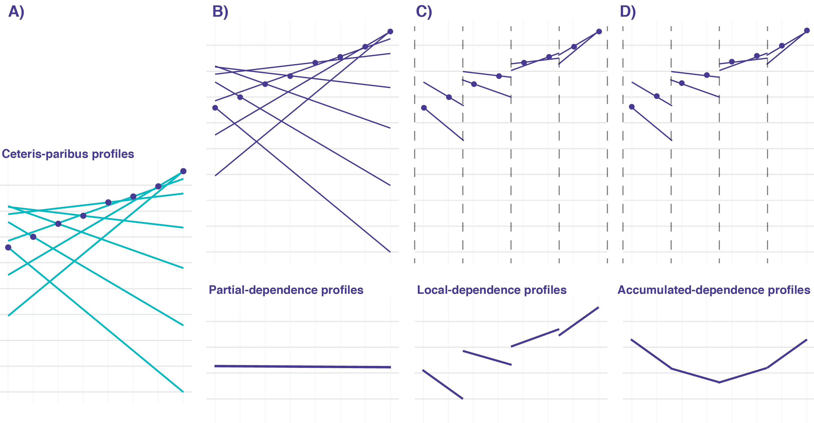

```{r load_models_ALE, warning=FALSE, message=FALSE, echo=FALSE}
source("models/models_titanic.R")
source("models/models_apartments.R")
```

# Local-dependence and Accumulated Local Profiles {#accumulatedLocalProfiles}

## Introduction {#ALPIntro}

Partial-dependence (PD) profiles, introduced in the previous chapter, are easy to explain and interpret, especially given their estimation as an average of Ceteris-paribus (CP) profiles. However, as it was mentioned in Section \@ref(PDPProsCons), the profiles may be misleading if the explanatory variables are correlated. In many applications, this is the case. For example, in the Apartments dataset (see Section \@ref(ApartmentDataset)), one can expect that variables ''surface'' and ''number of rooms'' may be positively correlated, because apartments with larger number of rooms usually also have a larger surface. Thus, it is not realistic to consider, for instance, an apartment with 5 rooms and 20 square meters. Similarly, in the Titanic dataset, a positive correlation can be expected for the values of variables ''fare'' and ''passenger class'', as tickets in the higher classes are more expensive than in the lower classes. 

In this chapter, we present accumulated local (AL) profiles that address this issue. As they are related to local-dependence (LD) profiles, we introduce the latter first. Both approaches were proposed in ,,ALEPlot: Accumulated Local Effects (ALE) Plots and Partial Dependence (PD) Plots'' [@ALEPlotRPackage].


## Intuition {#ALPIntuition}

<!--
The general idea behind LD profiles is to use the conditional distribution of the instead of marginal distribution to accommodate for the dependency between $x^j$ and $x^{-j}$.
The general idea behind Accumulated Local Profiles is to accumulate local changes in model response affected by single feature $x^j$.

Intuition behind Partial Dependency profiles and their extensions is presented in Figure \@ref(fig:accumulatedLocalEffects).
-->

Let us consider the following, simple nonlinear model with for two explanatory variables: 

\begin{equation}
f(x_1, x_2) = (x_1 + 1)\cdot x_2.
(\#eq:trickyModel)
\end{equation}

Moreover, assume that explanatory variables $X^1$ and $X^2$ are uniformly distributed over the interval $[-1,1]$ and perfectly correlated, i.e., $X^2 = X^1$. Suppose that we have got the following dataset with 8 observations:


| i     | 1  |     2 |     3 |     4 |     5 |     6 |     7 |  8  |
|-------|----|-------|-------|-------|-------|-------|-------|-----|
| $X^1$ | -1 | -0.71 | -0.43 | -0.14 |  0.14 |  0.43 |  0.71 |  1  |
| $X^2$ | -1 | -0.71 | -0.43 | -0.14 |  0.14 |  0.43 |  0.71 |  1  |
| $y$   | 0  | -0.2059 | -0.2451 | -0.1204 |  0.1596 |  0.6149 |  1.2141 |  2  |

Note that, for both $X^1$ and $X^2$, the sum of all observed values is equal to 0. 

The top part of Panel A of Figure \@ref(fig:accumulatedLocalEffects) shows CP profiles for $X^1$ for model \@ref(eq:trickyModel) calculated for the eight observations. The bottom part of the panel presents the corresponding estimate of the PD profile for $X^1$, i.e., the average of the CP profiles. The profile suggests no effect of variable $X^1$, which is clearly a misleading conclusion.

To understand the reason, let us explicitly express the CP profile for $X^1$ for model \@ref(eq:trickyModel):

\begin{equation}
h^{(x_1 + 1) \cdot x_2 , 1}_{x_1,x_2}(z) = f(z,x_2) = (z+1)\cdot x_2.
(\#eq:CPtrickyModel)
\end{equation}

By allowing $z$ to take any value in the interval $[-1,1]$, we get the CP profiles as straight lines with the slope equal to the value of variable $X^2$. Hence, for instance, the CP profile for observation $(-1,-1)$ is a straight line with the slope equal to -1. 

Recall that the PD profile for $X^j$, defined in equation \@ref(eq:PDPdef0), is the expected value, over the joint distribution of all explanatory variables other than $X^j$, of the model predictions when $X^j$ is set to $z$. This leads to the estimation of the profile by taking the average of CP profiles for $X^j$ (see equation \@ref(eq:PDPest)). 
 
In our case, this implies that the PD profile for $X^1$ is the expected value of the model predictions over the distribution of $X^2$, i.e., over the uniform distribution on the interval $[-1,1]$. Thus, the PD profile is estimated by taking the average of the CP profiles (see \@ref(eq:CPtrickyModel)) at each value of $z$ in $[-1,1]$:

\begin{equation}
\hat g_{PD}^{(x_1 + 1)\cdot x_2, 1}(z) =  \frac{1}{8} \sum_{i=1}^{8} (z+1)\cdot x_{2,i} = \frac{z+1}{8}  \sum_{i=1}^{8} x_{2,i} = 0.
(\#eq:PDtrickyModel)
\end{equation}

As a result, the PD profile for $X^1$ is estimated as a horizontal line at 0, as seen in the bottom part of Panel A of Figure \@ref(fig:accumulatedLocalEffects). 

The calculations in equation \@ref(eq:PDtrickyModel) ignore the fact that, given our assumptions, one cannot change $z$  *freely* for a particular value of $X^2$, because $X^1$ and $X^2$ are assumed to be perfectly correlated. In fact, in this case, the CP profile for the $i$-th observation should actually be undefined for any values of $z$ different from $x^2_i$. As a consequence, the sum used in the calculation of the PD profile in equation \@ref(eq:PDtrickyModel) would involve undefined terms for any $z$.

Thus, the issue is related to the fact of using the marginal distribution of $X^2$, which disregards the value of $X^1$, in the definition of the PD profile. This observation suggests a modification: instead of the marginal distribution, one might consider the conditional distribution of $X^2 | X^1$. The modification leads to the definition of the LD profile. 

For in our example, the conditional distribution of $X^2$, given $X^1=z$, is just a probability mass of 1 at $z$. Consequently, the Local-dependence (LD) profile, for any $z \in [-1,1]$, is given by 
\begin{equation}
g_{LD}^{(x_1 + 1)\cdot x_2, 1}(z) =  z \cdot (z+1).
(\#eq:LDtrickyModel)
\end{equation}

It turns out, however, that the modification does not fully address the issue of correlated explanatory variables. 

<!-- Profile LD  -->

Looking at equation \@ref(eq:trickyModel) one can see that from the perspective of $X^1$ the effect of the variable $x_1$ is similar to the function $f(x_1) = -x_1 -1$ for values close to $(x_1, x_2) = (-1,-1)$ and similar to the function $f(x_1) = x_1 +1$ for values close to $(x_1, x_2) = (1,1)$. So  first it decreases at the same rate as it increases later. The function in equation \@ref(eq:LDtrickyModel) does not show this. 

In the [@ALEPlotRPackage], author proposed Accumulated Local Effects (AL) profiles, where the effect of the $X^1$ variable is defined as the cumulative sum of local derivatives due to the $X^1$ variable

\begin{equation}
g_{AL}^{(x_1 + 1)\cdot x_2, 1}(z) = 
\int_{-1}^z E \left[\frac{\partial f(x_1, x_2)}{\partial x_1} | X^1 = v \right] dv = 
\int_{-1}^z E \left[X^2 | X^1 = v \right] dv = 
\int_{-1}^z v dv =
(z^2 - 1)/2.
(\#eq:ALtrickyModel)
\end{equation}

This formula better reflects the behavior of function $f(x_1,x_2)$ due to $X^1$ removing the effect of changes in variable $X^2$.

<!--
For example, for the `apartments` dataset one can expect that features like `surface` and `number.of.rooms` are correlated but we can also imagine that each of these variables affect the apartment price somehow. Partial Dependency Profiles show how the average price changes as a function of surface, keeping all other variables unchanged. Conditional Dependency Profiles show how the average price changes as a function of surface adjusting all other variables to the current value of the surface. Accumulated Local Profiles show how the average price changes as a function of surface adjusting all other variables to the current value of the surface but extracting changes caused by these other features. 
-->


## Method {#ALPMethod}

### Local-dependence profile 

LD profile for model $f(x)$ and variable $X^j$ is defined as follows:

\begin{equation}
g_{LD}^{f, j}(z) = E_{X^{-j}|X^j=z}\left[f\left(X^{j|=z}\right)\right].
(\#eq:LDPdef)
\end{equation}

Thus, it is the expected value of the model predictions over the conditional distribution of $X^{-j}$ given $X^j=z$, i.e., over the joint distribution of all explanatory variables other than $X^j$ conditional on the value of the latter variable set to $z$. Or, in other words, it is the expected value of the CP profiles in equation \@ref(eq:CPPdef) for $X^j$ over the conditional distribution of $X^{-j} | X^j$.   

<!--
For example, let $f(x_1, x_2) = x_1 + x_2$ and distribution of $(x_1, x_2)$ is given by $x_1 \sim U[0,1]$ and $x_2=x_1$. In this case $g^{CD}_{f, 1}(z) = 2*z$.
-->

For example, consider $X=(X^1,X^2)$ with $X^1$ uniformly distributed over $[-1,1]$ and $X^2=X^1$. Then the conditional distribution of $X^{-1} \equiv X^2$, given $X^1=z$, is the point mass of 1 at $z$. Consequently, for model \@ref(eq:trickyModel) and variable $X^1$, we get

$$
g_{LD}^{(x_1+1)\cdot x_2,1}(z) = E_{X^2|X^1=z}[f(z,X^2)] = E_{X^2|X^1=z}[(z+1)\cdot X^2] = (z+1)\cdot E_{X^2|X^1=z}(X^2) = (z+1)\cdot z,
$$
as given in Equation \@ref(eq:LDtrickyModel).

As proposed in ,,ALEPlot: Accumulated Local Effects Plots and Partial Dependence Plots'' [@ALEPlotRPackage], LD profile can be estimated as follows: 

\begin{equation}
\hat g_{LD}^{f,j}(z) = \frac{1}{|N_j|} \sum_{k\in N_j} f\left(x_k^{j| = z}\right), 
(\#eq:LDPest)
\end{equation}

where $N_j$ is the set of observations with the value of $X^j$ ''close'' to $z$ that is used to estimate the conditional distribution of $X^{-j}|X^j=z$.

<!--
In Figure \@ref(fig:accumulatedLocalEffects) panel C the range of variable $x_i$ is divided into 4 separable intervals. The set $N_i$ contains all observations that fall into the same interval as observation $x_i$. The final CD profile is an average from closest pieces of CP profiles.
-->

Note that, in general, the estimator given in formula \@ref(eq:LDPest) is neither smooth nor continuous at boundaries between  subsets $N_i$. A smooth estimator for $g_{LD}^{f,j}(z)$ can be defined as follows: 

\begin{equation}
\tilde g_{LD}^{f,j}(z) = \frac{1}{\sum_k w_{k}(z)} \sum_{i = 1}^N w_i(z) f(x_i^{j| = z}), 
(\#eq:LDPest2)
\end{equation}

where weights $w_i(z)$ capture the distance between $z$ and $x_i^j$. In particular, for a categorical variable, we may just use the indicator function $w_i(z) = 1_{z = x^j_i}$, while for a continuous variable we may use the Gaussian kernel:

\begin{equation}
w_i(z) = \phi(z - x_i^j, 0, s),
(\#eq:Gkernel)
\end{equation}

where $\phi(y,0,s)$ is the density of a normal distribution with mean 0 and standard deviation $s$. Note that $s$ plays the role of a smoothing factor.

As argued in ,,Visualizing the Effects of Predictor Variables in Black Box Supervised Learning Models'' [@ALEPlot2], if an explanatory variable is correlated with some other variables, the LD profile for the variable will capture the effect of all of the variables. This is because the profile is obtained by marginalizing (in fact, ignoring) over the remaining variables in the model. Thus, in this respect, LD profiles share the same limitation as PD profiles. To address the limitation, AD profiles can be used. We present them in the next section. 

### Accumulated local profile

Consider model $f(x)$ and define 

$$
h^j(u)=\left[ \frac{\partial f(x)}{\partial x^j} \right]_{x=u}.
$$
The AL profile for model $f(x)$ and variable $X^j$ is defined as follows:

\begin{equation}
g_{AL}^{f, j}(z) = \int_{z_0}^z \left\{E_{X^{-j}|X^j=u}\left[ h^j(X^{j|=u}) \right]\right\} du + c,
(\#eq:ALPdef)
\end{equation}

where $z_0$ is a value close to the lower bound of the effective support of the distribution of $X^j$ and $c$ is a constant, usually selected so that $E_{X^j}\left[g_{AL}^{f,j}(X^j)\right] = E_X f(x)$.

To interpret equation \@ref(eq:ALPdef) note that $h^j(u)$ describes the local effect (change) of the model due to $X^j$. Or, to put it in other words, $h^j(u)$ describes how much the CP profile for $X^j$ changes at $u$. This effect (change) is averaged over the ''relevant'' (according to the conditional distribution of $X^{-j}|X^j$) values of $X^{-j}$ and, subsequently, accumulated (integrated) over values of $u$ up to $z$. As argued by [@ALEPlot2], the averaging of the local effects allows avoiding the issue, present in the PD and LD profiles, of capturing the effect of other variables in the profile for a particular variable. To see this, one can consider the approximation 

$$
f(u^{j|=u+du})-f(u^{j|=u})  \approx h^j(u)du,
$$
and note that the difference $f(u^{j|=u+du})-f(u^{j|=u})$, for a model without interaction, effectively removes the effect of all variables other than $X^j$. For example, consider model $f(x_1, x_2) = x_1 + x_2$, with $f_1(x_1,x_2)=1$. Then 

$$
f(u+du,x_2)-f(u,x_2)  = (u + du + x_2) - (u + x_2) = du = f_1(u,x_2) du.
$$
As another example, consider model \@ref(eq:trickyModel). In this case, $f_1(x_1,x_2)=x_2$ and the effect of variable $X^2$ will still be present in the AL profile for $X^1$.

Continuing with model in formula \@ref(eq:trickyModel), assume that $X=(X^1,X^2)$ with $X^1$ uniformly distributed over $[-1,1]$ and $X^2=X^1$. In this case, the conditional distribution of $X^2 | X^1=z$ is the point mass of 1 at $z$. Then

\begin{equation}
g_{AL}^{(x_1+1)\cdot x_2,1}(z) = \int_{-1}^z \left[E_{X^2|X^1=u}\left( X^2 \right)\right] du + c = \int_{-1}^z u du + c = \frac{z^2-1}{2}+c.
(\#eq:ALtrickyModel)
\end{equation}

Since $E_{X^1}\left[(X^1)^2\right] = 1/3$, then, upon taking $c=-1/3$, we get $E_{X^1}\left[g_{AL}^{(x_1+1) \cdot x_2,1}(X^1)\right] = 0$.

To estimate AL profile, one replaces the integral in equation \@ref(eq:ALPdef) by a summation and the derivative with a finite difference [@ALEPlotRPackage]. In particular, consider a partition of the range of observed values $x_{i}^j$ of variable $X^j$ into $K$ intervals $N_j(k)=(z_{k-1}^j,z_k^j]$ ($k=1,\ldots,K$).  Note that $z_0^j$ can be chosen just below $\min(x_1^j,\ldots,x_N^j)$ and $z_K^j=\max(x_1^j,\ldots,x_N^j)$. Let $n_j(k)$ denote the number of observations $x_i^j$ falling into $N_j(k)$, with $\sum_{k=1}^K n_j(k)=N$. An estimator of AL profile for variable $X^j$ can then be constructed as follows: 

\begin{equation}
\widehat{g}_{AL}^{f,j}(z) = \sum_{k=1}^{k_j(z)} \frac{1}{n_j(k)} \sum_{i: x_i^j \in N_j(k)} \left[ f(x_i^{j| = z_k^j}) - f(x_i^{j| = z_{k-1}^j}) \right] - \hat{c},
(\#eq:ALPest)
\end{equation}

where $k_j(z)$ is the index of interval $N_j(k)$ in which $z$ falls, i.e., $z \in N_j[k_j(z)]$, and $\hat{c}$ is selected so that $\sum_{i=1}^n \widehat{g}_{AL}^{f,j}(x_i^j)=0$. To interpret formula \@ref(eq:ALPest) note that difference $f\left(x_i^{j| = z_k^j}\right) - f\left(x_i^{j| = z_{k-1}^j}\right)$ corresponds to the difference of the CP profile for the $i$-th observation at the limits of interval $N_j(k)$. This differences for are then averaged across all observations falling into the interval and accumulated.

<!--
In Figure \@ref(fig:accumulatedLocalEffects) panel D the range of variable $x_i$ is divided into 4 separable intervals. The set $N_i$ contains all observations that fall into the same interval as observation $x_i$. The final ALE profile is constructed from accumulated differences of local CP profiles.
-->

Note that, in general, $\widehat{g}_{AL}^{f,j}(z)$ is not smooth at the boundaries of intervals $N_j(k)$. A smooth estimate can obtained as follows:

\begin{equation}
\widetilde{g}_{AL}^{f,j}(z) = \sum_{k=1}^K \frac{1}{\sum_{l} w_l(z_k)} \sum_{i=1}^N w_{i}(z_k) \left[f(x_i^{j| = z_k}) - f(x_i^{j| = z_k - \Delta})\right] - c,
(\#eq:ALPest2)
\end{equation}

where points $z_k$ ($k=0, \ldots, K$) form a uniform grid covering the interval $(z_0,z)$ with step $\Delta = (z-z_0)/K$, and weight $w_i(z_k)$ captures the distance between point $z_k$ and observation $x_i^j$. In particular, we may use similar weights as in case of equation \@ref(eq:LDPest2).

### An illustrative example {#summaryFeatureEffects}

Let us consider model \@ref(eq:trickyModel) and explanatory-variable vector $X=(X^1,X^2)$ with $X^1$ uniformly distributed over $[-1,1]$ and $X^2=X^1$. Hence, $X^2$ is perfectly correlated with $X^1$. Moreover, consider the eight observations for $X$ from Section \@ref(ALPIntuition).

The top part of Panel A of Figure \@ref(fig:accumulatedLocalEffects) shows CP profiles for $X^1$ for the eight observations, as computed in formula \@ref(eq:CPtrickyModel). The bottom part of the panel shows the estimated PD profile obtained by using the average of the CP profiles. As indicated by formula  \@ref(eq:PDtrickyModel), the PD profile is estimated at 0. The estimate is correct, as 

$$
g_{PD}^{(x_1+1)\cdot x_2,1}(z) = E_{X^2}[(z+ 1)\cdot X^2] = (z+1)\cdot E_{X^2}(X^2) = 0,
$$
given that $X^2$ is uniformly-distributed over $[-1,1]$. It is, however, misleading, as there clearly is an effect of $X^1$.  

```{r accumulatedLocalEffects, echo=FALSE, fig.cap="Partial-dependence, local-dependence, and accumulated local profiles. Panel A: Ceteris-paribus profiles (top plot) and the corresponding partial-dependence profile. Panel B: local-dependence profile. Panel C: accumulated local profile.", out.width = '90%', fig.align='center'}

```

The LD profile for model \@ref(eq:trickyModel), as computed in \@ref(eq:LDtrickyModel), is

$$
g_{LD}^{(x_1+1)\cdot x_2,1}(z) =  (z+1)\cdot z.
$$
By using estimator \@ref(eq:LDPest), with the data split into four intervals each containing two observations, we obtain the estimated LD profile shown at the bottom of Panel B of Figure \@ref(fig:accumulatedLocalEffects).

As shown in \@ref(eq:ALtrickyModel), the AL profile for model presented in formula \@ref(eq:trickyModel) is up to the constant equal
$$
g_{AL}^{(x_1+1)\cdot x_2,1}(z) =  \frac{z^2-1}{2} + c.
$$

By using estimator \@ref(eq:ALPest), with the data split into four intervals each containing two observations, we obtain the estimated AL profile shown at the bottom of Panel C of Figure \@ref(fig:accumulatedLocalEffects).

## Example: Apartments data {#CDPExample}

In this section, we use PD, LD, and AL profiles to evaluate performance of the random-forest model `apartments_rf_v5` (see Section \@ref(model-Apartments-rf)) for the Apartments dataset (see Section \@ref(ApartmentDataset)). Recall that the goal is to predict the price per square-meter of an apartment. In our illustration we focus on two explanatory variables, surface and the number of rooms, as they are correlated (see Figure \@ref(fig:appartmentsSurfaceNorooms)). 

Figure \@ref(fig:featureEffectsApartment) shows the three types of profiles for both variables estimated according to formulas \@ref(eq:PDPest), \@ref(eq:LDPest2) and \@ref(eq:ALPest2). 

Number of rooms and surface are two correlated variables, moreover both have some effect on the price per square meter. As we see profiles calculated with different methods are different.

The green curve corresponds to the PD profile, which is the ordinary average of CP profiles. The red curve corresponds to the LD profile. It is steeper because the effect of the `surface` variable is additionally overlapped by the effects of variables correlated with `surface`, e.g. number of rooms.
The blue curve corresponds to the AL profile. The estimator for AL profiles eliminates the effect of correlated variables. Since the AL and PD profiles are parallel to each other, it suggests that the model is additive for these two variables. In other words the effect of the `surface` variable in the model does not depend on the value of other variables.


```{r featureEffectsApartment, warning=FALSE, message=FALSE, echo=FALSE, fig.width=8, fig.height=5.5, fig.cap="Partial dependence, local dependence, and accumulated local profiles for the random forest model for the  Apartments dataset.", fig.align='center', out.width='75%'}
library("ingredients")
explain_apartments_rf <- explain(model_apartments_rf, 
                                 data = apartments,
                                 verbose = FALSE)

pd_rf <- partial_dependency(explain_apartments_rf, variables = c("no.rooms", "surface"))
ac_rf <- accumulated_dependency(explain_apartments_rf, variables = c("no.rooms", "surface"))
cd_rf <- conditional_dependency(explain_apartments_rf, variables = c("no.rooms", "surface"))

pd_rf$`_label_` <- "partial dependence"
ac_rf$`_label_` <- "accumulated local"
ac_rf$`_yhat_`  <- ac_rf$`_yhat_` + max(pd_rf$`_yhat_`)
cd_rf$`_label_` <- "local dependence"

plot(pd_rf, ac_rf, cd_rf) + ylab("Predicted price") +
  ggtitle("Number of rooms and surface", "The effect on the predicted price per square-meter") 
```

## Pros and cons {#ALPProsCons}

In this chapter we introduced tools for exploration of the relation between model response and model inputs. These tools are useful to summarize how ,,in general'' model responds to the input of interest. All presented approaches are based on Ceteris-paribus profiles introduced in Chapter \@ref(ceterisParibus) but they differ in a way how individual profiles are merged into a global model response.

When the variables in the data are independent and there are no interactions in the model, the Ceteris-paribus profiles are parallel and their average, i.e. Partial Dependence, summarizes them all well.

When there are interactions in the model, the Ceteris-paribus profiles are not parallel. Additionally, if variables in the data are correlated, averaging entire Ceteris-paribus profiles may distort the relationship described by the model.

Comparison of PD, LD and AL profiles allows to identify if there are any interactions in the model and if data are significantly correlated. When there are interactions, it may be helpful to explore these relations with generalization of PD profiles for two or more dependent variables.


## Code snippets for R {#ALPR}

In this section, we present key features of R package `DALEX`  which is a wrapper over  package `ingredients` [@ingredientsRPackage]. Similar functionalities can be found in package `ALEPlots` [@ALEPlotRPackage] or `iml` [@imlRPackage].

For illustration purposes, we use the random-forest model `apartments_rf_v5` (see Section \@ref(model-Apartments-rf)) for the Apartments dataset (see Section \@ref()). Recall that the goal is to predict the price per square-meter of an apartment. In our illustration we focus on two explanatory variables, surface and the number of rooms.

LD profiles are calculated by applying function `DALEX::variable_profile` to the model-explainer object. By default, profiles are calculated for all explanatory variables. To limit the calculation to selected variables, one can pass the names of the variables to the `variables` argument. A plot of the calculated profiles can be obtained by applying the generic `plot()` function, as shown in the code below. The resulting profiles correspond to those shown in Figure \@ref(fig:featureEffectsApartment).


```{r aleExample1, warning=FALSE, message=FALSE, fig.width=6.5, fig.height=5,  fig.cap="Partial Dependence profile for surface and number of rooms.", fig.align='center', out.width='80%'}
explain_apartments_rf <- explain(model_apartments_rf, 
                                 data = apartments,
                                 verbose = FALSE)

pd_rf <- variable_profile(explain_apartments_rf, 
                           type = "partial",
                          variables = c("no.rooms", "surface"))
plot(pd_rf) +
  ggtitle("Partial dependence for surface and number of rooms") 
```

LD profiles are calculated by applying function `DALEX::variable_profile` with additional argument `type = "conditional"`.

```{r aleExample3, warning=FALSE, message=FALSE, fig.width=6.5, fig.height=5,  fig.cap="Local dependence profiles for the number of rooms and surface.", fig.align='center', out.width='80%'}
cd_rf <- variable_profile(explain_apartments_rf,
                          type = "conditional",
                          variables = c("no.rooms", "surface"))
plot(cd_rf) +
  ggtitle("Local dependence for surface and number of rooms") 

```

LD profiles are calculated by applying function `DALEX::variable_profile` with additional argument `type = "accumulated"`.

```{r aleExample2, warning=FALSE, message=FALSE, fig.width=6.5, fig.height=5,  fig.cap="Accumulated local profiles for the number of rooms and surface.", fig.align='center', out.width='80%'}
ac_rf <- variable_profile(explain_apartments_rf,
                          type = "accumulated",
                          variables = c("no.rooms", "surface"))
plot(ac_rf) +
  ggtitle("Accumulated local profiles for surface and number of rooms") 

```

One can also use the `plot()` function to juxtapose different types of profiles in a single plot.

```{r aleExample5, warning=FALSE, message=FALSE, fig.width=6.5, fig.height=5,  fig.cap="Different types of profiles for the number of rooms and surface.", fig.align='center', out.width='80%'}
pd_rf$agr_profiles$`_label_` = "Partial Dependence"
cd_rf$agr_profiles$`_label_` = "Local Dependence"
ac_rf$agr_profiles$`_label_` = "Accumulated Local"
plot(pd_rf$agr_profiles, cd_rf$agr_profiles, ac_rf$agr_profiles) 
```


