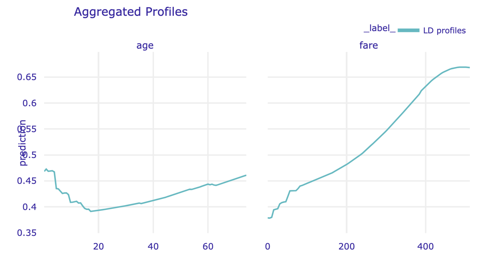
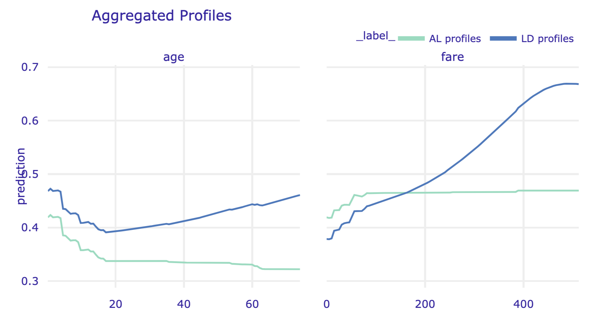

```{r load_models_ALE, warning=FALSE, message=FALSE, echo=FALSE, eval=FALSE}
source("models/models_titanic.R")
source("models/models_apartments.R")
```

```{r, echo=FALSE, warning=FALSE}
source("code_snippets/ema_init.R")
```

# Local-dependence and Accumulated-local Profiles {#accumulatedLocalProfiles}

## Introduction {#ALPIntro}

Partial-dependence (PD) profiles, introduced in the previous chapter, are easy to explain and interpret, especially given their estimation as the mean of ceteris-paribus (CP) profiles. However, as it was mentioned in Section \@ref(PDPProsCons), the profiles may be misleading if, for instance, explanatory variables are correlated. In many applications, this is the case. For example, in the apartment-prices dataset (see Section \@ref(ApartmentDataset)), one can expect that variables *surface* and *number of rooms* may be positively correlated, because apartments with a larger number of rooms usually also have a larger surface. Thus, in ceteris-paribus profiles, it is not realistic to consider, for instance, an apartment with five rooms and a surface of 20 square meters. Similarly, in the Titanic dataset, a positive association can be expected for the values of variables *fare* and *class*, as tickets in the higher classes are more expensive than in the lower classes. 

In this chapter, we present accumulated-local profiles that address this issue. As they are related to local-dependence profiles, we introduce the latter first. Both approaches were proposed by @ALEPlotRPackage.\index{Accumulated-local profile}\index{AL profile|see{Accumulated-local profile}}


## Intuition {#ALPIntuition}

<!--
The general idea behind LD profiles is to use the conditional distribution of the instead of marginal distribution to accommodate for the dependency between $x^j$ and $x^{-j}$.
The general idea behind Accumulated Local Profiles is to accumulate local changes in model response affected by single feature $x^j$.

The intuition behind Partial Dependency profiles and their extensions is presented in Figure \@ref(fig:accumulatedLocalEffects).
-->

Let us consider the following simple linear model with two explanatory variables: 

\begin{equation}
Y = X^1 +  X^2 + \varepsilon = f(X^1, X^2) + \varepsilon,
(\#eq:simpleModel)
\end{equation}

where $\varepsilon \sim N(0,0.1^2)$. 

For this model, the effect of $X^1$ for any value of $X^2$ is linear, i.e., it can be described by a straight line with the intercept equal to 0 and the slope equal to 1. 

Assume that observations of explanatory variables $X^1$ and $X^2$ are uniformly distributed over the unit square, as illustrated in the left-hand-side panel of Figure \@ref(fig:PDPcorr1) for a set of 1000 observations. The right-hand-side panel of Figure \@ref(fig:PDPcorr1) presents the scatter plot of the observed values of $Y$ in function of $X^1$. The plot for $X^2$ is, essentially, the same and we do not show it. 

(ref:PDPcorr1Desc) Observations of two explanatory variables uniformly distributed over the unit square (left-hand-side panel) and the scatter plot of the observed values of the dependent variable $Y$ in function of $X^1$ (right-hand-side panel).

```{r PDPcorr1, warning=FALSE, message=FALSE, echo=FALSE, fig.width=8, fig.height=4, fig.cap='(ref:PDPcorr1Desc)', fig.align='center', out.width='90%'}

set.seed(21965)
x1 <- runif(1000)
x2 <- runif(1000)
ex <- rnorm(1000,mean=0,sd=0.1)
yx <- x1+x2+ex
ys <- x1+x2
br <- c(0,.2,.4,.6,.8,1)
x1c <- cut(x1,breaks = br)
x2c <- cut(x2,breaks = br)
xx <- data.frame(x1,x2,ex,yx,ys,x1c,x2c)
xx.red <- subset(xx,x1c==x2c)

pl1 <- ggplot(xx, aes(x1, x2)) +
  geom_point() + 
  geom_hline(yintercept = seq(0,1,0.2), color = "grey", lty = 2) + 
  geom_vline(xintercept = seq(0,1,0.2), color = "grey", lty = 2) +
  theme_classic() +
  scale_x_continuous("X1",breaks = seq(0,1,0.2), expand = c(0,0)) +
  scale_y_continuous("X2",breaks = seq(0,1,0.2), expand = c(0,0))  + theme_ema

pl2 <- ggplot(xx, aes(x1, yx)) +
  geom_point() + 
  theme_classic() +
  scale_x_continuous("X1",breaks = seq(0,1,0.2), expand = c(0,0), limits = c(0,1)) +
  scale_y_continuous("Y",breaks = seq(0,2,0.5), expand = c(0,0), limits = c(0,2))  + theme_ema

library(patchwork)
pl1 + pl2
# 
# par(mfrow=c(1,2))
# plot(xx$x1,xx$x2)
# segments(x0=0.2,y0=0,x1=0.2,y1=1)	
# segments(x0=0.4,y0=0,x1=0.4,y1=1)	
# segments(x0=0.6,y0=0,x1=0.6,y1=1)	
# segments(x0=0.8,y0=0,x1=0.8,y1=1)	
# segments(x0=0,y0=0.2,x1=1,y1=0.2)
# segments(x0=0,y0=0.4,x1=1,y1=0.4)	
# segments(x0=0,y0=0.6,x1=1,y1=0.6)
# segments(x0=0,y0=0.8,x1=1,y1=0.8)
# 
# plot(xx$x1,xx$yx)
```

In view of the plot shown in the right-hand-side panel of Figure \@ref(fig:PDPcorr1), we could consider using a simple linear model with $X^1$ and $X^2$ as explanatory variables. Assume, however, that we would like to analyze the data without postulating any particular parametric form of the effect of the variables. A naïve way would be to split the observed range of each of the two variables into, for instance, five intervals (as illustrated in the left-hand-side panel of Figure \@ref(fig:PDPcorr1)), and estimate the means of observed values of $Y$ for the  resulting 25 groups of observations. Table \@ref(tab:FullDataMeans) presents the sample means (with rows and columns defined by the ranges of possible values of, respectively, $X^1$ and $X^2$).   

Table: (\#tab:FullDataMeans) Sample means of $Y$ for 25 groups of observations resulting from splitting the ranges of explanatory variables $X^1$ and $X^2$ into five intervals (see the left-hand-side panel of Figure \@ref(fig:PDPcorr1)). 

```{r FullDataMeans, warning=FALSE, message=FALSE, echo=FALSE}
tab.mean <- round(with(xx, tapply(yx, list(x1c,x2c), mean)),2)
kableExtra::kable(tab.mean, format = "simple")
```

Table \@ref(tab:FullDataNumbers) presents the number of observations for each of the sample means from Table \@ref(tab:FullDataMeans). 

Table: (\#tab:FullDataNumbers) Number of observations for the sample means from Table \@ref(tab:FullDataMeans). 

```{r FullDataNumbers, warning=FALSE, message=FALSE, echo=FALSE}
tab.count <- table(xx$x1c,xx$x2c)
total.c <- margin.table(tab.count,2)
total <- total.c
tab.count.c <- rbind(tab.count,total)
total <- margin.table(tab.count.c,1)
kableExtra::kable(cbind(tab.count.c,total), format = "simple")
```

<!---
Table: (\#tab:FullData) Sample means $ys$

|X1 |(0,0.2] | (0.2,0.4] | (0.4,0.6] | (0.6,0.8] | (0.8,1] |
|---|--------|-----------|-----------|-----------|---------|
(0,0.2]   |   0.19  |    0.40   |   0.60  |    0.80 |   0.99 |
(0.2,0.4] |   0.40  |    0.59   |   0.81  |    1.00 |   1.21 |
(0.4,0.6] |   0.60  |    0.80   |   0.99  |    1.19 |   1.41 |
(0.6,0.8] |   0.79  |    0.99   |   1.20  |    1.41 |   1.58 |
(0.8,1]   |   0.99  |    1.21   |   1.40  |    1.62 |   1.79 |


Table: (\#tab:FullData) Sample means $yx$

|X1 |(0,0.2] | (0.2,0.4] | (0.4,0.6] | (0.6,0.8] | (0.8,1] |
|---|--------|-----------|-----------|-----------|---------|
(0,0.2]   |   0.19  |    0.45   |   0.68  |    0.80 |   1.00 |
(0.2,0.4] |   0.38  |    0.57   |   0.81  |    1.02 |   1.16 |
(0.4,0.6] |   0.57  |    0.82   |   0.97  |    1.22 |   1.50 |
(0.6,0.8] |   0.71  |    1.02   |   1.20  |    1.40 |   1.58 |
(0.8,1]   |   1.04  |    1.23   |   1.35  |    1.54 |   1.75 |
--->

By using this simple approach, we can compute the PD profile for $X^1$. Consider $X^1=z$. To apply the estimator defined in  \@ref(eq:PDPest), we need the predicted values $\hat{f}(z,x^2_i)$ for any observed value of $x^2_i \in [0,1]$. As our observations are uncorrelated and fill-in the unit-square, we can use the suitable mean values for that purpose. In particular, for $z \in [0,0.2]$, we get

\begin{align}
\hat g_{PD}^{1}(z) &= \frac{1}{1000}\sum_{i}\hat{f}(z,x^2_i) = \nonumber \\
&= (198\times 0.19 + 197\times 0.42 + 173\times 0.63 + \nonumber\\
& \ \ \ \ \ 228\times 0.80 + 204\times 1.00)/1000  = 0.6. \nonumber 
(\#eq:fullDataPD)
\end{align}

By following the same principle, for $z \in (0.2,0.4]$, $(0.4,0.6]$, $(0.6,0.8]$, and $(0.8,1]$ we get the values of 0.8, 1, 1.2, and 1.4, respectively. Thus, overall, we obtain a piecewise-constant profile with values that capture the (correct) linear effect of $X^1$ in model \@ref(eq:simpleModel). In fact, by using, for instance, midpoints of the intervals for $z$, i.e., 0.1, 0.3, 0.5, 0.7, and 0.9, we could describe the profile by the linear function $0.5+z$.    

Assume now that we are given the data only from the regions on the diagonal of the unit square, as illustrated in the left-hand-side panel of Figure \@ref(fig:PDPcorr2). In that case, the observed values of $X^1$ and $X^2$ are strongly correlated, with the estimated value of Pearson's correlation coefficient equal to 0.96. The right-hand-side panel of Figure \@ref(fig:PDPcorr2) presents the scatter plot of the observed values of $Y$ in the function of $X^1$. 

(ref:PDPcorr2Desc) Correlated observations of two explanatory variables (left-hand-side panel) and the scatter plot of the observed values of the dependent variable $Y$ in the function of $X^1$ (right-hand-side panel).

```{r PDPcorr2, warning=FALSE, message=FALSE, echo=FALSE, fig.width=8, fig.height=4, fig.cap='(ref:PDPcorr2Desc)', fig.align='center', out.width='90%'}

pl1 <- ggplot(xx.red, aes(x1, x2)) +
  geom_point() + 
  geom_hline(yintercept = seq(0,1,0.2), color = "grey", lty = 2) + 
  geom_vline(xintercept = seq(0,1,0.2), color = "grey", lty = 2) +
  theme_classic() +
  scale_x_continuous("X1",breaks = seq(0,1,0.2), expand = c(0,0)) +
  scale_y_continuous("X2",breaks = seq(0,1,0.2), expand = c(0,0)) + theme_ema

pl2 <- ggplot(xx.red, aes(x1, yx)) +
  geom_point() + 
  theme_classic() +
  scale_x_continuous("X1",breaks = seq(0,1,0.2), expand = c(0,0), limits = c(0,1)) +
  scale_y_continuous("Y",breaks = seq(0,2,0.5), expand = c(0,0), limits = c(0,2)) + theme_ema 

library(patchwork)
pl1 + pl2

# par(mfrow=c(1,2))
# plot(xx.red$x1,xx.red$x2)
# segments(x0=0.2,y0=0,x1=0.2,y1=1)	
# segments(x0=0.4,y0=0,x1=0.4,y1=1)	
# segments(x0=0.6,y0=0,x1=0.6,y1=1)	
# segments(x0=0.8,y0=0,x1=0.8,y1=1)	
# segments(x0=0,y0=0.2,x1=1,y1=0.2)
# segments(x0=0,y0=0.4,x1=1,y1=0.4)	
# segments(x0=0,y0=0.6,x1=1,y1=0.6)
# segments(x0=0,y0=0.8,x1=1,y1=0.8)
# plot(xx.red$x1,xx.red$yx)

```

Now, the "naïve" modelling approach would amount to using only five sample means, as in the table below.   

Table: (\#tab:ReducedDataMeans) Sample means of $Y$ for five groups of observations (see the left-hand-side panel of Figure \@ref(fig:PDPcorr2)). 

```{r ReducedDataMeans, warning=FALSE, message=FALSE, echo=FALSE}
tab.mean.red <- round(with(xx.red, tapply(yx, list(x1c,x2c), mean)),2)

kableExtra::kable(tab.mean.red, format = "simple")
```

When computing the PD profile for $X^1$, we now encounter the issue related to the fact that, for instance, for $z \in [0,0.2]$, we have not got any observations and, hence, any sample mean for $x^2_i>0.2$. To overcome this issue, we could extrapolate the predictions (i.e., mean values) obtained for other intervals of $z$. That is, we could assume that, for $x^2_i \in (0.2,0.4]$, the prediction is equal to 0.59, for $x^2_i \in (0.4,0.6]$ it is equal to 0.98, and so on. This leads to the following value of the PD profile for $z \in [0,0.2]$:    

\begin{align}
\hat g_{PD}^{1}(z) &= \frac{1}{51 + 40 + 35 + 55 + 34}\sum_{i}\hat{f}(z,x^2_i) = \nonumber \\
&= \frac{1}{215}(51\times0.19 + 40\times0.59 + 35\times0.98 + \nonumber \\
& \ \ \ \ \ 55\times1.40 + 34\times1.77)=0.95.  
\end{align}

This is a larger value than 0.6 computed in \@ref(eq:fullDataPD) for the uncorrelated data. The reason is the extrapolation: for instance, for $z \in [0,0.2]$ and $x^2_i \in (0.6,0.8]$, we use 1.40 as the predicted value of $Y$. However, Table \@ref(tab:FullDataMeans) indicates that the sample mean for those observations is equal to 0.80. 

In fact, by using the same extrapolation principle, we get $\hat g_{PD}^{1}(z) = 0.95$ also for $z \in (0.2,0.4]$, $(0.4,0.6]$, $(0.6,0.8]$, and $(0.8,1]$. Thus, the obtained profile indicates no effect of $X^1$, which is clearly a wrong conclusion. 

While the modelling approach presented in the example above may seem to be simplistic, it does illustrate the issue  that would also appear for other flexible modelling methods like, for instance, regression trees. In particular, the left-hand-side panel of Figure \@ref(fig:PDPcorr3) presents a regression tree fitted to the data shown in Figure \@ref(fig:PDPcorr2) by using function `tree()` from the R package `tree`. The right-hand-side panel of Figure \@ref(fig:PDPcorr3) presents the corresponding split of the observations. According to the model, the predicted value of $Y$ for the observations in the region $x^1 \in [0,0.2]$ and $x^2 \in [0.8,1]$ would be equal to 1.74. This extrapolation implies a substantial overestimation, as the true expected value of $Y$ in the region is equal to 1. Note that the latter is well estimated by the sample mean equal to 0.99 (see Table \@ref(tab:FullDataMeans)) in the case of the uncorrelated data shown in Figure \@ref(fig:PDPcorr1). 

The PD profile for $X^1$ for the regression tree would be equal to 0.2, 0.8, and 1.5 for $z \in [0,0.2]$,  $(0.2,0.6]$, and $(0.6,1]$, respectively. It does show an effect of $X^1$, but if we used midpoints of the intervals for $z$, i.e., 0.1, 0.4, and 0.8, we could (approximately) describe the profile by the linear function $2z$, i.e., with a slope larger than (the true value of) 1.  

(ref:PDPcorr3Desc) Results of fitting of a regression tree to the data shown in Figure \@ref(fig:PDPcorr2) (left-hand-side panel) and the corresponding split of the observations of the two explanatory variables (right-hand-side panel).

```{r PDPcorr3, warning=FALSE, message=FALSE, echo=FALSE, fig.width=8, fig.height=5, fig.cap='(ref:PDPcorr3Desc)', fig.align='center', out.width='90%'}
library("tree")
library("grid")
#trees.red <- tree(ys ~ x1 + x2, data=xx.red)
trees.red <- tree(yx ~ x1 + x2, data=xx.red)

yx.red.hat <- predict(trees.red)
pred.yx.red <- cbind(xx.red,yx.red.hat)

par(mfrow=c(1,2))

plot(trees.red)
text(trees.red)


pl3 <- ggplot() +
  geom_point(data=xx.red, aes(x1, x2), color = "grey") + 
  theme_classic() +
  scale_x_continuous("X1",breaks = seq(0,1,0.2), expand = c(0,0)) +
  scale_y_continuous("X2",breaks = seq(0,1,0.2), expand = c(0,0)) +
  geom_segment(data = data.frame(x = c(0,0.1777,0,0.597),y = c(0.424,0, 0.783,0.424),xend = c(1,0.1777,1,0.597),yend = c(0.424,0.424, 0.783, 0.783)), 
               aes(x=x,y=y,xend=xend,yend=yend), size=1, lty=2) + theme_ema

vp <- viewport(height = unit(0.8,"npc"), width=unit(0.4, "npc"), 
              y = 0.5, x = 0.75)
print(pl3, vp = vp)

#plot(xx.red$x1,xx.red$x2)
#segments(x0=0.2,y0=0,x1=0.2,y1=1)
#segments(x0=0.4,y0=0,x1=0.4,y1=1)
#segments(x0=0.4,y0=0.6,x1=1,y1=0.6)
#segments(x0=0.4,y0=0.8,x1=1,y1=0.8)

# segments(x0=0.18,y0=0,x1=0.18,y1=0.42)
# segments(x0=0.6,y0=0,x1=0.6,y1=0.78)
# segments(x0=0,y0=0.42,x1=1,y1=0.42)
# segments(x0=0,y0=0.78,x1=1,y1=0.78)

```

<!---
Moreover, assume that explanatory variables $X^1$ and $X^2$ are uniformly distributed over the interval $[-1,1]$ and are perfectly correlated, i.e., $X^2 = X^1$. Suppose that we have got the following dataset with 8 observations:

| i     | 1  |     2 |     3 |     4 |     5 |     6 |     7 |  8  |
|-------|----|-------|-------|-------|-------|-------|-------|-----|
| $X^1$ | -1 | -0.71 | -0.43 | -0.14 |  0.14 |  0.43 |  0.71 |  1  |
| $X^2$ | -1 | -0.71 | -0.43 | -0.14 |  0.14 |  0.43 |  0.71 |  1  |
| $f(x^1,x^2)$   | 0  | -0.2059 | -0.2451 | -0.1204 |  0.1596 |  0.6149 |  1.2141 |  2  |

Note that, for both $X^1$ and $X^2$, the sum of all observed values is equal to 0. 

The top part of panel A in Figure \@ref(fig:accumulatedLocalEffects) [TOMASZ: REMOVE THE CURRENT PANEL A. RENAME THE REMAINING ONES.] shows CP profiles for $X^1$ for model \@ref(eq:trickyModel) calculated for the eight observations. The bottom part of the panel presents the corresponding estimate of the PD profile for $X^1$, i.e., the average of the CP profiles. The profile suggests no effect of $X^1$, which is clearly a misleading conclusion.

To understand the reason, let's use definition \@ref(eq:CPPdef) and obtain an explicit expression of the CP profile for $X^1$ for model \@ref(eq:trickyModel):

\begin{equation}
h^{(x^1 + 1) \cdot x^2 , 1}_{(x^1,x^2)}(z) = f(z,x^2) = (z+1)\cdot x^2.
(\#eq:CPtrickyModel)
\end{equation}

Thus, the CP profile is a straight line with the slope equal to the value of variable $X^2$. Hence, for instance, the CP profile for observation with $(x^1,x^2)=(-1,-1)$ is a straight line with the slope equal to -1.  

On the other hand, the PD profile for $X^j$ is estimated, as indicated in \@ref(eq:PDPest), by taking the mean of the CP profiles given by \@ref(eq:CPtrickyModel):

\begin{equation}
\hat g_{PD}^{(x^1 + 1)\cdot x^2, 1}(z) =  \frac{1}{8} \sum_{i=1}^{8} (z+1)\cdot x_{i}^2 = \frac{z+1}{8}  \sum_{i=1}^{8} x_{i}^2 = 0.
(\#eq:PDtrickyModel)
\end{equation}

As a result, the PD profile for $X^1$ is estimated as a horizontal line at 0, as seen in the bottom part of panel A in Figure \@ref(fig:accumulatedLocalEffects). 

This result is due to the fact that the CP profile, given in \@ref(eq:CPtrickyModel), ignores the fact that, given our assumptions, one cannot change $z$  *freely* for a particular value of $X^2$, because $X^1$ and $X^2$ are assumed to be perfectly correlated. In fact, in this case, the CP profile for the $i$-th observation should remain undefined for any values of $z$ different from $x^2_i$. As a consequence, the sum used in \@ref(eq:PDtrickyModel) should involve undefined terms for any $z$.

--->

The issue stems from the fact that, in the definition \@ref(eq:PDPdef0) of the PD profile, the expected value of model predictions is computed by using the marginal distribution of $X^2$, which disregards the value of $X^1$. Clearly, this is an issue when the explanatory variables are correlated. This observation suggests a modification: instead of the marginal distribution, one might use the conditional distribution of $X^2$ given $X^1$, because it reflects the association between the two variables. The modification leads to the definition of an LD profile. 

It turns out, however, that the modification does not fully address the issue of correlated explanatory variables. 
As argued by @Apley2019, if an explanatory variable is correlated with some other variables, the LD profile for the variable will still capture the effect of the other variables. This is because the profile is obtained by marginalizing over (in fact, ignoring) the remaining variables in the model, which results in an effect similar to the "omitted variable" bias in linear regression. Thus, in this respect, LD profiles share the same limitation as PD profiles. To address the limitation, @Apley2019 proposed the concept of local-dependence effects and accumulated-local (AL) profiles.

<!---
If we focus on variable $X^1$ we can conclude that, according to \@ref(eq:trickyModel), the effect of the variable is similar to function $f(x_1) = -x_1 -1$ for values close to $(x_1, x_2) = (-1,-1)$ and similar to function $f(x_1) = x_1 +1$ for values close to $(x_1, x_2) = (1,1)$. This means that the effect is decreasing, at the rate -1,  around $(-1,-1)$ and it is increasing, at the rate 1, around $(1,1)$. The function specified in  \@ref(eq:LDtrickyModel) does not explicitly reflect this behavior. To address this issue, [@Appley2019] proposed the concept of accumulated local effects and accumulated local (AL) profiles, in which the effect of $X^1$ is defined as the cumulative sum of local derivatives of the model function with respect to $X^1$.
--->

<!--
For example, for the `apartments` dataset, one can expect that features like `surface` and `number.of.rooms` are correlated but we can also imagine that each of these variables affects the apartment price somehow. Partial Dependency Profiles show how the average price changes as a function of the surface, keeping all other variables unchanged. Conditional Dependency Profiles show how the average price changes as a function of surface adjusting all other variables to the current value of the surface. Accumulated Local Profiles show how the average price changes as a function of surface adjusting all other variables to the current value of the surface but extracting changes caused by these other features. 
-->


## Method {#ALPMethod}

### Local-dependence profile 

Local-dependence (LD) profile for model $f()$ and variable $X^j$ is defined as follows:\index{LD profile| see {Local-dependence profile}}\index{Local-dependence profile}

\begin{equation}
g_{LD}^{f, j}(z) = E_{\underline{X}^{-j}|X^j=z}\left\{f\left(\underline{X}^{j|=z}\right)\right\}.
(\#eq:LDPdef)
\end{equation}

Thus, it is the expected value of the model predictions over the conditional distribution of $\underline{X}^{-j}$ given $X^j=z$, i.e., over the joint distribution of all explanatory variables other than $X^j$ conditional on the value of the latter variable set to $z$. Or, in other words, it is the expected value of the CP profiles for $X^j$, defined in \@ref(eq:CPPdef), over the conditional distribution of $\underline{X}^{-j} | X^j = z$.

<!--
For example, let $f(x_1, x_2) = x_1 + x_2$ and distribution of $(x_1, x_2)$ is given by $x_1 \sim U[0,1]$ and $x_2=x_1$. In this case $g^{CD}_{f, 1}(z) = 2*z$.
-->

As proposed by @Apley2019, LD profile can be estimated as follows: 

\begin{equation}
\hat g_{LD}^{j}(z) = \frac{1}{|N_j|} \sum_{k\in N_j} f\left(\underline{x}_k^{j| = z}\right), 
(\#eq:LDPest)
\end{equation}

where $N_j$ is the set of observations with the value of $X^j$ "close" to $z$ that is used to estimate the conditional distribution of $\underline{X}^{-j}|X^j=z$.

<!--
In Figure \@ref(fig:accumulatedLocalEffects) panel C the range of variable $x_i$ is divided into 4 separable intervals. The set $N_i$ contains all observations that fall into the same interval as observation $x_i$. The final CD profile is an average from closest pieces of CP profiles.
-->

Note that, in general, the estimator given in \@ref(eq:LDPest) is neither smooth nor continuous at boundaries between  subsets $N_j$. A smooth estimator for $g_{LD}^{f,j}(z)$ can be defined as follows: \index{Smooth estimator}

\begin{equation}
\tilde g_{LD}^{j}(z) = \frac{1}{\sum_k w_{k}(z)} \sum_{i = 1}^n w_i(z) f\left(\underline{x}_i^{j| = z}\right), 
(\#eq:LDPest2)
\end{equation}

where weights $w_i(z)$ capture the distance between $z$ and $x_i^j$. In particular, for a categorical variable, we may just use the indicator function $w_i(z) = 1_{z = x^j_i}$, while for a continuous variable we may use the Gaussian kernel:\index{Kernel ! Gaussian}

\begin{equation}
w_i(z) = \phi(z - x_i^j, 0, s),
(\#eq:Gkernel)
\end{equation}

where $\phi(y,0,s)$ is the density of a normal distribution with mean 0 and standard deviation $s$. Note that $s$ plays the role of a smoothing factor.\index{Normal distribution}\index{Smoothing factor}

As already mentioned in Section \@ref(ALPIntuition), if an explanatory variable is correlated with some other variables, the LD profile for the variable will capture the effect of all of the variables. For instance, consider model \@ref(eq:simpleModel). Assume that $X^1$ has a uniform distribution on $[0,1]$ and that $X^1=X^2$, i.e., explanatory variables are perfectly correlated. In that case, the LD profile for $X^1$ is given by 

$$
g_{LD}^{1}(z) = E_{X^2|X^1=z}(z+X^2) = z + E_{X^2|X^1=z}(X^2) = 2z.
$$
Hence, it suggests an effect of $X^1$ twice larger than the correct one.

To address the limitation, AL profiles can be used. We present them in the next section. 

### Accumulated-local profile

Consider model $f()$ and define 

$$
q^j(\underline{u})=\left\{ \frac{\partial f(\underline{x})}{\partial x^j} \right\}_{\underline{x}=\underline{u}}.
$$
Accumulated-local (AL) profile for model $f()$ and variable $X^j$ is defined as follows:

\begin{equation}
g_{AL}^{j}(z) = \int_{z_0}^z \left[E_{\underline{X}^{-j}|X^j=v}\left\{ q^j(\underline{X}^{j|=v}) \right\}\right] dv + c,
(\#eq:ALPdef)
\end{equation}

where $z_0$ is a value close to the lower bound of the effective support of the distribution of $X^j$ and $c$ is a constant, usually selected so that $E_{X^j}\left\{g_{AL}^{j}(X^j)\right\} = 0$.

To interpret \@ref(eq:ALPdef), note that $q^j(\underline{x}^{j|=v})$ describes the local effect (change) of the model due to $X^j$. Or, to put it in other words, $q^j(\underline{x}^{j|=v})$ describes how much the CP profile for $X^j$ changes at $(x^1,\ldots,x^{j-1},v,x^{j+1},\ldots,x^p)$. This effect (change) is averaged over the "relevant" (according to the conditional distribution of $\underline{X}^{-j}|X^j$) values of $\underline{x}^{-j}$ and, subsequently, accumulated (integrated) over values of $v$ up to $z$. As argued by @Apley2019, the averaging of the local effects allows avoiding the issue, present in the PD and LD profiles, of capturing the effect of other variables in the profile for a particular variable in additive models (without interactions). To see this, one can consider the approximation 

$$
f(\underline{x}^{j|=v+dv})-f(\underline{x}^{j|=v})  \approx q^j(\underline{x}^{j|=v})dv,
$$

and note that the difference $f(\underline{x}^{j|=v+dv})-f(\underline{v}^{j|=v})$, for a model without interaction, effectively removes the effect of all variables other than $X^j$. 

For example, consider model \@ref(eq:simpleModel). In that case, $f(x^1,x^2)=x^1+x^2$ and $q^1(\underline{u}) = 1$. Thus,

$$
f(u+du,x_2)-f(u,x_2)  = (u + du + x^2) - (u + x^2) = du = q^1(u)du.
$$

Consequently, irrespective of the joint distribution of $X^1$ and $X^2$ and upon setting $c=z_0$, we get
\[
g_{AL}^{1}(z) = \int_{z_0}^z \left\{E_{{X}^{2}|X^1=v}(1)\right\} dv + z_0 = z.
\]

To estimate an AL profile, one replaces the integral in \@ref(eq:ALPdef) by a summation and the derivative with a finite difference [@Apley2019]. In particular, consider a partition of the range of observed values $x_{i}^j$ of variable $X^j$ into $K$ intervals $N_j(k)=\left(z_{k-1}^j,z_k^j\right]$ ($k=1,\ldots,K$). Note that $z_0^j$ can be chosen just below $\min(x_1^j,\ldots,x_N^j)$ and $z_K^j=\max(x_1^j,\ldots,x_N^j)$. Let $n_j(k)$ denote the number of observations $x_i^j$ falling into $N_j(k)$, with $\sum_{k=1}^K n_j(k)=n$. An estimator of the AL profile for variable $X^j$ can then be constructed as follows: 

\begin{equation}
\widehat{g}_{AL}^{j}(z) = \sum_{k=1}^{k_j(z)} \frac{1}{n_j(k)} \sum_{i: x_i^j \in N_j(k)} \left\{ f\left(\underline{x}_i^{j| = z_k^j}\right) - f\left(\underline{x}_i^{j| = z_{k-1}^j}\right) \right\} - \hat{c},
(\#eq:ALPest)
\end{equation}

where $k_j(z)$ is the index of interval $N_j(k)$ in which $z$ falls, i.e., $z \in N_j\{k_j(z)\}$, and $\hat{c}$ is selected so that $\sum_{i=1}^n \widehat{g}_{AL}^{f,j}(x_i^j)=0$. 

To interpret \@ref(eq:ALPest), note that difference $f\left(\underline{x}_i^{j| = z_k^j}\right) - f\left(\underline{x}_i^{j| = z_{k-1}^j}\right)$ corresponds to the difference of the CP profile for the $i$-th observation at the limits of interval $N_j(k)$. These differences are then averaged across all observations for which the observed value of $X^j$ falls into the interval and are then accumulated.

<!--
In Figure \@ref(fig:accumulatedLocalEffects) panel D the range of variable $x_i$ is divided into 4 separable intervals. The set $N_i$ contains all observations that fall into the same interval as observation $x_i$. The final ALE profile is constructed from accumulated differences of local CP profiles.
-->

Note that, in general, $\widehat{g}_{AL}^{f,j}(z)$ is not smooth at the boundaries of intervals $N_j(k)$. A smooth estimate can obtained as follows:

\begin{equation}
\widetilde{g}_{AL}^{j}(z) = \sum_{k=1}^K \left[ \frac{1}{\sum_{l} w_l(z_k)} \sum_{i=1}^N w_{i}(z_k) \left\{f\left(\underline{x}_i^{j| = z_k}\right) - f\left(\underline{x}_i^{j| = z_k - \Delta}\right)\right\}\right] - \hat{c},
(\#eq:ALPest2)
\end{equation}

where points $z_k$ ($k=0, \ldots, K$) form a uniform grid covering the interval $(z_0,z)$ with step $\Delta = (z-z_0)/K$, and weight $w_i(z_k)$ captures the distance between point $z_k$ and observation $x_i^j$. In particular, we may use similar weights as in case of \@ref(eq:LDPest2).

<!---
### Illustrative examples {#summaryFeatureEffects}

We will consider a vector of two explanatory variables $\underline{X}=(X^1,X^2)'$ such that $X^1$ is uniformly distributed over $[-1,1]$ and $X^2=X^1$. Hence, $X^2$ is perfectly correlated with $X^1$ and $E({X^2})=E({X^1})=0$. The conditional distribution of $\underline{X}^{-1} \equiv X^2$ given $X^1=z$ is the point mass of 1 at $z$. 

#### An additive model {#summaryFeatureEffectsAdd}

For model \@ref(eq:simpleModel), the PD profile for $X^1$ is given by 

$$
g_{PD}^{x^1+x^2,1}(z) = E_{X^2}(z+X^2) = z + E(X^2) = z.
$$
On the other hand, the LD profile for $X^1$ is given by 

$$
g_{LD}^{x^1+x^2,1}(z) = E_{X^2|X^1=z}(z+X^2) = z + E_{X^2|X^1=z}(X^2) = 2z.
$$
Finally, for model \@ref(eq:simpleModel) we have got 

\begin{equation}
q^1(u^1,u^2)=\left\{ \frac{\partial (x^1+x^2)}{\partial x^1} \right\}_{\underline{x}=(u^1,u^2)}=1,
(\#eq:derivsimpleModel)
\end{equation}

so that  

$$
\int_{-1}^z \left[ E_{X^2|X^1=v}\left\{ q^1(v,X^2) \right\} \right] dv + c = \int_{-1}^z dv + c = z+1+c.
$$

Since $E_{X^1}\left(X^1+1\right) = 1$, then, upon taking $c=-1$, we obtain the following AL profile for $X^1$:

$$
g_{AL}^{x^1+x^2,1}(z) = z,
$$

with $E_{X^1}\left\{g_{AL}^{x^1+x^2,1}(X^1)\right\} = 0$.

Note that the AL profile properly captures the effect of the explanatory variable $X^1$ on the model predictions. As we can see, function $q^1(\underline{u})$, given in \@ref(eq:derivsimpleModel), does not depend on the value of $X^2$. Consequently, the AL profile for $X^1$ does not include the effect of $X^2$. However, the LD profile is biased, due to the fact that it does include the effect of $X^2$, because of averaging of the predictions over that variable, which is correlated with $X^1$. 

#### A model with an interaction {#summaryFeatureEffectsInter}

Let us now consider model \@ref(eq:trickyModel) and the eight observations for $\underline{X}$ from Section \@ref(ALPIntuition).

The top part of panel A of Figure \@ref(fig:accumulatedLocalEffects) [TOMASZ: REMOVE THE CURRENT PANEL A.] shows CP profiles for $X^1$ for the eight observations, as given in \@ref(eq:CPtrickyModel). The bottom part of the panel shows the estimated PD profile obtained by using the mean of the CP profiles. As indicated in   \@ref(eq:PDtrickyModel), the PD profile is estimated at 0. The estimate is correct, because 

$$
g_{PD}^{(x^1+1)\cdot x^2,1}(z) = E_{X^2}\{(z+ 1)\cdot X^2\} = (z+1)\cdot E_{X^2}(X^2) = 0,
$$

given that $X^2$ is uniformly-distributed over $[-1,1]$. However, the PD profile itself is misleading, as there clearly is an effect of $X^1$.  

(ref:accumulatedLocalEffectsDesc) Partial-dependence, local-dependence, and accumulated local profiles for the model (x1+1)x2. Panel A: Ceteris-paribus profiles (top plot) and the corresponding partial-dependence profile (underneath). Panel B: Local-dependence profile. Panel C: Accumulated local profile. 

```{r accumulatedLocalEffects, echo=FALSE, fig.cap='(ref:accumulatedLocalEffectsDesc)', out.width = '90%', fig.align='center'}
knitr::include_graphics("figure/CP_ALL.png")
```

The LD profile for model \@ref(eq:trickyModel) and variable $X^1$ is given by

\begin{equation}
g_{LD}^{(x^1+1)\cdot x^2,1}(z) = E_{X^2|X^1=z}\{f(z,X^2)\} = E_{X^2|X^1=z}\{(z+1)\cdot X^2\} = (z+1)\cdot z.
(\#eq:LDtrickyModel)
\end{equation}

By using estimator \@ref(eq:LDPest), with the data split into four intervals each containing two observations (see the top part of panel B pf Figure \@ref(fig:accumulatedLocalEffects)), we obtain the estimated LD profile shown at the bottom of panel B of Figure \@ref(fig:accumulatedLocalEffects).

Finally, for model \@ref(eq:trickyModel) we have got 

\begin{equation}
q^1(u^1,u^2)=\left\{ \frac{\partial (x^1x^2+x^2)}{\partial x^1} \right\}_{\underline{x}=(u^1,u^2)}=u^2,
(\#eq:derivtrickyModel)
\end{equation}
  
so that  

$$
\int_{-1}^z \left[ E_{X^2|X^1=v}\left\{ q^1(v,X^2) \right\} \right] dv + c = \int_{-1}^z vdv + c = \frac{(z)^2-1}{2}+c.
$$

Since $E_{X^1}\left\{(X^1)^2\right\} = 1/3$, then, upon taking $c=1/3$, we obtain the following AL profile for $X^1$:

\begin{equation}
g_{AL}^{(x^1+1)\cdot x^2,1}(z) = \frac{z^2}{2}-\frac{1}{3},
(\#eq:ALtrickyModel)
\end{equation}

with $E_{X^1}\left\{g_{AL}^{(x^1+1) \cdot x^2,1}(X^1)\right\} = 0$.

By using estimator \@ref(eq:ALPest), with the data split into four intervals containing two observations each (see the plot at the top of panel C of Figure \@ref(fig:accumulatedLocalEffects), we obtain the estimated AL profile shown at the bottom of panel C of Figure \@ref(fig:accumulatedLocalEffects). 

Note that all three profiles are different. The PD profile is clearly wrong, as it indicates no effect of $X^1$. On the other hand, both LD and AL profiles suggest a quadratic effect of the variable, which is also incorrect. For the LD profile, this is due to marginalizing over $X^2$ which is correlated with $X^1$. For the AL profile, the issue is that the model contains the interaction term $x^1x^2$. As a result, function $q^1(\underline{u})$, given in \@ref(eq:derivtrickyModel), depends on the value of $X^2$. Consequently, the AL profile for $X^1$ also includes the effect of $X^2$. 

<!---

As another example, consider model \@ref(eq:trickyModel). In this case, $q^1(x_1,x_2)=x_2$ and the effect of variable $X^2$ will still be present in the AL profile for $X^1$.

Continuing with model in formula \@ref(eq:trickyModel), assume that $X=(X^1,X^2)$ with $X^1$ uniformly distributed over $[-1,1]$ and $X^2=X^1$. In this case, the conditional distribution of $X^2 | X^1=z$ is the point mass of 1 at $z$. Then

\begin{equation}
g_{AL}^{(x_1+1)\cdot x_2,1}(z) = \int_{-1}^z \left[E_{X^2|X^1=u}\left( X^2 \right)\right] du + c = \int_{-1}^z u du + c = \frac{z^2-1}{2}+c.
(\#eq:ALtrickyModel)
\end{equation}

Since $E_{X^1}\left[(X^1)^2\right] = 1/3$, then, upon taking $c=-1/3$, we get $E_{X^1}\left[g_{AL}^{(x_1+1) \cdot x_2,1}(X^1)\right] = 0$.

\begin{equation}
g_{AL}^{(x_1 + 1)\cdot x_2, 1}(z) = 
\int_{-1}^z E \left[\frac{\partial f(x_1, x_2)}{\partial x_1} | X^1 = v \right] dv = 
\int_{-1}^z E \left[X^2 | X^1 = v \right] dv = 
\int_{-1}^z v dv =
(z^2 - 1)/2.
(\#eq:ALtrickyModel)
\end{equation}

--->

### Dependence profiles for a model with interaction and correlated explanatory variables: an example

In this section, we illustrate in more detail the behavior of PD, LD, and AL profiles for a model with an interaction between correlated explanatory variables. In particular, let us consider the following simple model for two explanatory variables: 

\begin{equation}
f(X^1, X^2) = (X^1 + 1)\cdot X^2.
(\#eq:trickyModel)
\end{equation}

Moreover, assume that explanatory variables $X^1$ and $X^2$ are uniformly distributed over the interval $[-1,1]$ and perfectly correlated, i.e., $X^2 = X^1$. Suppose that we have got a dataset with eight observations as in Table \@ref(tab:trickyModelData). Note that, for both $X^1$ and $X^2$, the sum of all observed values is equal to 0. 

Table: (\#tab:trickyModelData) A sample of eight observations. 

| i     | 1  |     2 |     3 |     4 |     5 |     6 |     7 |  8  |
|-------|----|-------|-------|-------|-------|-------|-------|-----|
| $X^1$ | -1 | -0.71 | -0.43 | -0.14 |  0.14 |  0.43 |  0.71 |  1  |
| $X^2$ | -1 | -0.71 | -0.43 | -0.14 |  0.14 |  0.43 |  0.71 |  1  |
| $y$   | 0  | -0.2059 | -0.2451 | -0.1204 |  0.1596 |  0.6149 |  1.2141 |  2  |

Note that PD, LD, AL profiles describe the effect of a variable in isolation from the values of other variables. In model \@ref(eq:trickyModel), the effect of variable $X^1$ depends on the value of variable $X^2$. For models with interactions, it is subjective to define what would be the "true" main effect of variable $X^1$. Complex predictive models often have interactions. By examining the case of model \@ref(eq:trickyModel), we will provide some intuition on how PD, LD and AL profiles may behave in such cases. 


(ref:accumulatedLocalEffectsNewDesc) Partial-dependence (PD), local-dependence (LD), and accumulated-local (AL) profiles for model \@ref(eq:trickyModel). Panel A: ceteris-paribus (CP) profiles for eight observations from Table \@ref(tab:trickyModelData). Panel B: entire CP profiles (top) contribute to calculation of the corresponding PD profile (bottom). Panel C: only parts of the CP profiles (top), close to observations of interest, contribute to the calculation of the corresponding LD profile (bottom).  Panel D: only parts of the CP profiles (top) contribute to the calculation of the corresponding AL profile (bottom).

```{r accumulatedLocalEffectsNew, echo=FALSE, fig.cap=, out.width = '90%', fig.align='center', fig.cap='(ref:accumulatedLocalEffectsNewDesc)'}
knitr::include_graphics("figure/CP_ALL.png")
```

Let us explicitly express the CP profile for $X^1$ for model \@ref(eq:trickyModel):

\begin{equation}
h^{1}_{CP}(z) = f(z,X^2) = (z+1)\cdot X^2.
(\#eq:CPtrickyModel)
\end{equation}

By allowing $z$ to take any value in the interval $[-1,1]$, we get the CP profiles as straight lines with the slope equal to the value of variable $X^2$. Hence, for instance, the CP profile for observation $(-1,-1)$ is a straight line with the slope equal to $-1$.  The CP profiles  for the eight observations, from Table \@ref(tab:trickyModelData) are presented in panel A of Figure \@ref(fig:accumulatedLocalEffectsNew).

Recall that the PD profile for $X^j$, defined in equation \@ref(eq:PDPdef0), is the expected value, over the joint distribution of all explanatory variables other than $X^j$, of the model predictions when $X^j$ is set to $z$. This leads to the estimation of the profile by taking the average of CP profiles for $X^j$, as given in \@ref(eq:PDPest).

In our case, this implies that the PD profile for $X^1$ is the expected value of the model predictions over the distribution of $X^2$, i.e., over the uniform distribution on the interval $[-1,1]$. Thus, the PD profile is estimated by taking the average of the CP profiles, given by \@ref(eq:CPtrickyModel), at each value of $z$ in $[-1,1]$:

\begin{equation}
\hat g_{PD}^{1}(z) =  \frac{1}{8} \sum_{i=1}^{8} (z+1)\cdot X^2_{i} = \frac{z+1}{8}  \sum_{i=1}^{8} X^2_{i} = 0.
(\#eq:PDtrickyModel)
\end{equation}

As a result, the PD profile for $X^1$ is estimated as a horizontal line at 0, as seen in the bottom part of Panel B of Figure \@ref(fig:accumulatedLocalEffectsNew). 

Since the $X^1$ and $X^2$ variables are correlated, it can be argued that we should not include entire CP profiles in the calculation of the PD profile, but only parts of them. In fact, for perfectly correlated explanatory variables, the CP profile for the $i$-th observation should actually be undefined for any values of $z$ different from $x^2_i$. <!-- As a consequence, the sum used in the calculation of the PD profile in equation \@ref(eq:PDtrickyModel) should involve undefined terms for any $z$.-->

The estimated horizontal PD profile results from using the marginal distribution of $X^2$, which disregards the value of $X^1$, in the definition of the profile. This observation suggests a modification: instead of the marginal distribution, one might consider the conditional distribution of $X^2$ given $X^1$. The modification leads to the definition of LD profile. 

For the data from Table \@ref(tab:trickyModelData), the conditional distribution of $X^2$, given $X^1=z$, is just a probability mass of 1 at $z$. Consequently, for model \@ref(eq:trickyModel), the LD profile for $X^1$ and any $z \in [-1,1]$ is given by

\begin{equation}
g_{LD}^{1}(z) =  z \cdot (z+1).
(\#eq:LDtrickyModel)
\end{equation}

The bottom part of panel C of Figure \@ref(fig:accumulatedLocalEffectsNew) presents the LD profile estimated by applying estimator \@ref(eq:LDPdef), in which the conditional distribution was calculated by using four bins with two observations each (shown in the top part of the panel). The LD profile shows the average of predictions over the conditional distribution. Part of the average can be attributed to the effect of the correlated variable $X^2$. AL profile shows the net effect of $X^1$ variable. 

By using definition \@ref(eq:ALPdef), the AL profile for model \@ref(eq:trickyModel) is given by

\begin{align}
g_{AL}^{1}(z) &= 
\int_{-1}^z E \left[\frac{\partial f(X^1, X^2)}{\partial X^1} | X^1 = v \right] dv \nonumber \\
& = \int_{-1}^z E \left[X^2 | X^1 = v \right] dv = 
\int_{-1}^z v dv =
(z^2 - 1)/2.
(\#eq:ALtrickyModel)
\end{align}

The bottom part of panel D of Figure \@ref(fig:accumulatedLocalEffectsNew) presents the AL profile estimated by applying estimator \@ref(eq:ALPdef), in which the range of observed values of $X^1$ was split into four intervals with two observations each. 

It is clear that PD, LD and AL profiles show different aspects of the model. In the analyzed example of model \@ref(eq:trickyModel), we obtain three different explanations of the effect of variable $X^1$.

In practice, explanatory variables are typically correlated and complex predictive models are usually not additive. Therefore, when analyzing any model, it is worth checking how much do the PD, LD, and AL profiles differ. And if so, look for potential causes. Correlations can be detected at the stage of data exploration. Interactions can be noted by looking at individual CP profiles.

<!--
Let us consider model \@ref(eq:trickyModel) and explanatory-variable vector $X=(X^1,X^2)$ with $X^1$ uniformly distributed over $[-1,1]$ and $X^2=X^1$. Hence, $X^2$ is perfectly correlated with $X^1$. Moreover, consider the eight observations for $X$ from Section \@ref(ALPIntuition).

The top part of Panel A of Figure \@ref(fig:accumulatedLocalEffects) shows CP profiles for $X^1$ for the eight observations, as computed in formula \@ref(eq:CPtrickyModel). The bottom part of the panel shows the estimated PD profile obtained by using the average of the CP profiles. As indicated by formula  \@ref(eq:PDtrickyModel), the PD profile is estimated at 0. The estimate is correct, as 

$$
g_{PD}^{(x_1+1)\cdot x_2,1}(z) = E_{X^2}[(z+ 1)\cdot X^2] = (z+1)\cdot E_{X^2}(X^2) = 0,
$$
given that $X^2$ is uniformly-distributed over $[-1,1]$. It is, however, misleading, as there clearly is an effect of $X^1$.  

=The LD profile for model \@ref(eq:trickyModel), as computed in \@ref(eq:LDtrickyModel), is

$$
g_{LD}^{(x_1+1)\cdot x_2,1}(z) =  (z+1)\cdot z.
$$
By using estimator \@ref(eq:LDPest), with the data split into four intervals each containing two observations, we obtain the estimated LD profile shown at the bottom of Panel B of Figure \@ref(fig:accumulatedLocalEffects).

As shown in \@ref(eq:ALtrickyModel), the AL profile for model presented in formula \@ref(eq:trickyModel) is up to the constant equal
$$
g_{AL}^{(x_1+1)\cdot x_2,1}(z) =  \frac{z^2-1}{2} + c.
$$

By using estimator \@ref(eq:ALPest), with the data split into four intervals each containing two observations, we obtain the estimated AL profile shown at the bottom of Panel C of Figure \@ref(fig:accumulatedLocalEffects).

-->


## Example: apartment-prices data {#CDPExample}

In this section, we use PD, LD, and AL profiles to evaluate performance of the random forest model `apartments_rf` (see Section \@ref(model-Apartments-rf)) for the apartment-prices dataset (see Section \@ref(ApartmentDataset)). Recall that the goal is to predict the price per square meter of an apartment. In our illustration, we focus on two explanatory variables, *surface* and *number of rooms*, as they are correlated (see Figure \@ref(fig:apartmentsSurfaceNorooms)). 

Figure \@ref(fig:featureEffectsApartment) shows the three types of profiles for both variables estimated according to formulas \@ref(eq:PDPest), \@ref(eq:LDPest2), and \@ref(eq:ALPest2). As we can see from the plots, the profiles calculated with different methods are different. The LD profiles are steeper than the PD profiles. This is because, for instance, the effect of *surface* includes the effect of other correlated variables, including *number of rooms*. The AL profile eliminates the effect of correlated variables. Since the AL and PD profiles are parallel to each other, they suggest that the model is additive for these two explanatory variables. 

(ref:featureEffectsApartmentDesc) Partial-dependence, local-dependence, and accumulated-local profiles for the random forest model for the apartment-prices dataset.

```{r featureEffectsApartment, warning=FALSE, message=FALSE, echo=FALSE, fig.width=8, fig.height=5, fig.cap='(ref:featureEffectsApartmentDesc)', fig.align='center', out.width='100%'}
library("randomForest")
library("ingredients")
library("DALEX")
library("ggplot2")

#apartments_rf <- archivist::aread("pbiecek/models/fe7a5")
explain_apartments_rf <- DALEX::explain(model = apartments_rf, data = apartments[,-1],
    y = apartments$m2.price, label = "Random Forest", verbose = FALSE)

pd_rf <- partial_dependency(explain_apartments_rf, variables = c("no.rooms", "surface"))
ac_rf <- accumulated_dependency(explain_apartments_rf, variables = c("no.rooms", "surface"))
cd_rf <- conditional_dependency(explain_apartments_rf, variables = c("no.rooms", "surface"))

pd_rf$`_label_` <- "partial dependence"
ac_rf$`_label_` <- "accumulated local"
ac_rf$`_yhat_`  <- ac_rf$`_yhat_` + max(pd_rf$`_yhat_`)
cd_rf$`_label_` <- "local dependence"

plot(pd_rf, ac_rf, cd_rf) + ylab("Predicted price") +
  ggtitle("Number of rooms and surface", "")  + theme_ema
```

## Pros and cons {#ALPProsCons}

The LD and AL profiles, described in this chapter, are useful to summarize the influence of an explanatory variable on a model's predictions. The profiles are constructed by using the CP profiles introduced in Chapter \@ref(ceterisParibus), but they differ in how the CP profiles for individual observations are summarized.

When explanatory variables are independent and there are no interactions in the model, the CP profiles are parallel and their mean, i.e., the PD profile introduced in Chapter \@ref(partialDependenceProfiles), adequately summarizes them. 

When the model is additive, but an explanatory variable is correlated with some other variables, neither PD nor LD profiles will properly capture the effect of the explanatory variable on the model's predictions. However, the AL profile will provide a correct summary of the effect.

When there are interactions in the model, none of the profiles will provide a correct assessment of the effect of any explanatory variable involved in the interaction(s). This is because the profiles for the variable will also include the effect of other variables. Comparison of PD, LD, and AL profiles may help in identifying whether there are any interactions in the model and/or whether explanatory variables are correlated. When there are interactions, they may be explored by using a  generalization of the PD profiles for two or more dependent variables [@Apley2019].

## Code snippets for R {#ALPR}

In this section, we present the `DALEX` package for R, which covers the methods presented in this chapter. In particular, it includes wrappers for functions from the `ingredients` package [@ingredientsRPackage]. Note that similar functionalities can be found in package `ALEPlots` [@ALEPlotRPackage] or `iml` [@imlRPackage].

For illustration purposes, we use the random forest model `apartments_rf` (see Section \@ref(model-Apartments-rf)) for the apartment prices dataset (see Section \@ref(ApartmentDataset)). Recall that the goal is to predict the price per square meter of an apartment. In our illustration, we focus on two explanatory variables, *surface* and *number of rooms*.

We first load the model-object via the `archivist` hook, as listed in Section \@ref(ListOfModelsApartments). Then we construct the explainer for the model by using the function `explain()` from the `DALEX` package (see Section \@ref(ExplainersTitanicRCode)). Note that, beforehand, we have got to load the `randomForest` package, as the model was fitted by using function `randomForest()` from this package (see Section \@ref(model-titanic-rf)) and it is important to have the corresponding `predict()` function available. 
 
```{r, warning=FALSE, eval = FALSE, message=FALSE}
library("DALEX")
library("randomForest")
apartments_rf <- archivist::aread("pbiecek/models/fe7a5")
explainer_apart_rf <- DALEX::explain(model = apartments_rf, 
                             data    = apartments_test[,-1],
                             y       = apartments_test$m2.price, 
                             label   = "Random Forest")
```
```{r, warning=FALSE, echo = FALSE, message=FALSE}
library("DALEX")
library("randomForest")
explainer_apart_rf <- DALEX::explain(model = apartments_rf, 
                             data    = apartments_test[,-1],
                             y       = apartments_test$m2.price, 
                             label   = "Random Forest", 
                             verbose = FALSE)
```

The function that allows the computation of LD and AL profiles in the `DALEX` package is `model_profile()`. Its use and arguments were described in Section \@ref(PDPR). LD profiles are calculated by specifying argument `type = "conditional"`. In the example below, we also use  the `variables` argument to calculate the profile only for the explanatory variables *surface* and *no.rooms*. By default, the profile is based on 100 randomly selected observations. 

```{r aleExample3, warning=FALSE, message=FALSE}
ld_rf <- model_profile(explainer = explainer_apart_rf,
                      type       = "conditional",
                      variables  = c("no.rooms", "surface"))
```

The resulting object of class "model_profile" contains the LD profiles for both explanatory variables. By applying the `plot()` function to the object, we obtain separate plots of the profiles. 

(ref:aleExample3PlotDesc) Local-dependence profiles for the random forest model and explanatory variables *no.rooms* and *surface* for the apartment-prices dataset.

```{r, warning=FALSE, message=FALSE, eval=FALSE}
plot(ld_rf) +
  ggtitle("Local-dependence profiles for no. of rooms and surface", "")
```

The resulting plot is shown in Figure \@ref(fig:aleExample3Plot). The profiles essentially correspond to those included in Figure \@ref(fig:featureEffectsApartment).

```{r aleExample3Plot, warning=FALSE, message=FALSE, fig.width=8, fig.height=5, echo=FALSE, fig.cap='(ref:aleExample3PlotDesc)', fig.align='center', out.width='80%'}
plot(ld_rf) +
  ggtitle("Local-dependence profiles for no. of rooms and surface", "")  + theme_ema
```

AL profiles are calculated by applying function `model_profile()` with the additional argument `type = "accumulated"`. In the example below, we also use  the `variables` argument to calculate the profile only for the explanatory variables *surface* and *no.rooms*.

```{r aleExample2, warning=FALSE, message=FALSE}
al_rf <- model_profile(explainer = explainer_apart_rf,
                            type = "accumulated",
                       variables = c("no.rooms", "surface"))
```

By applying the `plot()` function to the object, we obtain separate plots of the AL profiles for *no.rooms* and *surface*. They are presented in Figure \@ref(fig:aleExample2Plot). The profiles essentially correspond to those included in Figure \@ref(fig:featureEffectsApartment). 

(ref:aleExample2PlotDesc) Accumulated-local profiles for the random forest model and explanatory variables *no.rooms* and *surface* for the apartment-prices dataset.

```{r, warning=FALSE, message=FALSE, eval=FALSE}
plot(al_rf) +
  ggtitle("Accumulated-local profiles for no. of rooms and surface", "")
```
```{r aleExample2Plot, warning=FALSE, message=FALSE, fig.width=8, echo=FALSE, fig.height=5,  fig.cap='(ref:aleExample2PlotDesc)', fig.align='center', out.width='80%'}
plot(al_rf) +
  ggtitle("Accumulated-local profiles for no. of rooms and surface", "")  + theme_ema
```

Function `plot()` allows including all plots in a single graph. We will show how to apply it in order to  obtain Figure \@ref(fig:featureEffectsApartment). Toward this end, we have got to create PD profiles first (see Section \@ref(PDPR)). We also modify the labels of the PD, LD, and AL profiles contained in the `agr_profiles` components of the "model_profile"-class objects created for the different profiles.

```{r aleExample5, warning=FALSE, message=FALSE}
pd_rf <- model_profile(explainer = explainer_apart_rf,
                            type = "partial",
                      variables = c("no.rooms", "surface"))
pd_rf$agr_profiles$`_label_` = "partial dependence"
ld_rf$agr_profiles$`_label_` = "local dependence"
al_rf$agr_profiles$`_label_` = "accumulated local"
```

Subsequently, we simply apply the `plot()` function to the `agr_profiles` components of the "model_profile"-class objects for the different profiles (see Section \@ref(PDPR)).   

```{r aleExample5Plot, warning=FALSE, message=FALSE, eval=FALSE, fig.width=6.5, fig.height=5,  fig.cap="Different types of profiles for the number of rooms and surface.", fig.align='center', out.width='80%'}
plot(pd_rf, ld_rf, al_rf) 
```

The resulting plot (not shown) is essentially the same as the one presented in Figure \@ref(fig:featureEffectsApartment), with a possible difference due to the use of a different set of (randomly selected) 100 observations from the apartment-prices dataset.

## Code snippets for Python {#ALPPython}

In this section, we use the `dalex` library for Python. The package covers all methods presented in this chapter. It is available on `pip` and `GitHub`. 

For illustration purposes, we use the `titanic_rf` random forest model for the Titanic data developed in Section \@ref(model-titanic-python-rf). Recall that the model is developed to predict the probability of survival for passengers of Titanic. 

In the first step, we create an explainer-object that will provide a uniform interface for the predictive model. We use the `Explainer()` constructor for this purpose.

```{python,  eval = FALSE}
import dalex as dx
titanic_rf_exp = dx.Explainer(titanic_rf, X, y, 
                    label = "Titanic RF Pipeline")
```

The function that allows calculations of LD profiles is `model_profile()`. It was already introduced in Section \@ref(PDPPython). By defaut, it calculates PD profiles. To obtain LD profiles, the `type = 'conditional'` should be used.

In the example below, we calculate the LD profile for *age*  and *fare* by applying the `model_profile()` function  to the explainer-object for the random forest model while specifying `type = 'conditional'`. Results are stored in the `ld_rf.result` field.

```{python,  eval = FALSE}
ld_rf = titanic_rf_exp.model_profile(type = 'conditional')
ld_rf.result['_label_'] = 'LD profiles'
ld_rf.result
```

```{r examplePythonLDProfile1, echo=FALSE, out.width = '70%'}
knitr::include_graphics("figure/python_model_accumulated_1.png")
```

Results can be visualised by using the `plot()` method. Note that, in the code below, we use the `variables` argument to display the LD profiles only for *age* and *fare*. The resulting plot is presented in Figure \@ref(fig:examplePythonLDProfile2). 

(ref:examplePythonLDProfile2Desc) Local-dependence profiles for *age* and *fare* for the random forest model for the Titanic data, obtained by using the `plot()` method in Python.

```{python,  eval = FALSE}
ld_rf.plot(variables = ['age', 'fare'])
```

```{r examplePythonLDProfile2, echo=FALSE, out.width = '100%', fig.align='center', fig.cap='(ref:examplePythonLDProfile2Desc)'}

```

In order to calculate the AL profiles for *age* and *fare*, we apply the `model_profile()` function with the `type = 'accumulated'` option.

```{python,  eval = FALSE}
al_rf = titanic_rf_exp.model_profile(type = 'accumulated')
al_rf.result['_label_'] = 'AL profiles'
```

We can plot AL and LD profiles in a single chart. Toward this end, in the code that follows, we pass the `ld_rf` object, which contains LD profiles, as the first argument of the `plot()` method of the `al_rf` object that includes AL profiles. We also use the `variables` argument to display the profiles only for *age* and *fare*. The resulting plot is presented in Figure \@ref(fig:examplePythonALLDProfiles). 

```{python,  eval = FALSE}
al_rf.plot(ld_rf, variables = ['age', 'fare'])
```

(ref:examplePythonALLDProfilesDesc) Local-dependence and accumulated-local profiles for *age* and *fare* for the random forest model for the Titanic data, obtained by using the `plot()` method in Python.

```{r examplePythonALLDProfiles, echo=FALSE, out.width = '100%', fig.align='center',fig.cap='(ref:examplePythonALLDProfilesDesc)'}

```

