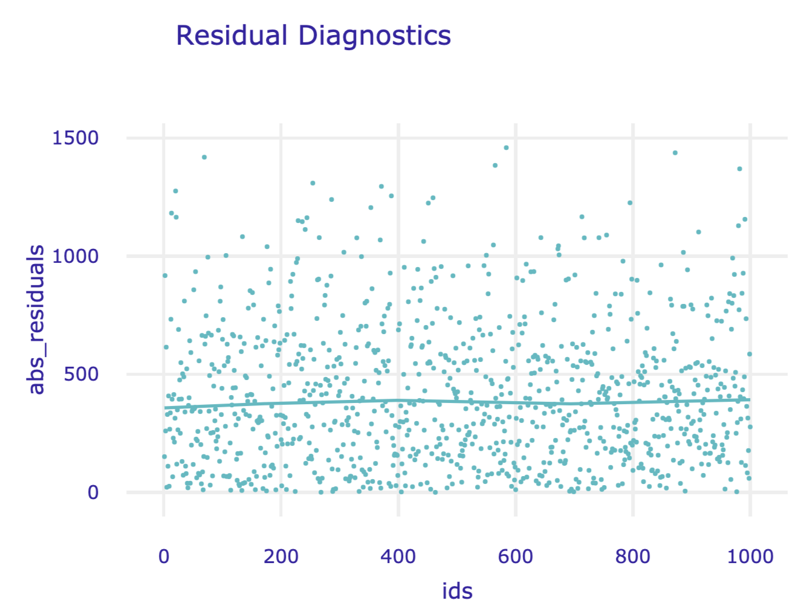

# Residual-diagnostics Plots {#residualDiagnostic}

```{r, echo=FALSE, warning = FALSE}
source("code_snippets/ema_init.R")
```

## Introduction {#IntroResidualDiagnostic}

In this chapter, we present methods that are useful for a detailed examination of both overall and instance-specific model performance. In particular, we focus on graphical methods that use residuals. The methods may be used for several purposes:

* In Part II of the book, we discussed tools for single-instance exploration. Residuals can be used to identify potentially problematic instances. The single-instance explainers can then be used in the problematic cases to understand, for instance, which factors contribute most to the errors in prediction.

* For most models, residuals should express a random behavior with certain properties (like, e.g., being concentrated around 0). If we find any systematic deviations from the expected behavior, they may signal an issue with a model (for instance, an omitted explanatory variable or a wrong functional form of a variable included in the model). 

* In Chapter \@ref(modelPerformance), we discussed measures that can be used to evaluate the overall performance of a predictive model. Sometimes, however, we may be more interested in cases with the largest prediction errors, which can be identified with the help of residuals.

Residual diagnostics is a classical topic related to statistical modelling. It is most often discussed in the context of the evaluation of goodness-of-fit of a model. That is, residuals are computed using the training data and used to assess whether the model predictions "fit" the observed values of the dependent variable. The literature on the topic is vast, as essentially every book on statistical modeling includes some discussion about residuals. Thus, in this chapter, we are not aiming at being exhaustive. Rather, our goal is to present selected concepts that underlie the use of residuals for predictive models. 

## Intuition {#IntuitionResidualDiagnostic}

As it was mentioned in Section \@ref(notation), we primarily focus on models describing the expected value of the dependent variable as a function of explanatory variables. In such a case, for a "perfect" predictive model, the predicted value of the dependent variable should be exactly equal to the actual value of the variable for every observation. Perfect prediction is rarely, if ever, expected. In practice, we want the predictions to be reasonably close to the actual values. This suggests that we can use the difference between the predicted and the actual value of the dependent variable to quantify the quality of predictions obtained from a model. The difference is called a *residual*.

For a single observation, residual will almost always be different from zero. While a large (absolute) value of a residual may indicate a problem with a prediction for a particular observation, it does not mean that the quality of predictions obtained from a model is unsatisfactory in general. To evaluate the quality, we should investigate the "behavior" of  residuals for a group of observations. In other words, we should look at the distribution of the values of residuals. 

For a "good" model, residuals should deviate from zero randomly, i.e., not systematically. Thus, their distribution should be symmetric around zero, implying that their mean (or median) value should be zero. Also, residuals should be close to zero themselves, i.e., they should show low variability. 

Usually, to verify these properties, graphical methods are used. For instance, a histogram can be used to check the symmetry and location of the distribution of residuals. Note that a model may imply a concrete distribution for residuals. In such a case, the distributional assumption can be verified by using a suitable graphical method like, for instance, a quantile-quantile plot. If the assumption is found to be violated, one might want to be careful when using predictions obtained from the model.

## Method {#MethodResidualDiagnostic}

As it was already mentioned in Chapter \@ref(modelDevelopmentProcess), for a continuous dependent variable $Y$, residual $r_i$ for the $i$-th observation in a dataset is the difference between the observed value of $Y$ and the corresponding model prediction:

\begin{equation}
r_i = y_i - f(\underline{x}_i) = y_i - \widehat{y}_i.
(\#eq:resid)
\end{equation}

*Standardized residuals* are defined as

\begin{equation}
\tilde{r}_i = \frac{r_i}{\sqrt{\mbox{Var}(r_i)}},
(\#eq:standresid)
\end{equation}

where $\mbox{Var}(r_i)$ is the variance of the residual $r_i$. 

Of course, in practice, the variance of $r_i$ is usually unknown. Hence, the estimated value of $\mbox{Var}(r_i)$ is used in \@ref(eq:standresid). Residuals defined in this way are often called the *Pearson residuals* [@Galecki2013]. Their distribution should be approximately standard-normal. For the classical linear-regression model, $\mbox{Var}(r_i)$ can be estimated by using the design matrix. On the other hand, for count data, the variance can be estimated by $f(\underline{x}_i)$, i.e., the expected value of the count. In general, for complicated models, it may be hard to estimate $\mbox{Var}(r_i)$, so it is often approximated by a constant for all residuals. 

<!-- Consider, for example, the classical linear-regression model. According to the model, for the $i$-th observation, the dependent variable $Y_i$ should follow a normal distribution with mean $f(x_i)$ and variance $\sigma^2$. Thus, the standardized residual $\tilde{r}_i = r_i/\sigma$. If the model is correct, $\tilde{r}_i$ should have a standard-normal distribution. The Pearson residual is defined as $r_i/\widehat{\sigma}$, where $\widehat{\sigma}$ is the estimated value of $\sigma$, and has, approximately, also a standard-normal distribution.  -->

Definition \@ref(eq:standresid) can also be applied to a binary dependent variable if the model prediction $f(\underline{x}_i)$ is the probability of observing $y_i$ and upon coding the two possible values of the variable as 0 and 1. However, in this case, the range of possible values of $r_i$ is restricted to $[-1,1]$, which limits the usefulness of the residuals. For this reason, more often the Pearson residuals are used.  Note that, if the observed values of the explanatory-variable vectors $\underline{x}_i$ lead to different predictions $f(\underline{x}_i)$ for different observations in a dataset, the distribution of the Pearson residuals will not be approximated by the standard-normal one. This is the case when, for instance, one (or more) of the explanatory variables is continuous. Nevertheless, in that case, the index plot may still be useful to detect observations with large residuals. The standard-normal approximation is more likely to apply in the situation when the observed values of vectors $\underline{x}_i$ split the data into a few, say $K$, groups, with observations in group $k$ ($k=1,\ldots,K$) sharing the same predicted value $f_k$. This may be happen if all explanatory variables are categorical with a limited number of categories. In that case, one can consider averaging residuals $r_i$ per group and standardizing them by $\sqrt{f_k(1-f_k)/n_k}$, where $n_k$ is the number of observations in group $k$. 

For categorical data, residuals are usually defined in terms of differences in predictions for the dummy binary variable indicating the category observed for the $i$-th observation.

<!---
A histogram of the estimated residuals can be used to check the symmetry and location of their distribution. An index plot of residuals, i.e., the plot of residuals against the corresponding observation number, may be used to identify observations with large residuals.
--->

Let us consider the classical linear-regression model. In that case, residuals should be normally distributed with mean zero and variance defined by the diagonal of hat-matrix $\underline X(\underline X^T \underline X)^{-1}\underline X^T$. For independent explanatory variables, it should lead to a constant variance of residuals. Figure \@ref(fig:residuals1234) presents examples of classical diagnostic plots for linear-regression models that can be used to check whether the assumptions are fulfilled. In fact, the plots in Figure \@ref(fig:residuals1234) suggest issues with the assumptions. 

In particular, the top-left panel presents the residuals in function of the estimated linear combination of explanatory variables, i.e., predicted (fitted) values. For a well-fitting model, the plot should show points scattered symmetrically around the horizontal straight line at 0. However, the scatter in the top-left panel of Figure \@ref(fig:residuals1234) has got a shape of a funnel, reflecting increasing variability of residuals for increasing fitted values. This indicates a violation of the homoscedasticity, i.e., the constancy of variance, assumption. Also, the smoothed line suggests that the mean of residuals becomes increasingly positive for increasing fitted values. This indicates a violation of the assumption that residuals have got zero-mean.      

The top-right panel of Figure \@ref(fig:residuals1234) presents the scale-location plot, i.e., the plot of $\sqrt{\tilde{r}_i}$ in function of the fitted values $f(\underline{x}_i)$. For a well-fitting model, the plot should show points scattered symmetrically across the horizontal axis. This is clearly not the case of the plot in Figure \@ref(fig:residuals1234), which indicates a violation of the homoscedasticity assumption.  

The bottom-left panel of Figure \@ref(fig:residuals1234) presents the plot of standardized residuals in the function of *leverage*. Leverage is a measure of the distance between $\underline{x}_i$ and the vector of mean values for all explanatory variables [@Kutner2005]. A large leverage value for the $i$-th observation, say $l_i$, indicates that $\underline{x}_i$ is distant from the center of all observed values of the vector of explanatory variables. Importantly, a large leverage value implies that the observation may have an important influence on predicted/fitted values. In fact, for the classical linear-regression model, it can be shown that the predicted sum-of-squares, defined in \@ref(eq:PRESS), can be written as 

\begin{equation}
PRESS = \sum_{i=1}^{n} (\widehat{y}_{i(-i)} - y_i)^2 =  \sum_{i=1}^{n} \frac{r_i^2}{(1-l_{i})^2}.
(\#eq:leveragePRESS)
\end{equation}

Thus, \@ref(eq:leveragePRESS) indicates that observations with a large $r_i$ (or $\tilde{r}_i$) and a large $l_i$ have an important influence on the overall predictive performance of the model. Hence, the plot of standardized residuals in the function of leverage can be used to detect such influential observations. Note that the plot can also be used to check homoscedasticity because, under that assumption, it should show a symmetric scatter of points around the horizontal line at 0. This is not the case of the plot presented in the bottom-left panel of Figure \@ref(fig:residuals1234). Hence, the plot suggests that the assumption is not fulfilled. However, it does not indicate any particular influential observations, which should be located in the upper-right or lower-right corners of the plot. <!---, above the dashed red line. On such charts, usually, areas with Cook's  values exceeding 0.5 are marked with dashed lines. But for the presented data, the leverages are not large, so the whole presented area corresponds to Cook values smaller than 0.5.-->

Note that the  plot of standardized residuals in function of leverage can also be used to detect observations with large differences between the predicted and observed value of the dependent variable. In particular, given that ${\tilde{r}_i}$ should have approximately standard-normal distribution, only about 0.5\% of them should be larger, in absolute value, than 2.57. If there is an excess of such observations, this could be taken as a signal of issues with the fit of the model. At least two such observations (59 and 143) are indicated in the plot shown in the bottom-left panel of Figure \@ref(fig:residuals1234).  

Finally, the bottom-right panel of Figure \@ref(fig:residuals1234) presents an example of a normal quantile-quantile plot. In particular, the vertical axis represents the ordered values of the standardized residuals, whereas the horizontal axis represents the corresponding values expected from the standard normal distribution. If the normality assumption is fulfilled, the plot should show a scatter of points close to the $45^{\circ}$ diagonal. Clearly, this is not the case of the plot in the bottom-right panel of Figure \@ref(fig:residuals1234). 

(ref:residuals1234Desc) Diagnostic plots for a linear-regression model. Clockwise from the top-left: residuals in  function of fitted values, a scale-location plot, a normal quantile-quantile plot, and a leverage plot. In each panel, indexes of the three most extreme observations are indicated.

```{r residuals1234, echo=FALSE, fig.cap='(ref:residuals1234Desc)', out.width = '100%', fig.align='center'}
knitr::include_graphics("figure/residuals1234.png")
```

<!--
[TOMASZ: NOT SURE IF THE BELOW IS WORTH INCLUDING. WE DO NOT SEEM TO LOOK AT QQ PLOTS. PERHAPS WE SHOULD?]

For models implying concrete distributional assumptions one can define a generalization of residuals called *pseudo-residuals* [Zucchini, MacDonald, Langrock "Hidden Markov Models for Time Series. An Introduction Using R. (
Second Edition)]. Assume that, according to the model, the dependent variable for the $i$-th observation should have a distribution with the cumulative distribution function $F_i(y)$, i.e., $P(Y_i \leq y) = F_i(y)$. In that case, the *uniform pseudo-residual* is defined as follows:

$$
u_i=F_i(y_i).
$$

If the model correctly describes the distribution of the dependent variable, then the pseudo-residual, obtained by transforming the variable by its cumulative distribution function, should have a uniform distribution on the interval $[0,1]$. A histogram of the estimated residuals could be used to check the uniform-distribution assumption.

Note that a value of $u_i$ close to 0 or 1 indicates that $y_i$ is located in one of the tails of the model-predicted distribution, i.e., it is unlikely from the point of view of the distribution. Excess of such values would indicate a systematic failure of the model to provide good predictions.  

However, uniform pseudo-residuals are not very useful for detection of observations for which model fails to yield good predictions. This is because it is difficult to discriminate between values very close to 0 or 1, like 0.975 and 0.999. For this reason, often, *normal pseudo-residuals* are used. They are defined as follows:

$$
\tilde{u}_i=\Phi^{-1}(u_i),
$$

where $\Phi()$ denotes the cumulative distribution function of the standard normal distribution. If the model is correct, normal pseudo-residuals should have the standard-normal distribution. A quantile-quantile plot of the estimated residuals could be used to check the normal-distribution assumption. Note that, for $u_i=0.975$ and 0.999, we get clearly distinguishable values of $\tilde{u}_i=1.96$ and 3.09, respectively. 

It is worth noting that the normal pseudo-residual measures, in general, the deviation of the observed value of the dependent variable from the model-predicted median of the corresponding distribution. This is because 

\begin{equation}
\tilde{u}_i=0 \rightarrow \Phi^{-1}(u_i)=0  \rightarrow u_i=\Phi(0)=\frac{1}{2} \rightarrow F_i(y_i)=\frac{1}{2}.
(\#eq:pseudomedian)
\end{equation}

The last equality in \@ref(eq:pseudomedian) implies that $y_i$ is equal to the median of the corresponding distribution of the dependent variable. 

Consider, for example, the classical linear-regression model. In this case, $F_i$ is the cumulative distribution function of a normal distribution with mean $f(x_i)$ and variance $\sigma^2$. It follows that the uniform pseudo-residual is equal to

$$
u_i=F_i(y_i)=\Phi\left\{\frac{y_i-f(x_i)}{\sigma}\right\}=\Phi\left(\frac{r_i}{\sigma}\right)=\Phi\left(\tilde{r_i}\right).
$$

If the model correctly captures the distribution of the dependent variable, the standardized residual $\tilde{r}_i$ should follow a standard-normal distribution. Consequently, $u_i$, obtained by transforming $\tilde{r}_i$ by its cumulative distribution function $\Phi()$, should follow a uniform distribution, as required for the uniform pseudo-residual.

On the other hand, the normal pseudo-residual for the linear-regression model is given by

$$
\tilde{u}_i=\Phi^{-1}\{F_i(y_i)\}=\Phi^{-1}\left\{\Phi\left(\frac{r_i}{\sigma}\right)\right\}=\tilde{r_i}.
$$
Thus, in this case, the normal pseudo-residual is simply the standardized residual. Consequently, $\tilde{u}_i$ should follow a standard-normal distribution, as required for the normal pseudo-residual. Moreover, $\tilde{u}_i$ measures the deviation of the observed value of the dependent variable from the model-predicted mean (equal to the median) of the corresponding (normal) distribution.

For a discrete dependent variable, e.g., a count, one can define the *uniform pseudo-residual segments* as follows:

$$
[u^-_i,u^+_i]=[F_i(y^-_i),F_i(y_i)],
$$

where $y^-_i$ is the largest possible value of the dependent variable smaller than $y_i$. Essentially, the length of the interval $[u^-_i,u^+_i]$ is equal to $P(Y_i=y_i)$, the probability of observing $y_i$. Thus, the uniform pseudo-residual segment provides an information on how rare the observed value of the dependent variable is given the corresponding distribution predicted by the model.   

The *normal pseudo-residual segment* is defined as 

$$
[\tilde{u}^-_i,\tilde{u}^+_i]=[\Phi^{-1}\{ F_i(y^-_i)\},\Phi^{-1}\{F_i(y_i)\}].
$$

Essentially, the limits of the interval $[\tilde{u}^-_i,\tilde{u}^+_i]$ are the quantiles of the standard-normal distribution corresponding to $P(Y_i\leq y^-_i)$ and $P(Y_i\leq y_i)$, respectively, so that 

$$
\Phi(\tilde{u}_i)-\Phi(\tilde{u}^-_i)=P(Y_i\leq y_i)-P(Y_i\leq y^-_i)=P(Y_i= y_i).
$$

Furthermore, one can define *normal mid-pseudo-residual* as follows:

$$
\bar{\tilde{u}}_i=\Phi^{-1}\left(\frac{\tilde{u}^-_i+\tilde{u}^+_i}{2}\right).
$$

The normality of estimated mid-pseudo-residuals can be checked by constructing a histogram or a normal quantile-quantile plot.
-->

## Example: apartment-prices data {#ExampleResidualDiagnostic}

In this section, we consider the linear-regression model `apartments_lm` (Section \@ref(model-Apartments-lr)) and the random forest model `apartments_rf` (Section \@ref(model-Apartments-rf)) for the apartment-prices dataset (Section \@ref(ApartmentDataset)). Recall that the dependent variable of interest, the price per square meter, is continuous. Thus, we can use residuals $r_i$, as defined in \@ref(eq:resid). We compute the residuals for the `apartments_test` testing dataset (see Section \@ref(predictionsApartments)). It is worth noting that, as it was mentioned in Section \@ref(modelPerformanceApartments), RMSE for both models is very similar for that dataset. Thus, overall, the two models could be seen as performing similarly on average.

```{r modelResidualsArchivistRead0, warning=FALSE, echo=FALSE, message=FALSE}
library("DALEX")
library("ggplot2")
library("randomForest")
#apartments_rf <- archivist::aread("pbiecek/models/fe7a5")
#apartments_lr <- archivist::aread("pbiecek/models/55f19")
explainer_apartments_rf <- DALEX::explain(model = apartments_rf, data = apartments_test[,-1],
    y = apartments_test$m2.price, label = "Random Forest", verbose = FALSE)
explainer_apartments_lr <- DALEX::explain(model = apartments_lr, data = apartments_test[,-1],
    y = apartments_test$m2.price, label = "Linear Regression", verbose = FALSE)
mr_lr <- DALEX::model_performance(explainer_apartments_lr)
mr_rf <- DALEX::model_performance(explainer_apartments_rf)
```

Figures \@ref(fig:plotResidualDensity1) and \@ref(fig:plotResidualBoxplot1) summarize the distribution of residuals for both models. In particular, Figure \@ref(fig:plotResidualDensity1) presents histograms of residuals, while Figure \@ref(fig:plotResidualBoxplot1) shows box-and-whisker plots for the absolute value of the residuals. 

(ref:plotResidualDensity1Desc) Histogram of residuals for the linear-regression model `apartments_lm` and the random forest model `apartments_rf` for the `apartments_test` dataset. 

```{r plotResidualDensity1, fig.cap='(ref:plotResidualDensity1Desc)',  warning=FALSE, message=FALSE, echo = FALSE, fig.width=8, fig.height=5,  fig.align='center', echo=FALSE}
plot(mr_lr, mr_rf, geom = "histogram") + scale_x_continuous(breaks = seq(-1000,1600,200)) + theme_ema
```

Despite the similar value of RMSE, the distributions of residuals for both models are different. In particular, Figure \@ref(fig:plotResidualDensity1) indicates that the distribution for the linear-regression model is, in fact, split into two separate, normal-like parts, which may suggest omission of a binary explanatory variable in the model. The two components are located around the values of about -200 and 400. As mentioned in the previous chapters, the reason for this behavior of the residuals is the fact that the model does not capture the non-linear relationship between the price and the year of construction. For instance, Figure \@ref(fig:pdpApartment3) indicates that the relationship between the construction year and the price may be U-shaped. In particular, apartments built between 1940 and 1990 appear to be, on average, cheaper than those built earlier or later.

As seen from Figure \@ref(fig:plotResidualDensity1), the distribution of residuals for the random forest model is skewed to the right and multimodal. It seems to be centered at a value closer to zero than the  distribution for the linear-regression model, but it shows a larger variation. These conclusions are confirmed by the box-and-whisker plots in Figure \@ref(fig:plotResidualBoxplot1). 

(ref:plotResidualBoxplot1Desc) Box-and-whisker plots of the absolute values of the residuals of the linear-regression model `apartments_lm` and the random forest model `apartments_rf` for the `apartments_test` dataset. The dots indicate the mean value that corresponds to root-mean-squared-error. 

```{r plotResidualBoxplot1, fig.cap='(ref:plotResidualBoxplot1Desc)',  warning=FALSE, message=FALSE, echo = FALSE, fig.width=8, fig.height=2.5,  fig.align='center', echo=FALSE, out.width="80%"}
plot(mr_lr, mr_rf, geom = "boxplot") + scale_y_continuous(breaks = seq(-1000,1600,200)) + theme_ema
```

The plots in Figures \@ref(fig:plotResidualDensity1) and \@ref(fig:plotResidualBoxplot1) suggest that the residuals for the random forest model are more frequently smaller than the residuals for the linear-regression model. However, a small fraction of the random forest-model residuals is very large, and it is due to them that the RMSE is comparable for the two models.

In the remainder of the section, we focus on the random forest model. 

Figure \@ref(fig:plotResidual1) shows a scatter plot of residuals (vertical axis) in function of the observed (horizontal axis) values of the dependent variable. For a "perfect" predictive model, we would expect the horizontal line at zero. For a "good" model, we would like to see a symmetric scatter of points around the horizontal line at zero, indicating random deviations of predictions from the observed values. The plot in Figure \@ref(fig:plotResidual1) shows that, for the large observed values of the dependent variable, the residuals are positive, while for small values they are negative. This trend is clearly captured by the smoothed curve included in the graph. Thus, the plot suggests that the predictions are shifted (biased) towards the average. 

(ref:plotResidual1Desc) Residuals and observed values of the dependent variable for the random forest model `apartments_rf` for the `apartments_test` dataset. 

```{r plotResidual1, fig.cap='(ref:plotResidual1Desc)',  warning=FALSE, message=FALSE, echo = FALSE, fig.width=8, fig.height=6,  fig.align='center', echo=FALSE, out.width="80%"}
md_lr <- model_diagnostics(explainer_apartments_lr)
md_rf <- model_diagnostics(explainer_apartments_rf)

plot(md_rf, variable = "y", yvariable = "residuals") + xlab("true value of m2.price (y)") + ylab("residuals (r_i)") + theme_ema
```

The shift towards the average can also be seen from Figure \@ref(fig:plotPrediction1) that shows a scatter plot of the predicted (vertical axis) and observed (horizontal axis) values of the dependent variable. For a "perfectly" fitting model we would expect a diagonal line (indicated in red). The plot shows that, for large observed values of the dependent variable, the predictions are smaller than the observed values, with an opposite trend for the small observed values of the dependent variable.

(ref:plotPrediction1Desc) Predicted and observed values of the dependent variable for the random forest model `apartments_rf` for the `apartments_test` dataset. The red line indicates the diagonal. 

```{r plotPrediction1, fig.cap='(ref:plotPrediction1Desc)',  warning=FALSE, message=FALSE, echo = FALSE, fig.width=8, fig.height=6,  fig.align='center', echo=FALSE, out.width="80%"}
plot(md_rf, variable = "y", yvariable = "y_hat") + xlab("true value of m2.price (y)") + ylab("predicted m2.price (y_hat)") + geom_abline(
    colour = "red", intercept = 0, slope = 1) + theme_ema
```

Figure \@ref(fig:plotResidual2) shows an index plot of residuals, i.e., their scatter plot in function of an (arbitrary) identifier of the observation (horizontal axis). The plot indicates an asymmetric distribution of residuals around zero, as there is an excess of large positive (larger than 500) residuals without a corresponding fraction of negative values. This can be linked to the right-skewed distribution seen in Figures \@ref(fig:plotResidualDensity1) and \@ref(fig:plotResidualBoxplot1) for the random forest model. 

(ref:plotResidual2Desc) Index plot of residuals for the random forest model `apartments_rf` for the `apartments_test` dataset. 

```{r plotResidual2, fig.cap='(ref:plotResidual2Desc)',  warning=FALSE, message=FALSE, echo = FALSE, fig.width=8, fig.height=6,  fig.align='center', out.width="80%"}
plot(md_rf, variable = "ids", yvariable = "residuals", smooth = FALSE) + xlab("observation id") + ylab("residuals") + theme_ema
```

Figure \@ref(fig:plotResidual3) shows a scatter plot of residuals (vertical axis) in function of the predicted (horizontal axis) value of the dependent variable. For a "good" model, we would like to see a symmetric scatter of points around the horizontal line at zero. The plot in Figure \@ref(fig:plotResidual3), as the one in Figure \@ref(fig:plotResidual1), suggests that the predictions are shifted (biased) towards the average. 

(ref:plotResidual3Desc) Residuals and predicted values of the dependent variable for the random forest model `apartments_rf` for the `apartments_test` dataset. 

```{r plotResidual3, fig.cap='(ref:plotResidual3Desc)',  warning=FALSE, message=FALSE, echo = FALSE, fig.width=5, fig.height=5,  fig.align='center', out.width="55%"}
plot(md_rf, variable = "y_hat", yvariable = "residuals") + ylab("residuals") + xlab("predicted m2.price (y_hat)") + theme_ema
```

The random forest model, as the linear-regression model, assumes that residuals should be homoscedastic, i.e., that they should have a constant variance. Figure \@ref(fig:plotScaleLocation1) presents a variant of the scale-location plot of residuals, i.e., a scatter plot of the absolute value of residuals (vertical axis) in function of the predicted values of the dependent variable (horizontal axis). The plot includes a smoothed line capturing the average trend. For homoscedastic residuals, we would expect a symmetric scatter around a horizontal line; the smoothed trend should be also horizontal. The plot in Figure \@ref(fig:plotScaleLocation1) deviates from the expected pattern and indicates that the variability of the residuals depends on the (predicted) value of the dependent variable. 

For models like linear regression, such heteroscedasticity of the residuals would be worrying. In random forest models, however, it may be less of concern. This is beacuse it may occur due to the fact that the models reduce variability of residuals by introducing a bias (towards the average). Thus, it is up to the developer of a model to decide whether such a bias (in our example, for the cheapest and most expensive apartments) is a desirable price to pay for the reduced residual variability.

(ref:plotScaleLocation1Desc) The scale-location plot of residuals for the random forest model `apartments_rf` for the `apartments_test` dataset. 

```{r plotScaleLocation1, fig.cap='(ref:plotScaleLocation1Desc)',  warning=FALSE, message=FALSE, echo = FALSE, fig.width=5, fig.height=5,  fig.align='center', out.width="55%"}
plot(md_rf, variable = "y_hat", yvariable = "abs_residuals") + 
    xlab("predicted m2.price") + ylab("absolute value of residuals") + theme_ema
```

## Pros and cons {#ProsConsResidualDiagnostic}

Diagnostic methods based on residuals are a very useful tool in model exploration. They allow identifying different types of issues with model fit or prediction, such as problems with distributional assumptions or with the assumed structure of the model (in terms of the selection of the explanatory variables and their form). The methods can help in detecting groups of observations for which a model's predictions are biased and, hence, require inspection. 

A potential complication related to the use of residual diagnostics is that they rely on graphical displays. Hence, for a proper evaluation of a model, one may have to construct and review many graphs. Moreover, interpretation of the patterns seen in graphs may not be straightforward. Also, it may not be immediately obvious which element of the model may have to be changed to remove the potential issue with the model fit or predictions.  

## Code snippets for R {#RcodeResidualDiagnostic}

In this section, we present diagnostic plots as implemented in the `DALEX` package for R. The package covers all plots and methods presented in this chapter. Similar functions can be found in packages `auditor` [@R-auditor], `rms` [@rms], and `stats` [@Faraway02practicalregression].

For illustration purposes, we will show how to create the plots shown in Section \@ref(ExampleResidualDiagnostic) for the linear-regression model `apartments_lm` (Section \@ref(model-Apartments-lr)) and the random forest model `apartments_rf` (Section \@ref(model-Apartments-rf)) for the `apartments_test` dataset (Section \@ref(ApartmentDataset)). 

We first load the two models via the `archivist` hooks, as listed in Section \@ref(ListOfModelsApartments). Subsequently, we construct the corresponding explainers by using function `explain()` from the `DALEX` package (see Section \@ref(ExplainersTitanicRCode)). Note that we use the `apartments_test` data frame without the first column, i.e., the *m2.price* variable, in the `data` argument. This will be the dataset to which the model will be applied. The *m2.price* variable is explicitly specified as the dependent variable in the `y` argument. We also load the `randomForest` package, as it is important to have the corresponding `predict()` function available for the random forest model. 

```{r modelResidualsArchivistReadcode, message=FALSE, eval=FALSE}
library("DALEX")
model_apart_lm <- archivist:: aread("pbiecek/models/55f19")
explain_apart_lm <- DALEX::explain(model = model_apart_lm, 
                           data    = apartments_test[,-1], 
                           y       = apartments_test$m2.price, 
                           label   = "Linear Regression")
library("randomForest")
model_apart_rf <- archivist:: aread("pbiecek/models/fe7a5")
explain_apart_rf <- DALEX::explain(model = model_apart_rf, 
                           data    = apartments_test[,-1], 
                           y       = apartments_test$m2.price, 
                           label   = "Random Forest")
```

```{r, message=FALSE, eval=TRUE, echo=FALSE}
library("DALEX")
explain_apart_lm <- DALEX::explain(model = model_apart_lm, 
                           data    = apartments_test[,-1], 
                           y       = apartments_test$m2.price, 
                           label   = "Linear Regression", 
                           verbose = FALSE)

library("randomForest")
explain_apart_rf <- DALEX::explain(model = model_apart_rf, 
                           data    = apartments_test[,-1], 
                           y       = apartments_test$m2.price, 
                           label   = "Random Forest", 
                           verbose = FALSE)
```

For exploration of residuals, `DALEX` includes two useful functions. The `model_performance()` function can be used to evaluate the distribution of the residuals. On the other hand, the `model_diagnostics()` function is suitable for investigating the relationship between residuals and other variables.

The `model_performance()` function was already introduced in Section \@ref(modelPerformanceR). Application of the function to an explainer-object returns an object of class "model_performance" which includes, in addition to selected model-performance measures, a data frame containing the observed and predicted values of the dependent variable together with the residuals. 

```{r modelResidualscode, message=FALSE}
mr_lm <- DALEX::model_performance(explain_apart_lm)
mr_rf <- DALEX::model_performance(explain_apart_rf)
```

By applying the `plot()` function to a "model_performance"-class object we can obtain various plots. The required type of the plot is specified with the help of the `geom` argument (see Section \@ref(modelPerformanceR)). In particular, specifying `geom = "histogram"` results in a histogram of residuals. In the code below, we apply the `plot()` function to the "model_performance"-class objects for the linear-regression and random forest models. As a result, we automatically get a single graph with the histograms of residuals for the two models. The resulting graph is shown in Figure \@ref(fig:plotResidualDensity1) 

```{r plotResidualDensity1code, warning=FALSE, message=FALSE, eval=FALSE}
library("ggplot2")
plot(mr_lm, mr_rf, geom = "histogram") 
```

The box-and-whisker plots of the residuals for the two models can be constructed by applying the `geom = "boxplot"` argument. The resulting graph is shown in Figure \@ref(fig:plotResidualBoxplot1). 

```{r plotResidualBoxplot1code,  warning=FALSE, message=FALSE, eval=FALSE}
plot(mr_lm, mr_rf, geom = "boxplot")
```

Function `model_diagnostics()` can be applied to an explainer-object to directly compute residuals. The resulting object of class "model_diagnostics" is a data frame in which the residuals and their absolute values are combined with the observed and predicted values of the dependent variable and the observed values of the explanatory variables. The data frame can be used to create various plots illustrating the relationship between residuals and the other variables. 

```{r plotResidual1code, warning=FALSE, message=FALSE, eval=FALSE}
md_lm <- model_diagnostics(explain_apart_lm)
md_rf <- model_diagnostics(explain_apart_rf)
```

Application of the `plot()` function to a `model_diagnostics`-class object produces, by default, a scatter plot of residuals (on the vertical axis) in function of the predicted values of the dependent variable (on the horizontal axis). By using arguments `variable` and `yvariable`, it is possible to specify plots with other variables used for the horizontal and vertical axes, respectively. The two arguments accept, apart from the names of the explanatory variables, the following values:

* `"y"` for the dependent variable,
* `"y_hat"` for the predicted value of the dependent variable,
* `"obs"` for the identifiers of observations,
* `"residuals"` for residuals,
* `"abs_residuals"` for absolute values of residuals.

Thus, to obtain the plot of residuals in function of the observed values of the dependent variable, as shown in Figure \@ref(fig:plotResidual1), the syntax presented below can be used.

```{r plotResidual2code,  warning=FALSE, message=FALSE, eval=FALSE}
plot(md_rf, variable = "y", yvariable = "residuals") 
```

To produce Figure \@ref(fig:plotPrediction1), we have got to use the predicted values of the dependent variable on the vertical axis. This is achieved by specifying the `yvariable = "y_hat"` argument. We add the diagonal reference line to the plot by using the `geom_abline()` function. 

```{r plotResidual3code, warning=FALSE, message=FALSE, eval=FALSE}
plot(md_rf, variable = "y", yvariable = "y_hat") +
      geom_abline(colour = "red", intercept = 0, slope = 1)
```

Figure \@ref(fig:plotResidual2) presents an index plot of residuals, i.e., residuals (on the vertical axis) in function of identifiers of individual observations (on the horizontal axis). Toward this aim, we use the `plot()` function call as below.

```{r plotPrediction1code, warning=FALSE, message=FALSE, eval=FALSE}
plot(md_rf, variable = "ids", yvariable = "residuals")
```

Finally, Figure \@ref(fig:plotScaleLocation1) presents a variant of the scale-location plot, with absolute values of the residuals shown on the vertical scale and the predicted values of the dependent variable on the horizontal scale. The plot is obtained with the syntax shown below. 

```{r plotAutocorrelation1code, warning=FALSE, message=FALSE, eval=FALSE}
plot(md_rf, variable = "y_hat", yvariable = "abs_residuals")
```

Note that, by default, all plots produced by applying the `plot()` function to a "model_diagnostics"-class object include a smoothed curve. To exclude the curve from a plot, one can use the argument `smooth = FALSE`.

## Code snippets for Python {#PythoncodeResidualDiagnostic}

In this section, we use the `dalex` library for Python. The package covers all methods presented in this chapter. But, as mentioned in Section \@ref(IntroResidualDiagnostic), residuals are a classical model-diagnostics tool. Thus, essentially any model-related library includes functions that allow calculation and plotting of residuals.

For illustration purposes, we use the `apartments_rf` random forest model for the Titanic data developed in Section \@ref(model-Apartments-python-rf). Recall that the model is developed to predict the price per square meter of an apartment in Warsaw. 

In the first step, we create an explainer-object that will provide a uniform interface for the predictive model. We use the `Explainer()` constructor for this purpose.

```{python,  eval = FALSE}
import dalex as dx
apartments_rf_exp = dx.Explainer(apartments_rf, X, y,
      label = "Apartments RF Pipeline")
```

The function that calculates residuals, absolute residuals and observation ids is `model_diagnostics()`. 

```{python,  eval = FALSE}
md_rf = apartments_rf_exp.model_diagnostics()
md_rf.result
```

```{r examplePythonMDiagnostics1, echo=FALSE, out.width = '100%'}
knitr::include_graphics("figure/python_model_diagnostics_1.png")
```

The results can be visualised by applying the `plot()` method. Figure \@ref(fig:examplePythonMDiagnostics2) presents the created plot.

```{python,  eval = FALSE}
md_rf.plot()
```

(ref:examplePythonMDiagnostics2Desc) Residuals versus predicted values for the random forest model for the Apartments data. 

```{r examplePythonMDiagnostics2, echo=FALSE, out.width = '70%', fig.align='center', fig.cap='(ref:examplePythonMDiagnostics2Desc)'}
knitr::include_graphics("figure/python_model_diagnostics_2.png")
```

In the `plot()` function, we can specify what shall be presented on horizontal and vertical axes. Possible values are columns in the `md_rf.result` data frame, i.e. `residuals`, `abs_residuals`, `y`, `y_hat`, `ids` and variable names.

```{python,  eval = FALSE}
mp_rf.plot(variable = "ids", yvariable = "abs_residuals")
```

(ref:examplePythonMDiagnostics3Desc) Absolute residuals versus indices of corresponding observations for the random forest model for the Apartments data. 

```{r examplePythonMDiagnostics3, echo=FALSE, out.width = '70%', fig.align='center', fig.cap='(ref:examplePythonMDiagnostics3Desc)'}

```

