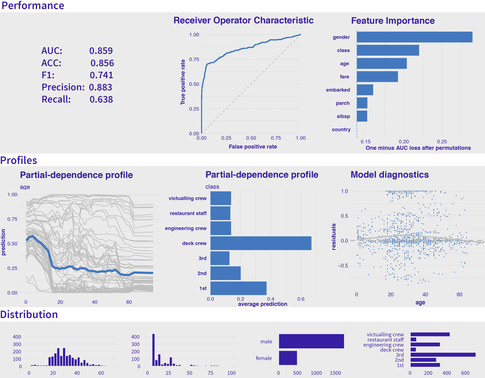
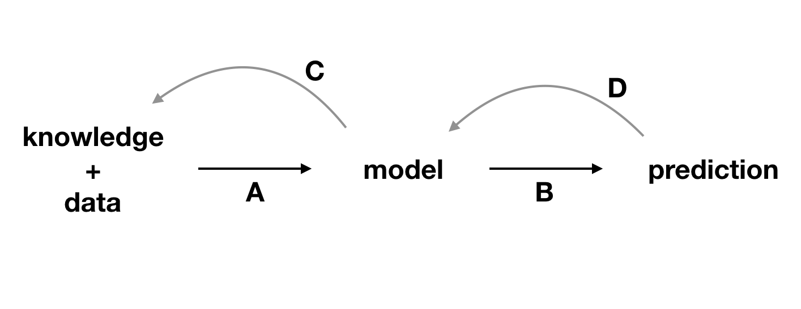

# Summary of Dataset-level Exploration {#summaryModelLevel}

```{r, echo=FALSE, warning=FALSE}
source("code_snippets/ema_init.R")
```

## Introduction {#summaryModelLevelIntro}

In Part III of the book, we introduced several techniques for global exploration and explanation of a model's predictions for a set of instances. Each chapter was devoted to a single technique. In practice, these techniques are rarely used separately. Rather, it is more informative to combine different insights offered by each technique into a more holistic overview.

(ref:modelLevelExplainersDesc) Results of dataset-level explanation techniques for the random forest model for the Titanic data. 

```{r modelLevelExplainers, echo=FALSE, fig.cap='(ref:modelLevelExplainersDesc)', out.width = '100%', fig.align='center'}

```

Figure \@ref(fig:modelLevelExplainers) offers a graphical illustration of the idea. The graph includes the results of different dataset-level explanation techniques applied to the random forest model (Section \@ref(model-titanic-rf)) for the Titanic data (Section \@ref(TitanicDataset)). 

The plots in the first row of Figure \@ref(fig:modelLevelExplainers) show how good is the model and which variables are the most important. In particular, the first two graphs in that row present measures of the model's overall performance, as introduced in Chapter \@ref(modelPerformance), along with a graphical summary in the form of the ROC curve. The last plot in the row shows values of the variable-importance measure obtained by the method introduced in Chapter \@ref(featureImportance). The three graphs indicate a reasonable overall performance of the model and suggest that the most important variables are *gender*, *class*, and *age*.

The two first plots in the second row of Figure \@ref(fig:modelLevelExplainers) show partial-dependence (PD) profiles for *age* (continuous variable) and *class* (categorical variable). The profile for *age* suggest that the critical cutoff, from a perspective of the variable's effect, is around 18 years. The profile for *class* indicates that, among different travel-classes, the largest effect and chance for survival is associated with the deck crew. The last graph  on the right in the second row of Figure \@ref(fig:modelLevelExplainers) presents a scatter plot of residuals for *age*. In the plot, residuals for passengers with age between 20 and 40 years are, on average, slightly larger than for other ages, but the bias is not excessive.

The plots in the third row of Figure \@ref(fig:modelLevelExplainers) summarize distributions of (from the left to the right the) *age*, *fare*, *gender*, and *class*.

Thus, Figure \@ref(fig:modelLevelExplainers) illustrates that perspectives offered by different techniques complement each other and, when combined, allow obtaining a more profound insight into the model's predictive performance.   

Figure \@ref(fig:knowledgeExtraction) illustrates how the information obtained from model exploration can be used to gain a better understanding of the model and of the domain that is being modelled. Modelling is an iterative process (see Section \@ref(MDPprocess)), and the more we learn in each iteration, the easier it is to plan and execute the next one. 

(ref:knowledgeExtractionDesc) Explainability techniques allow strengthening the feedback extracted from a model. A, data and domain knowledge allow building the model. B, predictions are obtained from the model. C, by analyzing the predictions, we learn more about the model. D, better understanding of the model allows better understanding of the data and, sometimes, broadens domain knowledge. 

```{r knowledgeExtraction, echo=FALSE, fig.cap='(ref:knowledgeExtractionDesc)', out.width = '70%', fig.align='center'}

```

While combining various techniques for dataset-level explanation can provide additional insights, it is worth remembering that the techniques are, indeed, different and their suitability may depend on the problem at hand. This is what we discuss in the remainder of the chapter.

## Exploration on training/testing data

The key element of dataset-level explanatory techniques is the set of observations on which the exploration is performed. Therefore, sometimes these techniques are called dataset-level exploration. This is the terminology that we have adopted.

In the case of machine-learning models, data are often split into a training set and a testing set. Which one should we use for model exploration?

In the case of model-performance assessment, it is natural to evaluate it using an independent testing dataset to minimize the risk of overfitting. However, PD profiles or accumulated-local (AL) profiles can be constructed for both the training and testing datasets. If the model is generalizable, its behavior for the two datasets should be similar. If we notice significant differences in the results for the two datasets, the source of the differences should be examined, as it may be a sign of shifts in variable distributions. Such shifts are called data-drift in the machine learning world.

## Correlated explanatory variables

Most methods introduced in Part III of the book analyze each exploratory variable independently from the other variables. However, more often than not, exploratory variables are correlated and jointly present some aspects of observations. For example, *fare* and *class* in the Titanic data are correlated (see Section \@ref(exploration-titanic)), and both are related to the wealth of the passenger. Many of the techniques presented in Part III can be generalized to allow a joint analysis of groups of two or more exploratory variables. For example, the permutation-based variable-importance measure presented in Chapter \@ref(featureImportance) was introduced in the context of an analysis of a single variable. However, permutations can be done for a group of variables, allowing for evaluation of the importance of the entire group.

Similarly, PD profiles (Chapter \@ref(partialDependenceProfiles)) assumed independence of variables. However, AL profiles (Chapter \@ref(accumulatedLocalProfiles)) allow taking correlation between variables into account. Moreover, it is possible to extend the AL profiles to the analysis of interaction effects. 

## Comparison of models (champion-challenger analysis)

One of important applications of the methods presented in Part III of the book is comparison of models. 

It appears that different models may offer a similar performance, while basing their predictions on different relations extracted from the same data. @twoCultures refers to this phenomenon as "Rashomon effect". By comparing models, we can gain important insights that can lead to improvement of one or several of the models. For instance, when comparing a more flexible model with a more rigid one, we can check if they discover similar relationships between the dependent variable and explanatory variables. If they do, this can reassure us that both models have discovered genuine aspects of the data. Sometimes, however, the rigid model may miss a relationship that might have been found by the more flexible one. This could provide, for instance, a suggestion for an improvement of the former. An example of such a case was provided in Chapter \@ref(partialDependenceProfiles), in which a linear-regression model was compared to a random forest model for the apartment-prices dataset. The random forest model suggested a U-shaped relationship between the construction year and the price of an apartment, which was missed by the simple linear-regression model.
