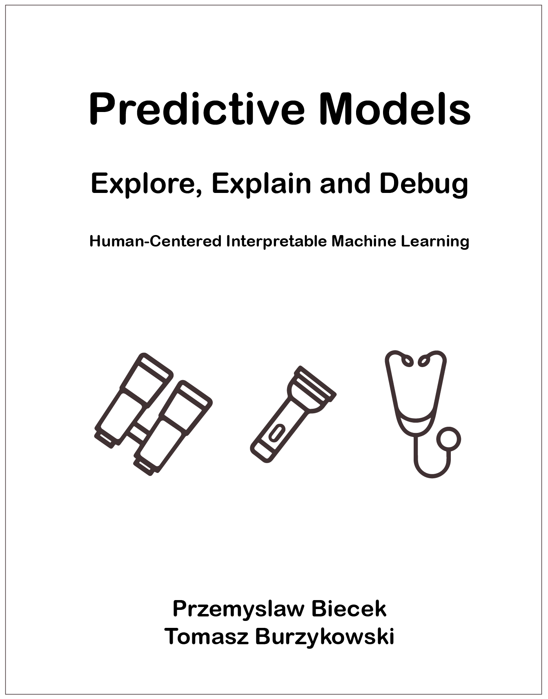

# Explanatory Model Analysis
## Explore, Explain and Examine Predictive Models

See the html website here: https://pbiecek.github.io/ema/

A note to readers: this text is a work in progress. 

We've released this initial version to get more feedback. Feedback can be given at the GitHub repo https://github.com/pbiecek/ema/issues. We are primarily interested in the organization and consistency of the content, but any comments will be welcommed.
