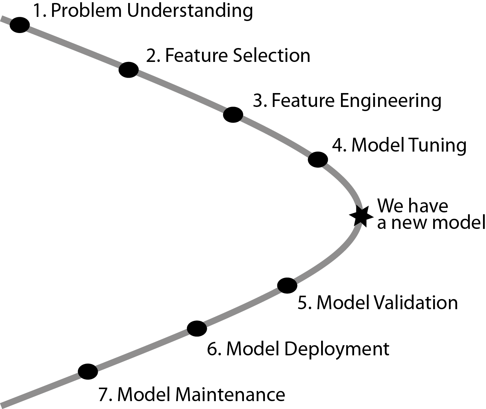

--- 
title: 'Predictive Models: Visualisation, Exploration and Explanation'
author: "Przemyslaw Biecek and Tomasz Burzykowski"
date: "`r Sys.Date()`"
colorlinks: yes
bibliography:
- book.bib
- packages.bib
description: This book introduces key concepts for exploration, explanation and visualization
  of complex predictive models.
documentclass: krantz
github-repo: pbiecek/PM_VEE
graphics: yes
link-citations: yes
lof: yes
lot: yes
site: bookdown::bookdown_site
subtitle: With examples in R and Python
biblio-style: apalike
---

# Introduction

## The aim of the book

Predictive models are used to guess (statisticians would say: predict) values of a variable of interest based on other variables. As an example, consider prediction of sales based on historical data, prediction of risk of heart disease based on patient's characteristics, or prediction of political attitudes based on facebook comments.

Predictive models have been constructed through the whole human history. Ancient Egyptians, for instance, used observations of rising of Sirius to predict flooding of the Nile. A more rigorous approach to model construction may be attributed to the method of least squares, published more than two centuries ago by Legendre in 1805 and by Gauss in 1809. With time, the number of applications in economy, medicine, biology,and  agriculture was growing. The term *regression* was coined by Francis Galton in 1886. Initially, it was referring to biological applications, while today it is used for various models that allow prediction of continuous variables. Prediction of nominal variables is called *classification*, and its beginning may be attributed to works of Ronald Fisher in 1936.

During the last century, many statistical models that can be used for predictive purposes have been developed. These include  linear models, generalized linear models, regression and classification trees, rule-based models, and many others. Developments in mathematical foundations of predictive models were boosted by increasing computational power of personal computers and availability of large datasets in the era of ,,big data'' that we have entered. 

With the increasing demand for predictive models, model features such as flexibility, ability to perform internally some feature engineering, and high precision of predictions are of interest. To obtain robust models, ensembles of models are used. Techniques like bagging, boosting, or model stacking combine hundreds or thousands of small models into a one super-model. Large deep neural models have overa  bilion of parameters. 

There is a cost of this progress. Complex models may seem to operate like ,,black boxes''. It may be difficult, or even impopssible, to understand how thousands of coefficients affect the model prediction. At the same time, complex models may not work as good as we would like them to do. An overview of real problems with large black-box models may be found in an excellent book of Cathy O'Neil [@ONeil] or in her TED Talk ,,*The era of blind faith in big data must end*''. There is a growing number of examples of predictive models with performance that deteriorated over time or became biased in some sense. See, for instance, the issues related to the flu epidemic predictions by the Google Flu Trends model [Lazer et al Science 2014] or the problems with cancer recommndations based on the IBM Watson model [https://www.statnews.com/2017/09/05/watson-ibm-cancer/].

Today the true bottleneck in predictive modelling is not the lack of data, nor the lack of computational power, nor the lack of flexible models. It is the lack of tools for model validation, model exploration, and explanation of model decisions. Thus, in this book, we present a collection of methods that may be used for this purpose. As development of such methods is a very active area of research and new methods become available almost on a continuous basis, we do not aim at being exhaustive. Rather, we present the mind-set, key problems, and several example of methods that can be used in model exploration.

TEST FROM RSTUDIO

## White-box models vs. black-box models

In this book we focus on black-box models, i.e., models with a complex structure that may involve a large number of coefficients. Such models are usually hard to trace and understand by humans.

Their counterpart are white-box models that have a simple structure and a limited number of coefficients. The two most common classess of white-box models are decision or regression trees (see an example in Figure \@ref(fig:BILLCD8)) or models with an additive structure, like the following model for mortality risk in melanoma patients:

$$
RelativeRisk = 1 + 3.6 * [Breslow > 2] - 2 * [TILs > 0] 
$$

In the model, two explanatory variables are used: an indicator whether the thickness of the lesion according to the Breslow scale is larger than 2 mm and an indicator whether the percentage of tumour-infiltrating lymphocytes (TILs) was larger than 0.  

The structure of white box-models is, in general, easy to understand. It may be difficult to build the model, collect the necessary data, fit the model, and/or perform model validation, but once the model has been derived its interpretation and mode of working is straightforward.

Why is it important to understand the model structure? There are several important advantages. If the model structure is clear, we can easily see which variables are included in the model and which are not. Hence, we may be able to question the model, for instance,  when a particular explanatory variable was ignored. Also, in case of a model with a clear structure and a limited number of coefficeints, we can easily link changes in model predictions with changes in particular explanatory variables. This, in turn, may allow us to challenge the model against the domain knowledge if, for instance, the effect of a particular variable on predictions is inconsistent with the previously established results. Note that linking changes in model predictions with changes in particular explanatory variables may be challening when there are may variables and/or coefficients in the model. For instance, a classification tree with hundreds of nodes is difficult to understand, as is a linear regression model with hundreds of cofficients.

Getting the idea about the performance of a black-box model may be more challenging. The structure of a complex model like, e.g., a neural-network model, mmay be far from transparent. Consequently, we may not understand which features and how influence the model decisions. Consequently, it may be difficult to decide whether the model is consistent with the domain knowledge. In our book we present tools that can help in extracting the information necessary for the model evaluation for complex models.

```{r BILLCD8, echo=FALSE, fig2.cap="(fig:BILLCD8) Example tree model for melanoma risk", out.width = '50%', fig.align='center'}
knitr::include_graphics("figure/wbBILL8model.png")
```

## How model exploration is different from data exploration?

Exploration and visualization of models is not that known as exploration and visualization of data.

In both data and model visualization we use a graphical representation to deliver  messages quicker in a form that is easier to digest. In fact, we may use similar charts and similar way to express ideas. This is because many people are already familiar with techniques for data visualization and we may want to take advantage of this knowledge when approaching model visualization.

Despite the similarites, we need to keep in mind a few key differences between these two worlds. 

First, with data exploration and visualization we want to understand the, usually unknown, mechanism generating data. Models are created based on the data, but in most cases we do not know how adequatly do these models capture the unknown mechanism. So, we use model exploration to check if the model is consistent with the data and, therefore, if it may offer a description of the mechanism. However, in most cases we do not check if data are ,,correct''. So, we are more skeptical about models than about data.

Second, we usually treat data as a random sample coming from a population or from a probability distribution. Hence, data inherit randomness related to the sampling. On the other hand, models are just functions. Most models are not stochastic (or at least some models are not stochastic) and the randomness (if any) come from the fitting procedure not from the sampling. [TOMASZ: NOT SURE WHAT DO WE WANT TO SAY HERE?]

Finally, models may be inaccurate or biased. When we ask a question like ,,How does the model perform?'' we essentially ask, a t the same time, ,,is the model accurate? how much I can trust it?''. With respect to data, we often do not question their accuracy or ,,trustwothiness'', but rather our understanding of the data. [TOMASZ: NOT SURE WHAT DO WE WANT TO SAY HERE?]

Thus, in summary, we may use similar exploration and visualization techniques for models and data. But the techniques are used to answer different questions.

## Model-agnostic vs. model-specific approach

Some classes of models attract higher interest or have been developed for a longer period of time. Consequently, those classes of models are equipped with very good tools for model exploration or visualisation. For example:

* Linear models have got many tools for model diagnostics and evaluation. Model assumptions are formally defined (normality, linear structure, homogenous variance) and can be checked by using normality tests or plots (normal qq-plot), diagnostic plots, tests for model structure (RESET test), tools for identification of outliers, etc.
* More complex models with an additive structure, like proportional hazards model, have also got many tools that can be used for checking model assumptions.
* Random-forest model is equipped with out-of-bag method of evaluation of performance and several tools for measuring variable importance [@R-randomForest]. Methods have been developed to extract information from the model structure about possible interactions [@R-randomForestExplainer]. Similar tools are developed for other ensembles of trees, like xgboost models [@R-xgboostExplainer].
* Neural networks enjoy a large collection of dedicated explainers that use, for instance, the layer-wise relevance propagation technique [@BachLWRP], or saliency maps technique [@SaliencyMaps], or a mixed approach.

Of course, the list of model classes with dedicated collections of model-explanation and/or diagnostics methods is much longer. This variety of model-specific approaches does lead to issues, though. For instance, one cannot easily compare explanations for two models with different structures. Also, every time when a new architecture or a new ensemble of models is proposed, one needs to look for new methods of model exploration. Finally, for brand-new models no tools for model explanation or diagnostics may be immedaitely available.

For these reasons, in our book we focus on model-agnostic techniques. In particular, we prefer not to assume anything about the model structure, as we may be dealing with a black-box model with an unclear structure. In that case, the only operation that we may be able to perform is evaluation of a model for a selected observation.

Hoever, while we do not assume anything about the structure of the model, we will assume that the model operates on $p$-dimensional vectors and, for a single vector, it returns a single value which is a real number. This assumption holds for a broad range of models for data such as tabular data, images, text data, videos, etc. It may not be suitable for, e.g., models with memory in which the model output does not depend only on the model input [TOMASZ: NOT SURE WHICH MODELS ARE MEANT HERE].

Note that the techniques considered in the book may not be sufficient to fully understand models in case $p$ is large. 

## Why do we need model explainers?

Machine-learning models (MLMs) have a wide range of applications. Due to the increasing computational power of computers and complexity of data sources, MLMs are becoming more and more sophisticated. Models created with the use of techniques such as boosting or bagging of neural networks are parametrized by thousands of coefficients. They are obscure; it is hard to trace the link between input variables and model outcomes - in fact they are treated as black boxes. They are used because of their elasticity and high performance, but their deficiency in interpretability is one of their weakest sides.

In many applications we need to know, understand or prove how the input variables are used in the model. We need to know the impact of particular variables on the final model predictions. Thus we need tools that extract useful information from thousands of model parameters.

Tools for model exploration and model understanding have many applications. They may be useful during every phase of a model lifecycle.

Below we summaries how such tools will be useful during the model development, model deployment or model maintenance.


```{r modelLifetime, echo=FALSE, fig.cap="(fig:modelLifetime) Example applications of explainers in different phases of model lifetime", out.width = '90%', fig.align='center'}
knitr::include_graphics("figure/modelLifetime.png")
```

**Model development**

Model building or model development is a phase in which one is looking for best available model. 

In the Section \@ref(partialDependence) we present tools for extraction of relations between features and target variable. Such methods may be used for feature engineering (assisted learning in which elastic black box model is used to learn features for the white box model). Learning from ML models may lead to model improvment.

In the Section \@ref(modelComparisons) we present tools that helps to compare models.

In the Section \@ref(modelAuditing) we present tools that help to validate model, audit model residuals, identify potential strange behaviors.

If for some observations we observe lack of fit, then through tools introduced in the Section \@ref(variableAttributionMethods) we may verify which variables do and which do not influence model decisions. This may help to identify some problem in the model fit and in the end will help to correct the model. 

Since the AutoML methods are being more and more popular, model explainers may actually help to understand how the model identified by AutoML method is working.

If we identify cases on which model is not working properly, then model explainers will help in model debugging. See an examples in the Section TODO.


**Model deployment**

Model deployment is a phase in which one wants final use trust in model decisions, understand these decisions and act accordingly. In some areas complex models are not being adopted because people do not understand nor trust them. Model explainers can change this and increase rate of aquisition of new models

Since most people would not trust in recommendations, that they do not understand, the key element here is to increase understanding related to features that affect model decisions. 

In the Section \@ref(variableAttributionMethods) we introduce tools that identify key features that drive model decisions. 

In the Section \@ref(ceterisParibus) we introduce tools for what-if analysis of model decisions.

In some areas there may be leagal expectations or regulations that requires that model predictions are explainable (see the right to explanation). See [@2017arXiv171107076L] or [@2017arXiv171006169T] for example methods that identify bias in the data.

  


**Model maintenance**

Model maintenance is a phase in which one wants to make sure that model is still valid and suited to the new data. Due to concept drift or similar problems that may happen after some time, we need to monitor the model performance.

In the section \@ref(partialDependence) we present tools that may compare how thw model response behaves on the new dataset. This helps to detect flaws in model assumptions and biases in the data.

## Model lifecycle

Figure \@ref(fig:lifecycle) shows typical lifecycle of a predictive model. Part of the lifecycle are activities that lead to the model development. First, of course, we need to understand the domain of a problem, then we need to select important features, prepare important features, select the right model structure and viola! We have the model.

Once the model is created we still need to validate its performance. We need to support its deployment and maintenance.

```{r lifecycle2, echo=FALSE, fig.cap="(fig:lifecycle) Model lifecycle", out.width = '50%', fig.align='center'}

```

As we will show, tools for model exploration, explanation and visualization may be useful in every phase of model lifecycle.

* Tools presented in chapter \@ref(variableImportance) helps to understand variable importance. They can be used in phase 2 - features selection.
* Tools presented in chapter \@ref(variableRelation) helps to understand variable effect. They can be used in phase 3 - features engineering.

Once the model is created, tools for model uderstanding have in general two applications.

* We can use them to contrast model behavior with our domain knowledge. This way we can validate if model behavior is consistent with our expectations / some imposed requirements.
* We can use them to extract some new knowledge about the domain. One possible application is to train a very elastic model to the dataset and then use model explainers to better understand relation between input variables and the target variable.

After model creation we may use model explainers to:

* Validate the model, some tools for that are presented in chapter ....
* Deploy the model. For deployed models we are interested in arguments agains particular decisions.
* Maintain the model. Monitor concept drift for a model.


## Code snippets

TODO: Here we should tell why we present examples for DALEX.
And mention that there are also other functions that can be used.


## Glossary / Notation


Let $f_{M}(x): \mathcal R^{d} \rightarrow \mathcal R$ denote a predictive model, i.e. function that takes $d$ dimensional vector and calculate numerical score. 
Dimenstions of the vector $x$ refer to different variables (aka features).

In sections in which we work with larger number of models we use subscript $M$ to index models. But to simplify notation, this subscript is omitted if profiles for only one model are considered. 

Symbol $x \in \mathcal R^d$ refers to a point in the feature space. We use subscript $x_i$ to refer to a different data points and superscript $x^j$ to refer to specific dimensions. Additionally, let $x^{-j}$ denote all coordinates except $j$-th and let $x|^j=z$ denote a data point $x^*$ with all coordinates equal to $x$ except coordinate $j$ equal to value $z$. I.e. $\forall_{i \neq {j}} x^i = x^{*,i}$ and $x^j = z$. In other words $x|^j=z$ denote a $x$ with $j$th coordinate changed to $z$.


* *Black-box model* is a model with structure that is hard to understand for humans. Usually it refers to the number of model parameters. As different humans may be better in understanding more or less complex models, there is no strict threshold that makes model a black-box. But in practice for most humans this threshold is closed to 10 rather than 100.
* *White-box model*, opposite to Black-box model, is a model that is easy to understand to human. Maybe not for every human. Consider small linear models and small CAR trees as white box models.
* *Feature* or *Variable*, part of the model input space. Without large loss of generality we can assume that one feature is a single dimension in the input space. There are exceptions (among them: polynomials, interactions between variables, nominal variables), but they do not change the intuition.
* *Continuous variable*, a variable that can be presented as a number and the ordering makes some sense (zip codes or phone numbers are not considered as continuous variables). It does not need to be continuous in a mathematical sense. Counting variables (number of floors, steps) counts here as well.
* *Nominal variable*, opposite to *Continuous variables*, finite set of values that will not the threated as a numeric 
* *Model level explanations*, opposite to *Instance level explanations*. Techniques that are designed to extract information related to a model behaviour for a selected dataset, usualy validation dataset.  Other names *Population level explanations* (when we thing about the validation dataset as a sample from some popualtion), *global level explanations* (opposite to *individual*).
* *Instance level explanations*, opposite to *Model level explanations*. Techniques that are designed to extract information about model behaviour related to a specific observation or instance. Other names *Individual level* (oposite to *global*), *Prediction level* (as this is related to a single model prediction). 


## The structure of the book

Our book is split in two parts. In the part *Prediction level explainers*, we present techniques for exploration and explanation of  model predictions for a single observation. On the other hand, in the part *Model level explainers*, we present techniques for exploration and explanation of a model as a whole. In each part, every method for model exploration is described in a separate section. The method sections have got the same strucutre: 
* Subsection *Introduction* explains the goal of and the general idea behind the method.
* Subsection *The Algorithm* shows mathematical or computational details related to the method. This subsection can be skipped if you are not interested in the details.
* Subsection *Example* shows an exemplary application of the method with discussion of results.
* Subsection *Pros and Cons* summarizes the advantages and disadvantages of the method. It also provides some guideance regarding when  to use the method.
* Subsection *Code snippets* shows the implementation of the method in R and Python. This subsection can be skipped if you are not interested in the implementation.

**In this book, we do show**

* how to determine features that affect model prediction for a single observation. In particular, we present the theory and examples of methods that can be used to explain prediction like break down plots, ceteris paribus profiles, local-model approximations, or Shapley values.
* techniques to examine fully-trained machine-learning models as a whole. In particular, we review the theory and examples of methods that can be used to explain model performance globally, like partial-dependency plots, variable-importance plots, and others.
* charts that can be used to present key information in a quick way. 
* tools and methods for model comparison.
* code snippets for R and Python that explain how to use the described methods.

**In this book, we do not focus on**

* any specific model. The presented techniques are model agnostic and do not make any assumptions related to model structure.
* data exploration. There are very good books on this topic, like R for Data Science http://r4ds.had.co.nz/ or TODO
* the process of model building. There are also very good books on this topic, see An Introduction to Statistical Learning by Gareth James, Daniela Witten, Trevor Hastie and Robert Tibshirani http://www-bcf.usc.edu/~gareth/ISL/ or TODO
* any particular tools for model building. These are discussed, for instance, in Applied Predictive Modeling By Max Kuhn and Kjell Johnson http://appliedpredictivemodeling.com/


It is worth noting that the same concepts have often been given different names in statistics and in machine learning. Thus, before embarking on the presentation of methods, in Section 1 we try to ,,translate'' the jargons used in these two worlds. In particular, we introduce the notation and vocabulary that will be used throughout the book. In this section, we also set expectations.

## Acknowledgements {#thanksto}

My work on interpretability has started during research trips within the RENOIR project (691152 - H2020/2016-2019). So I would like to thank prof. Janusz Holyst for the chance to take part in this project.

I would thank prof. Chris Drake for her hospitality. This book will never been created without perfect conditions that I found at your house in Woodland.

```{r, echo=FALSE, message=FALSE}
#Also I would like to thank our editor John Kimmel. It is amazing, than when only I mention his name to authors, I always hear that he is the best editor they ever had.
```

This book is prepared with the **bookdown** package [@R-bookdown], thanks to amazing work of Yihui Xie.
